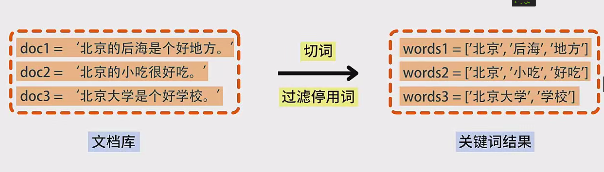
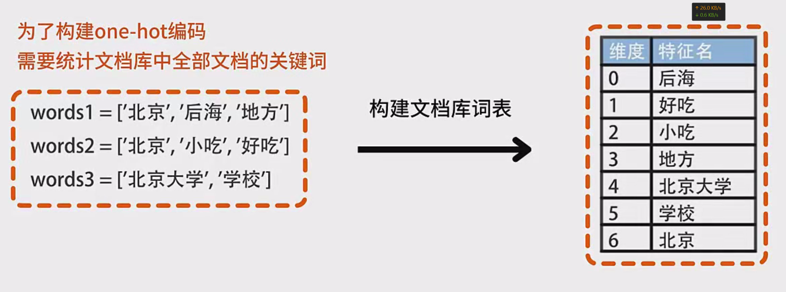
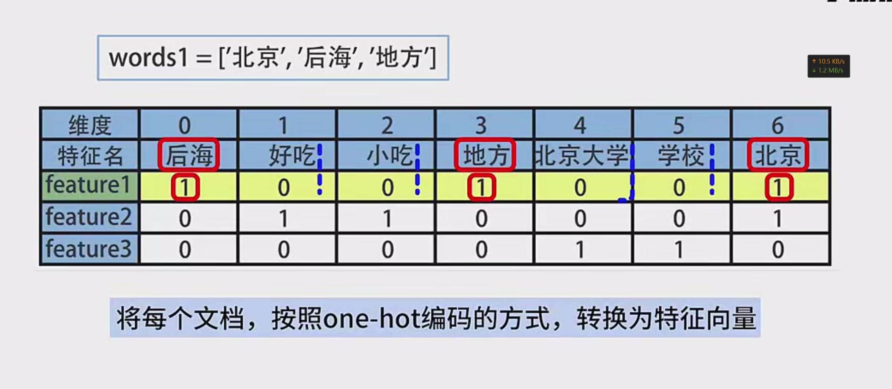
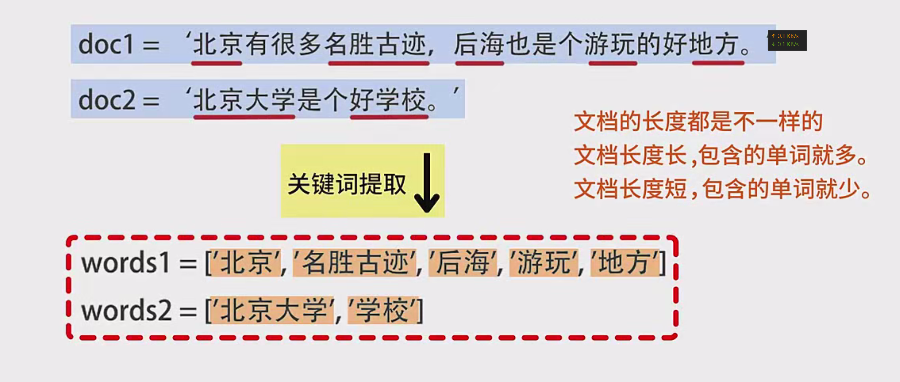
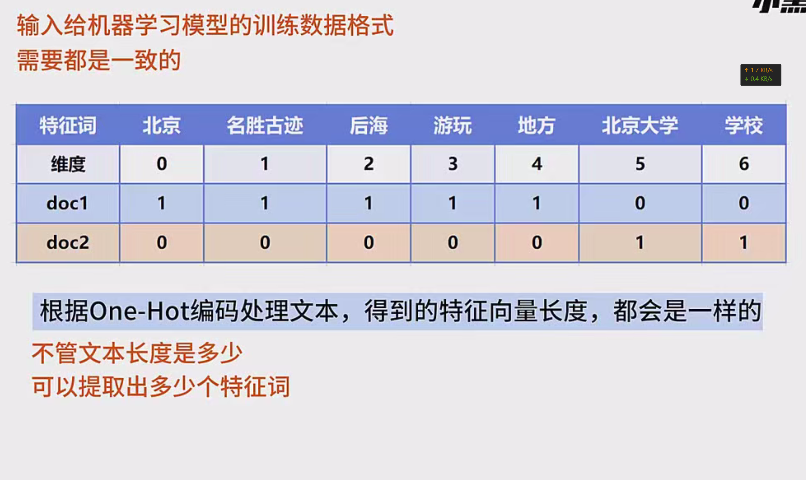
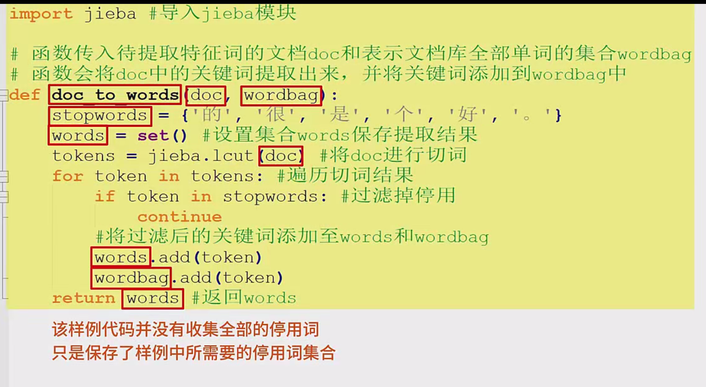
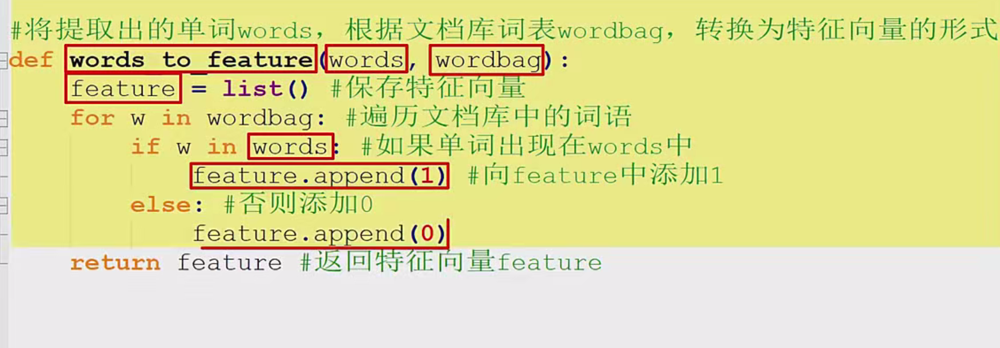
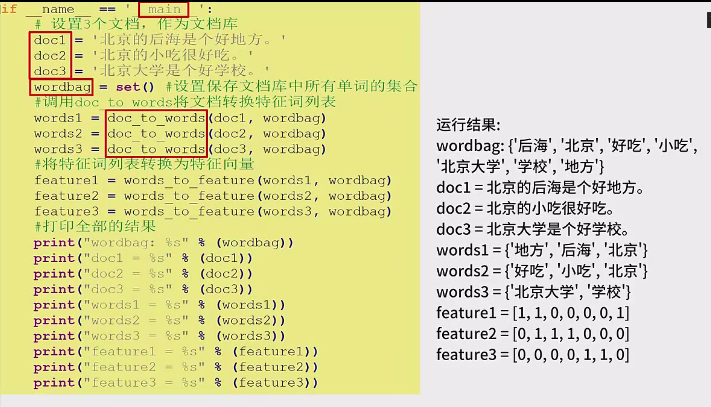

------

# **基于 One-hot 编码的文本向量化程序设计**

## **一、前言**

在自然语言处理（NLP）中，**One-hot 编码** 是一种常见的文本向量化方法。它通过将文本中的词汇转换为高维向量空间中的向量，使得机器学习模型能够处理文本数据。本文将结合实例，详细讲解 One-hot 编码的原理，并展示如何通过 Python 代码实现文本的 One-hot 向量化。

## **二、One-hot 编码原理**

### **1. 文档库与关键词提取**

假设我们有一个文档库，其中包含多个文档。例如：

- **doc1**: 后海小吃地方
- **doc2**: 北京小吃
- **doc3**: 北京后海地方

**步骤一：** 对每个文档进行切词，并过滤掉停用词（如“的”、“是”等），最终得到每个文档的关键词列表。

- 停用词集合：例如 `{"的", "是"}`
- **doc1 的关键词结果**：后海、小吃、地方
- **doc2 的关键词结果**：北京、小吃
- **doc3 的关键词结果**：北京、后海、地方

### **2. 构建词表**

将文档库中所有文档的关键词汇总，生成总词表。例如，上述三个文档的总词表为：

- 总词表：后海、小吃、地方、北京
- **总词表的维度**：4 个词汇

### **3. 生成 One-hot 向量**

One-hot 向量的长度与词表的大小相同。对于每个文档，其特征向量的每个维度对应词表中的一个词：

- 如果文档包含该词汇，则该维度值为 `1`；否则为 `0`。
- 例如：
  - **doc1 的特征向量**：[1, 1, 1, 0]（对应词汇：后海、小吃、地方、北京）
  - **doc2 的特征向量**：[0, 1, 0, 1]
  - **doc3 的特征向量**：[1, 0, 1, 1]

## **三、代码实现**

### **1. 函数定义**

#### **函数 1：`doc_to_words`**

用于从文档中提取关键词，并过滤停用词。

Python复制

```python
def doc_to_words(doc, stopwords):
    """
    提取文档中的关键词并过滤停用词。

    参数:
        doc (str): 文档内容.
        stopwords (set): 停用词集合.

    返回:
        list: 提取后的关键词列表.
        更新后的停用词集合(未实际使用，仅为示例说明).
    """
    # 切词（假设使用空格分隔，实际应用中可能需要更复杂的切词工具）
    words = doc.split()
    # 过滤停用词
    filtered_words = [word for word in words if word not in stopwords]
    return filtered_words
```

#### **函数 2：`words_to_feature`**

将关键词列表转换为 One-hot 特征集。

Python复制

```python
def words_to_feature(vocab, words):
    """
    将关键词列表转换为 One-hot 特征集。

    参数:
        vocab (list): 总词表（按顺序）.
        words (list): 文档的关键词列表.

    返回:
        list: One-hot 特征集.
    """
    feature = [0] * len(vocab)
    for i, word in enumerate(vocab):
        if word in words:
            feature[i] = 1
    return feature
```

### **2. 主程序**

实现文档库的 One-hot 编码过程。

Python复制

```python
# 示例文档库
docs = [
    "后海小吃地方",  # doc1
    "北京小吃",       # doc2
    "北京后海地方"    # doc3
]

# 定义停用词集合（假设没有停用词，为了示例）
stopwords = set()

# 初始化词袋（总词表）
word_bag = set()

# 提取所有文档的关键词并更新词袋
all_words = []
for doc in docs:
    words = doc_to_words(doc, stopwords)
    all_words.append(words)
    word_bag.update(words)

# 将词袋转换为有序词表（按字典序）
vocab = sorted(word_bag)
print("总词表:", vocab)

# 生成每个文档的 One-hot 特征集
for i, doc_words in enumerate(all_words):
    feature = words_to_feature(vocab, doc_words)
    print(f"文档 {i+1} 的特征向量: {feature}")
```

### **3. 输出结果**

假设代码运行后的输出示例：

复制

```
总词表: ['北京', '后海', '地方', '小吃']
文档 1 的特征向量: [0, 1, 1, 1]
文档 2 的特征向量: [1, 0, 0, 1]
文档 3 的特征向量: [1, 1, 1, 0]
```

## **四、总结**

- **One-hot 编码** 的核心是将文本转换为固定长度的二进制向量。
- 程序实现的关键步骤包括：
  - 提取文档关键词并过滤停用词。
  - 构建词表。
  - 根据词表生成 One-hot 特征集。
- 该方法简单易懂，但在处理大规模文本时可能导致维度爆炸问题。

