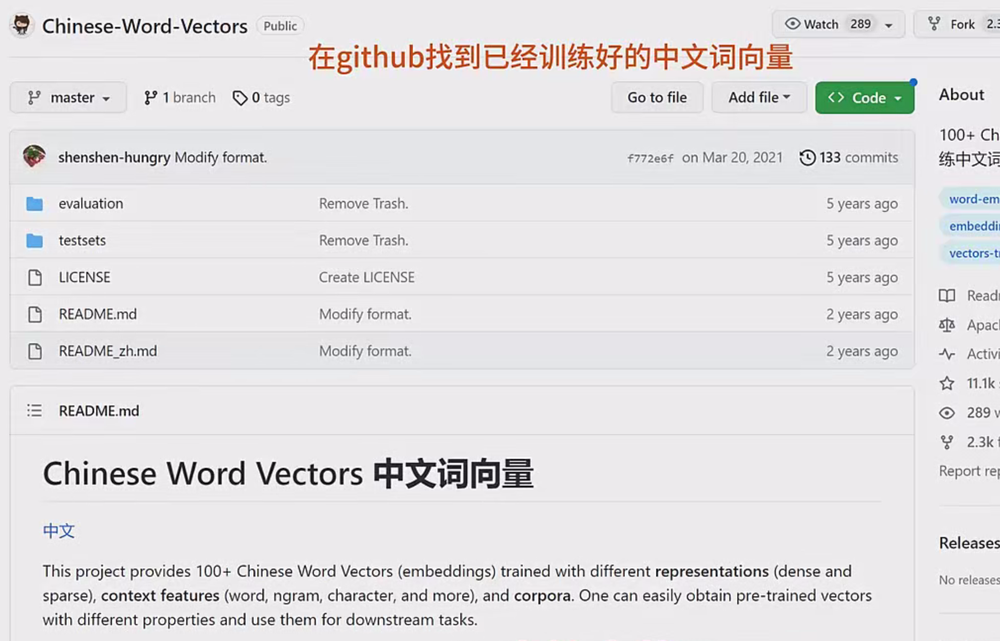
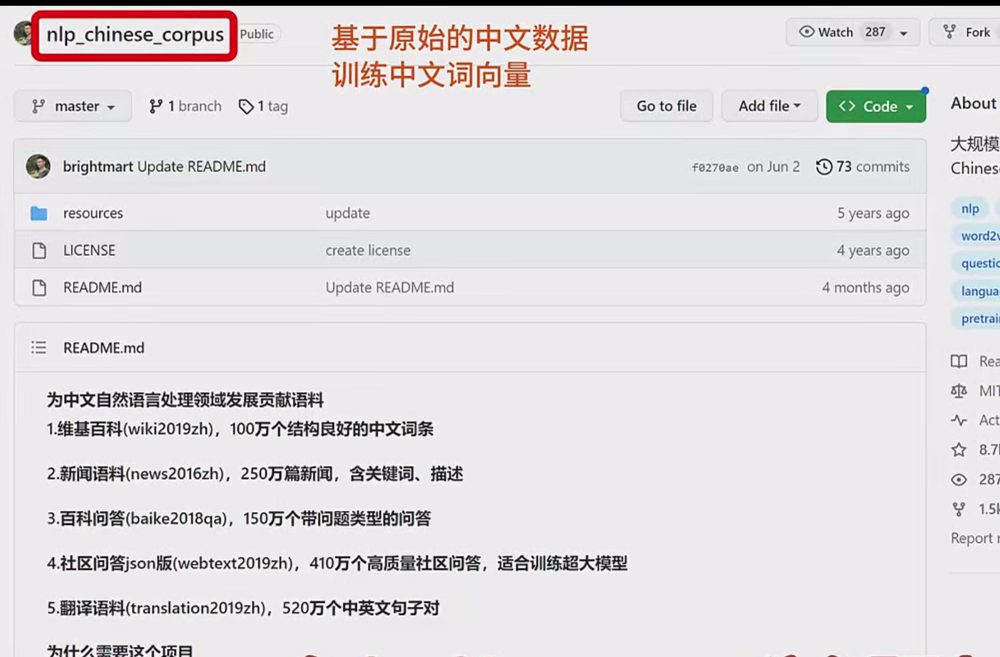
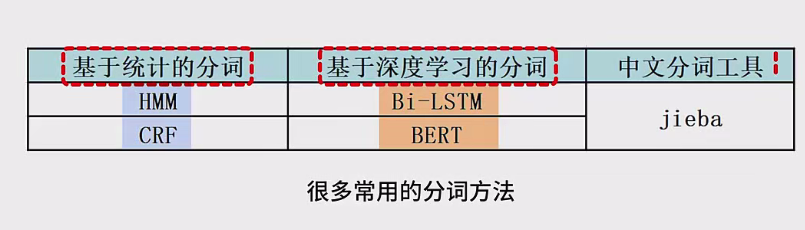
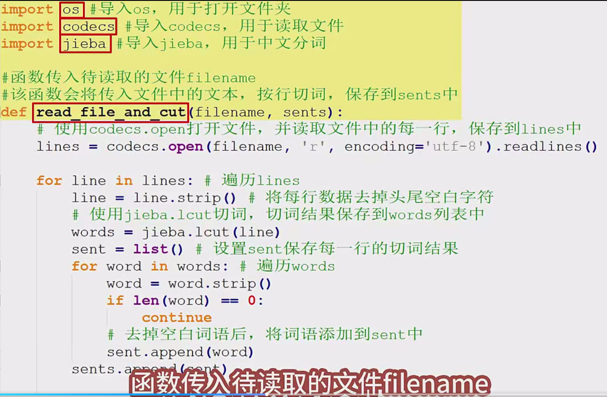
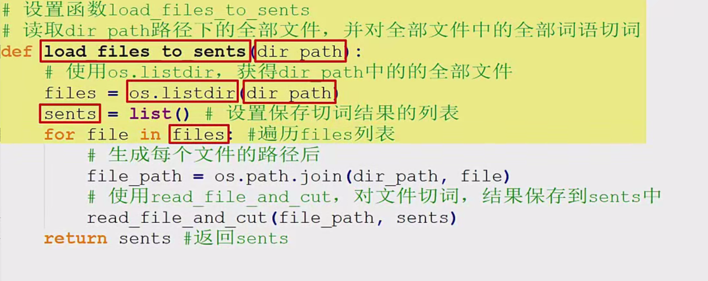
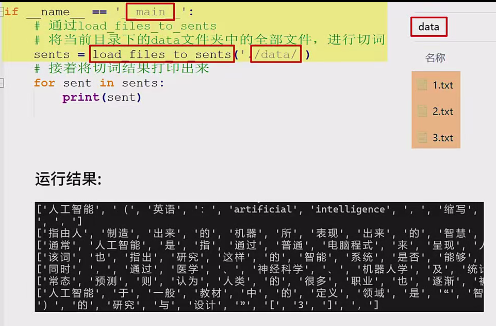
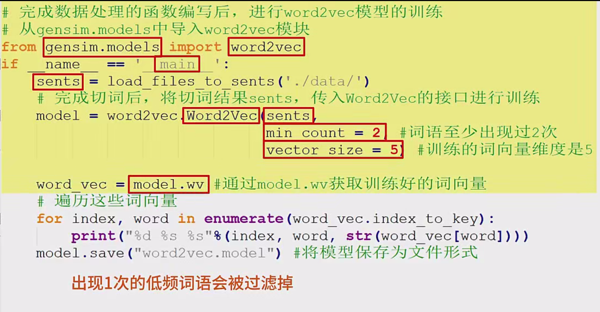
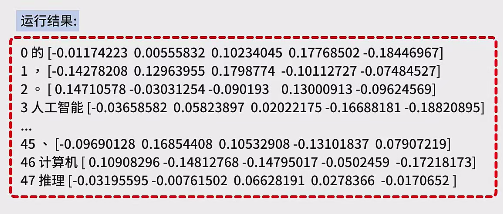

好的，我会进一步细化和补充内容，整理出更详细的笔记如下：

# 基于 JSON 工具训练 Word2Vector 词向量详细笔记

## 一、课程概述

本次课程主要围绕利用 JSON 工具来训练中文 Word2Vector 词向量展开讲解，整个过程大致分为三个关键步骤，即准备数据、进行中文分词以及开展模型训练，旨在帮助大家掌握通过这种方式生成适用于中文场景的词向量的方法。

## 二、使用预训练中文词向量

1. **获取途径**
   - 可以在 JI THUB（GitHub 平台）上搜索 “Chinese world vector”（中文词向量）相关的项目。在找到的对应项目中，包含了数量众多的上百个中文词向量。
   - 这些词向量的数据来源较为广泛，涵盖了像百度百科、搜狗新闻、知乎问答等不同类型的数据，基于这些丰富的数据进行训练后，每个词向量的长度是 300 维。
   - 我们可以直接将这些已经训练好的中文词向量下载下来，然后在自己的项目或者相关应用中进行使用，省去了从头训练的时间和资源成本。

## 三、基于原始数据训练中文词向量

### （一）准备数据

1. **数据来源**
   - 同样可以通过 GIT HUB（GitHub 平台）来获取原始的中文训练数据。例如，在 “nlp Chinese coopers”（中文 NLP 合作项目，具体名称以实际为准）这样的项目中，包含了各种形式的中文文本数据。
   - 这些文本数据类型多样，像百科知识类内容、新闻报道、问答社区中的问答内容等都有涵盖，能够为后续训练中文词向量提供充足且丰富的语料基础。

### （二）中文分词

1. **必要性**
   - 中文和英文在语言结构上有很大的不同。在英文句子中，单词之间通常是以空格等明显的标志来区分词的边界，方便进行自然语言处理中的词汇相关操作。
   - 然而，中文句子中词与词之间没有任何类似空格这样的显示标志来指示词的边界，这就导致如果直接对中文句子进行处理，很难准确地识别出一个个独立的词语。
   - 因此，在进行中文自然语言处理任务，特别是像训练 Word2Vector 词向量这样的任务时，必须使用专门的中文分词算法来进行分词操作，而且中文分词的效果会直接对后续 Word2Vector 模型训练的效果产生重要影响，如果分词不准确，训练出来的词向量很可能无法很好地表达词语的语义等信息。
2. **常用分词算法**
   - **基于统计的算法** ：
     - HMM（Hidden Markov Model，隐马尔可夫模型）中文分词模型，它是一种基于统计概率的方法，通过对大量文本数据进行学习，统计字与字之间的转移概率等信息，从而实现对中文句子的分词。
     - CRF（Conditional Random Field，条件随机场）中文分词模型，这是一种利用条件随机场模型来进行序列标注的分词方法，能够考虑到句子中每个字在不同上下文环境下的标注情况，从而更准确地划分词语边界。
   - **基于深度学习的算法** ：
     - YLSTM（具体全称根据实际情况而定，这里假设是一种改进的长短期记忆网络，用于中文分词）等分词模型，这类基于深度学习的分词模型可以自动学习文本中的深层次特征，通过构建复杂的神经网络结构来实现对中文句子的精准分词。
3. **工具使用 - 解霸分词器**
   - **导入相关模块**
     - 首先需要导入 OS 模块，这个模块主要用于打开文件夹，方便后续对文件进行操作，例如指定分词所要处理的文件所在的文件夹路径等。
     - 导入 codex 模块，其作用是用于读取文件，能够帮助我们打开并读取存储中文文本数据的文件内容。
     - 导入解八（具体名称以实际使用的分词工具库为准）模块，这是用于实现中文分词功能的核心模块，提供了具体的分词算法和接口供我们调用。
   - **编写分词函数**
     - **read_file_and_cut 函数**
       - **功能** ：该函数的主要功能是传入待读取的文件名 `file_name`，然后对文件中的文本内容按行进行切词操作，并将切词后的结果保存到 `sense` 这个变量中。
       - **具体实现过程** ：
         - 使用 `code ix.open` 方法打开传入的文件，并读取文件中的每一行内容，将读取到的每一行保存到 `lise`（假设是一个列表，用于暂存每行内容）中。
         - 接着，遍历 `lins`（这里可能存在表述有误，应理解为对保存每行内容的列表进行遍历操作），对于每行数据，先去掉头尾的空白字符，这一步是为了清理数据，避免空白字符对分词结果造成干扰。
         - 然后，使用解霸点 `l cut`（即调用解霸分词器提供的分词方法）进行切词操作，将切词得到的结果保存到 `words` 列表中。
         - 再设置 `s and`（这里表述不太清晰，理解为对切词结果进行进一步处理的逻辑）来保存每一行的切词结果，具体来说，就是遍历 `words` 列表，去掉其中的空白词语（因为有时候分词可能会出现一些无意义的空白词），将剩下的有效词语添加到 `sense` 中，这样就完成了对某个文件的切词处理。
     - **load_files_to_sends 函数**
       - **功能** ：该函数的作用是读取指定路径 `DIR parts`（即存放待分词文件的目录路径）下的全部文件，并对这些文件中的全部词语进行分词操作，最终将所有的分词结果汇总保存起来。
       - **具体实现过程** ：
         - 首先，使用 `OS list DIR` 方法获取 `DIR pass`（同样理解为指定的目录路径）中的全部文件名称，得到一个包含所有文件名的列表。
         - 然后，设置一个保存切词结果的列表 `sense`，用于存储后续所有文件分词后的词语。
         - 接着，遍历 `files`（即前面获取到的包含所有文件名的列表），生成每个文件的具体路径，通过调用前面编写的 `read_file_and_cut` 函数对每个文件进行切词操作，将每次分词得到的结果保存在 `sense` 中，最后函数返回这个汇总了所有分词结果的 `sense`。
   - **在 main 函数中调用实现**
     - 在 `main` 函数里，通过调用 `load_files_to_sends` 函数，将当前目录下的 `data` 文件夹（假设存放了需要分词的中文文本数据文件）中的全部文件进行切词处理。
     - 切词完成后，将得到的切词结果打印出来，这样我们就可以直观地看到分词的效果。运行程序后，在输出的结果中，每一行都对应了原始文本中的一行经过分词处理后的结果，方便我们检查分词是否准确。

### 