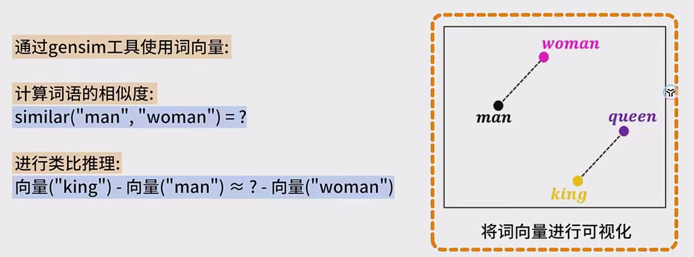
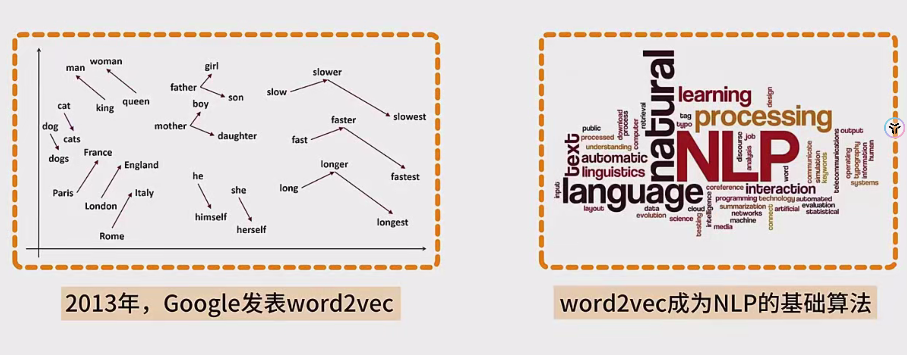
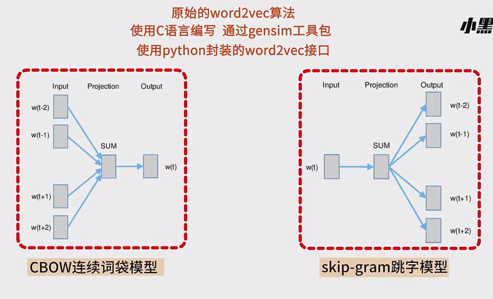
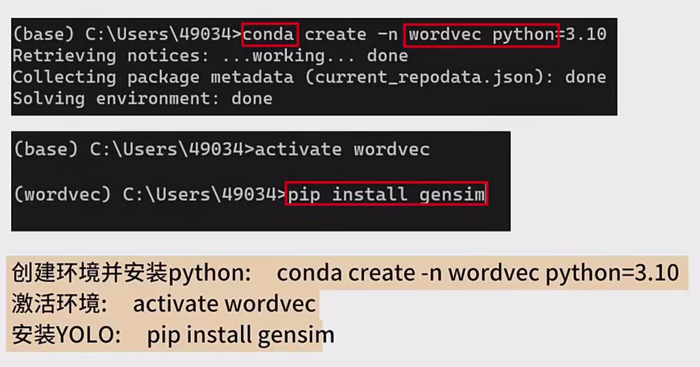
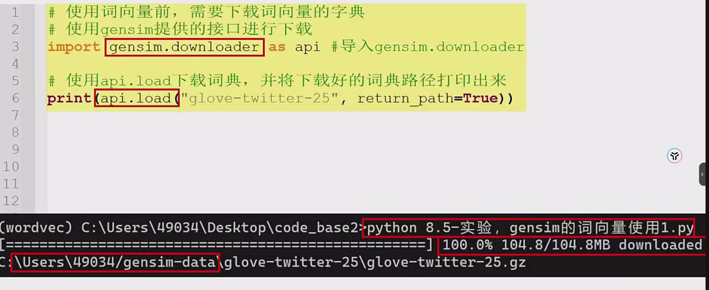
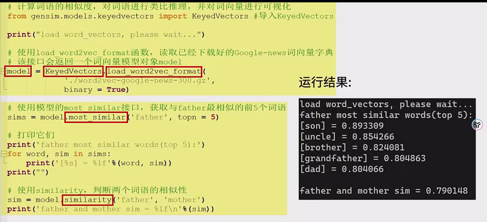
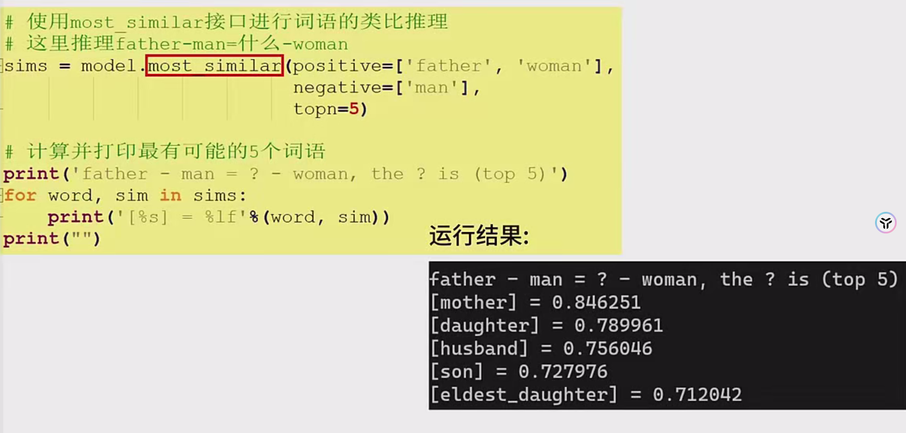
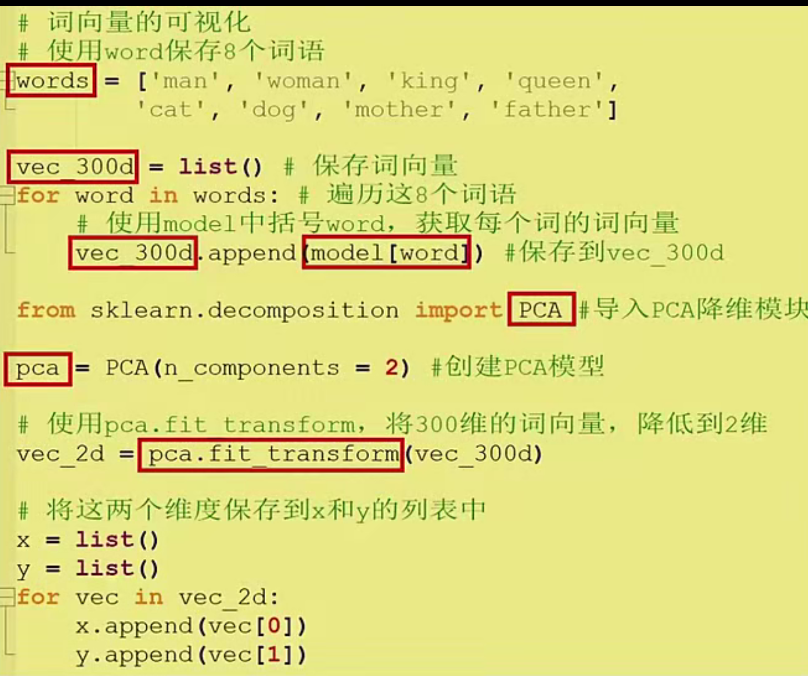
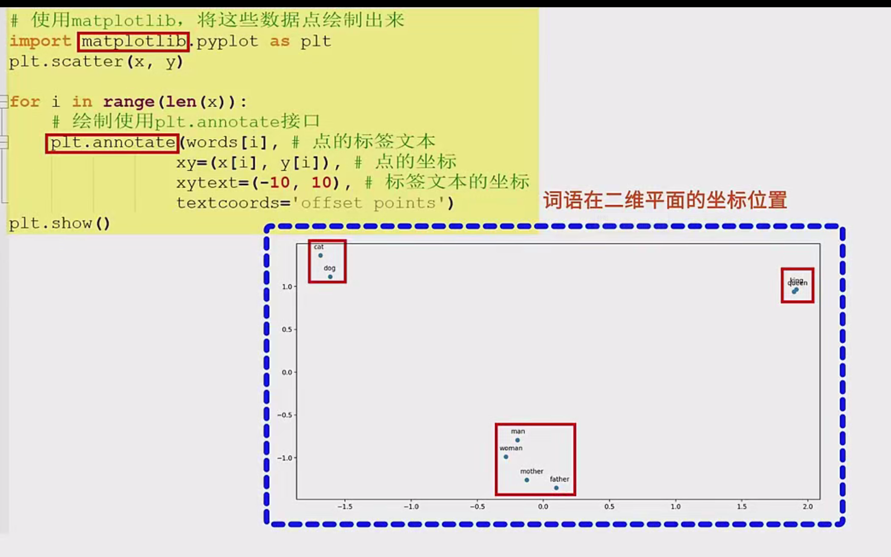

以下是基于 “基于 json 工具使用 word2vec 词向量” 的详细笔记：

### 一、背景介绍

- **Word2vec 简介** ：2013 年，Google 发表了革命性的词嵌入方法 word2vec，此后它迅速成为深度学习解决 NLP（自然语言处理）问题的基础算法。word2vec 有两种实现方法，分别是连续词袋模型（CBOW，Continuous Bag of Words）和跳字模型（Skip - Gram）。CBOW 的核心思想是通过上下文单词来预测目标单词，而 Skip - Gram 则是通过目标单词来预测上下文单词，这两种方法能够将单词转化为连续的向量表示，从而捕捉单词之间的语义和句法关系。
- **Json 工具包相关介绍** ：原始的 word2vec 算法使用 C 语言编写，而我们在本教程中将通过 Python 的 gensim 库（可能用户提到的 json 是口误，通常为 gensim）来使用其封装的 word2vec 接口。gensim 是一个开源免费的 Python 库，主要用于主题建模和文档的相似性分析，广泛应用于自然语言处理领域。除了提供 word2vec 的实现外，gensim 还支持其他词向量模型（如 fasttext 等）算法，并且包含了丰富的文本处理功能和预训练模型，使用起来非常方便。

### 二、环境搭建与词向量字典下载

- **创建环境和安装依赖** ：

  - 使用 Anaconda 创建一个新的 Python 环境，命名为 “word_vec”，使用以下命令：

    ```
    conda create -n word_vec python=3.x
    ```

    激活环境：

    ```
    conda activate word_vec
    ```

    然后在环境中安装 gensim 库：

    ```
    pip install gensim
    ```

- **下载词向量字典** ：

  - 使用 gensim 提供的接口下载预训练的词向量模型。以下是一个示例代码片段，用于下载 Google News 训练的 word2vec 模型：

    Python复制

    ```python
    import gensim.downloader as api
    
    print("可用的预训练模型：", api.info()["models"].keys())
    model = api.load("word2vec-google-news-300")  # 加载模型
    ```

    如果无法通过在线方式下载模型，可以访问 https://github.com/RaRe-Technologies/gensim-data 提供的链接，手动下载所需的预训练模型文件。

### 三、词向量的应用

- **计算词语相似度** ：

  - 加载预训练的 word2vec 模型：

    Python复制

    ```python
    from gensim.models import KeyedVectors
    
    # 假设我们已经下载了 "word2vec-google-news-300" 模型文件
    model_path = "path/to/GoogleNews-vectors-negative300.bin"
    model = KeyedVectors.load_word2vec_format(model_path, binary=True)
    ```

  - 使用 `most_similar` 方法查找与某个单词最相似的单词，例如：

    Python复制

    ```python
    # 查找与 "father" 最相似的前五个单词
    similar_words = model.most_similar("father", topn=5)
    print(similar_words)
    # 输出可能为：
    # [('son', 0.712), ('uncle', 0.687), ('brother', 0.684), ('grandfather', 0.681), ('dad', 0.679)]
    ```

  - 使用 `similarity` 方法计算两个单词之间的相似度：

    Python复制

    ```python
    similarity = model.similarity("father", "mother")
    print(f"father 和 mother 的相似度为: {similarity:.2f}")
    # 输出可能为：0.79
    ```

- **类比推理** ：

  - 使用 `most_similar` 方法进行类比推理，例如：

    Python复制

    ```python
    analogy = model.most_similar(positive=["woman", "king"], negative=["man"], topn=1)
    print(analogy)
    # 输出可能为：[('queen', 0.745)]
    ```

    这个例子的意义在于，king 的词向量与 woman 的词向量之间的差异（即 “国王” 减去 “男人”）应该与 “queen” 的词向量与 “woman” 的词向量之间的差异大致相当（即 “女王” 减去 “女人”），从而通过类比推理得到正确的结果。

### 四、词向量的可视化

- **绘制词向量分布图** ：

  - 选择一些单词，将其对应的词向量提取出来，并使用 t - SNE 或 PCA 进行降维处理，以便在二维平面上绘制这些单词的分布情况。以下是一个使用 PCA 降维并绘制词向量分布图的示例代码：

    Python复制

    ```python
    import numpy as np
    import matplotlib.pyplot as plt
    from sklearn.decomposition import PCA
    
    # 选择要可视化的单词
    words = ["cat", "dog", "king", "queen", "man", "woman", "father", "mother"]
    
    # 获取每个单词的词向量
    vectors = [model[word] for word in words]
    
    # 使用 PCA 降维到二维
    pca = PCA(n_components=2)
    vectors_2d = pca.fit_transform(vectors)
    
    # 绘制词向量分布图
    plt.figure(figsize=(10, 6))
    for i, word in enumerate(words):
        plt.scatter(vectors_2d[i, 0], vectors_2d[i, 1])
        plt.annotate(word, (vectors_2d[i, 0], vectors_2d[i, 1]))
    plt.title("Word Embedding Visualization")
    plt.show()
    ```

- **观察结果** ：通过词向量的可视化，可以直观地看到单词在语义空间中的位置关系。例如，“cat” 和 “dog” 的位置相近，可能是因为它们在语义上都属于动物类别；“king” 和 “queen” 的位置相近，因为它们在语义上具有相似的属性（如都是君主）；“father” 和 “mother” 的位置靠近 “man” 和 “woman”，因为它们在性别和家庭角色上具有关联性。

