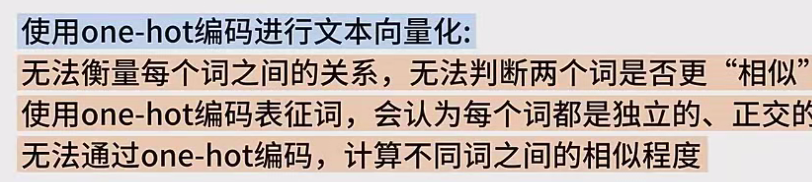

# 文本向量化和 One - Hot 编码详细笔记

## 一、文本向量化的背景与重要性

在当今数字化时代，自然语言文本数据海量存在，像社交媒体上的帖子、新闻文章、书籍文献等等，这些文本信息蕴含着丰富的知识和价值。然而，计算机本身并不能直接理解和处理这种非结构化的自然语言文本。文本向量化作为一种关键的技术手段，能够将文本从原本的文字形式转换为计算机能够高效计算和深入理解的数值向量形式，为后续的文本分类、情感分析、机器翻译等各种自然语言处理任务奠定基础，是连接自然语言文本与计算机算法的桥梁。

## 二、文本向量化的主要方法概述

文本向量化的方法丰富多样，各有特点和适用场景。基于统计的方法通常是通过统计文本中词频等信息来进行向量化，能一定程度反映文本的词汇分布特征；词袋模型则是把文本看作是一袋词汇的集合，忽略词序，重点关注词汇的出现情况；基于深度学习的 Word2Vec 方法能够学习到词汇的语义信息，将语义相近的词映射到向量空间中相近的位置，为文本语义理解提供了有力支持。而本节课着重讲解的基于 One - Hot 编码的文本向量化方法，在自然语言处理发展历程中也有着不可忽视的地位。

## 三、One - Hot 编码的详细介绍

1. **定义与基本原理**
   - One - Hot 编码，也被称为独热编码，它的核心思想是将离散的、非连续取值的数据特征，转换为机器学习模型能够轻松处理的二进制向量格式。在深度学习大规模应用于自然语言处理之前，传统的词语表达方式常常依赖 One - Hot 编码。具体来说，在 One - Hot 编码中，向量的每一个维度都代表着语料库中的一个独立词汇，当某个位置对应的词在文本中存在时，该维度的值为 “1”，反之则为 “0”。例如，对于 “红、绿、蓝” 这三个词语进行 One - Hot 编码，“红” 对应 “[1,0,0]”，“绿” 对应 “[0,1,0]”，“蓝” 对应 “[0,0,1]”，通过这种方式，每个词都被赋予了一个独一无二的向量表示。
2. **处理语料库的具体流程**
   - 当运用 One - Hot 编码处理语料库时，首先需要对语料库中的文本进行一系列预处理操作。以包含三个句子（doc1、doc2、doc3）的语料库为例，第一步是对这三个句子进行切词，将完整的句子拆分成一个个独立的词语，方便后续处理；接着要去掉停用词，像 “的、是、在” 等这些在文本中频繁出现但对于语义理解帮助不大的词，得到对应的处理结果，分别记为 words1、words2 和 words3。
   - 然后，将出现的词进行去重操作，并按照一定的规则（比如词频高低、字典序等）进行排序，构建出一个词典。假设经过处理后，词典包括了 “后海、好吃、小吃、地方” 等七个词语，每个词语就对应着 One - Hot 编码向量中的一个维度。
   - 后续使用这个词典，就可以将句子或文档转换为一个七维的向量。转换方式十分简单，只需查看句子中出现了哪些词语，将对应词语的维度标记为 “1”，其余维度保持为 “0” 即可。例如，句子一中包含了 “后海、地方、北京” 这三个关键词，那么这三个词对应的维度标记为 “1”，其余四个维度标记为 “0”，这样就得到了一个七维向量来表示句子一，对另外两个句子的转换方式也是如出一辙。
3. **One - Hot 编码的优点**
   - One - Hot 编码的优点十分突出，它简单直观，容易理解。对于初学者来说，能够快速上手掌握这种编码方式，而且在一些简单的文本处理场景下，比如判断文本中是否包含某些特定关键词时，One - Hot 编码能够很直接地提供所需信息，方便后续的逻辑判断和处理操作。
4. **One - Hot 编码的缺点**
   - 尽管 One - Hot 编码有其优点，但也存在诸多明显的缺点。从前面的例子可以看出，它只能表示每个词是否出现在文档或句子中，却无法反映出词出现的次数这一重要信息。在很多自然语言处理任务中，词频对于语义理解、文本分类等有着关键影响，One - Hot 编码在这方面就显得力不从心。
   - 另外，如果语料库规模庞大，词汇量丰富，那么构建的词典规模也会随之巨大。例如，当词典中有十万个词时，每个词就需要用一个十万维的向量来进行 One - Hot 编码表示。使用该编码表示的样本，也同样需要十万维来进行表示。此时，会发现这种方式表示的样本向量极为稀疏，绝大多数维度上的值都是 “0”，仅有极少数维度上的值是 “1”，这就导致了存储空间的巨大浪费，同时也会引发维度灾难，给后续的计算和模型训练带来极大的负担。
   - 再者，使用 One - Hot 编码进行文本向量化是无法衡量每个词之间的关系的。因为在使用 One - Hot 编码表征词的时候，会默认每个词都是独立的、正交的，所以无法通过 One - Hot 编码计算不同词之间的相似程度。比如，使用 One - Hot 编码表示 “北京、上海、广州、苹果” 这几个词时，编码显示它们之间毫无关系，但实际上 “北京、上海、广州” 这三个词都是地名，理论上应该具有一定的相似性，One - Hot 编码却无法体现出这种内在的语义关联。

## 四、总结与展望

通过对文本向量化和 One - Hot 编码的详细讲解，我们了解到文本向量化是自然语言处理领域的一项基础且关键的技术，而 One - Hot 编码作为其中一种简单直观的方法，在实际应用中既有优势也有诸多局限性。随着自然语言处理技术的不断发展，后续还会学习到更多先进的文本向量化方法，如 Word2Vec、BERT 等，这些方法能够更好地捕捉文本的语义信息以及词汇之间的复杂关系，为自然语言处理的各种高级应用提供更有力的支持。本节课关于文本向量化和 One - Hot 编码的内容就讲到这里，感谢大家的观看，我们下节课再会。