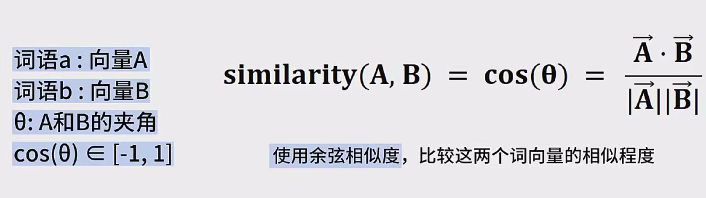
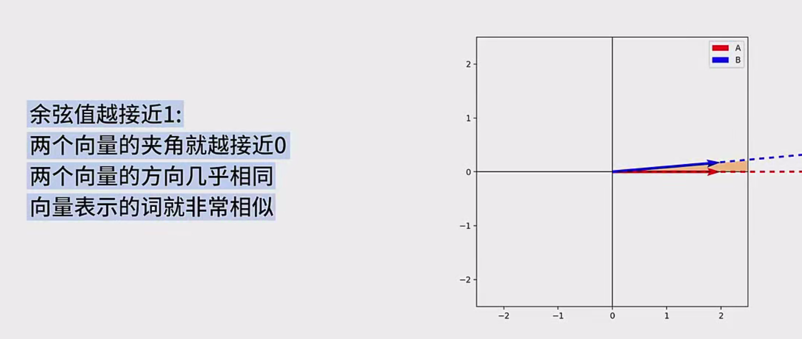
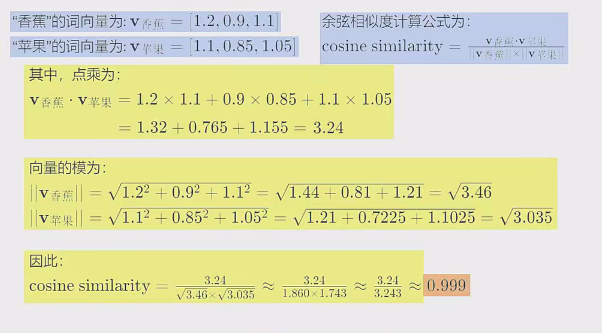
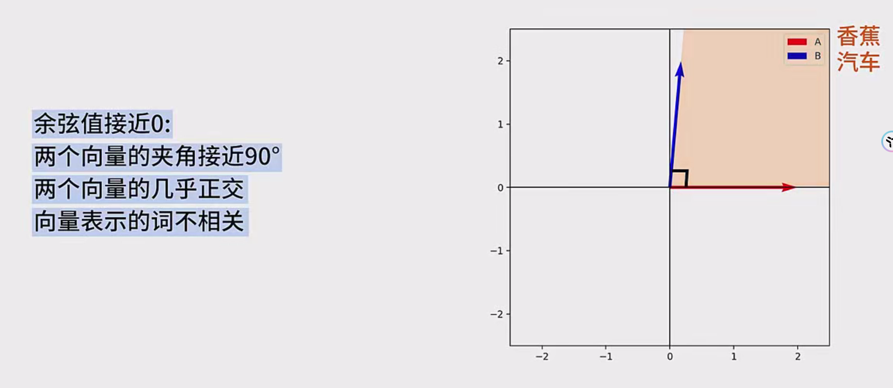
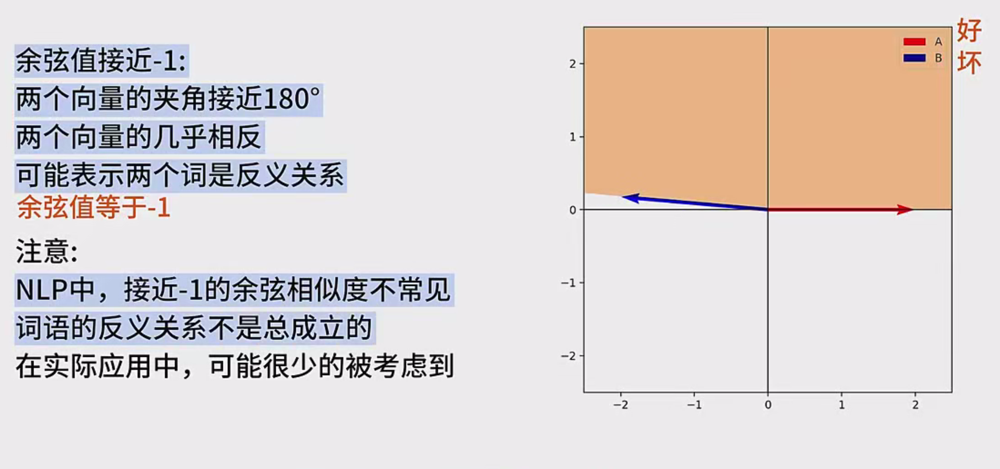
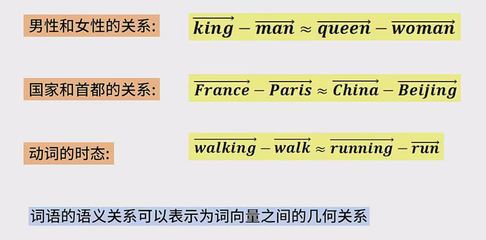
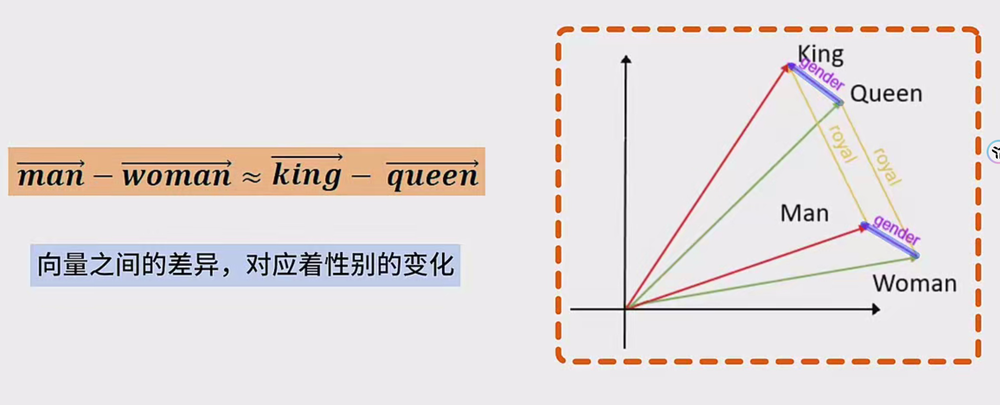
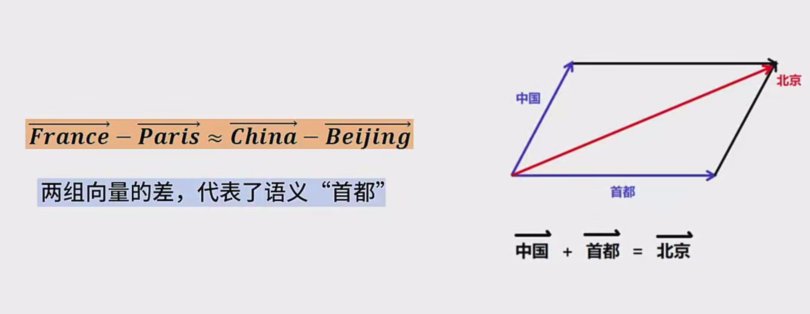

在进行词向量的加减法运算后，得到的结果不会正好等于词向量表中的某个向量词向量通常有几百维，每个维度上也有连续的实数值词向量表中与运算结果最接近的向量，通常就是希望得到的答案

# 相似度计算和类比推理笔记

## 一、相似度计算

1. **基础原理**
   - **磁嵌入算法与词向量** ：借助磁嵌入算法，我们能够高效地为词汇表中的每个词生成对应的词向量。这些词向量，本质上是高维空间中的点，它们的排列与分布，反映了词语在语义空间中的相近程度、相对关系等。当训练完成之后，这些词向量可以直接用于后续的相似度计算以及各类语义推理任务。
   - **余弦相似度的定义** ：对于任意两个向量 a 和向量 b，我们定义它们之间的夹角为 θ，余弦相似度则是用来衡量这两个向量在方向上相似程度的指标。其计算公式为：`cosθ = (a · b) / (||a|| * ||b||)`。其中，`a · b` 表示向量 a 和向量 b 的内积（即点乘），`||a||` 和 `||b||` 分别代表向量 a 和向量 b 的模长（即向量的长度）。
2. **结果解读**
   - **余弦值接近 1** ：当两个词向量 a 和 b 的余弦相似度接近 1 时，说明这两个向量之间的夹角 θ 非常小，几乎为 0 度，意味着它们的方向几乎完全一致。在这种情况下，所对应的两个词语在语义上具有非常高的相似性。例如，“香蕉” 和 “苹果” 都属于水果类的词汇，它们在语义层面上非常接近。如果我们分别用三维向量来表示这两个词，通过余弦相似度计算可以得到非常接近 1 的值，比如 0.999。
   - **余弦值接近 0** ：当余弦值接近 0，说明向量 a 和向量 b 的夹角接近 90 度，即它们几乎彼此正交。这通常意味着这两个向量所表示的词语之间几乎没有语义上的相关性。例如，“香蕉” 和 “汽车” 这两个词，一个是水果，一个是交通工具，它们的语义显然是毫不相关的，在词向量空间中它们的夹角也大概率会接近 90 度，余弦相似度接近于 0。
   - **余弦值接近 -1** ：一般来说，在自然语言处理（NLP）领域中，余弦相似度接近 -1 的情况是较少出现的，因为实际的词向量空间往往是经过规范化等处理的。如果真的出现这种情况，它表示两个向量的夹角接近 180 度，即方向几乎完全相反。在语义上，这种情况可能表示两个词是反义词。例如，“好” 和 “坏” 这样的反义词对，它们的词向量方向可能接近相反，余弦值接近 -1。不过，这种情况的解释并不像余弦值接近 1 或 0 那样直观和常见，因为反义词的语义关系比较特殊，并不是所有反义词都能准确地通过词向量的余弦相似度来体现，因此在实际应用中，余弦值等于 -1 的情况可能很少被重点考虑。

## 二、类比推理

1. **基本逻辑**
   - **语义关系与几何关系** ：类比推理的本质是基于词向量之间的几何运算来推断词与词之间的语义关系。词向量空间中，一个词向量可以被认为是在特定维度上的坐标点，它所处的位置以及与其他向量之间的关系，蕴含着丰富的语义信息。例如，当我们观察到“男人” 和 “女人” 这两个词的词向量时，它们之间的向量差（即向量 man - 向量 woman）可以表示出与性别相关的语义变化。如果我们在词向量空间中找到另一个类似的向量差，比如“国王” 和 “女王” 之间的向量差（向量 king - 向量 queen），并通过计算发现这个向量差与“男人” 和 “女人” 之间的向量差非常相似，那么我们就可以推断出“男人对应女人，就像国王对应女王”，或者反过来，“男人对应国王，就像女人对应女王”。
   - **加减法运算表示语义运算** ：词向量的加减法运算可以看作是对词语语义的加减运算。例如，如果我们从“男人” 的词向量中减去“女人” 的词向量，得到的是性别差异的向量。反之，如果我们再将“女人” 的词向量与“国王” 的词向量相加，可能得到一个接近“女王” 的词向量。这种基于词向量的线性运算所构建的类比推理模型，正是许多现代 NLP 系统理解词语语义关系的重要手段。
2. **实例拓展**
   - **经典类比推理例子** ：“男人”（man）和“女人”（woman）之间的向量差异体现了性别变化。同样地，“国王”（king）和“女王”（queen）之间的向量差异应与“男人” 和“女人” 之间的向量差异相似。因此，我们可以进行以下计算：
   - 向量运算：（king - man）≈ （queen - woman），即 king - man + woman ≈ queen。这说明男人对应女人，就像国王对应女王。这体现了类比推理中基于线性运算发现词义关系的原理。
   - 其他类似例子：如“法国 - 巴黎 ≈ 中国 - 北京”，这两个向量对的差值代表国家与首都的关系。在词向量空间中，如果我们找到中国所对应的向量，并将其与法国到巴黎的向量差进行某种运算，可能能够接近北京的向量。这说明通过词向量的类比推理，我们可以挖掘出不同词语之间的复杂的语义关联。
3. **结果处理与应用**
   - **运算结果的近似性** ：在实际应用中，当我们对词向量进行加减法运算后，得到的结果通常不会与词向量表中的某个具体向量完全一致。因为词向量表中的词语数量是有限的，而通过运算得到的新向量可能位于词向量空间中一个未被精确覆盖的位置。例如，当我们计算 “中国” 的向量减去 “巴黎” 的向量加上 “北京” 的向量，得到的结果可能并不是直接对应词向量表中的某个词，而是接近于 “法国” 的向量，或者更确切地说，是接近于 “中国” 这个国家对应的向量在某种语义变换后的结果。因此，在这种情况下，我们需要找到词向量表中与运算结果最接近的向量，通常通过计算余弦相似度等方法来确定这个最接近的向量，作为类比推理的结果。
   - **实际应用场景** ：这种基于词向量的类比推理方法，在自然语言处理的诸多应用中发挥着关键作用。例如：
   - **聊天机器人** ：当用户输入一个包含某些词语的句子时，聊天机器人能够通过分析这些词语的词向量及其之间的关系，更好地理解用户的意图。比如，用户问“我想要一个像苹果公司那样成功的公司”，聊天机器人可以根据“苹果公司” 的词向量以及“成功” 的语义方向，生成诸如“谷歌”、“微软” 等相关类似公司的信息作为回复。
   - **搜索引擎** ：在进行信息检索时，搜索引擎可以利用词向量的类比推理功能，为用户提供更精准的搜索结果。例如，当用户搜索“巴黎的浪漫夜景”，搜索引擎可以通过对“巴黎” 的词向量与其他相关词汇如“浪漫夜景” 的向量进行类比推理，挖掘出与之相关的图片、文章等信息，提高搜索结果与用户需求的相关性。
   - **问答系统** ：在回答用户问题的过程中，问答系统能够借助词向量的类比推理功能，更好地理解问题中所涉及的实体、概念及其之间的关系。比如，用户问“中国的首都是中国最大的城市吗？”，问答系统可以根据“中国” 的词向量与“首都”、“最大城市” 等词汇之间的多组向量关系，快速判断出正确答案。
   - **知识挖掘与推荐系统** ：基于词向量的类比推理还可以用于知识图谱的构建，挖掘实体之间的潜在关联，并在推荐系统中为用户提供个性化的推荐服务。

