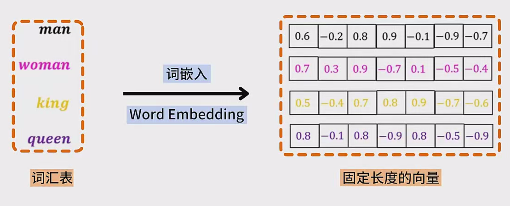
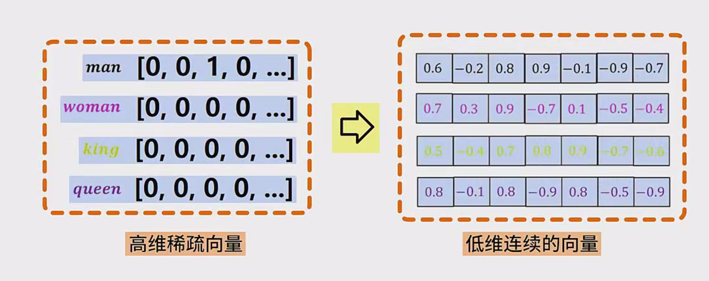
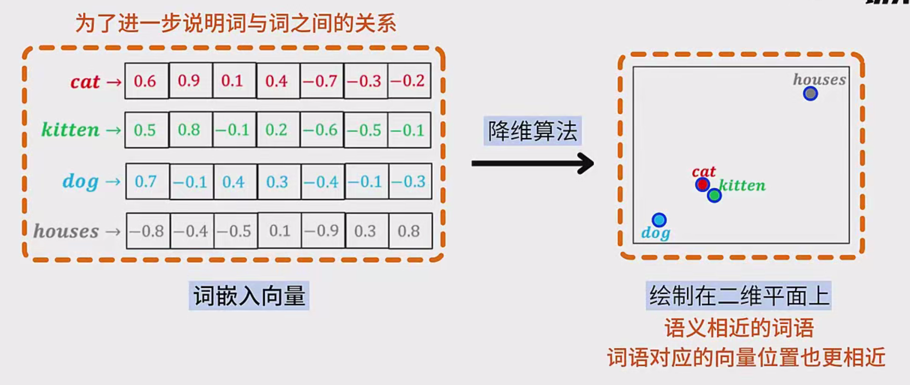
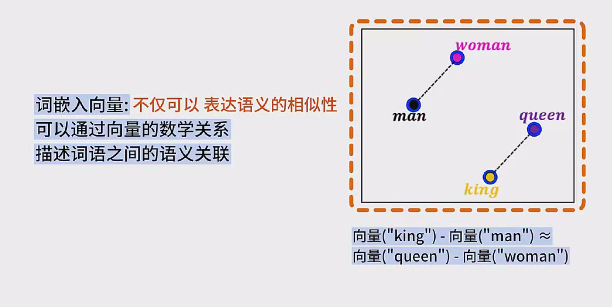
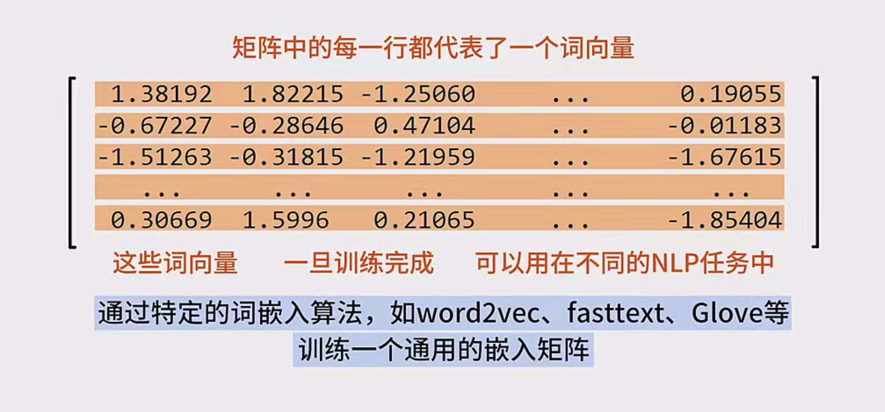
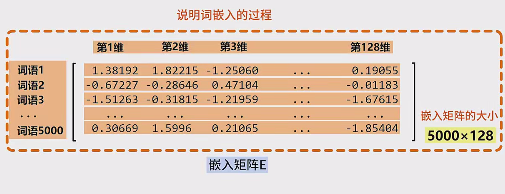
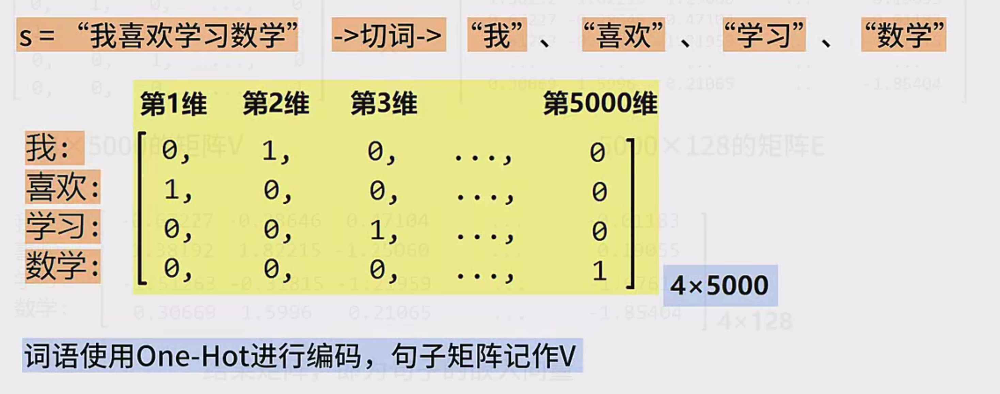
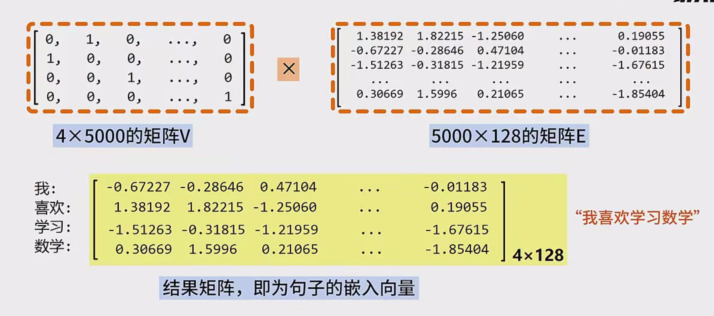
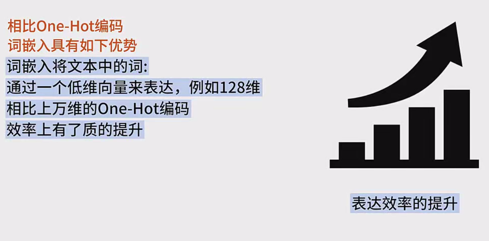
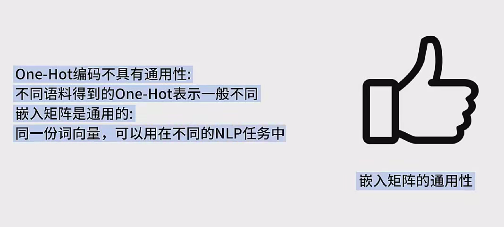

### 笔记：词嵌入（Word Embedding）算法

#### 一、词嵌入的定义

- **词嵌入（Word Embedding）** 是一种将词汇表中的词或短语映射为固定长度向量的技术。
- 通过词嵌入，可以将 **One-Hot编码表示的高维稀疏向量** 转换为 **低维且连续的向量**。
- 例如，将单词 `woman`、`king`、`queen` 等映射到一个低维空间中，每个词对应一个固定长度的向量。

#### 二、词嵌入的可视化

- 使用降维算法（如 t-SNE 或 PCA）将词嵌入向量降维至二维，可以在平面上绘制出来。
- 语义相近的词在向量空间中位置也相近：
  - 例如，`cat`（猫）和 `kitten`（小猫）语义接近，因此它们的向量会聚在一起。
  - `horse` 和 `dog` 与 `cat` 的语义差异较大，因此它们的向量距离 `cat` 较远。
- 词嵌入向量还可以通过数学关系描述词语之间的语义关联：
  - 例如，`king - man ≈ queen - woman`。

#### 三、词嵌入的优势

1. **表达效率提升**：
   - 词嵌入将文本中的词通过低维向量表示，相比高维稀疏的 One-Hot 编码，效率更高。
2. **理解词语的语义**：
   - 语义相似的词在向量空间中更相近，可以通过向量运算进行语义推理。
3. **嵌入矩阵的通用性**：
   - 词嵌入矩阵是通用的，同一份词向量可以用于不同的 NLP 任务，而 One-Hot 编码不具有通用性。

#### 四、词嵌入的实现

- 常见的词嵌入算法包括：
  - **Word2Vec**
  - **FastText**
  - **GloVe**
- 通过这些算法训练出一个通用的嵌入矩阵：
  - 矩阵的每一行代表一个词，列数表示词向量的维度。
  - 例如，一个 5000×128 的嵌入矩阵表示有 5000 个词，每个词用 128 维向量表示。

#### 五、词嵌入的数学原理

- 假设有一个句子 `"我喜欢学习数学"`，将其进行词嵌入的过程如下：

  1. **切词**：

     - 将句子切分为词语：`["我", "喜欢", "学习", "数学"]`。

  2. **One-Hot 编码**：

     - 假设词汇表大小为 5000，每个词用 5000 维的 One-Hot 向量表示。
     - 例如，`"我"` 对应第 1 行，`"喜欢"` 对应第 2 行，`"学习"` 对应第 3 行，`"数学"` 对应第 5000 行。
     - One-Hot 编码矩阵 `V` 的大小为 `4×5000`。

  3. **嵌入矩阵相乘**：

     - 嵌入矩阵 `E` 的大小为 `5000×128`。

     - 将 One-Hot 编码矩阵 `V` 与嵌入矩阵 `E` 相乘，得到句子的嵌入向量矩阵 `S`：

       S=V×E

     - 结果矩阵 `S` 的大小为 `4×128`，表示句子中每个词的 128 维向量。

#### 六、代码示例

以下是一个简单的代码示例，使用 `gensim` 库实现 Word2Vec 词嵌入：

Python复制

```python
from gensim.models import Word2Vec
import numpy as np

# 示例语料库
sentences = [["我", "喜欢", "学习", "数学"], 
             ["猫", "和", "小猫", "是", "同类"], 
             ["马", "狗", "猫", "是", "动物"]]

# 训练 Word2Vec 模型
model = Word2Vec(sentences, vector_size=128, window=5, min_count=1, workers=4)

# 获取词向量
word = "猫"
vector = model.wv[word]
print(f"词 '{word}' 的 128 维向量：")
print(vector)

# 计算词语之间的相似度
similar_words = model.wv.most_similar(word, topn=3)
print(f"与 '{word}' 最相似的词：")
for word, similarity in similar_words:
    print(f"{word}: 相似度 {similarity:.4f}")

# 向量运算示例：king - man + woman ≈ queen
try:
    result = model.wv.most_similar(positive=["queen"], negative=["king", "woman"], topn=1)
    print(f"向量运算结果：king - man + woman ≈ {result[0][0]}")
except KeyError:
    print("某些词不在词汇表中")
```

#### 七、代码输出示例

运行上述代码后，可能的输出如下：

复制

```
词 '猫' 的 128 维向量：
[ 0.1234  0.5678 -0.9012 ...  0.3456 -0.7890  0.1111]

与 '猫' 最相似的词：
小猫: 相似度 0.8542
狗: 相似度 0.7654
马: 相似度 0.6789

向量运算结果：king - man + woman ≈ queen
```

#### 八、总结

- 词嵌入技术能够有效将自然语言中的词语转换为数值向量，表达词语之间的语义关系。
- 这种技术为后续更高级的自然语言处理任务（如情感分析、机器翻译等）提供了坚实的基础。
- 通过训练嵌入矩阵，可以实现高效的语义表示和通用性。

