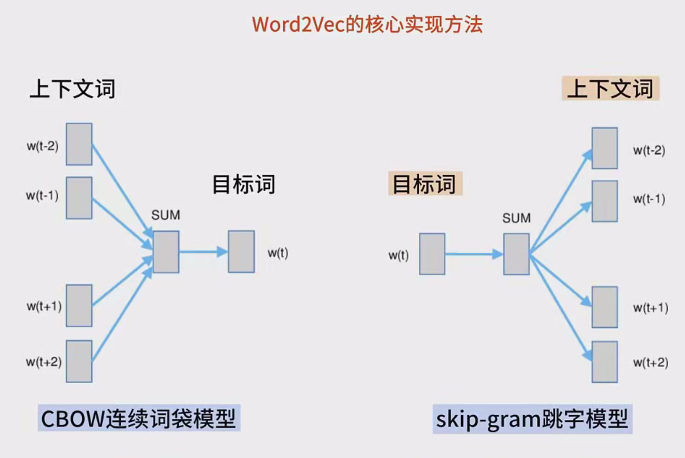
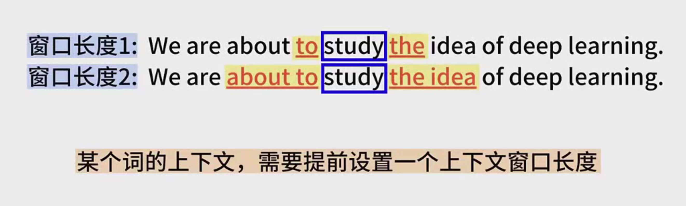
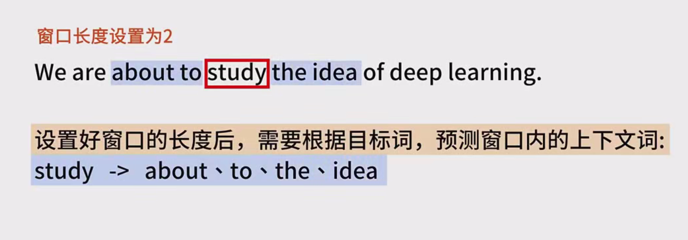
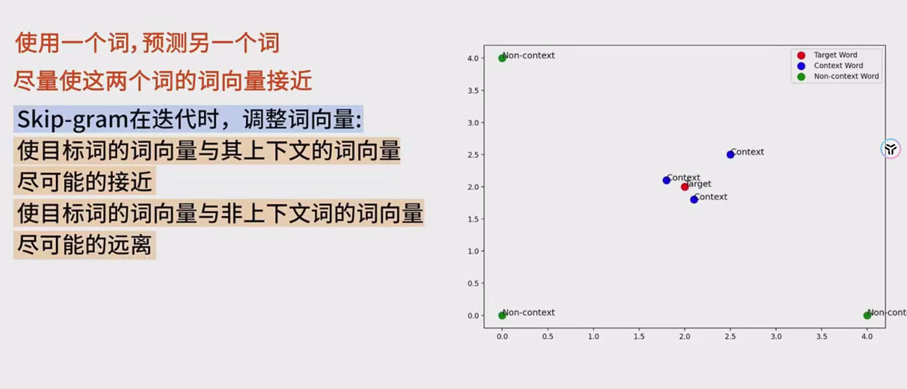
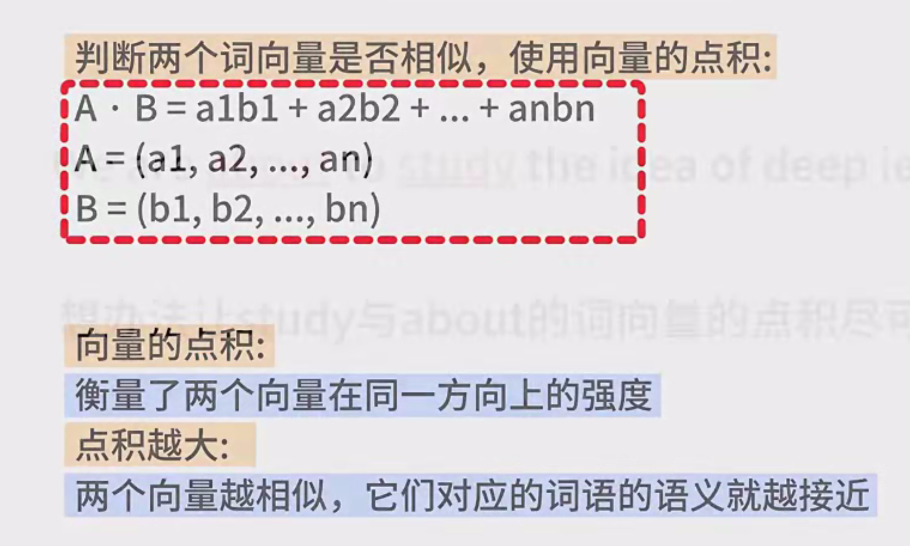
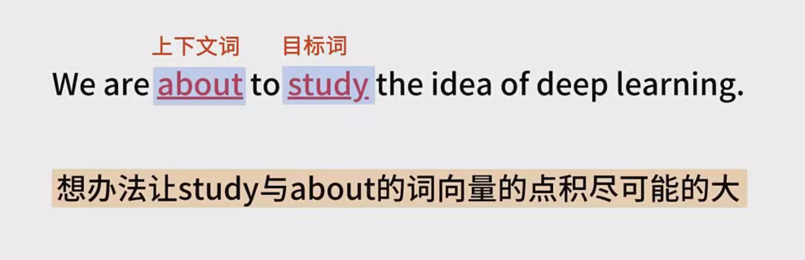
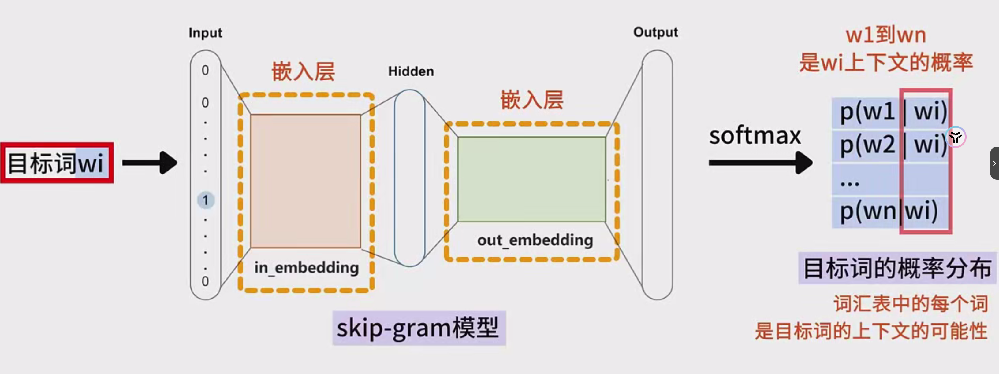
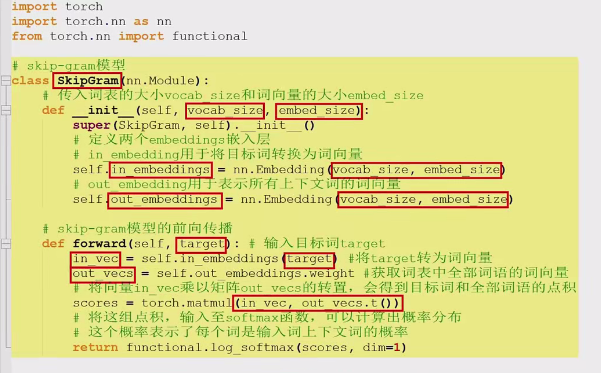
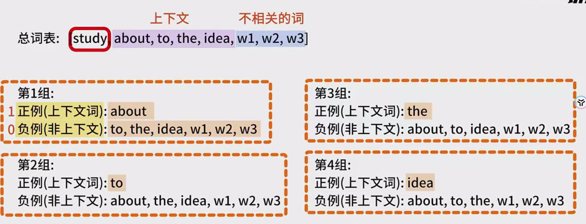

# 详细的跳字模型 Skip Gram 入门笔记

**一、引言** 词向量是自然语言处理（NLP）中的关键技术，它将单词转换为可以用于机器学习和深度学习的数值形式。传统上，单词以离散符号表示，如独热编码（one-hot encoding），但这种方法存在维度灾难、缺乏语义信息等问题。跳字模型（Skip Gram）是一种高效学习词向量的方法，是 Word2Vec 框架的核心组成部分之一。以下是跳字模型的核心要点介绍： **二、跳字模型概述** 跳字模型旨在通过学习单词之间的关系来生成连续且密集的词向量。其基本思想是根据目标词来预测其上下文词。例如，对于句子 “The cat sits on the mat”，当处理目标词 “cat” 时，模型尝试预测其上下文词，如 “the” “sits” 等，从而捕捉单词在语境中的潜在关系。 **三、模型架构** 跳字模型的架构基于神经网络，包含以下几个关键步骤：

1. **输入层**：接受输入单词，并将其转换为词向量。词向量是一个固定长度的密集向量，用于表征单词的语义特征。
2. **隐藏层**：通常是一个简单的线性层，用于计算输入词向量与上下文词向量之间的关系。
3. **输出层**：使用softmax函数将隐藏层的输出转换为概率分布，其中每个元素对应词汇表中的一个单词，表示该单词作为上下文词的概率。 **四、训练过程** 跳字模型的训练过程涉及以下步骤：
4. **数据准备**：首先需要构建一个语料库，将其分割为单词序列。然后，为每个目标词生成上下文对。例如，对于目标词 w和上下文窗口大小为 m，上下文词包括目标词前后的 m 个单词。
5. **上下文窗口和训练样本**：上下文窗口的大小是一个超参数，可以是 2、3 或更大，具体取决于任务需求。每个目标词和上下文对构成一个训练样本。
6. **模型训练**：使用随机梯度下降（SGD）或类似的优化算法，通过最大化预测上下文词的对数概率来更新词向量。损失函数通常是对数似然损失。 **五、数学原理** 跳字模型的数学原理可以概括如下：

- **目标词和上下文词的向量表示**：每个单词被映射到一个低维向量空间中的向量。假设词汇表中的单词数目为 V，每个词的向量维度为 Q。
- **预测上下文词的概率**：对于目标词 w_i，其上下文词的预测概率由软大小函数计算，如下所示：
  P(wo​∣wi​)=∑k=1V​exp(vwk​T​⋅uwi​​)exp(vwo​T​⋅uwi​​)​
  其中，v_{w_o}是上下文词向量，u_{w_i}是输入词向量，Q 是词向量的维度，V是词汇表的大小。

1. **损失函数**：为了训练模型，需要最大化训练数据的对数似然函数。对于每个训练样本（目标词 w_i、上下文词 w_o），损失函数为：
   J=−logP(wo​∣wi​)
   这个损失函数旨在使目标词和上下文词的向量更加接近，同时使其他非上下文词的向量远离。 **六、词向量的调整** 在训练过程中，输入词向量和上下文词向量会不断调整。对于每个训练样本，计算损失函数并反向传播梯度，以更新模型的参数（即词向量）。经过多轮迭代后，词向量会逐渐捕获单词的语义和语法信息，相似的单词在向量空间中更接近。 **七、与CBOW模型的比较**

- **输入和输出**：跳字模型使用目标词来预测上下文词，而 CBOW 模型使用上下文词来预测目标词。
- **训练数据量**：跳字模型可以生成比 CBOW 更多的训练样本，因为每个目标词和上下文词对都是一个样本，而 CBOW 使用一个上下文窗口来生成目标词样本。
- **语义学习**：跳字模型能够更好地捕捉罕见单词的语义，因为它更关注单词之间的局部关系。 **八、应用场景** 跳字模型生成的词向量具有广泛的应用场景，包括：
- **文本分类**：将词向量作为输入特征进行文本分类任务，如情感分析、主题分类等。
- **机器翻译**：将词向量用于源语言和目标语言之间的映射，提高翻译质量。
- **问答系统**：结合词向量来理解用户的问题并生成准确的回答。
- **推荐系统**：根据用户的兴趣和行为，利用词向量进行物品推荐。 **九、Python示例代码** 以下是一个使用 TensorFlow 和 Keras 提供的跳字模型实现的简单示例代码：

Python复制

```python
import tensorflow as tf
from tensorflow.keras.layers import Embedding, Dense, Flatten
from tensorflow.keras.models import Model

vocab_size = 10000  # 词汇表大小
embed_size = 128    # 词向量维度
window_size = 2     # 上下文窗口大小

# 输入层
target_word = tf.keras.Input(shape=(1,), name="target_word")
context_word = tf.keras.Input(shape=(1,), name="context_word")

# 词嵌入层
embedding = Embedding(input_dim=vocab_size, output_dim=embed_size, name="embedding")
target_embed = embedding(target_word)
context_embed = embedding(context_word)

# 交互层（点积）
dot_product = tf.reduce_sum(target_embed * context_embed, axis=2)
output = tf.keras.layers.Activation('sigmoid')(dot_product)

# 构建模型
model = Model(inputs=[target_word, context_word], outputs=output)

# 模型编译
model.compile(optimizer='adam', loss='binary_crossentropy')

# 模型训练（假设生成器生成训练样本）
```

在这个示例中，模型使用词嵌入层将目标词和上下文词转换为向量，并计算它们之间的点积。点积结果通过 sigmoid 激活函数转换为预测概率。可以使用标准的二元交叉熵损失函数进行训练。