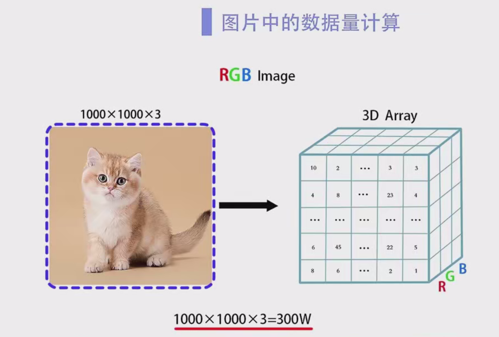
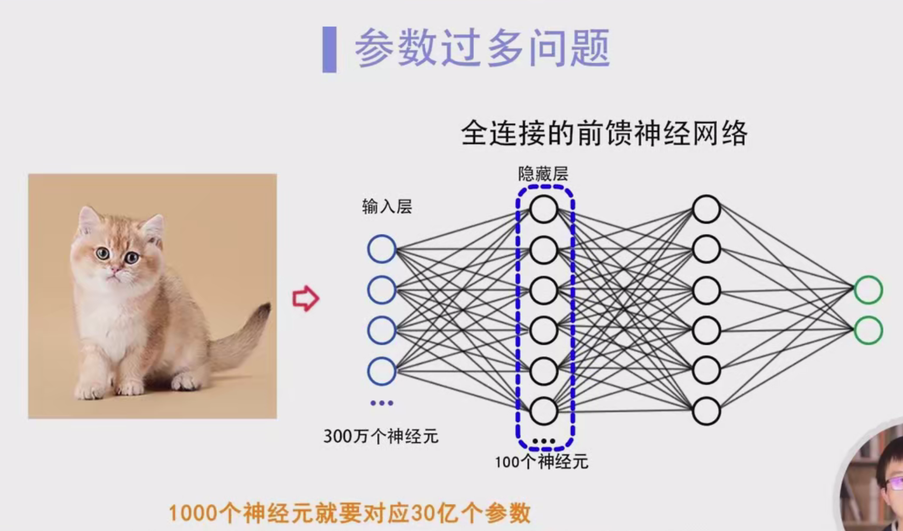
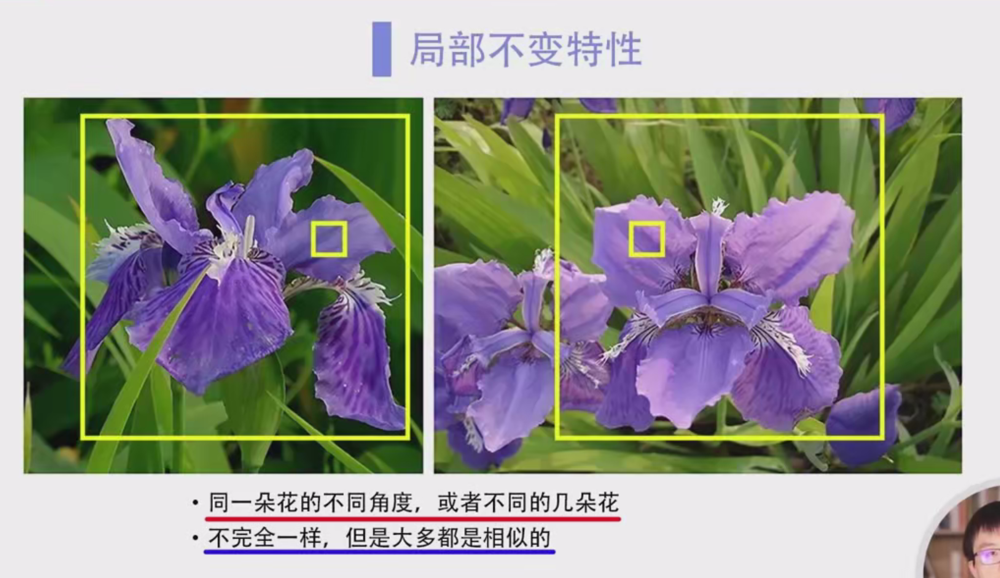
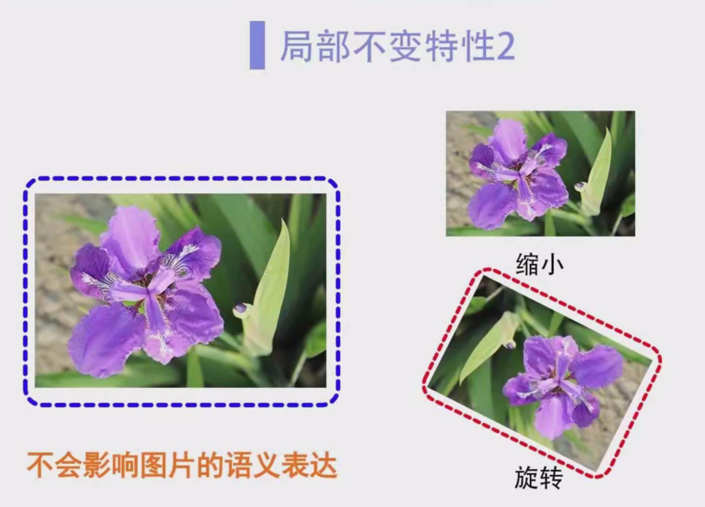

### 全连接网络的局限性 - 详细笔记

------

#### 1. 引言

- 在卷积神经网络（CNN）出现之前，**图像处理**一直是人工智能领域中的难题。
- **全连接神经网络（FCN）**常被用于处理图像问题，但在实际应用中，面临两个主要问题：
  1. **参数过多**，导致计算复杂度高。
  2. **无法捕捉图像中的局部不变特性**，影响识别能力。

------

#### 2. 参数过多

**背景：**

- 图像数据是由像素点组成的，每个像素有三个颜色通道（RGB），分别代表红色、绿色和蓝色。
- 图像在计算机中一般有三个维度：**高度**、**宽度**和**RGB颜色通道**。

**举例说明：**

- 假设一张图片的长宽为1000x1000像素，每个像素有3个颜色通道： 1000×1000×3=3,000,0001000 \times 1000 \times 3 = 3,000,000 这意味着图像有300万个数据点。
- 如果使用全连接神经网络（FCN）处理该图像，输入层将需要有**300万个神经元**来接收这些数据。

**隐藏层与参数增长：**

- 假设隐藏层有100个神经元。由于全连接网络中每层神经元与上一层所有神经元都有连接，所以输入层和隐藏层之间的连接数为： 3,000,000×100=300,000,000(3亿个训练参数)3,000,000 \times 100 = 300,000,000 \quad \text{(3亿个训练参数)}
- 若隐藏层的神经元数量增加至1000个，那么连接数为： 3,000,000×1000=3,000,000,000(30亿个训练参数)3,000,000 \times 1000 = 3,000,000,000 \quad \text{(30亿个训练参数)}
- 这意味着随着神经元数目和网络深度的增加，训练参数呈指数增长，计算量急剧增加，导致：
  1. **计算资源消耗巨大**。
  2. **训练效率低下**。
  3. **容易过拟合**，网络模型的表现可能变差。
- **总的来说**，全连接网络由于参数过多，计算量庞大，训练和推理速度都受到显著影响。

------

#### 3. 无法捕捉图像中的局部不变特性

**局部不变特性：**

- 在自然界中，图像中的同一物体往往具有局部不变特性。例如，同一朵鸢尾花从不同角度拍摄的图片，尽管细节上有所不同，但颜色、形状等特征是相似的。
- 图像也经常需要做旋转、缩放、平移等处理，但这些操作不应改变图像的语义。

**问题分析：**

- 全连接神经网络的每个神经元与输入的所有像素都存在全连接。这种结构是全局的，即每个神经元处理整个图像的信息。
- 由于全连接网络缺乏空间局部感知能力，无法有效捕捉图像中的局部特征，例如：
  - 图像中的一个区域可能包含一个物体的特征，而全连接网络难以区分这种区域的变化。
  - 无法处理图像的平移、旋转等变化，因为网络的连接没有考虑到图像的空间结构。

**卷积神经网络的优势：**

- **卷积层**的引入使得CNN能够有效捕捉图像的局部特征。
- CNN利用**卷积操作**在图像中滑动滤波器，可以逐渐提取出图像的局部特征（例如边缘、纹理等）。
- 通过**共享权重**，卷积层能够减少参数数量，使得网络能够更好地处理不同变换（如旋转、缩放、平移）下的同一物体。

------

#### 4. 解决方案：卷积神经网络（CNN）

- **局部感知：** CNN的卷积操作帮助网络关注图像的局部区域，而不是整个图像。
- **权重共享：** CNN的卷积核是共享的，即同一个卷积核在图像不同位置上进行运算，极大减少了需要训练的参数数量。
- **池化层：** 池化操作（如最大池化和平均池化）进一步降低了计算量，同时有助于提取局部特征，增强模型的平移不变性。
- **深度网络：** 通过多层卷积层，CNN能够逐渐提取从低级特征（如边缘、角点）到高级特征（如物体形状）的信息。
- **优点：** CNN能够有效处理图像中的局部不变特性，减少计算量，同时提高图像识别的准确性和效率。

------

#### 5. 总结

**全连接网络的局限性：**

1. **参数过多：** 随着图像尺寸和网络深度的增加，全连接网络的参数数量呈指数增长，导致计算量巨大，训练效率低，容易出现过拟合。
2. **无法捕捉局部不变特性：** 全连接网络缺乏局部感知能力，无法有效处理图像的局部特征变化，如平移、旋转和缩放。

**卷积神经网络（CNN）作为解决方案：**

- **CNN**通过卷积层、共享权重和池化操作，能够更高效地处理图像数据，减少计算量，且能够捕捉图像中的局部不变特性，处理不同变换下的图像。