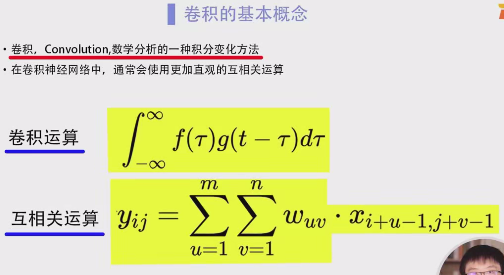

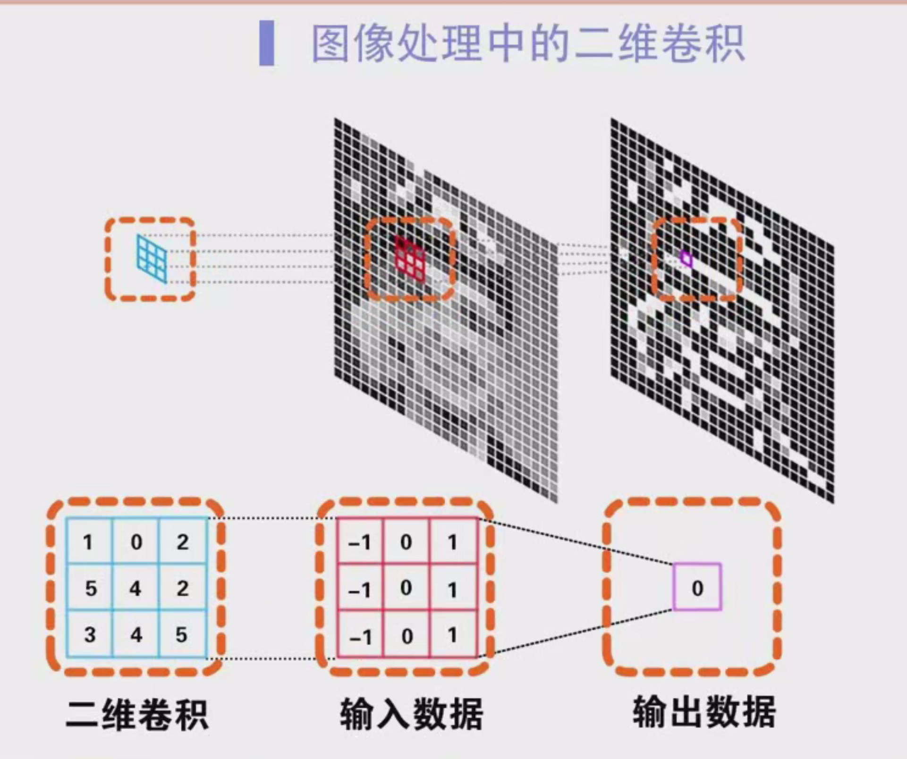

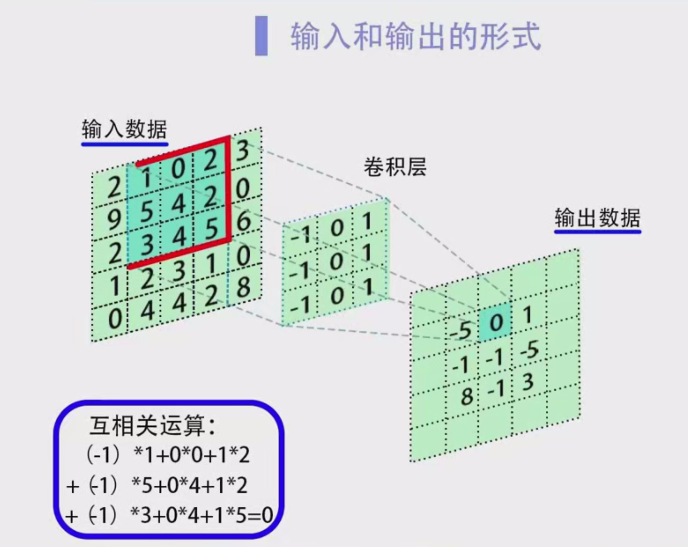

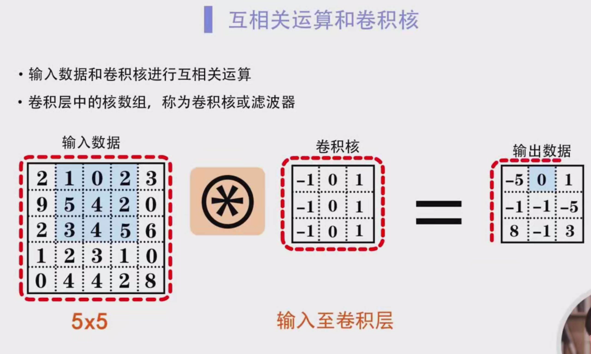

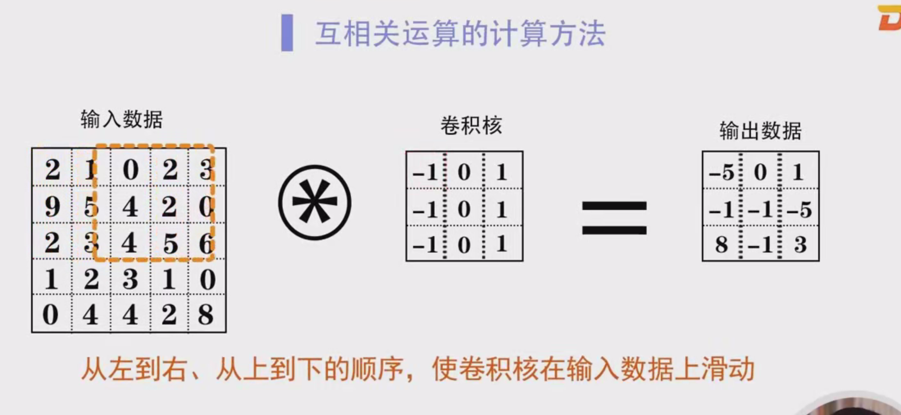

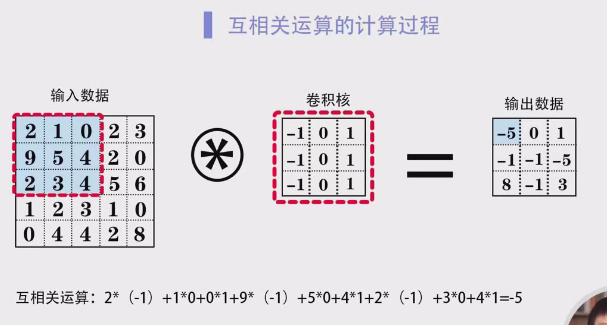

### 卷积神经网络中的卷积层及其运算

#### 1. **卷积的基本概念**

- **卷积运算**（Convolution）是数学分析中的一种重要运算，广泛应用于信号处理、图像处理等领域。卷积运算可以对信号或图像进行滤波、平滑、边缘检测等处理。在卷积神经网络中，卷积运算的主要目标是提取输入数据（如图像）的局部特征。
- 尽管卷积神经网络（CNN）中使用了“卷积”一词，但实际计算过程中，卷积神经网络通常使用**互相关运算**（Cross-Correlation），它与卷积的区别在于，卷积运算需要将卷积核（滤波器）进行旋转，而互相关则直接进行计算。互相关运算的计算方式更加直观且效率较高，因此在实际应用中常使用互相关代替卷积。
- 对于卷积的数学定义，理论上它是通过将输入信号与一个函数进行滑动匹配计算而得出输出，但在神经网络的计算中，我们重点关注如何在具体的网络模型中应用这种计算方法。

#### 2. **卷积运算在图像处理中的应用**

- **二维卷积**：在图像处理中，常用的卷积方式是二维卷积，适用于彩色或灰度图像。每一张图像通常是由像素组成的二维数据，因此二维卷积对于图像数据的处理尤为重要。
- 在二维卷积中，图像数据的每个像素点都包含两个维度的信息：**高度**（Rows）和**宽度**（Columns），相当于一个二维数组。通过卷积运算，我们可以在输入图像上提取到各种不同的特征，如边缘、纹理、形状等。
- **滑动窗口**：卷积核（也称为滤波器）在图像上滑动并进行计算。卷积核的大小通常较小，例如3×3、5×5等。通过滑动，卷积核对图像的局部区域进行加权求和，从而得到一个新的输出。

#### 3. **卷积层中的输入和输出数据**

- **输入数据**：卷积神经网络中的输入通常是一个高维的张量，特别是在处理图像时，输入数据通常是一个**三维**张量，维度为[高度×宽度×通道数]。例如，一张RGB图像的输入数据形状为[高度×宽度×3]，其中3表示图像的RGB三个颜色通道。
- **卷积核**：卷积层包含若干个卷积核，每个卷积核也是一个二维数组，用于在输入数据上滑动并计算特征图（feature map）。例如，一个卷积核的大小为3×3，表示该卷积核处理3×3的输入区域。
- **输出数据**：卷积操作的结果是一个二维数组，称为**特征图（Feature Map）**。特征图的大小取决于卷积核的大小、步长（Stride）和填充（Padding）等因素。

#### 4. **卷积层的计算过程**

- 假设输入数据为一个5×5的二维数组（表示为图像），卷积核为一个3×3的二维数组。为了进行卷积计算，卷积核会在输入数据上滑动，每次滑动一个单位，进行互相关运算。

- 在计算时，每次卷积核与输入数据的对应位置对齐，并进行元素级的乘法操作。即，卷积核中的每个元素与输入数据中对应位置的元素相乘，然后将这些乘积相加，得到一个数值作为输出数据的一个元素。

- 例如，假设输入数据中的一部分是：

  ```
  | 1 | 2 | 3 |
  | 4 | 5 | 6 |
  | 7 | 8 | 9 |
  ```

  卷积核为：

  ```
  | 1 | 0 | -1 |
  | 1 | 0 | -1 |
  | 1 | 0 | -1 |
  ```

  进行计算时，卷积核与输入数据的对应区域对齐，得到的计算结果是：

  ```
  (1*1 + 2*0 + 3*(-1)) + (4*1 + 5*0 + 6*(-1)) + (7*1 + 8*0 + 9*(-1)) = -5
  ```

- 在卷积核滑动的过程中，逐步计算每个输出元素，最终得到一个二维输出数组（特征图）。

#### 5. **卷积核（滤波器）**

- 卷积核是卷积操作的核心，其作用是对输入数据进行加权求和，从而提取图像中的特征。每个卷积核的权重在训练过程中会自动更新，以使得神经网络能够识别和提取重要的特征。
- 卷积核的大小和数量通常是由网络设计者根据任务需求来确定。常见的卷积核大小包括3×3、5×5等。
- 每个卷积核学习到不同的特征，例如边缘、角点、纹理等。

#### 6. **互相关运算的计算方法**

- 互相关运算是卷积神经网络中实际进行的计算方式，流程如下：

  1. 将卷积核看作一个窗口，每次计算时，卷积核与输入数据的对应部分大小相同。
  2. 卷积核从输入数据的左上角开始滑动，并进行计算。
  3. 卷积核与输入数据对应区域的元素相乘，然后将所有乘积相加，得到一个数值，该数值就是输出数组中对应位置的元素。
  4. 滑动的过程遵循从左到右、从上到下的顺序。

- 例如，假设卷积核的当前对齐位置如下图所示：

  ```
  输入数据：
  | 1 | 2 | 3 |
  | 4 | 5 | 6 |
  | 7 | 8 | 9 |
  
  卷积核：
  | 1 | 0 | -1 |
  | 1 | 0 | -1 |
  | 1 | 0 | -1 |
  ```

  对应位置的互相关计算如下：

  ```
  输出数据 = (1*1 + 2*0 + 3*(-1)) + (4*1 + 5*0 + 6*(-1)) + (7*1 + 8*0 + 9*(-1)) = -5
  ```

- 然后，卷积核向右滑动一个单位，继续进行相同的计算。

#### 7. **卷积层参数与调整**

- **步长（Stride）**：步长控制卷积核在输入数据上滑动的距离。步长越大，输出特征图的尺寸越小。常见的步长为1或2。
- **填充（Padding）**：填充用于在输入数据的边缘添加零，目的是保持输入和输出数据的尺寸一致，或者控制输出特征图的尺寸。常见的填充方法有"valid"（无填充）和"same"（填充以保持尺寸）。

#### 8. **总结**

- 本节讲解了卷积神经网络中卷积层的基本概念、卷积核的运作方式以及互相关运算的过程。
- 卷积层通过卷积核在输入数据上滑动进行特征提取，从而帮助神经网络识别图像中的重要特征。
- 卷积神经网络的关键在于通过多个卷积层的堆叠逐步提取图像的层次特征，最终用于分类或回归任务。

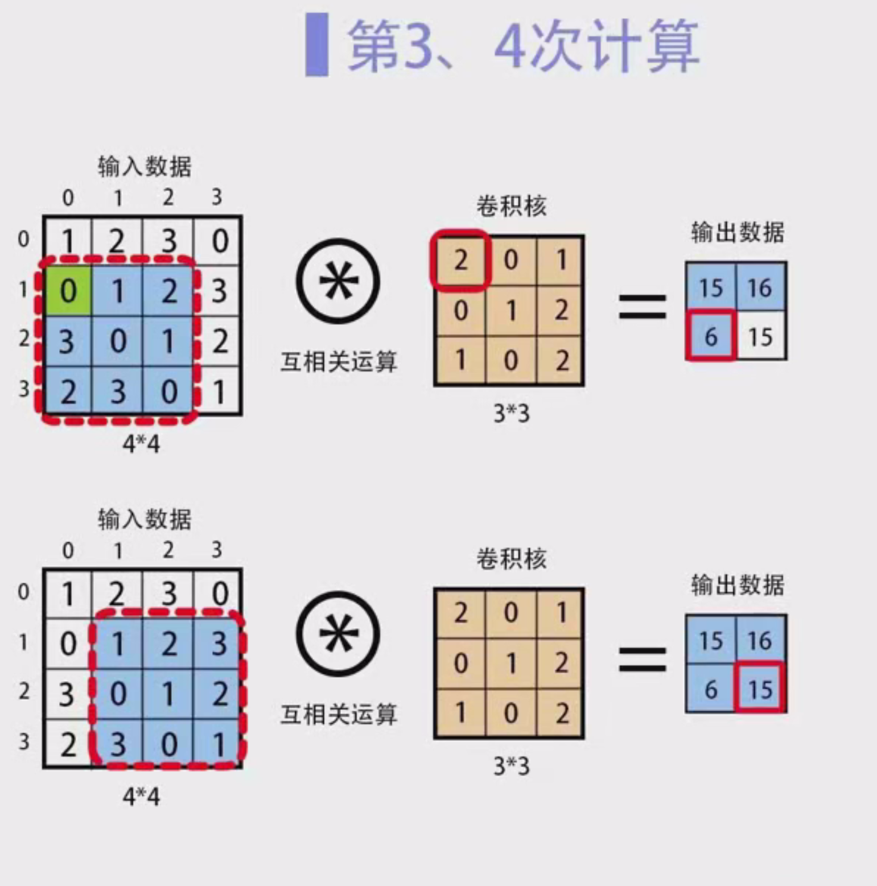

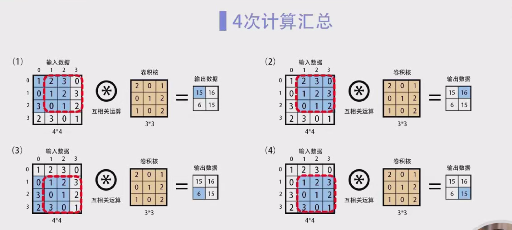

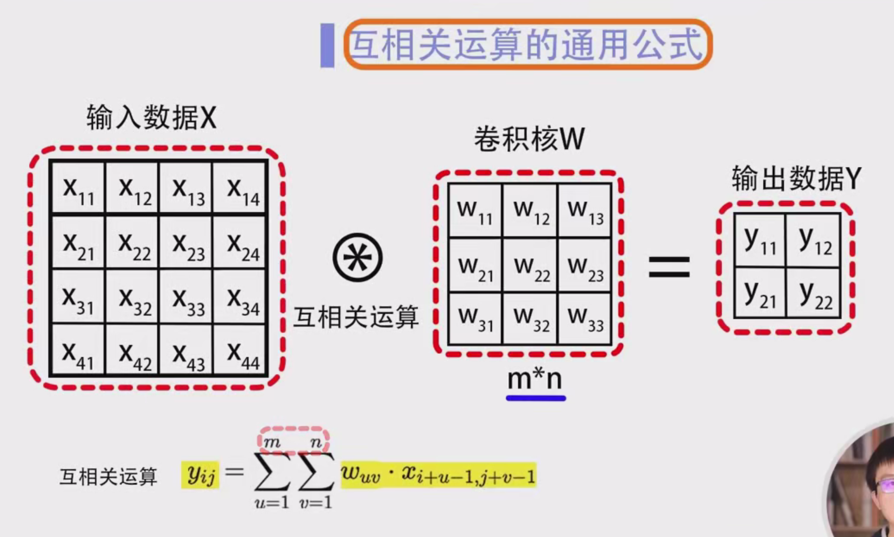

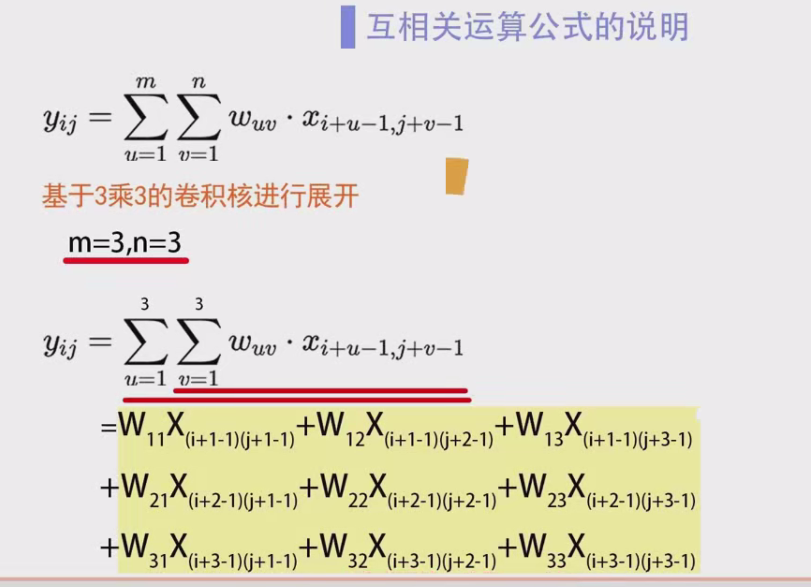

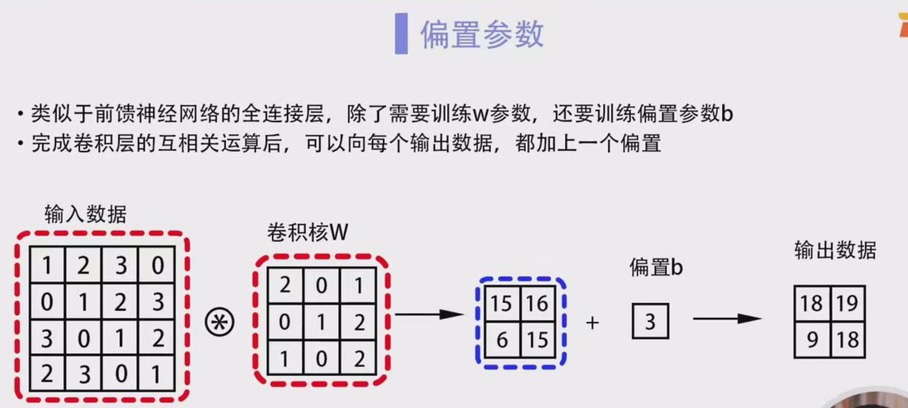