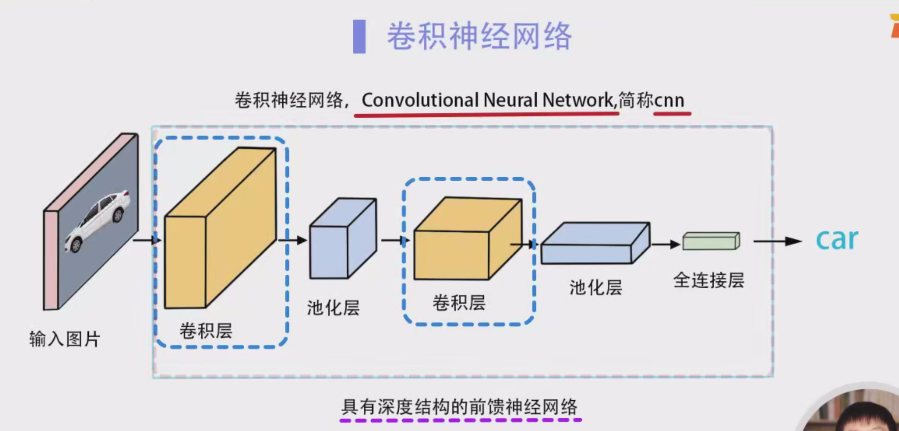
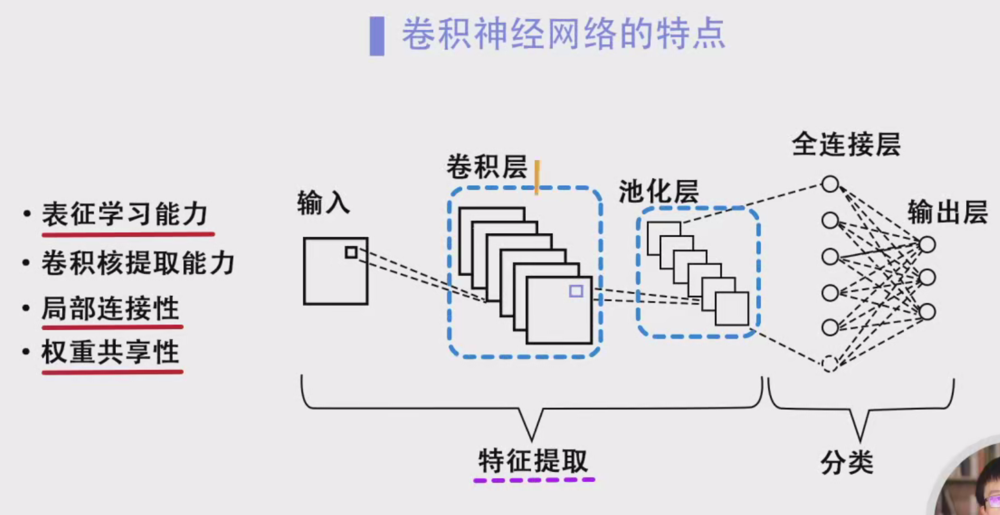
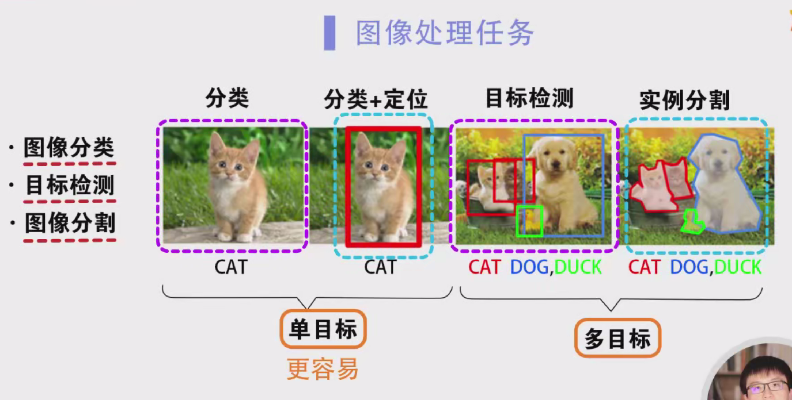
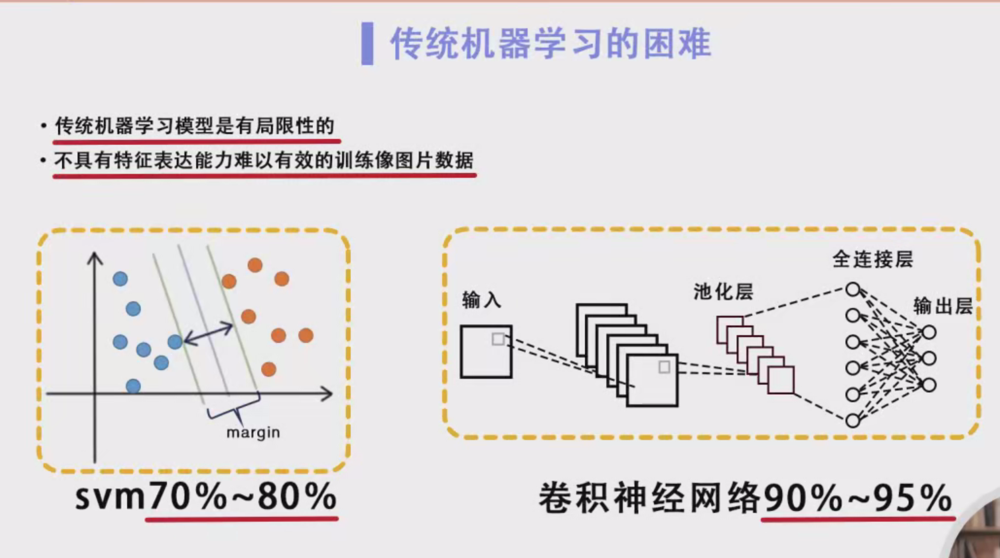
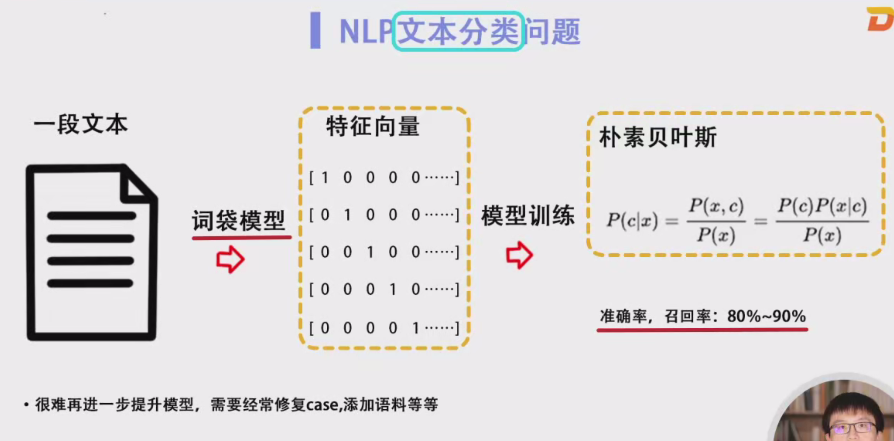
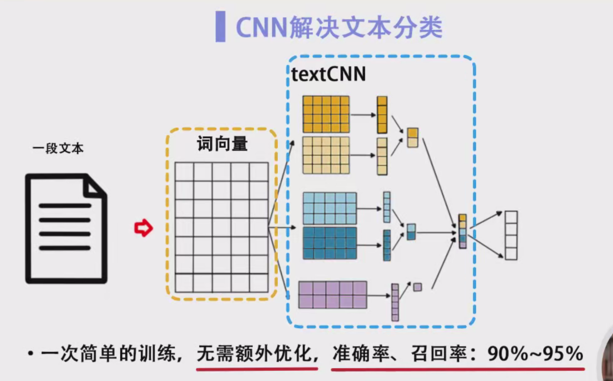

# 卷积神经网络（CNN）入门学习笔记

## 一、卷积神经网络背景介绍

### 1.1 卷积神经网络（CNN）的定义

卷积神经网络（Convolutional Neural Network，简称CNN）是一种深度前馈神经网络，由一个或多个卷积层构成。其主要特点是具有深度结构，也就是说，网络中包含多个层次。与传统的前馈神经网络（Feedforward Neural Network, FFNN）相比，卷积神经网络的层次更加深，能够进行更复杂的特征提取。

### 1.2 卷积神经网络的特点

卷积神经网络具有强大的表征学习能力，能够通过不同的卷积核提取图像特征。随着网络的加深，网络中的不同层次会提取出不同的特征。

卷积神经网络相比普通的前馈神经网络，还有以下两大特点：

- **局部连接性**：网络中不同节点之间的连接是局部的，即只与邻近节点相连接。
- **权重共享性**：同一卷积核的权重在整个图像中共享，能够有效减少参数数量，提高模型效率。

### 1.3 卷积神经网络的应用领域

卷积神经网络是近年来深度学习在计算机视觉领域取得突破性进展的核心算法。除了计算机视觉，CNN在自然语言处理、推荐系统、语音识别等多个领域也得到了广泛应用。

## 二、计算机视觉中的图像处理任务

### 2.1 图像处理任务类型

在计算机视觉中，常见的图像处理任务包括：

- **图像分类**：识别图片属于哪个类别。
- **目标检测**：不仅识别图像中的物体，还确定它们的位置。
- **图像分割**：将图像划分为多个区域，识别每个区域的内容。

这些任务可以分为单目标任务和多目标任务两类：

- **单目标任务**：图像中只包含一个目标，例如识别图片中的猫并定位其位置。
- **多目标任务**：图像中包含多个目标，例如识别图片中的多种动物，并且为每个目标进行定位和实例分割。

### 2.2 单目标与多目标任务的比较

- **单目标任务**：任务相对简单，通常先进行图像分类，然后根据分类结果定位目标位置。
- **多目标任务**：任务较为复杂，需要识别图像中的多个实体并进行定位、分割等操作。

## 三、传统机器学习与卷积神经网络的比较

### 3.1 传统机器学习的局限性

在卷积神经网络得到充分发展之前，传统机器学习方法被用于图像处理任务。然而，传统机器学习方法存在显著的局限性，主要体现在：

- 传统模型缺乏有效的特征表达能力，难以从图像中提取有效的特征。
- 传统模型往往需要依赖手动设计特征，这使得它们在处理图像数据时效果有限。

举个例子，使用支持向量机（SVM）进行图像分类时，准确率通常只能达到70%-80%。而使用卷积神经网络时，通常可以轻松达到90%-95%的准确率，效果提升显著。

### 3.2 卷积神经网络的优势

卷积神经网络通过其强大的表征学习能力，能够自动从图像中提取特征，不再依赖手动设计特征。其应用效果在计算机视觉领域取得了显著突破，且在其他领域（如自然语言处理）也取得了良好成绩。

例如，在文本分类任务中，传统机器学习方法通常需要手动提取文本特征，然后将其输入到模型中（如朴素贝叶斯或逻辑回归）。尽管如此，模型的效果仍然有限，可能需要多次优化和调整。而使用深度学习方法（如基于词向量的CNN），只需要进行一次训练，模型的准确率和召回率即可达到90%-95%。

