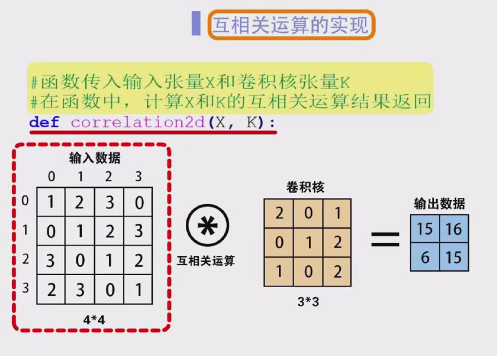
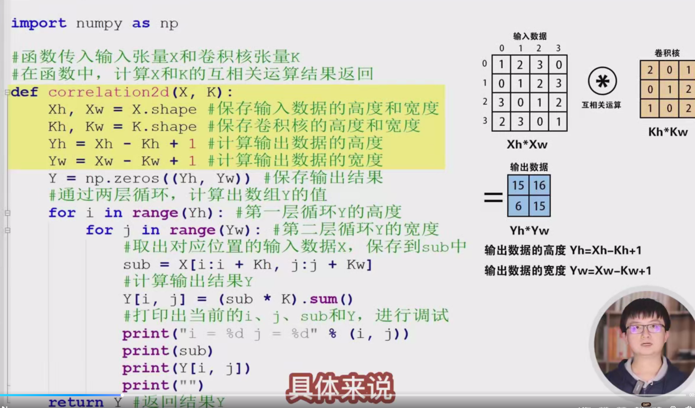
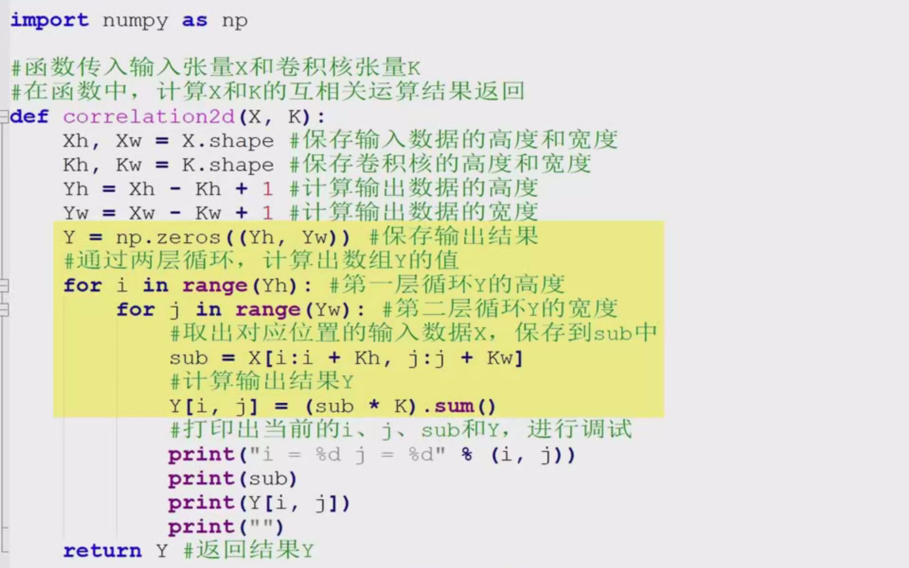
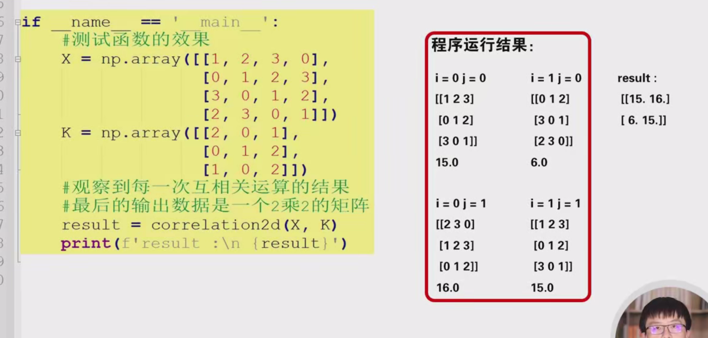
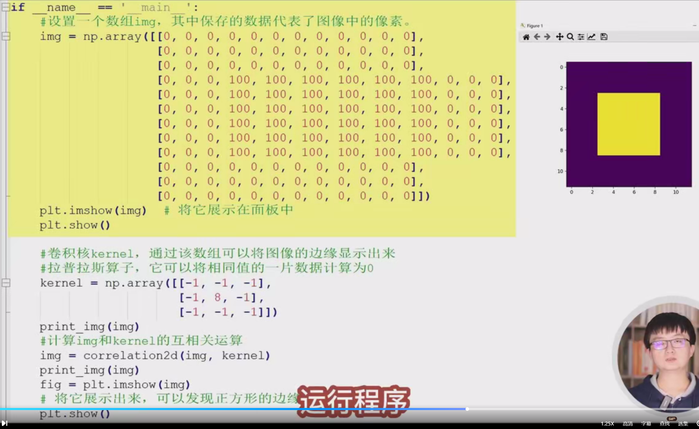
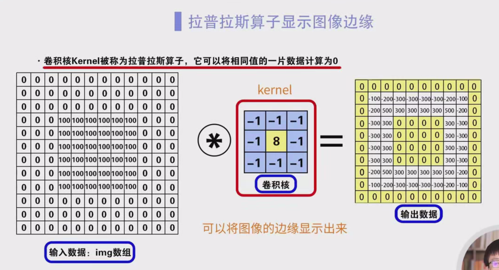
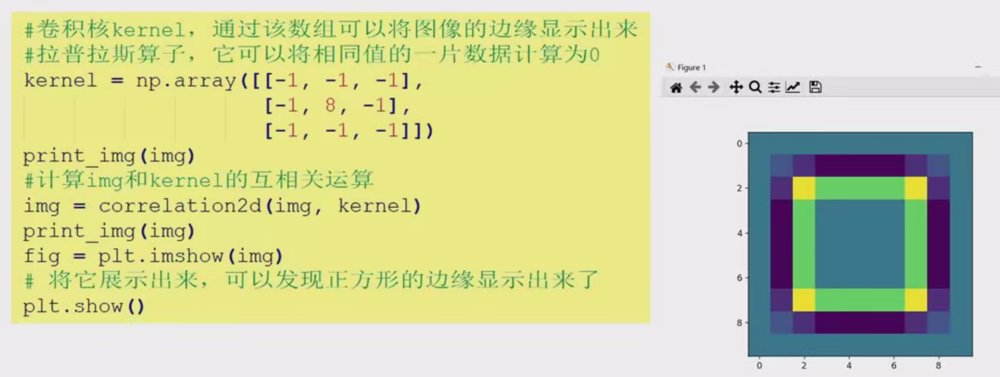
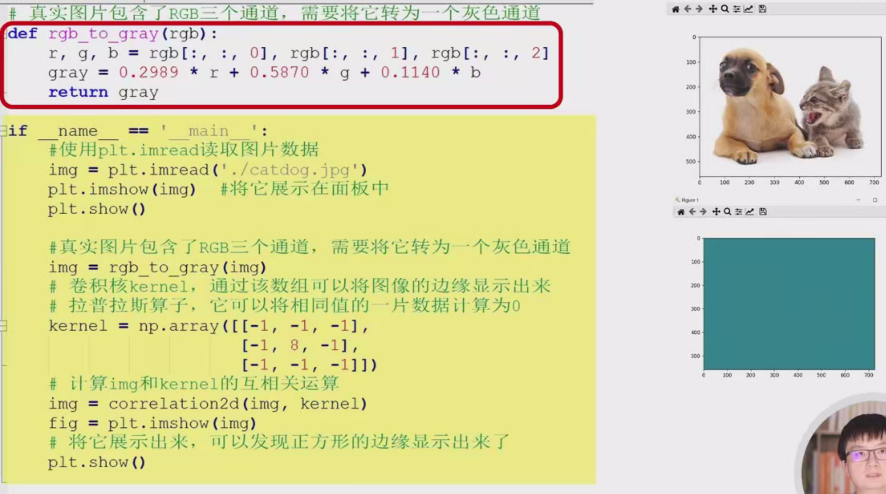

好的，我会进一步详细整理内容，增加具体步骤、代码示例和解释，方便入门学习。

### 笔记：卷积运算与图像边缘检测的程序设计实验

#### 一、实验目标

1. 理解卷积运算和互相关运算的基本原理。
2. 学习如何通过编程实现互相关运算。
3. 使用卷积运算实现图像边缘检测。
4. 掌握从手动构造数据到真实图片的实验流程。

#### 二、互相关运算的实践过程

##### 1. 互相关运算的定义

- **互相关运算**：将卷积核（滤波器）在输入数据上滑动，计算卷积核与输入数据的局部区域的逐元素相乘后再求和的结果。

- **公式**：

  y(i,j)=m∑n∑x(m,n)⋅k(i−m,j−n)

  其中：

  - x(m,n) 是输入数据。
  - k(i−m,j−n) 是卷积核。
  - y(i,j) 是输出结果。

##### 2. 实现互相关运算的函数

- **函数名称**：`correlation_2d`
- **输入参数**：
  - `x`：输入数据（二维矩阵）。
  - `k`：卷积核（二维矩阵）。
- **输出参数**：
  - `y`：互相关运算的结果（二维矩阵）。

###### 代码实现

Python复制

```python
def correlation_2d(x, k):
    # 获取输入数据和卷积核的尺寸
    xh, xw = x.shape  # 输入数据的高度和宽度
    kh, kw = k.shape  # 卷积核的高度和宽度

    # 计算输出数据的尺寸
    yh = xh - kh + 1
    yw = xw - kw + 1

    # 初始化输出数据
    y = [[0 for _ in range(yw)] for _ in range(yh)]

    # 互相关运算
    for i in range(yh):
        for j in range(yw):
            # 提取当前窗口的子矩阵
            sub = x[i:i+kh, j:j+kw]
            # 计算当前窗口的互相关结果
            y[i][j] = (sub * k).sum()
            # 调试信息
            print(f"i={i}, j={j}, sub=\n{sub}, y[{i}][{j}]={y[i][j]}")
    return y
```

##### 3. 示例

- **输入数据**：

  x=15913261014371115481216

- **卷积核**：

  k=147258369

- **输出数据**：

  y=[1561615]

###### 详细计算过程

1. **计算 y[0][0]**：

   - 提取子矩阵：

     sub=15926103711

   - 计算：

     y[0][0]=(sub⋅k).sum()=15

2. **计算 y[0][1]**：

   - 提取子矩阵：

     sub=261037114812

   - 计算：

     y[0][1]=(sub⋅k).sum()=16

3. **计算 y[1][0]**：

   - 提取子矩阵：

     sub=59136101471115

   - 计算：

     y[1][0]=(sub⋅k).sum()=6

4. **计算 y[1][1]**：

   - 提取子矩阵：

     sub=610147111581216

   - 计算：

     y[1][1]=(sub⋅k).sum()=15

#### 三、图像边缘检测

##### 1. 手动构造数据实验

###### (1) 构造图像数据

- **图像数据**：

  image=0000001001001000010010010000100100100000000

- **显示图像**：

  Python复制

  ```python
  import matplotlib.pyplot as plt
  plt.imshow(image, cmap='gray')
  plt.title("Manual Image")
  plt.show()
  ```

  - **结果**：外圈为黑色（0），内圈为白色（100）。

###### (2) 定义卷积核（拉普拉斯算子）

- **卷积核**：

  kernel=−1−1−1−18−1−1−1−1

- **作用**：检测图像的边缘，将相同值的区域计算为0，边缘区域突出显示。

###### (3) 互相关运算

- **代码**：

  Python复制

  ```python
  result = correlation_2d(image, kernel)
  plt.imshow(result, cmap='gray')
  plt.title("Edge Detection Result")
  plt.show()
  ```

- **结果**：图像的边缘被突出显示，内部区域为0。

##### 2. 真实图片实验

###### (1) 读取图片

- **代码**：

  Python复制

  ```python
  from PIL import Image
  import numpy as np
  
  # 读取图片
  img = Image.open("image.jpg")
  img_array = np.array(img)
  ```

- **注意**：真实图片包含RGB三个通道，需要转换为灰度图像。

###### (2) 转换为灰度图像

- **代码**：

  Python复制

  ```python
  def rgb_to_gray(rgb_image):
      return np.dot(rgb_image[..., :3], [0.2989, 0.5870, 0.1140])
  
  gray_image = rgb_to_gray(img_array)
  plt.imshow(gray_image, cmap='gray')
  plt.title("Gray Image")
  plt.show()
  ```

###### (3) 边缘检测

- **代码**：

  Python复制

  ```python
  edge_result = correlation_2d(gray_image, kernel)
  plt.imshow(edge_result, cmap='gray')
  plt.title("Edge Detection Result")
  plt.show()
  ```

- **结果**：图像的轮廓被清晰显示。

#### 四、总结

1. **互相关运算**：通过滑动卷积核计算局部区域的加权和。
2. **边缘检测**：使用拉普拉斯算子突出图像的边缘。
3. **实验流程**：
   - 手动构造数据实验：理解互相关运算和边缘检测的基本原理。
   - 真实图片实验：将理论应用于实际图像处理。

#### 五、注意事项

1. **输入数据和卷积核的尺寸**：确保输入数据和卷积核的尺寸匹配。
2. **调试信息**：在计算过程中打印中间结果，便于理解。
3. **真实图片处理**：需要将RGB图像转换为灰度图像。

希望这份详细的笔记对你入门学习有所帮助！