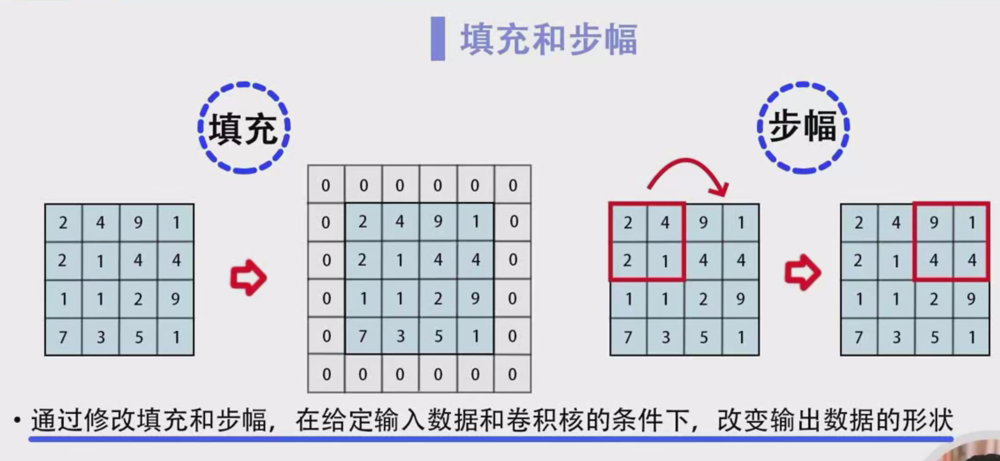
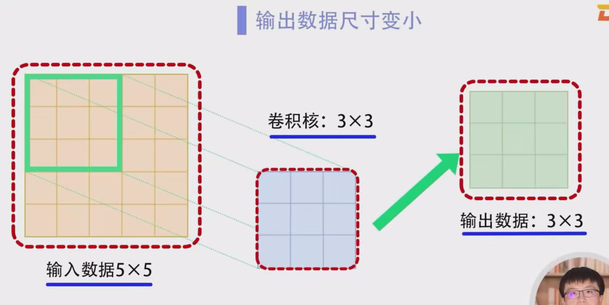
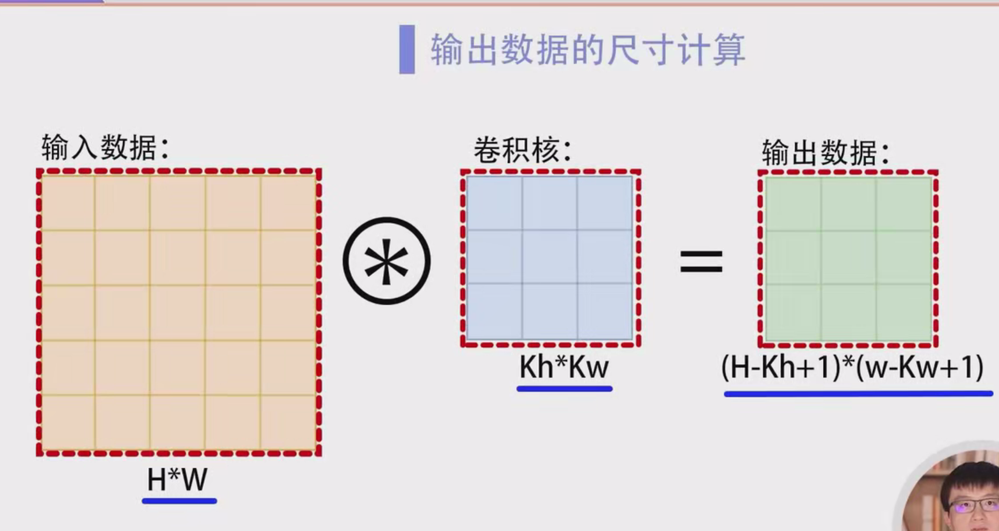
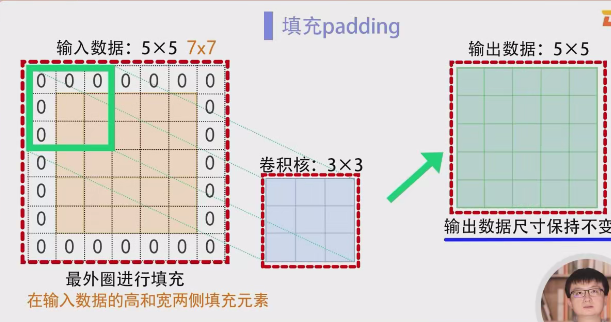
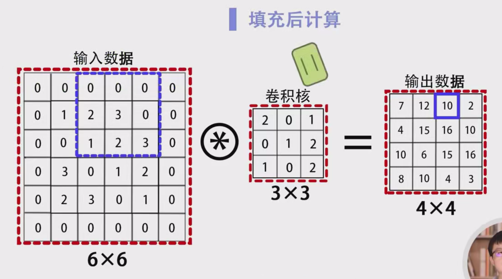

### 卷积运算中的填充：详细笔记

#### 1. 卷积运算概述

卷积神经网络中的卷积运算是图像处理中的一种核心操作，其输出形状由输入数据的形状和卷积核的窗口大小共同决定。卷积运算通过在输入数据上滑动卷积核来进行特征提取，最终输出一个新的数据矩阵。

在卷积运算中，除了输入数据的形状和卷积核的大小外，还有两个重要的超参数：填充（Padding）和步长（Stride）。我们将重点讨论填充，并且学习如何通过填充和步长来控制输出数据的形状。

#### 2. 卷积操作中的输出尺寸

当卷积核的大小大于1时，卷积运算的输出尺寸通常小于输入尺寸。这是因为卷积核在输入数据上滑动计算时，不能超出输入数据的范围。

例如：

- 如果输入数据的尺寸是 5×55 \times 5，而卷积核的大小是 3×33 \times 3，
- 每次卷积核滑动一步，输出的尺寸会变为 3×33 \times 3。

一般而言，卷积操作输出尺寸的公式为：

output height=h−kh+1\text{output height} = h - kh + 1output width=w−kw+1\text{output width} = w - kw + 1

其中，hh 和 ww 是输入图像的高度和宽度，khkh 和 kwkw 是卷积核的高度和宽度。

举例来说，对于一个 5×55 \times 5 的输入和 3×33 \times 3 的卷积核，输出的尺寸将是：

output height=5−3+1=3\text{output height} = 5 - 3 + 1 = 3output width=5−3+1=3\text{output width} = 5 - 3 + 1 = 3

因此，卷积后输出结果的尺寸就是 3×33 \times 3。

#### 3. 填充的作用

当卷积核的尺寸大于1时，多次卷积会使得输出尺寸逐渐变小，这通常不是我们希望的结果。为了避免卷积后输出尺寸变小，可以通过填充（Padding）来解决。

**填充**是指在输入数据的高和宽两侧添加额外的元素，通常填充的元素是零。填充后，输入数据的边缘部分将不再丢失，使得卷积核可以完整地处理数据的边缘。

例如，对于一个 5×55 \times 5 的输入图像，如果我们在周围添加一圈零（即填充1个像素），则图像变为 7×77 \times 7，经过卷积核的运算后，输出尺寸仍然是 5×55 \times 5。

#### 4. 填充运算示例

假设我们有一个 4×44 \times 4 的输入数据，并应用填充大小为1（Padding = 1）。具体操作如下：

1. **填充过程**：在 4×44 \times 4 输入数据的周围添加一圈零，得到 6×66 \times 6 的数据。
2. **卷积操作**：使用 3×33 \times 3 的卷积核对填充后的 6×66 \times 6 数据进行卷积。每次卷积核滑动一步，计算出一个结果。
3. **输出尺寸**：经过计算后，输出结果的尺寸为 4×44 \times 4，与原输入数据的尺寸相同。

通过这种方式，填充能够有效避免在多次卷积操作中，数据尺寸逐渐变小的问题。

#### 5. 填充的影响

由于填充的数据通常是零，因此它对卷积结果的影响非常小。填充后的数据不会干扰卷积核提取的特征，但却能有效防止边缘数据丢失，从而保持输出数据的尺寸。

