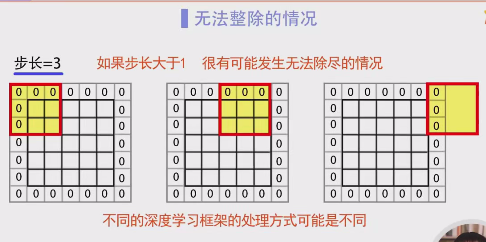

### 卷积运算中的步幅（Stride）学习笔记

#### 1. 引言
卷积运算是深度学习中非常重要的一项操作，尤其在卷积神经网络（CNN）中广泛使用。在卷积运算中，我们需要设置多个参数来影响卷积的计算结果，其中两个关键参数是“填充（Padding）”和“步幅（Stride）”。在前一节课中，我们学习了填充参数，本节将专门讲解步幅参数。

#### 2. 步幅（Stride）概念
步幅（Stride）是指卷积核在输入数据上滑动时，每次滑动的单位数。换句话说，步幅定义了卷积核窗口在输入数据上每次移动时的步长。

**步幅的作用：**
- 步幅决定了卷积核每次滑动的距离。
- 步幅的大小直接影响卷积操作的输出尺寸。
- 步幅可以在卷积运算中加快卷积核的扫描速度，减少输出的尺寸。

#### 3. 步幅的计算方式
卷积运算中，卷积核从输入矩阵的左上角开始，按从左到右、从上到下的顺序滑动。每次滑动的距离取决于步幅的值。

假设我们有一个 **6×6** 的输入矩阵，卷积核的大小为 **2×2**，步幅为 **1**。

- **步幅为1的情况：**  
  每次卷积核向右滑动一个单位，扫描完一行后，卷积核向下滑动一个单位，开始扫描下一行。在这种情况下，卷积核会扫描整个输入数据区域，输出一个 **5×5** 的矩阵。计算过程如下：
  
  - 第一行：卷积核从输入矩阵的最左侧开始，扫描到第一个 **2×2** 区域。
  - 第二行：卷积核继续向右滑动，扫描第二个 **2×2** 区域。
  - 当卷积核扫描完所有的列后，开始从第二行开始扫描，依此类推。

- **步幅为2的情况：**  
  如果将步幅改为 **2**，则卷积核每次在行或列上移动2个单位。因此，卷积核扫描的次数会减少，最终输出的数据尺寸会变小。例如，对于一个 **6×6** 的输入矩阵和 **2×2** 的卷积核，步幅为2时，输出结果将是一个 **3×3** 的矩阵。具体扫描过程如下：
  
  - 第一行：卷积核从输入矩阵的最左侧开始，向右滑动两个单位，扫描到第一个 **2×2** 区域。
  - 第二行：卷积核继续向下滑动两个单位，扫描第二个 **2×2** 区域。
  - 然后卷积核开始扫描下一行，直到完成整个矩阵的扫描。

#### 4. 例子分析：步幅对输出尺寸的影响
- **输入数据大小：** 4×4
- **卷积核大小：** 2×2
- **步幅：** 2
- **填充：** 无（没有填充）

**输出数据计算过程：**
假设输入数据是一个 **4×4** 的矩阵，卷积核为 **2×2**，步幅为 **2**，没有填充。卷积核每次向右和向下移动2个单位，因此输出数据的尺寸将是 **2×2**。

具体的扫描过程如下：
- 第一行：卷积核从输入矩阵的最左侧开始，扫描到第一个 **2×2** 区域。
- 第二行：卷积核向右移动2个单位，扫描第二个 **2×2** 区域。
- 然后卷积核开始从第二行的第二列开始扫描，直到完成整个矩阵的扫描。

#### 5. 步幅与填充的关系
- **步幅增大，输出尺寸变小：**  
  增加步幅意味着卷积核每次扫描的步长增大，因此输出数据的尺寸会变小。比如，步幅为1时，卷积核每次滑动1个单位，输出数据尺寸较大；而步幅为2时，卷积核每次滑动2个单位，输出数据尺寸变小。

- **填充增大，输出尺寸变大：**  
  填充（Padding）是指在输入数据的边缘添加额外的零，增加填充会使得卷积核能够覆盖更多的输入数据区域，最终输出的尺寸变大。与步幅相反，增加填充通常会增加输出的尺寸。

#### 6. 输出数据尺寸的计算公式
设输入矩阵的大小为 $ m \times n $，卷积核的大小为 $ u \times v $，填充为 $ p $（假设填充在高和宽上均相同），步幅为 $ s $，则输出矩阵的尺寸可以通过以下公式计算：

$
\text{输出高} = \frac{m + 2p - u}{s} + 1
$
$
\text{输出宽} = \frac{n + 2p - v}{s} + 1
$

**例子：**  
假设输入数据是一个 **5×5** 的矩阵，卷积核为 **3×3**，填充为 **1**，步幅为 **2**。我们可以用公式计算输出尺寸：

$
\text{输出高} = \frac{5 + 2 \times 1 - 3}{2} + 1 = 3
$
$
\text{输出宽} = \frac{5 + 2 \times 1 - 3}{2} + 1 = 3
$

因此，输出数据的尺寸为 **3×3**。

#### 7. 步幅大于1时的处理问题
当步幅大于1时，卷积核可能无法完全扫描整个输入数据，特别是在步幅较大的情况下。例如，如果步幅为3，卷积核可能会在扫描到最后时超出边界，导致无法完全扫描输入数据。

此时，不同的深度学习框架可能有不同的处理方式：
1. **报错：**  
   框架可能会检测到步幅无法整除输入数据的尺寸，并报错提示用户。
   
2. **四舍五入：**  
   框架也可能采取四舍五入的方式来处理，即计算出一个近似值。在实际操作中，框架通常会忽略掉超出部分的数据（例如右侧和下方的填充零），从而计算出一个近似的输出结果。

#### 8. 总结
- **步幅（Stride）** 是卷积运算中的重要参数，它控制卷积核在输入数据上滑动的距离，从而影响输出数据的尺寸。
- **增大步幅** 会导致卷积核的扫描速度变快，输出数据的尺寸变小。
- **增加填充** 会使输入数据的边缘得到扩展，从而使输出数据的尺寸变大。
- 输出数据的尺寸可以通过公式计算得出，步幅大于1时可能会出现无法整除的问题，通常框架会通过报错或四舍五入来处理
