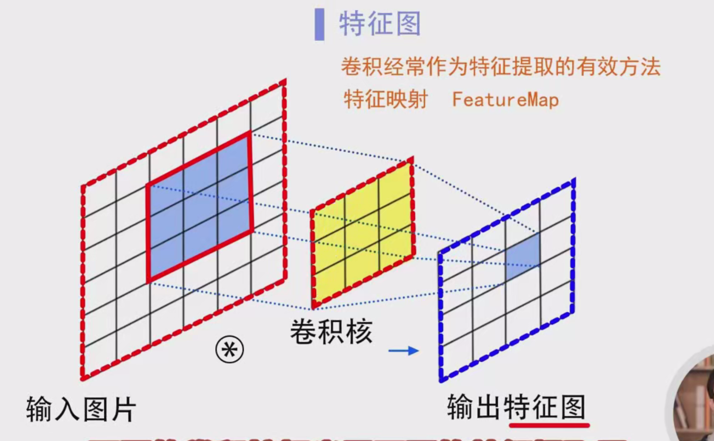
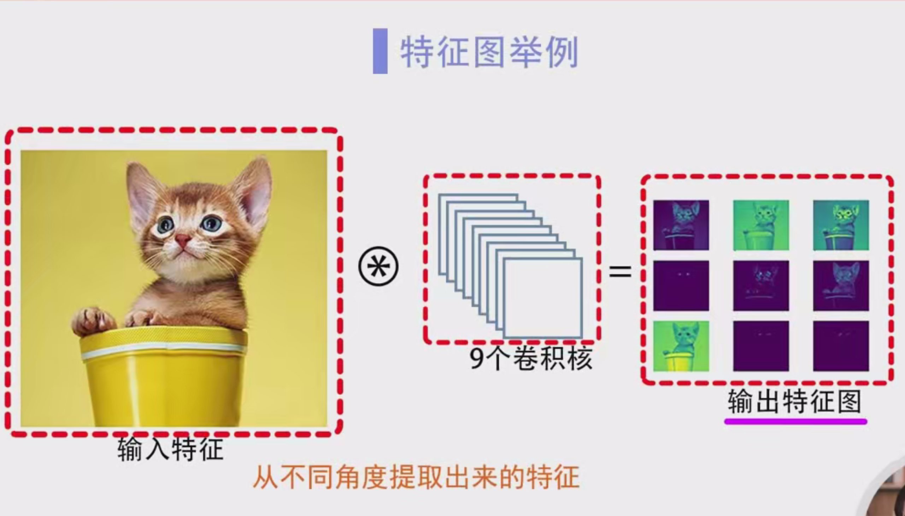
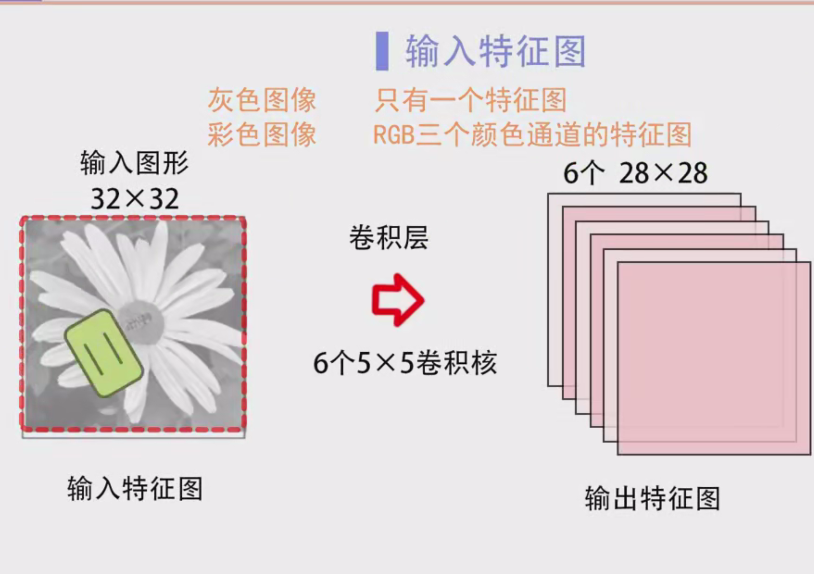
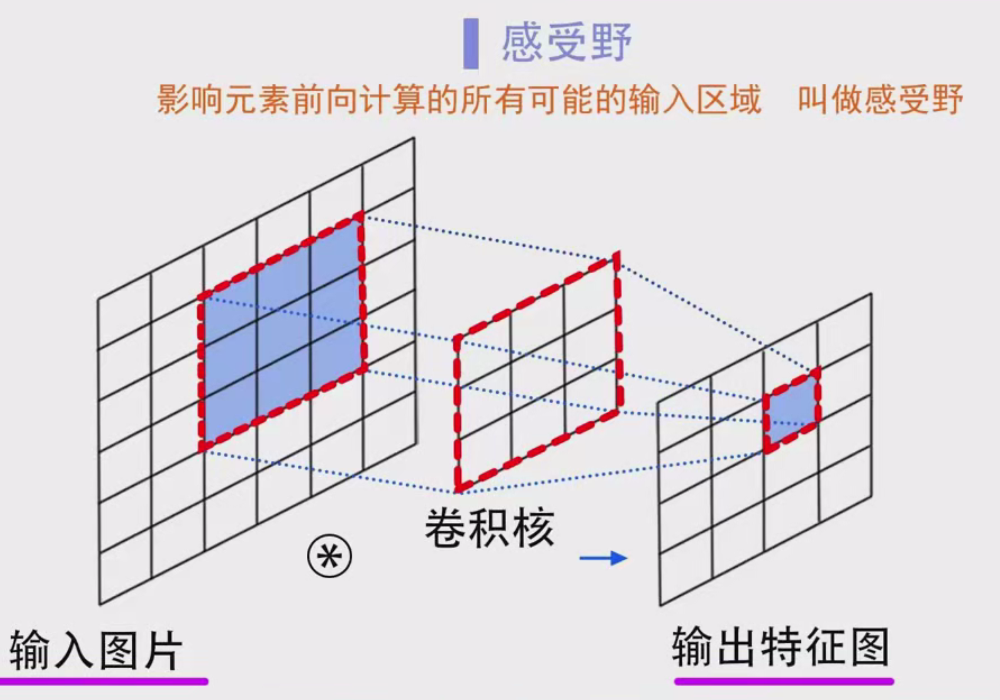
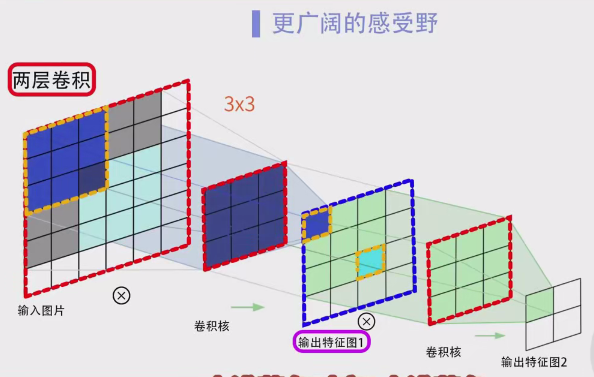
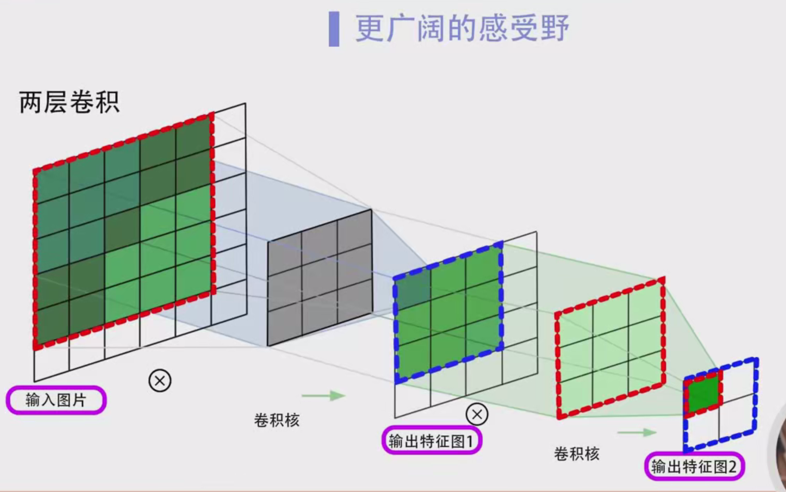

### 卷积运算中的步幅（Stride）学习笔记

#### 1. **什么是步幅（Stride）**

步幅（Stride）是卷积运算中的一个重要参数，决定了卷积核窗口在输入数据上滑动的步长或步数。简单来说，步幅是卷积核每次滑动时，沿着输入数据的行或列方向移动的单位数。

#### 2. **步幅的作用**

- 步幅越大，卷积核每次滑动的距离越长，输出的尺寸就会越小。
- 步幅越小，卷积核每次滑动的距离越短，输出的尺寸就会越大。
- 步幅直接影响卷积计算的效率和输出数据的尺寸。

#### 3. **卷积运算回顾**

在进行卷积运算时，卷积核（也叫滤波器）会在输入数据上滑动，逐步计算与输入数据各部分的卷积操作。每个卷积操作会得到一个输出值，最终这些输出值形成了卷积的结果。

- **输入数据**：是我们要进行卷积运算的原始数据。
- **卷积核**：是我们用来计算的滤波器，它通常比输入数据小。
- **步幅**：决定了卷积核每次滑动的距离。

#### 4. **步幅与卷积窗口滑动**

卷积核从输入数据的左上角开始，按照从左到右、从上到下的顺序滑动。每次滑动的距离就是步幅。

- 当步幅为 **1** 时，卷积核每次仅向右滑动一个单位，直到扫描完整行，再向下滑动一行。
- 当步幅为 **2** 时，卷积核每次向右滑动两个单位，完成一行扫描后，向下滑动两个单位。

#### 5. **步幅与输出尺寸的关系**

步幅的设置直接影响卷积运算后的输出尺寸。通过步幅的调整，可以让卷积核更快地扫描输入数据，从而减小输出尺寸。

**计算公式：** 设输入矩阵的大小为 m×nm \times n（即矩阵的高为 mm，宽为 nn），卷积核的大小为 u×vu \times v，填充为 pp（假设高和宽上的填充相同），步幅为 ss，则输出矩阵的尺寸（高和宽）可以通过以下公式计算：

输出高=m+2p−us+1\text{输出高} = \frac{m + 2p - u}{s} + 1输出宽=n+2p−vs+1\text{输出宽} = \frac{n + 2p - v}{s} + 1

#### 6. **具体示例：步幅对输出尺寸的影响**

**示例 1：步幅为1**

假设输入数据大小为 **5×5**，卷积核大小为 **3×3**，没有填充（即填充为0），步幅为1。

1. 计算输出尺寸：

   输出高=5+2×0−31+1=3\text{输出高} = \frac{5 + 2 \times 0 - 3}{1} + 1 = 3

   输出宽=5+2×0−31+1=3\text{输出宽} = \frac{5 + 2 \times 0 - 3}{1} + 1 = 3

   输出数据的尺寸是 **3×3**。

2. 计算过程：

   - 卷积核从输入矩阵的左上角开始，按顺序向右滑动，逐步计算卷积。每次滑动一个单位，直到达到输入矩阵的边缘。
   - 由于步幅为1，卷积核可以进行非常细致的扫描，最终输出尺寸较大。

**示例 2：步幅为2**

假设输入数据大小为 **5×5**，卷积核大小为 **3×3**，没有填充（填充为0），步幅为2。

1. 计算输出尺寸：

   输出高=5+2×0−32+1=2\text{输出高} = \frac{5 + 2 \times 0 - 3}{2} + 1 = 2

   输出宽=5+2×0−32+1=2\text{输出宽} = \frac{5 + 2 \times 0 - 3}{2} + 1 = 2

   输出数据的尺寸是 **2×2**。

2. 计算过程：

   - 卷积核每次向右滑动2个单位，而不是1个单位，扫描时每次跳过了1个单位的区域，因此扫描速度加快，输出数据尺寸减小。

#### 7. **步幅与填充的结合**

在卷积运算中，**步幅**和**填充**通常是一起考虑的。

- **填充（Padding）** 是指在输入数据的边缘添加一些零值，目的是保证卷积核能够覆盖输入数据的边缘区域，或者控制输出数据的尺寸。
- **步幅**决定了卷积核滑动的速度，控制了卷积的覆盖范围。

举个例子：

- 如果填充为 **1**，步幅为 **1**，则输出数据的尺寸会变得相对较大。
- 如果步幅为 **2**，则即使填充为1，输出的尺寸也会相对较小。

#### 8. **步幅大于1时的特殊情况**

当步幅大于1时，卷积核每次滑动的距离增加，可能会遇到以下情况：

- **超出边界问题**：卷积核的窗口有可能扫描到输入数据的边缘，超出输入数据的有效区域。

  例如，如果步幅为3，输入数据大小为 **6×6**，卷积核为 **2×2**，那么在进行卷积时，卷积核在第三步可能会超出输入数据的边界。

为了解决这个问题，深度学习框架通常会采用两种策略：

1. **报错**：框架检测到步幅不能整除输入数据的尺寸时，会提示错误，要求用户调整步幅或数据大小。
2. **四舍五入**：框架会忽略超出边界的部分，计算出一个近似的输出数据尺寸。

#### 9. **步幅的实际应用**

- **步幅为1**：适用于需要高精度、细致扫描的场景，常见于图像处理和目标检测。
- **步幅为2或更大**：适用于需要加速卷积运算、减少计算量的场景，常用于图像分类、特征提取等任务。

#### 10. **总结**

- **步幅（Stride）** 是卷积运算中的关键参数，控制卷积核的滑动速度。
- 步幅的设置直接影响卷积输出的尺寸：**步幅越大，输出尺寸越小**；**步幅越小，输出尺寸越大**。
- 步幅和填充通常一起设置，共同决定卷积输出的尺寸。
- 步幅大于1时，卷积核的扫描会更快，但也可能会遇到超出边界的问题，深度学习框架通常会提供处理方案。

