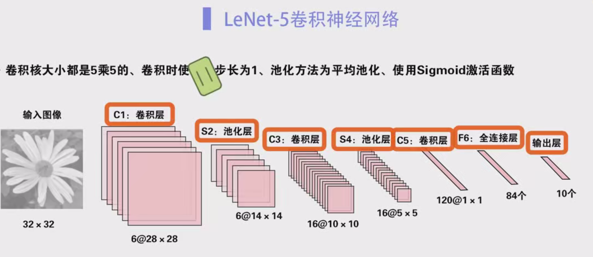
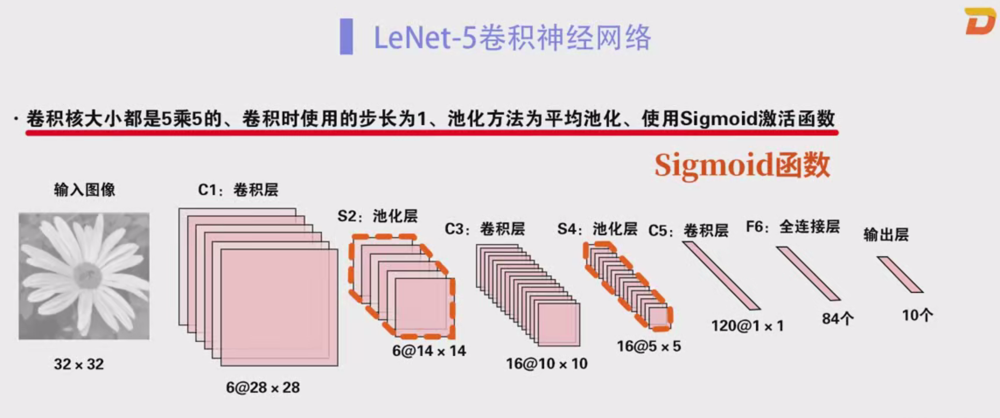
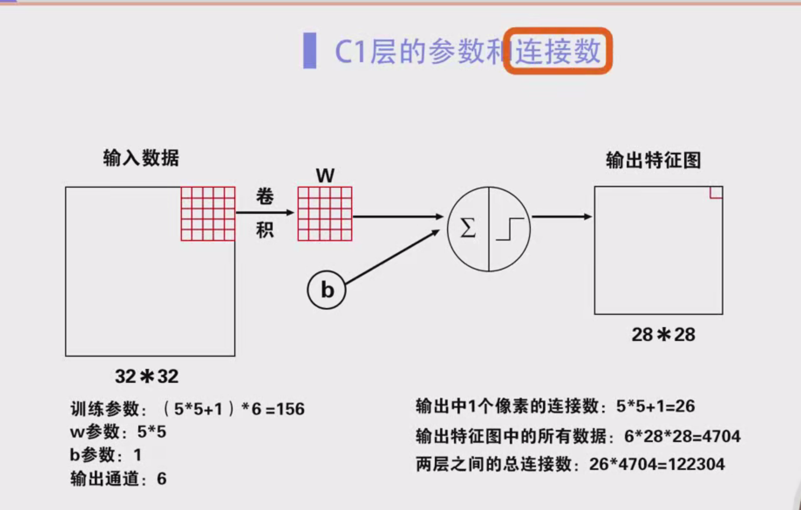
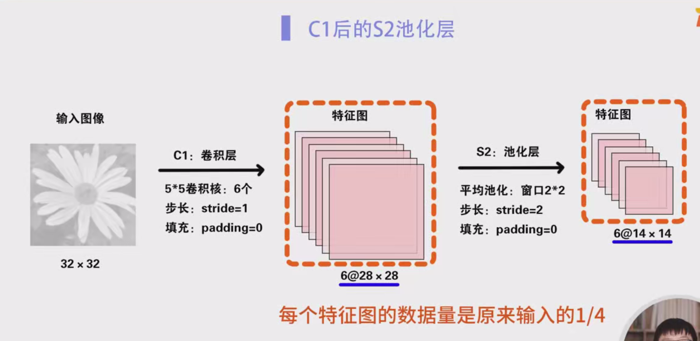
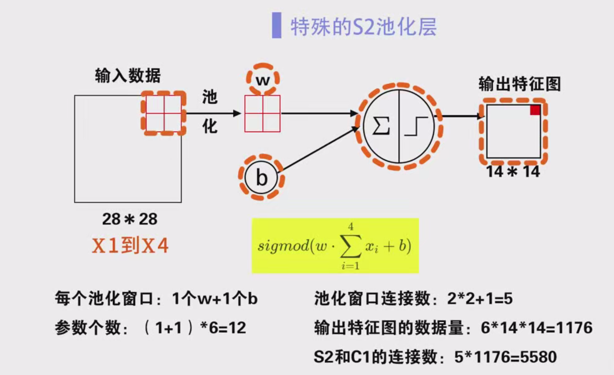

### L-Net卷积神经网络笔记

#### 1. 背景介绍

L-Net是一种用于手写体数字字符识别任务的卷积神经网络（CNN），它是最早期且最为经典的卷积神经网络之一。L-Net由杨乐坤等人在1998年提出。杨乐坤是法国计算机科学家，现为Facebook的首席人工智能科学家，并在2018年获得图灵奖。

尽管L-Net提出的时间较早，但它是一个非常成功的神经网络模型。在20世纪90年代，基于L-Net的手写体数字识别系统已被美国许多银行采用，用于识别支票上的手写体数字。实际上，如果对L-Net的结构稍作优化，它也能很好地解决目前遇到的很多实际问题。

#### 2. L-Net 结构

L-Net的结构包括输入层、卷积层、池化层、全连接层和输出层。网络的结构如下所示：

- **输入层**：输入为单通道的二维图像，尺寸为32×32。
- **卷积层**（C1，C3，C5）：使用5×5的卷积核，步长为1，池化层使用平均池化。
- **池化层**（S2，S4）：使用2×2的窗口进行平均池化。
- **全连接层**（F6）：经过卷积和池化后的特征图，最后会进入全连接层进行分类。
- **输出层**：最终输出识别结果。

整个L-Net模型共包含7层，分别为：C1，S2，C3，S4，C5，F6，以及输出层。这里的C表示卷积层，S表示池化层，F表示全连接层，数字则表示其在网络中的层次。需要注意的是，这七层不包括输入层。

#### 3. 详细分析

##### 3.1 输入层

输入图像在输入网络前，都会被统一归一化为32×32的尺寸。输入通道为1，表示输入的是黑白图像数据。

##### 3.2 C1 层（卷积层）

- **卷积核**：C1层使用6个5×5的卷积核，卷积步长为1，无填充（padding = 0）。
- **输出特征图大小**：通过计算，输出的特征图尺寸为28×28，因为 32−5+1=2832 - 5 + 1 = 28。
- **输出数量**：由于C1层有6个输出通道，所以输出的数据量为 6×28×28=47046 \times 28 \times 28 = 4704。
- **可训练参数**：每个卷积核包含5×5=25个参数，再加上1个偏置，共26个参数。由于有6个卷积核，总的训练参数数目为 26×6=15626 \times 6 = 156。
- **连接数**：每个卷积核中的所有参数都与输出特征图的每个像素有连接。因此，C1层的连接数为 26×6×28×28=12230426 \times 6 \times 28 \times 28 = 122304。

##### 3.3 S2 层（池化层）

- **池化方法**：S2层使用6个2×2的窗口进行平均池化，步长为2。
- **输出特征图大小**：由于池化操作将每个2×2的区域平均，S2层的输出特征图尺寸为14×14。
- **每个池化窗口的计算**：S2层中的每个池化窗口包含一个可训练的参数 ww 和一个偏置 bb，然后通过sigmoid函数激活。
- **可训练参数**：每个池化窗口有1个 ww 参数和1个偏置 bb 参数，因此每个池化窗口包含2个参数。由于有6个池化窗口，S2层的总参数数目为 2×6=122 \times 6 = 12。
- **连接数**：池化窗口中的每个参数与4个数据相连，因此连接数为 5×6×14×14=58805 \times 6 \times 14 \times 14 = 5880。

