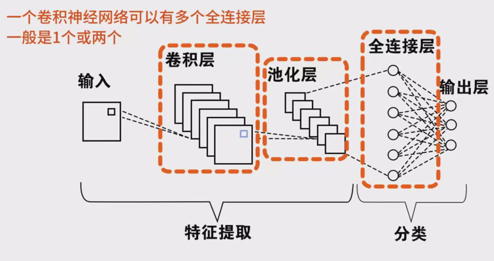
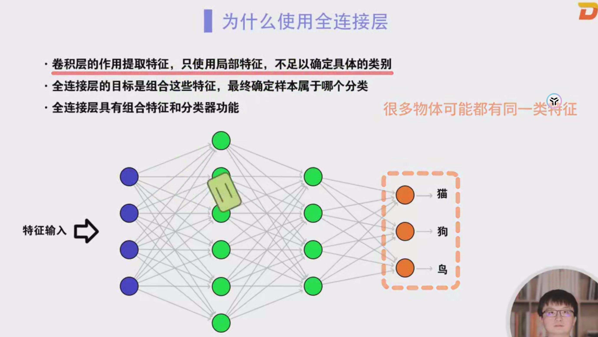
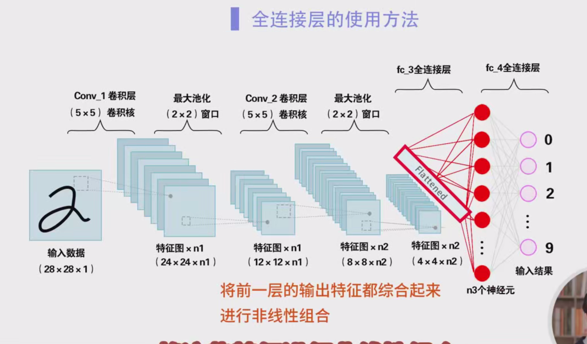
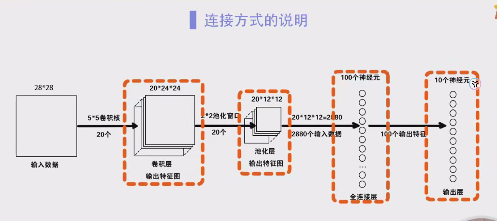
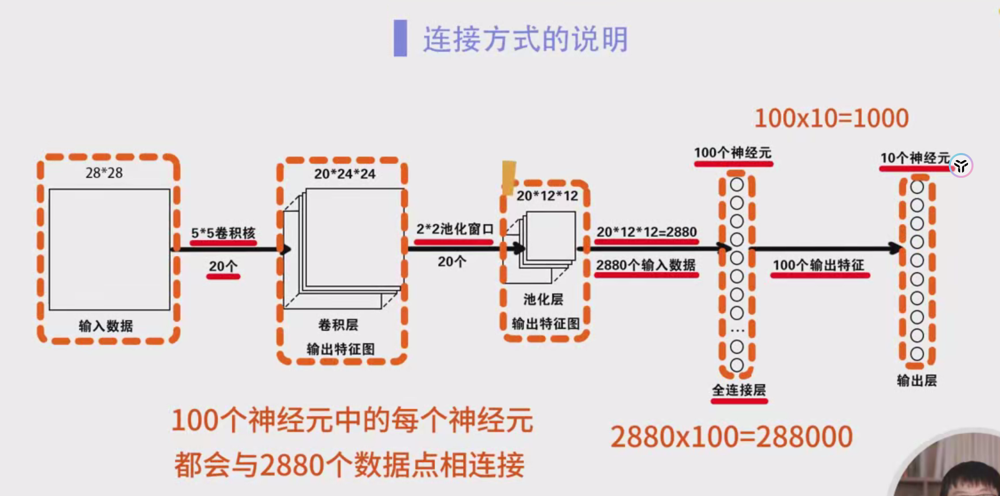
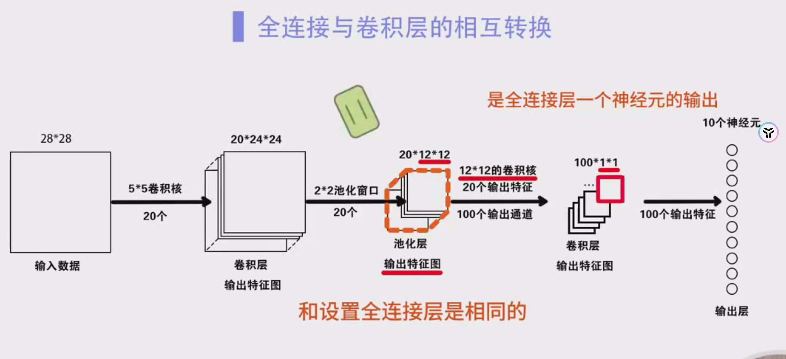
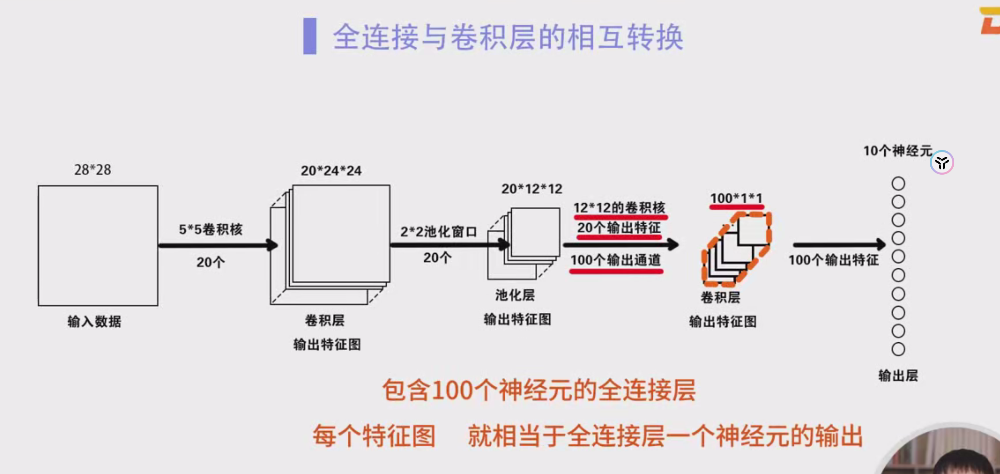
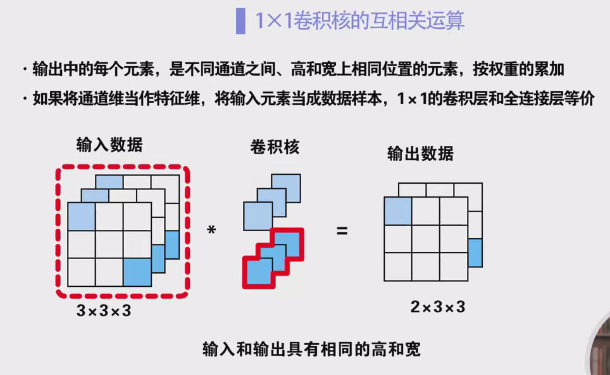

### 全连接层与输出层的深入理解

#### 一、背景与基本概念

卷积神经网络（CNN）是一类专门设计用于处理图像数据的深度学习模型，广泛应用于图像分类、目标检测、语义分割等任务。在CNN的结构中，**全连接层**（Fully Connected Layer）和**输出层**（Output Layer）通常位于网络的末端，起着将前面提取到的特征进行最终判断和分类的作用。

这些层在传统的前馈神经网络（FNN）中也有类似的应用，但在CNN中，它们的功能更为重要，尤其是在特征的组合与分类的过程中。

#### 二、全连接层的作用与原理

##### 1. 特征的组合与转换

卷积层的主要作用是通过卷积操作提取图像中的局部特征，例如边缘、角点、纹理等，这些特征通常是低级的。虽然这些特征能够反映出一些图像的局部信息，但单靠局部特征并不足以做出复杂的判断。

例如，猫、狗、鸟等动物都有眼睛这个特征，如果只依赖局部特征（如眼睛的形状和颜色），我们难以区分这些物体。因此，**全连接层的任务就是将卷积层提取的局部特征进行组合，从而获得更高层次的抽象特征**，以便进行更准确的分类。

在全连接层中，每一个神经元都与上一层的所有神经元连接，从而将各层的特征全部融合在一起。通过这种方式，全连接层能够“理解”到图像中的全局信息，帮助分类器做出最终的决策。

##### 2. 维度转换与输入格式

在卷积层和池化层提取出特征图后，这些特征图通常是二维的（如长×宽的矩阵），但全连接层需要输入一维的向量。因此，在进入全连接层之前，需要对卷积层或池化层的输出进行展平（flatten），将二维的特征图转化为一维的特征向量。

举个例子，假设一个卷积层的输出为**20×12×12**的特征图，这意味着我们有20个12×12的二维特征图。将这些特征图展平为一维向量后，得到的向量大小为**20×12×12 = 2880**，即总共有2880个数据点。这些数据点将被输入到全连接层中。

##### 3. 参数量与计算量

全连接层的特点是每个神经元与上一层的所有神经元都有连接，因此参数量非常庞大。例如，假设全连接层包含100个神经元，而上一层有2880个输入，那么全连接层与上一层之间的参数量为**2880 × 100 = 288,000**个参数。此外，每个神经元通常还会有一个偏置项，因此实际的参数量会更大。

全连接层通常会有大量的计算量和参数量，这也是为什么在深度神经网络中，过多的全连接层容易导致**过拟合**问题，同时增加计算的复杂度。

#### 三、输出层的作用与原理

##### 1. 分类任务中的输出层

输出层通常是神经网络的最后一层，它负责根据前面层处理过的特征信息做出最终的决策。**输出层的神经元数目通常对应于任务的类别数**。对于分类任务，输出层通常会使用激活函数（如softmax）来生成每个类别的概率值。

例如，在一个手写数字识别任务中，假设网络的输出层有10个神经元（分别对应数字0到9）。输出层中的每个神经元会输出一个概率值，表示输入图像属于对应数字的概率。网络会选择概率最大的神经元作为最终的分类结果。

##### 2. 回归任务中的输出层

如果是回归任务（如房价预测），输出层通常只有一个神经元，直接输出预测的数值。在这种情况下，输出层不会使用softmax激活函数，而是直接输出一个连续值。

##### 3. 激活函数的使用

在分类任务中，输出层通常会使用**softmax激活函数**，该函数能够将输出的原始分数转换为概率值，并且所有类别的概率之和为1。对于二分类任务，也可以使用**sigmoid激活函数**，将输出值压缩到[0, 1]区间。

#### 四、卷积层与全连接层的转换

在某些情况下，卷积层可以用来代替全连接层，尤其是使用**1×1卷积核**的卷积层。这是因为1×1卷积核不会影响图像的空间尺寸（高和宽），但会影响特征的通道数（深度）。这种操作可以看作是将特征图中的不同通道进行组合，从而生成新的特征。

1. **1×1卷积层的作用**：1×1卷积核是一种特殊的卷积核，尽管它的窗口大小是1×1，但它能够对输入数据的**通道维度**进行线性变换，相当于通过对每个通道的权重加权求和，完成特征的融合与转换。通过这种方式，1×1卷积层能够在通道维度上进行特征选择和组合。

2. **与全连接层的等价性**：由于1×1卷积层能够对通道维度进行加权求和，它与全连接层在某些情况下是等价的。例如，在处理高维特征时，1×1卷积层可以用来将多个输入特征通道进行融合，得到最终的分类结果。

3. **计算效率**：相较于传统的全连接层，1×1卷积层有着更高的计算效率，因为它避免了全连接层中高维数据展平和巨大的参数量。在某些深度神经网络中，1×1卷积层能够代替全连接层，减少计算量和参数量。

#### 五、案例分析：卷积神经网络的工作流程

以下是一个包含卷积层、池化层、全连接层和输出层的典型卷积神经网络结构：

1. **输入层**：输入图像的大小为28×28（如MNIST数据集中的手写数字图像）。
2. **卷积层1**：使用20个5×5的卷积核进行卷积操作，输出的特征图大小为20×24×24（20个24×24的特征图）。
3. **池化层1**：应用2×2的池化窗口对每个特征图进行池化，输出的特征图大小为20×12×12（20个12×12的特征图）。
4. **展平层**：将20×12×12的三维特征图展平为一维向量，得到2880个数据点。
5. **全连接层**：将展平后的2880个数据点输入到一个包含100个神经元的全连接层中，每个神经元与2880个数据点相连，计算得到100个输出。
6. **输出层**：将全连接层的100个神经元的输出与10个输出神经元进行全连接，生成10个类别的预测结果。

#### 六、总结

1. **全连接层的主要作用是对卷积层提取的特征进行整合与组合**，从而获得更高层次的特征表示，进而进行分类或回归任务。
2. **输出层根据全连接层的输出生成最终的预测结果**，在分类任务中通常使用softmax或sigmoid激活函数。
3. **1×1卷积层**能够在通道维度上实现与全连接层类似的功能，同时减少参数量和计算复杂度。
4. 卷积层和全连接层在某些情况下是可以互换的，尤其是使用1×1卷积核时，这种卷积操作相当于对全连接层的替代。
