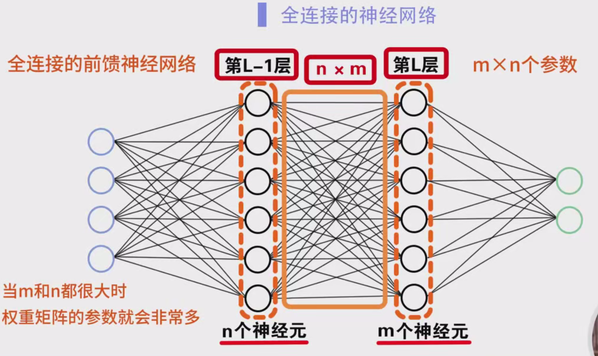
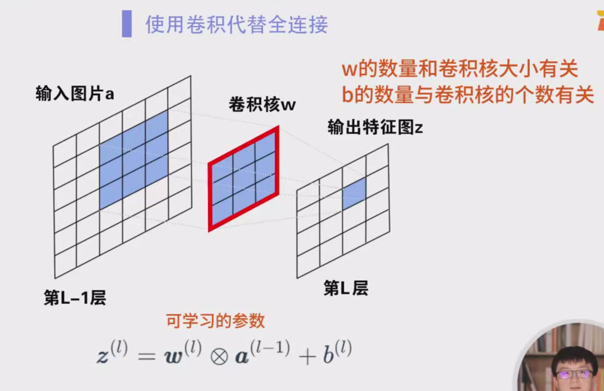
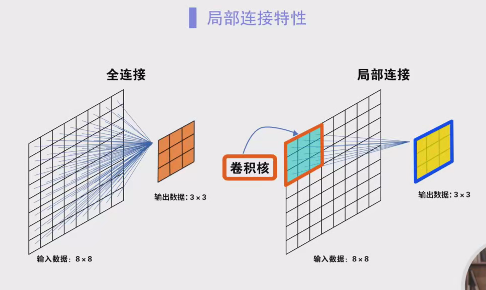
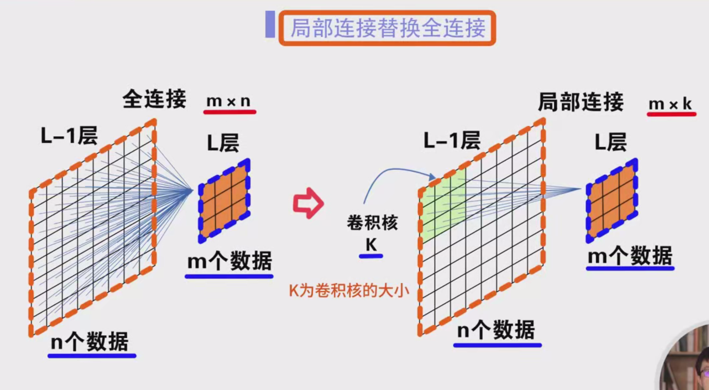
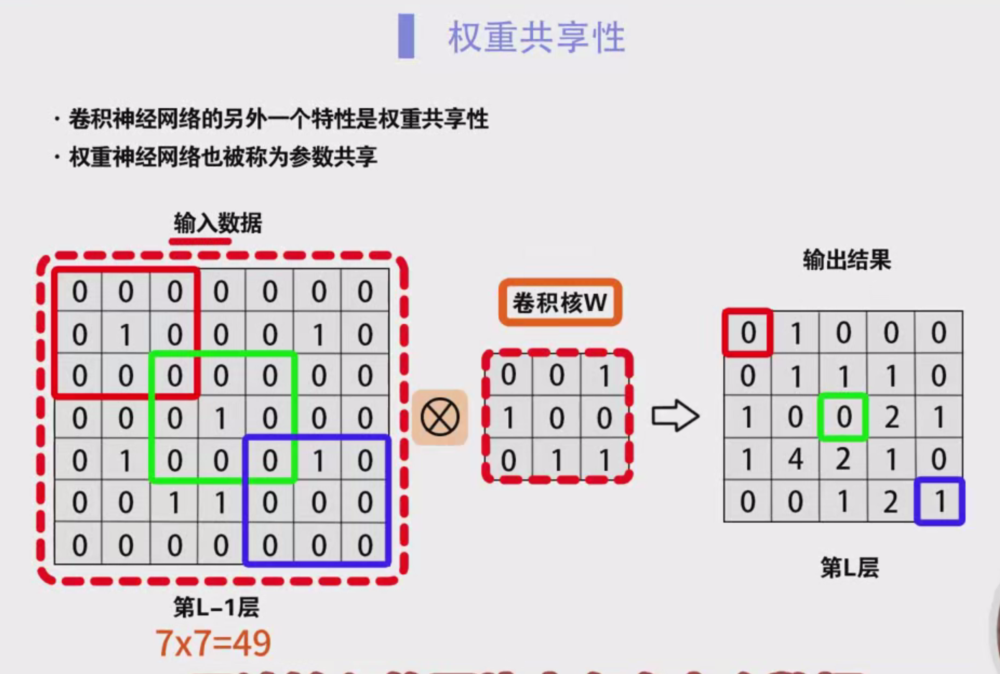
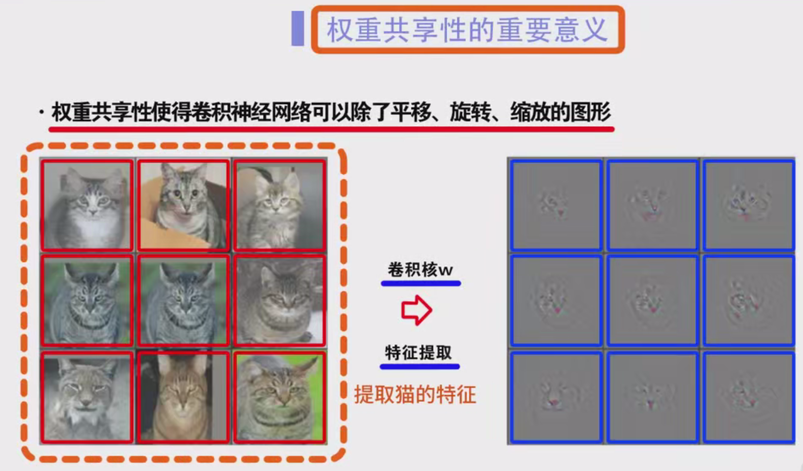
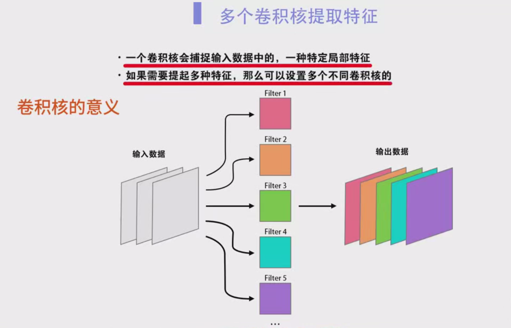

### 卷积神经网络（CNN）特性详细笔记

#### 一、全连接神经网络回顾

1. **全连接前馈神经网络**：  
   - 假设神经网络有 `dl` 层和 `dl-1` 层，分别有 `m` 个神经元和 `n` 个神经元。
   - 在这两层之间存在 `m × n` 个连接，因此权重矩阵中有 `m × n` 个参数。  
   - 当 `m` 和 `n` 都很大的时候，权重矩阵的参数数量就会非常庞大，导致训练时计算量非常大，效率低下。

2. **训练效率低**：  
   - 当网络层级较深或每层神经元数目较大时，计算量会成倍增加，导致训练速度缓慢，计算资源消耗大。

---

#### 二、卷积神经网络（CNN）中的卷积层

1. **卷积层的定义**：  
   - 卷积层采用卷积运算来代替全连接层。
   - 假设第 `dl` 层的输出为 `z`，其通过卷积运算从第 `dl-1` 层的特征图 `a` 中得到。其计算公式为：  
     $
     z_l = w_l * a_{l-1} + b_l
     $
     其中：
     - `w_l` 是卷积核，卷积核大小通常为 `k × k`。
     - `a_{l-1}` 是第 `l-1` 层的输入特征图。
     - `b_l` 是偏置项。
     - `*` 表示卷积操作。
  
2. **卷积核与偏置**：
   - `w` 和 `b` 都是卷积层的可训练参数。卷积核 `w` 的数量由卷积核的大小和卷积层输出的特征图的个数决定，偏置项 `b` 的数量与卷积核的个数相同。
   - 卷积核的大小和偏置项的设计决定了网络的学习能力和计算量。

---

#### 三、卷积神经网络的两个关键特性

1. **局部连接（Local Connection）**：

   - **定义**：  
     在卷积神经网络中，输出层的每个神经元只与输入层中局部区域的神经元相连接。即每个输出数据仅与输入数据的局部区域内的数据进行卷积计算。
   
   - **局部连接特性**：
     - 假设输入数据为 `8 × 8` 的图像，而卷积核大小为 `3 × 3`，那么每个输出节点只与卷积核大小的 `3 × 3` 区域内的输入数据相连，而不是与整个 `8 × 8` 的输入数据全连接。
     - 这样就大大减少了连接数。例如，在全连接网络中，`8 × 8 = 64` 个输入神经元和输出神经元之间有 `64 × 64 = 4096` 个连接；而在卷积神经网络中，假设卷积核大小为 `3 × 3`，则每个输出仅与 `3 × 3 = 9` 个输入数据相连接，减少了大约 99% 的连接数。
   
   - **优点**：
     - 局部连接显著减少了连接数，从而减少了计算量，提升了网络的训练和推理效率。
     - 在图像数据中，局部特征具有很强的意义，如边缘、角点、纹理等信息，这些特征通常出现在图像的某些局部区域，卷积神经网络正好能有效地提取这些特征。
     - 由于现实世界中的许多数据（如图像、文本、语音等）都具有局部特征结构，局部连接能够高效地捕捉这些局部模式。

2. **权重共享（Weight Sharing）**：

   - **定义**：  
     卷积神经网络中的所有局部区域使用相同的卷积核 `w` 来进行卷积运算，即“权重共享”。
   
   - **权重共享特性**：
     - 假设输入图像大小为 `7 × 7`，那么输入图像的不同区域（例如红色、绿色和蓝色区域）都与同一个卷积核 `w` 进行卷积计算。
     - 这意味着对于所有区域，我们都使用相同的卷积核来提取特征，而不是为每个区域使用不同的卷积核。这种权重共享减少了网络中可训练的参数数量，降低了内存消耗和计算开销。
   
   - **优点**：
     - 权重共享使得卷积神经网络可以有效地处理平移、旋转和缩放的图像。当我们在训练过程中学习到某个卷积核能够提取猫的特征时，无论猫出现在哪个位置、哪个角度，卷积神经网络都能识别出猫的特征。
     - 通过共享卷积核，CNN不需要针对图像中的每个位置学习独立的特征，从而大大减少了需要训练的参数数量，使得网络能够处理更复杂的问题。
     - 权重共享提高了模型的泛化能力，因为它能够有效地应对各种平移变换。

---

#### 四、卷积核的意义

1. **卷积核的作用**：
   - 卷积核在卷积神经网络中主要用于提取输入数据中的局部特征。
   - 每个卷积核专注于检测特定的局部模式，比如边缘、纹理等。

2. **多卷积核的使用**：
   - 如果我们希望提取多种不同的特征，可以使用多个卷积核。例如，设置 `20` 个卷积核可以提取 `20` 种不同的特征。
   - 每个卷积核都学习到不同类型的特征，使得网络能够从多个方面理解输入数据。

3. **卷积核的学习过程**：
   - 在训练过程中，卷积神经网络通过反向传播算法不断调整卷积核的权重，以最小化误差，从而使卷积核能够越来越精确地提取特定特征。

---

#### 五、卷积神经网络的优势

1. **计算效率**：
   - 由于局部连接和权重共享，卷积神经网络显著减少了参数数量，避免了传统全连接网络中庞大的参数矩阵，提升了计算效率。

2. **减少过拟合**：
   - 共享权重减少了网络的自由度，这有助于减少过拟合问题，使得卷积神经网络能够在有限的训练数据上泛化得更好。

3. **平移不变性**：
   - 卷积神经网络通过共享卷积核权重，能够识别平移、旋转、缩放等变换后的物体特征，具有较强的平移不变性。这使得卷积神经网络在处理图像和视频时具有很强的鲁棒性。

4. **层级特征学习**：
   - 卷积神经网络通过多层卷积操作逐层提取低级到高级的特征。例如，在图像处理中，第一层卷积可能提取边缘特征，第二层提取纹理特征，第三层提取形状特征，最终形成完整的物体特征。

---

