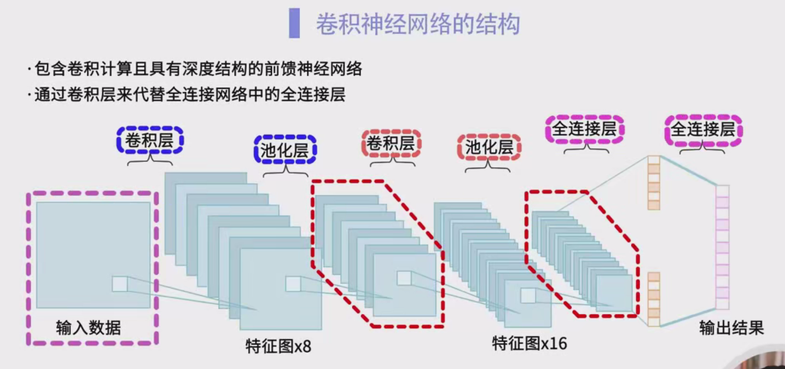
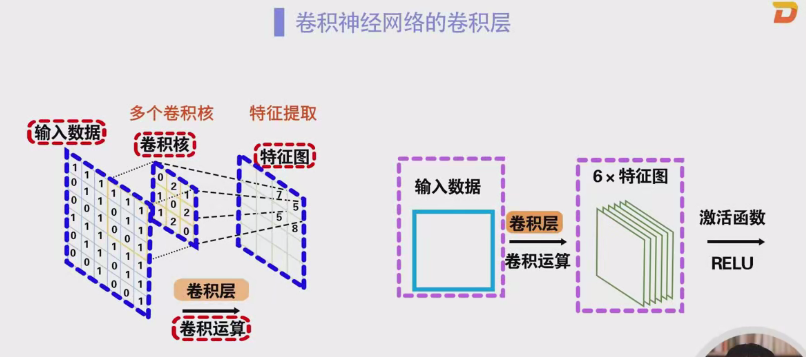
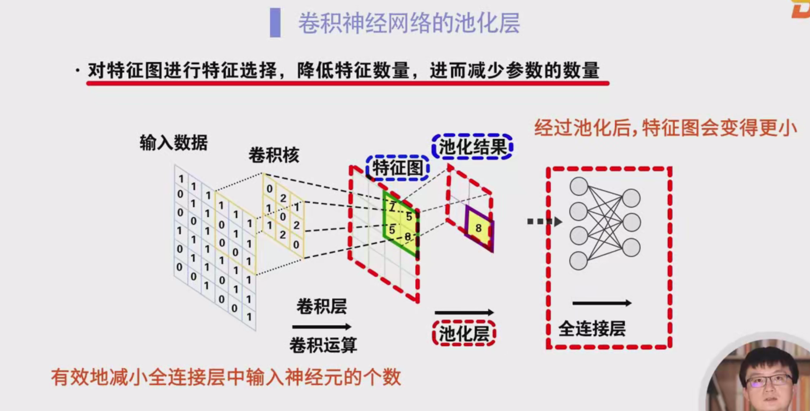
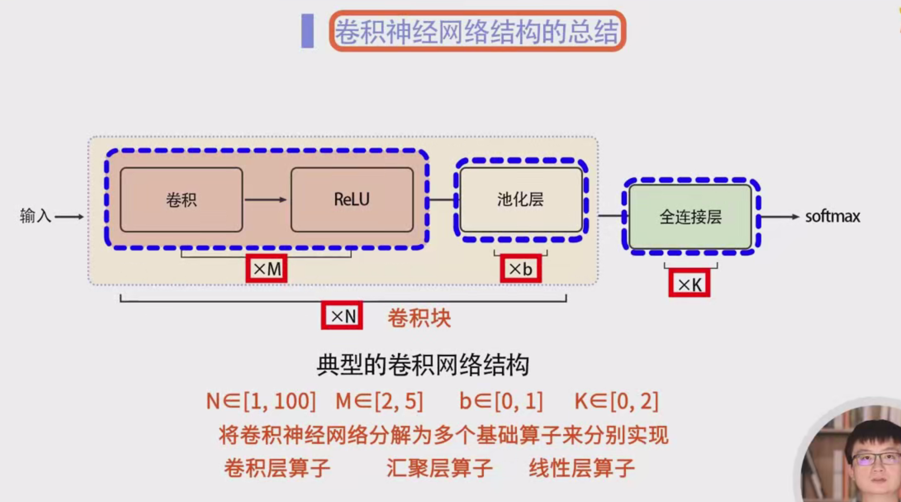
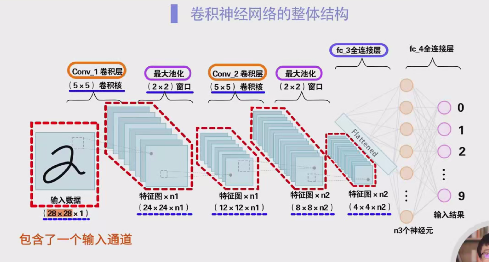

### 卷积神经网络结构详细笔记

**一、卷积神经网络简介** 卷积神经网络（CNN）是一类包含卷积运算且具有深度结构的前馈神经网络。卷积神经网络的核心思想是通过卷积层和池化层提取数据的特征，而不是通过全连接层对数据进行逐一处理。

**二、卷积神经网络的主要结构** 卷积神经网络的结构主要包括以下几个部分：

1. **卷积层（Convolutional Layer）**：该层是网络的核心，利用卷积核（Filter）对输入数据进行卷积运算，提取特征。
2. **池化层（Pooling Layer）**：池化层对卷积层输出的特征图进行降维，减少特征图的大小，降低计算量。
3. **全连接层（Fully Connected Layer）**：用于最终的分类或回归任务，将提取到的特征进行融合，输出最终结果。

**三、卷积神经网络的结构特点**

- 卷积神经网络通过卷积层和池化层代替了传统神经网络中的全连接层。通过这些层的堆叠，网络的深度可以逐步增加，从而提取更丰富的特征。
- 卷积层和池化层的数量决定了网络的深度，网络深度越大，提取的特征越复杂。

**四、卷积层** 在卷积层中，网络会使用多个卷积核与输入数据进行卷积运算。每个卷积核负责提取输入数据的一种特征，多个卷积核可以同时提取不同的特征。

- **卷积运算**：通过卷积核对输入数据进行滑动窗口操作，生成特征图（Feature Map）。
- **多个卷积核**：每个卷积核的输出结果构成一个特征图，多个卷积核会生成多个特征图。
- **激活函数**：卷积层的输出通常会通过非线性激活函数（如ReLU）进行处理，增加模型的非线性表达能力。

**五、池化层** 池化层的作用是对卷积层生成的特征图进行降维处理，减少特征数量，进而降低计算量。常见的池化操作有：

- **最大池化（Max Pooling）**：从池化窗口中选取最大值作为池化结果。
- **平均池化（Average Pooling）**：从池化窗口中计算平均值作为池化结果。

池化层的输出通常是尺寸更小的特征图，这样可以减少后续全连接层中的神经元数量，进而提高计算效率。

**六、卷积神经网络的整体结构**

1. **卷积块（Convolution Block）**：由一个或多个卷积层和池化层组成，是卷积神经网络的基本构建单元。卷积神经网络通常由多个卷积块堆叠而成。
2. **堆叠卷积层和池化层**：每个卷积块包含多个卷积层（通常为2到5个）和一个池化层（池化层数量灵活，通常为1个）。
3. **全连接层**：卷积块输出的特征图会经过全连接层进行进一步处理。全连接层通常位于网络的最后，用于生成最终的输出结果，如分类任务中的类别标签。

**七、卷积神经网络的常见结构** 一个卷积神经网络通常可以包含多个卷积块，卷积块中的卷积层数量可以从1到100甚至更大不等。网络的最后会连接若干个全连接层。

**八、卷积神经网络的示例** 以一个28x28像素的输入图像为例，具体的计算过程如下：

- **输入**：输入数据为一张28x28像素的图片，表示为1x28x28的输入向量。
- **卷积层（com1）**：使用一个5x5的卷积核进行卷积计算，得到24x24的输出特征图。
- **池化层（池化层1）**：使用2x2的池化窗口进行最大池化，得到12x12的特征图。
- **卷积层（com2）**：再次进行卷积运算，使用多个5x5的卷积核，得到8x8的特征图。
- **池化层（池化层2）**：再次进行池化，得到4x4的特征图。
- **全连接层**：这些特征图会进入全连接层（如FC3、FC4），最终得到0到9的输出结果。

**九、卷积神经网络的优化**

- **网络深度的增加**：通过增加卷积层和池化层的数量，可以提取更丰富、更抽象的特征。
- **避免过拟合**：通过使用适当的正则化技术（如Dropout），可以有效减少过拟合的风险。