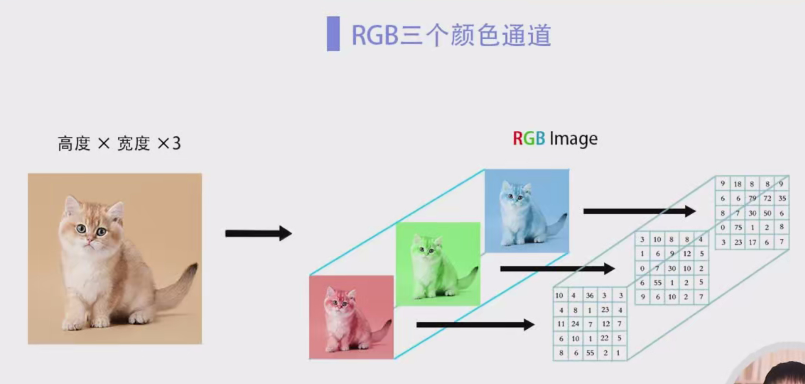
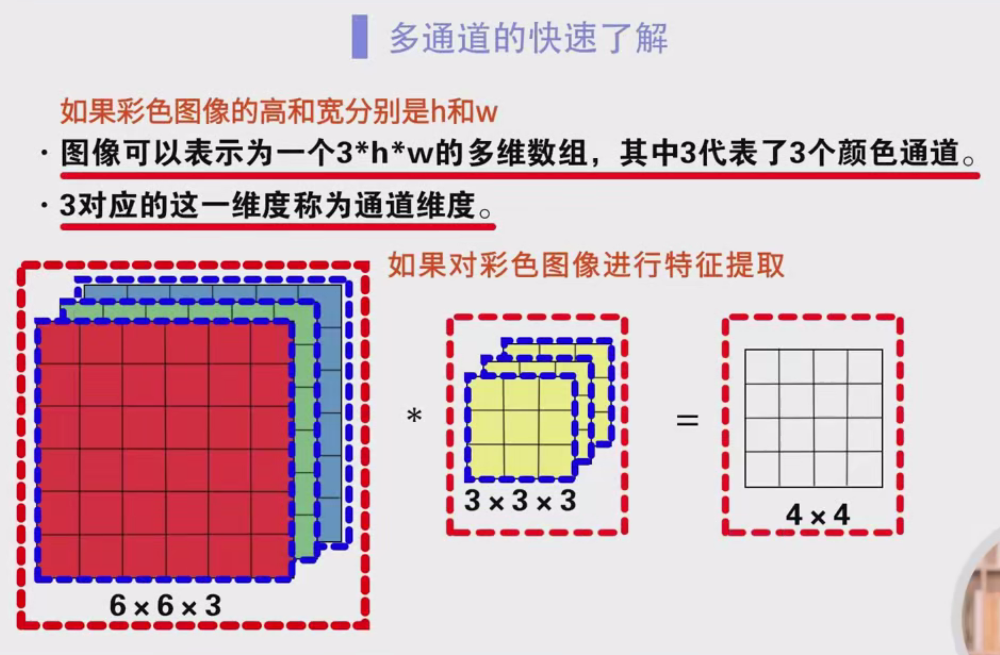
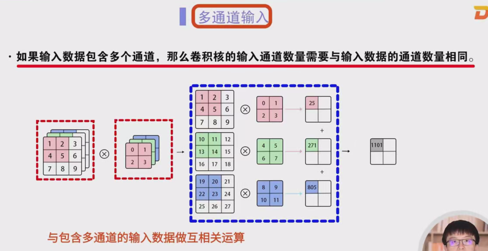
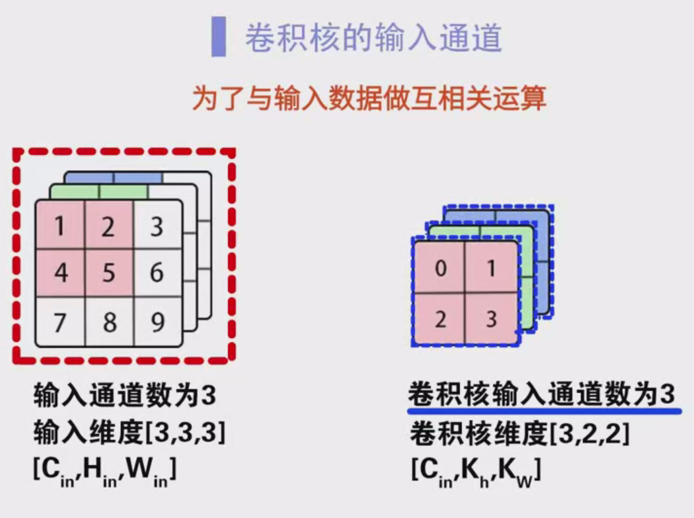
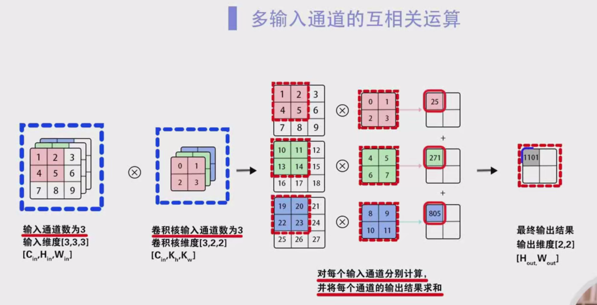
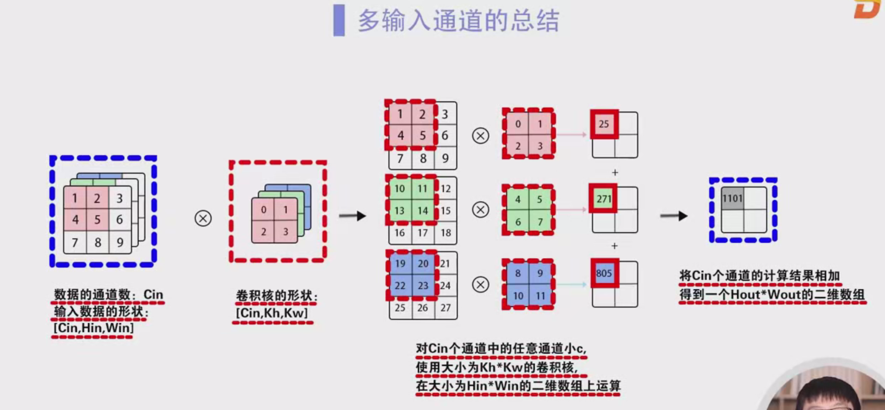
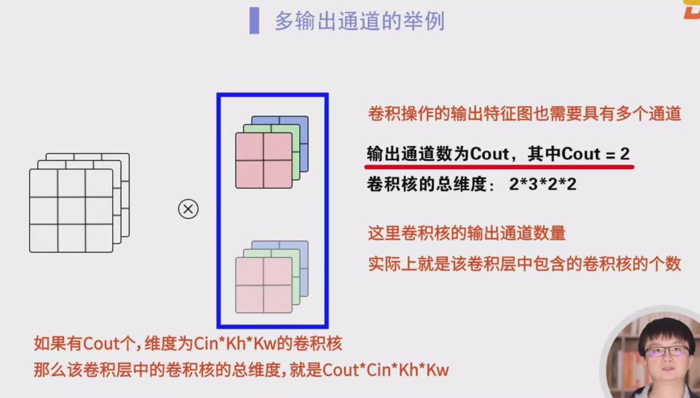
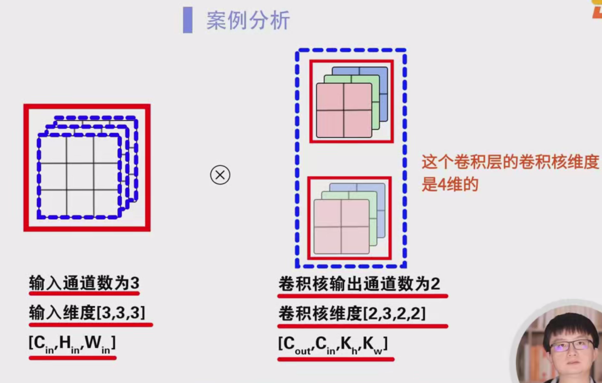
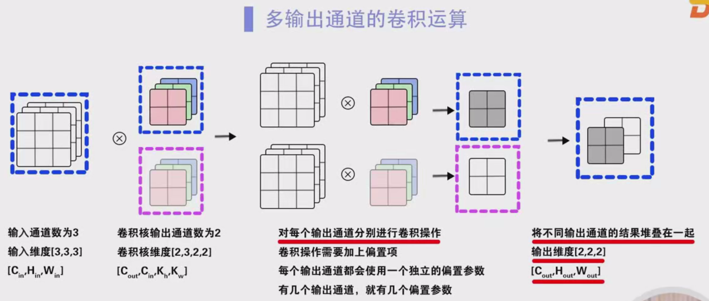
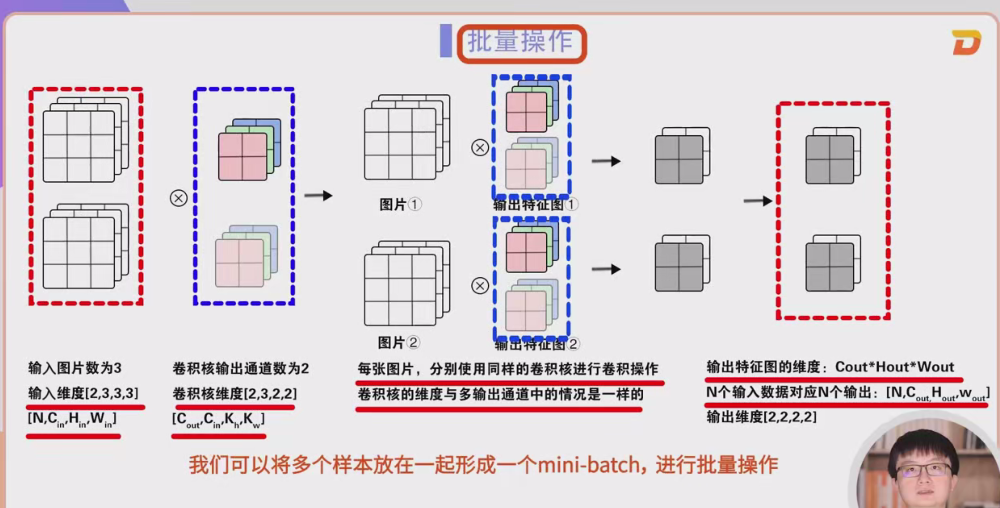

# 多通道输入、输出与批量操作详细笔记

## 1. 多通道输入

在卷积神经网络中，输入数据和卷积层输出的数据通常是二维数组。然而，实际数据常常是更高维度的，例如彩色图像。彩色图像除了包含高和宽两个维度外，还有红、绿、蓝（RGB）三个颜色通道。

- 如果彩色图像的高和宽分别为 $h$ 和 $w$，则该图像可以表示为一个三维数组，其维度为 $3 \times h \times w$，其中 3 代表了 RGB 三个颜色通道。
- 通常将这三个维度之一称为“通道维度”。

### 卷积核和计算方法
- 如果对彩色图像进行特征提取，我们需要为每个通道分别设计卷积核。例如，使用三个 $3 \times 3$ 的卷积核进行卷积运算，对应三个通道（红色、绿色和蓝色）。
- 假设图像的维度为 $3 \times 6 \times 6$，经过卷积操作后，输出的特征图可能为 $4 \times 4$ 的大小。

### 计算步骤：
1. 输入数据包含三个通道，假设输入数据的维度是 $3 \times 3 \times 3$（红、绿、蓝）。
2. 卷积核的输入通道数量应与输入数据的通道数相同，卷积核的维度为 $3 \times 2 \times 2$。
3. 对每个通道使用不同的卷积核进行卷积操作，例如红色通道与红色卷积核卷积，绿色与绿色卷积核，蓝色与蓝色卷积核，得到三个卷积结果。
4. 将每个通道的卷积结果相加，得到最终的输出结果，输出的维度为 $2 \times 2$。

### 总结：
- 输入数据的维度：$C_{\text{in}} \times H_{\text{in}} \times W_{\text{in}}$
- 卷积核的维度：$C_{\text{in}} \times K_{\text{h}} \times K_{\text{w}}$
- 输出数据的维度：$H_{\text{out}} \times W_{\text{out}}$
- 输出通道数始终为 1，因为对各个通道的结果进行了累加。

## 2. 多通道输出

在卷积神经网络中，一个卷积核能够提取图像中的一种特征，但是图像通常包含多种不同的特征。因此，我们需要使用多个卷积核来提取不同的特征。

### 输出通道数
- 卷积核的数量决定了输出通道的数量。每个卷积核都可以学习图像中的一种特征，因此输出特征图的数量与卷积核的数量相同。
- 假设有两个输出通道，那么输出通道数 $C_{\text{out}} = 2$，对应的卷积核维度为 $C_{\text{out}} \times C_{\text{in}} \times K_{\text{h}} \times K_{\text{w}}$。

### 计算步骤：
1. 输入数据的维度为 $3 \times 3 \times 3$。
2. 卷积核的数量为 2，卷积核的维度为 $2 \times 3 \times 2 \times 2$。
3. 分别使用两个卷积核进行卷积操作，得到两个输出特征图。
4. 输出的维度为 $2 \times 2$，输出的最终结果是将多个输出特征图叠加起来，得到 $2 \times 2 \times 2$。

### 偏置项
- 每个输出通道都有一个独立的偏置参数，因此如果有 $C_{\text{out}}$ 个输出通道，就需要为每个通道加上一个偏置项。

## 3. 批量操作

在卷积神经网络中，为了提高计算效率，我们通常将多个样本放在一起进行批量操作。这样，输入数据的维度将包含多个样本。

### 批量操作的输入维度
- 假设我们有 $n$ 个样本，每个样本的输入维度为 $C_{\text{in}} \times H_{\text{in}} \times W_{\text{in}}$，那么整个批次的输入维度为 $n \times C_{\text{in}} \times H_{\text{in}} \times W_{\text{in}}$。

### 卷积核的维度
- 卷积核的维度与之前相同，仍然是 $C_{\text{out}} \times C_{\text{in}} \times K_{\text{h}} \times K_{\text{w}}$。

### 输出的维度
- 每个输出特征图的维度是 $C_{\text{out}} \times H_{\text{out}} \times W_{\text{out}}$。
- 对于 $n$ 个输入样本，最终的输出维度是 $n \times C_{\text{out}} \times H_{\text{out}} \times W_{\text{out}}$。

## 总结
1. **多通道输入**：输入数据的通道数（例如 RGB 三个通道）决定了卷积核的输入通道数量。
2. **多通道输出**：卷积核的数量决定了输出通道的数量，每个输出通道代表一个特征图。
3. **批量操作**：多个样本一起处理，输出维度增加一个批次维度。
