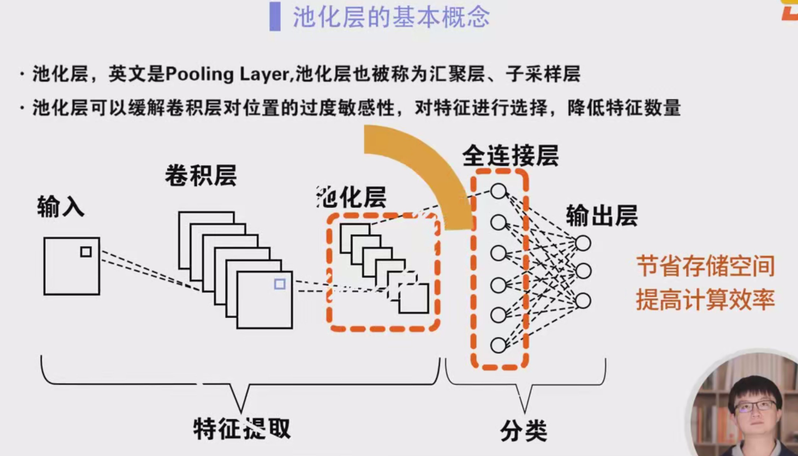
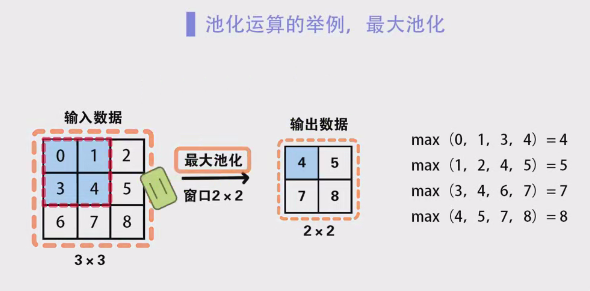

### 卷积神经网络中的池化层详细笔记

#### 一、池化层概述

池化层（Pooling Layer），也被称为汇聚层或子采样层（Subsampling Layer），是卷积神经网络（CNN）中常见的一层，其提出的初衷是缓解卷积层对输入数据位置的过度敏感性。池化层的主要功能是通过选择特征、降低特征的数量，从而减少参数的数量，并且减小卷积神经网络中全连接层的神经元个数，进而有效降低计算量和节省存储空间。

在前面的学习中，我们已经了解了卷积层。虽然卷积层能够显著减少神经网络中的连接数量，但卷积层的输出特征图中的数据并没有显著减少。如果在卷积层之后直接接一个线性分类器，那么分类器的输入维度依然会很高，这就容易导致过拟合问题。因此，池化层作为解决这一问题的有效手段，它通过将卷积层的输出特征图进行压缩，降低了后续全连接层的计算复杂度。

#### 二、池化层的工作原理

池化层的工作原理与卷积层相似。池化层首先会设置一个固定形状的窗口（池化窗口），并根据池化窗口中的输入数据计算输出。池化操作不同于卷积操作，卷积层是通过计算输入数据与卷积核的互相关性来获取特征，而池化层则通过计算池化窗口中的元素的最大值或平均值来进行特征提取。常见的池化操作有最大池化（Max Pooling）和平均池化（Average Pooling）。

- **最大池化**（Max Pooling）：在池化窗口内选取最大值作为输出。
- **平均池化**（Average Pooling）：在池化窗口内计算元素的平均值作为输出。

#### 三、池化操作的实现步骤

1. **池化窗口与步幅**：
   - 池化操作通过设置一个池化窗口来对输入数据进行操作。池化窗口的大小通常为2x2或3x3，步幅（stride）则控制窗口每次滑动的距离。步幅通常设置为2，这样池化操作可以有效地将特征图的维度减小一半。

2. **池化的滑动方式**：
   - 池化窗口从输入数据的最左上方开始，按照从左到右、从上到下的顺序滑动，每次滑动都会计算池化窗口内的最大值或平均值。

#### 四、池化层的运算示例

1. **最大池化示例**：
   - 假设输入数据为一个3x3的矩阵，池化窗口为2x2，步幅为1。通过最大池化计算得到的输出矩阵如下：
   ```
   输入数据：
   1 3 2
   4 5 6
   7 8 9
   
   输出数据（最大池化结果）：
   5 6
   8 9
   ```
   解释：最大池化的操作是从每个2x2的区域中选取最大的值。

2. **平均池化示例**：
   - 假设同样的输入数据为一个3x3的矩阵，池化窗口为2x2，步幅为1。通过平均池化计算得到的输出矩阵如下：
   ```
   输入数据：
   1 3 2
   4 5 6
   7 8 9
   
   输出数据（平均池化结果）：
   3.25 4.25
   6.25 7.25
   ```
   解释：平均池化操作是对每个2x2区域内的四个数求平均。

#### 五、池化层的功能与优势

1. **降低特征图尺寸**：
   - 池化操作可以有效减小特征图的尺寸，从而减少计算量。例如，经过池化后的特征图大小会变为原来的一半，从而减少后续全连接层的神经元个数。

2. **减少过拟合**：
   - 池化层通过降低特征图的维度，减少了模型的复杂度，从而降低了过拟合的风险。池化操作能够提取出更加显著的特征，同时忽略一些不重要的细节信息。

3. **位置不变性**：
   - 池化操作具有一定的平移不变性，即使输入数据在空间上有微小的平移，池化层的输出也能够保持稳定，这有助于提升模型的鲁棒性。

4. **高效的计算与存储**：
   - 由于池化层能够显著减少特征图的尺寸，从而减少了计算的复杂度和存储的需求，特别是在网络的深层次中，池化层能够有效加速计算过程。

#### 六、池化层的填充与步幅设置

池化层也和卷积层一样，支持填充（Padding）和步幅（Stride）设置。通常情况下，池化操作的窗口大小为2x2，步幅为2，填充为零。这种设置能够有效地将特征图的高和宽减半，但不会影响通道数。

举例：
- 输入数据：4x4
- 池化窗口：2x2
- 步幅：2
- 填充：0

池化操作后，输出特征图的大小会变为2x2。

#### 七、池化层与卷积层的区别

- **卷积层**：卷积层通过卷积操作提取输入数据中的局部特征，卷积层能够进行多通道的输入处理，并且将输入数据与卷积核进行卷积操作，生成特征图。
  
- **池化层**：池化层则用于压缩卷积层输出的特征图，它通过选择最大值或计算平均值来减少数据的维度，池化层操作简单，并且不会引入额外的可训练参数。

#### 八、池化层在多通道数据处理中的表现

池化层与卷积层不同，它对每个输入通道的特征图分别进行池化操作，而不是像卷积层那样将各个通道的输入按照对应位置相加。因此，池化层的输出通道数与输入通道数相等。

举例：
- 输入图片：单通道
- 经过卷积层：输出四通道特征图
- 进入池化层：对每个通道的特征图分别进行池化，输出四通道特征图

#### 九、池化层总结

池化层通过对特征图中每个区域的统计值进行替换，有效地减少了输出特征图的大小，同时保留了重要特征信息。池化操作具备一定的平移不变性，能够提升网络的鲁棒性和计算效率。在实际使用中，池化层一般放置于卷积层之后，并可以通过调整窗口大小、步幅和填充方式来控制输出的维度。

