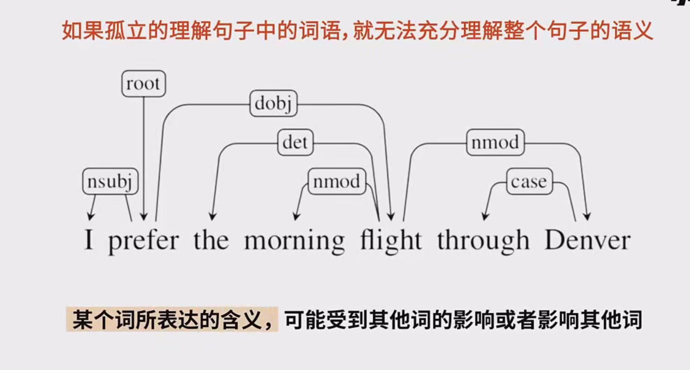
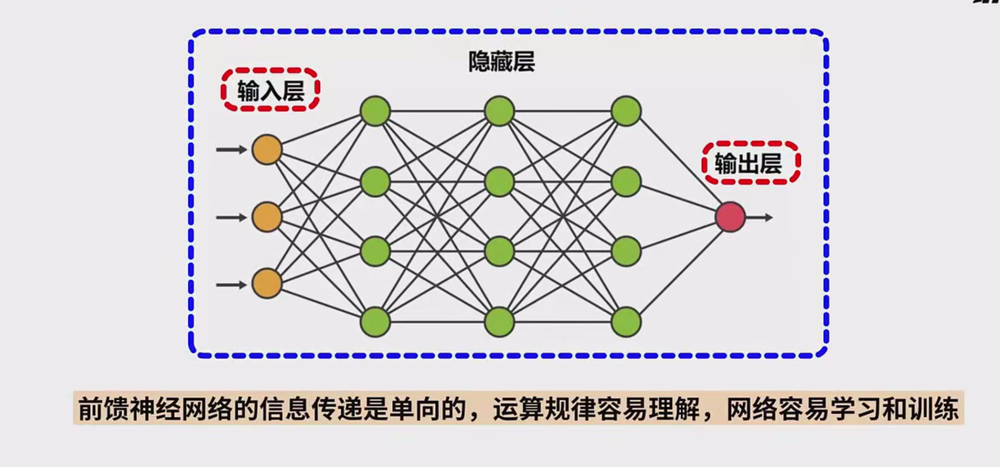
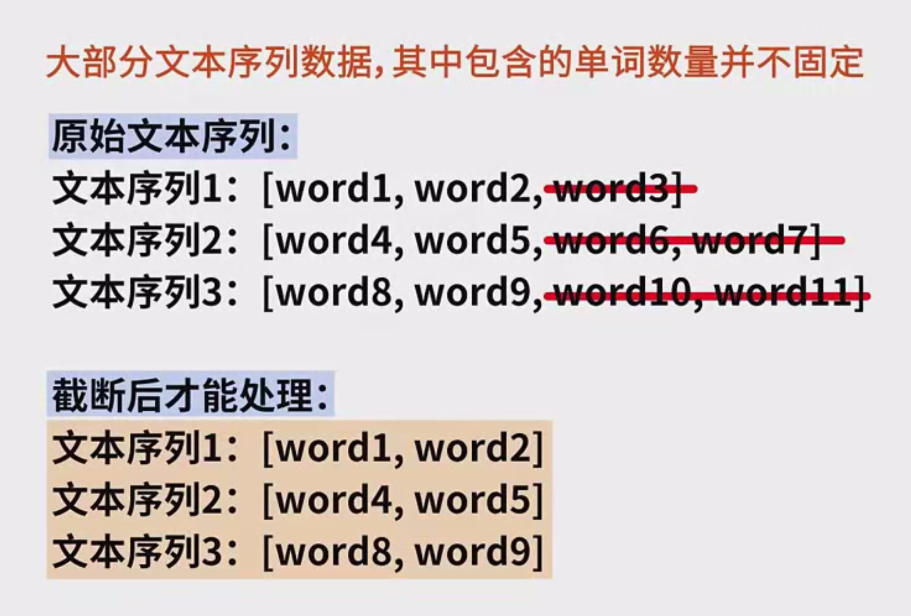
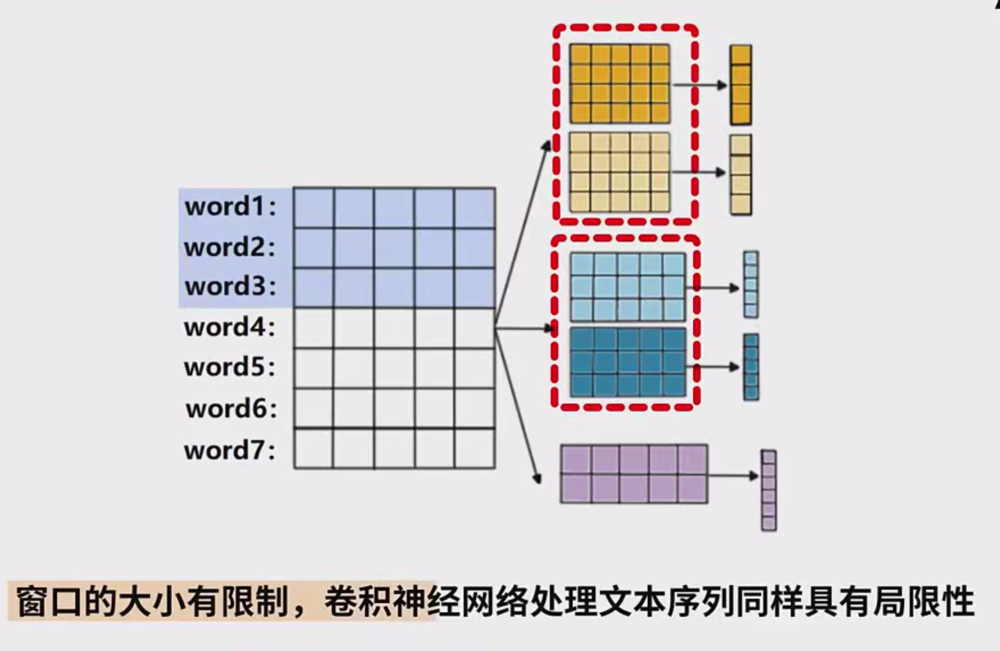
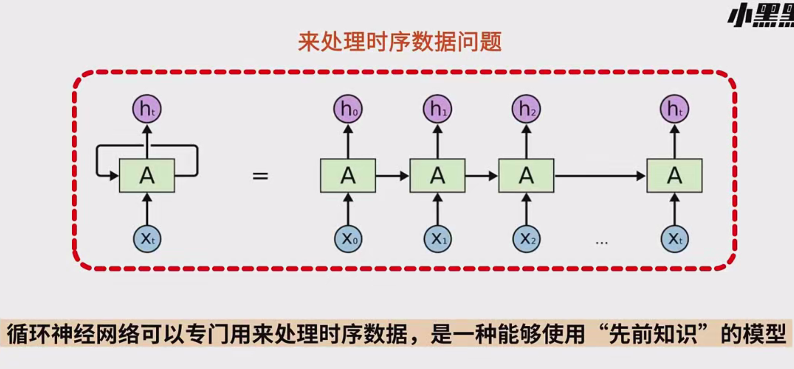

### 上下文理解与神经网络在文本序列理解中的应用

#### 1. **上下文理解的重要性**

- **语义的非独立性**：
  - 在自然语言中，句子中的每个词语并非独立存在，它们之间的相互关系对理解整句的意义至关重要。单独地分析每个词的含义可能会导致语境丢失，进而影响对整个句子意义的理解。
  - 举例说明
    1. **句子1**：“丈夫用赚来的钱买了一座大房子，妻子陷入了思考。”
    2. **句子2**：“丈夫用借来的钱买了一座大房子，妻子陷入了思考。”
  - 这两个句子在结构上几乎完全相同，但有一个词的差异——“赚来”和“借来”。
    - “赚来”给人的理解是丈夫通过工作或经营积累的钱，暗示经济状况较好；妻子可能在思考如何改善自己的生活或未来的计划。
    - “借来”则暗示钱并非丈夫的个人财富，可能是通过借款或者债务获取，暗示丈夫可能面临经济压力，妻子可能在思考家庭财务的可持续性或担忧未来的经济问题。
  - 关键点
    - 这两个句子表达的思想完全不同，但由于唯一的区别在于“赚来”和“借来”，因此词语的含义并不是孤立的，它必须结合上下文来进行准确的理解。
- **总结**：
  - 充分理解文本中的上下文关系对于正确理解文本序列的意义至关重要。词语之间的关系和上下文是理解语句的关键。

#### 2. **神经网络在文本理解中的作用**

- **前馈神经网络（Feedforward Neural Networks，FNN）的局限性**：

  - 前馈神经网络的工作原理

    - 数据从输入层通过多个隐藏层进行处理，最终传递到输出层。每一层的神经元在计算时只依赖于上一层的输出，数据流是单向的。
    - 由于输入层和输出层之间的传递是单向的，前馈神经网络的结构简单，计算和学习过程相对容易理解。

  - 局限性

    - 时序问题的处理困难

      ：前馈神经网络假设每个输入数据是独立的，而在许多实际任务中（尤其是自然语言处理任务），当前输入的数据往往依赖于之前的数据。

      - 例如，在处理文本序列时，前馈神经网络无法理解句子中词语的顺序和上下文之间的依赖关系。每个词语的理解只能基于当前输入，而忽略了之前的词汇信息。

    - **固定输入输出维度**：前馈神经网络要求输入和输出的维度是固定的，因此无法灵活处理动态变化的文本序列。例如，处理变长的句子或段落时需要额外的处理步骤，如截断、填充等，这增加了模型的复杂性。

    - **长依赖问题**：文本序列中的信息通常是具有长期依赖性的，前馈神经网络不能有效处理这些长距离的依赖关系，导致其在理解复杂文本时的效果较差。

- **卷积神经网络（CNN）在文本序列中的改进**：

  - 卷积神经网络的基本概念
    - 卷积神经网络在处理图像时，通过卷积核（滤波器）提取局部区域的信息。在文本处理上，卷积核可以对相邻的词语进行局部信息提取，进而帮助理解上下文。
  - 卷积神经网络的优势
    - 通过多个权重共享的卷积核，CNN能够同时处理文本中的多个相邻词语。这些卷积核通过与输入的词向量进行卷积运算，得到一个区域的特征，能够捕捉到局部的上下文信息。
    - 例如，使用一个长度为4的卷积核，从第一个词到第四个词进行卷积操作，另一个长度为3的卷积核可以对第二个词到第四个词进行卷积操作。
  - 局限性
    - **窗口大小的限制**：卷积核的窗口大小是固定的，因此它只能捕捉到文本中的局部信息。如果要捕获更广泛的上下文信息，需要增加卷积核的数量和大小，但这样会导致计算量的增加。
    - **缺乏长距离依赖处理能力**：虽然卷积神经网络在处理局部上下文时具有优势，但它们无法捕捉到文本中的长距离依赖。例如，卷积核只能覆盖相邻的几个词，无法有效理解跨越较长距离的词语之间的关系。

- **循环神经网络（RNN）的优势**：

  - RNN的工作原理
    - 循环神经网络能够处理时序数据。它通过在每一时刻保持一个隐藏状态（记忆），该状态包含了之前时刻的计算信息，并通过递归的方式将当前时刻的输入与之前时刻的信息结合起来进行处理。
  - RNN的优势
    - **捕捉长期依赖**：RNN能够通过在每个时间步传递状态来捕捉时间序列中的长期依赖。它可以记住前面输入的数据并影响后续的计算，尤其适用于文本序列中的上下文理解。
    - **灵活处理变长输入**：与前馈神经网络不同，RNN可以处理变长的文本序列，输入的词语顺序及其之间的依赖关系都能够被网络捕捉。
  - RNN的局限性
    - **梯度消失问题**：在深度RNN中，随着时间步的增加，梯度可能会逐渐消失，导致网络在训练时无法有效地捕捉到长时间间隔内的信息。
    - **计算效率**：由于RNN的逐步计算方式，它的训练过程相对较慢，尤其是在长序列的处理中。

- **总结**：

  - 上下文理解在文本序列的语义理解中至关重要。通过不同类型的神经网络（前馈神经网络、卷积神经网络和循环神经网络），可以在不同程度上捕捉文本中的上下文信息。
  - 前馈神经网络的局限性主要体现在无法处理时序依赖和上下文信息，而卷积神经网络通过局部感知提升了对相邻词语的理解，但仍然无法处理长距离依赖。
  - 循环神经网络则在捕捉上下文关系、理解文本序列的时序信息方面表现出色，尤其适用于处理复杂的、包含长期依赖的文本数据。

#### 3. **总结与展望**

- 关键要点
  - 上下文理解在自然语言处理中的重要性不可忽视。神经网络的设计必须考虑到文本序列中词语之间的依赖关系。
  - 前馈神经网络、卷积神经网络和循环神经网络各自具有不同的优势和局限性。根据任务的需要，选择合适的网络架构非常关键。
  - 随着循环神经网络的不断发展，尤其是长短期记忆（LSTM）和门控循环单元（GRU）等变体的提出，RNN在处理时序问题上已经取得了显著进展。

