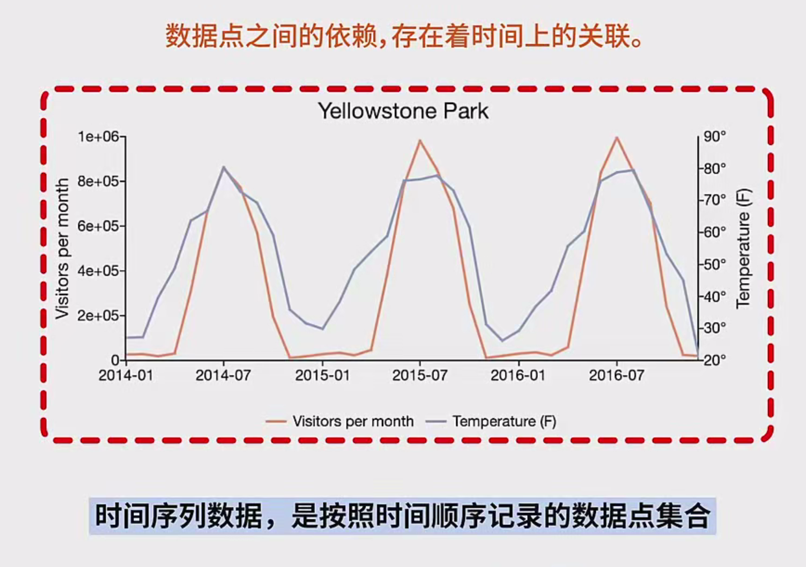
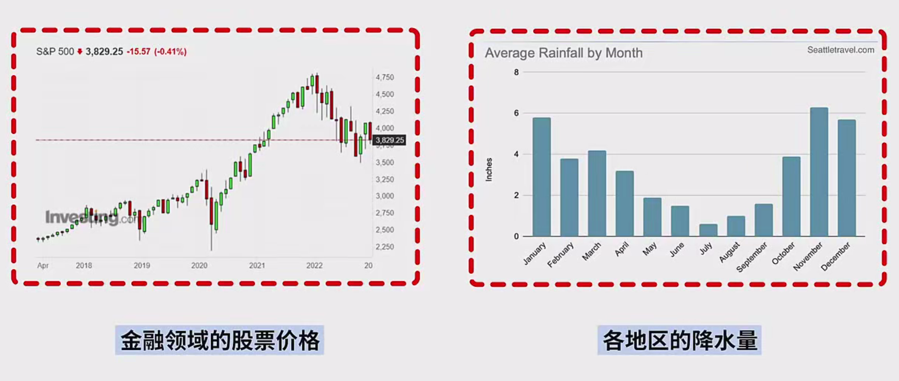
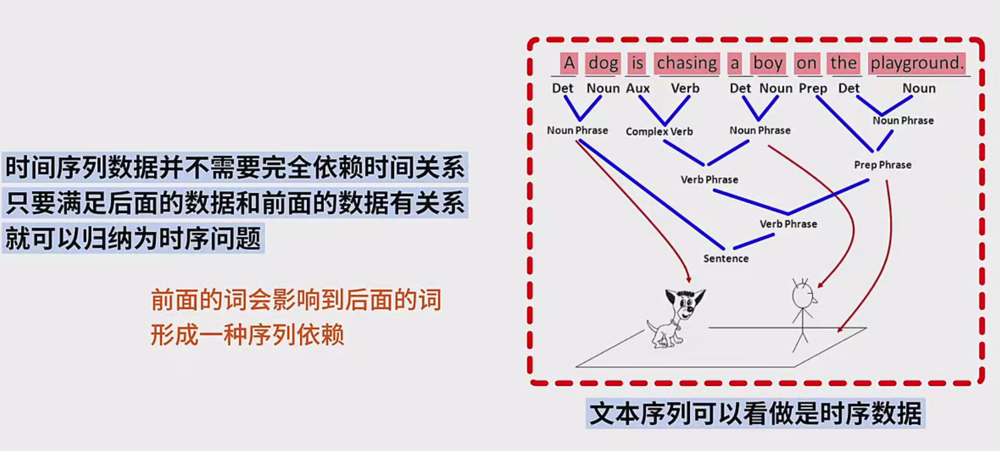
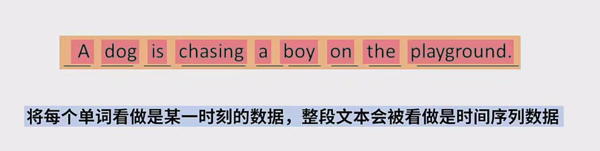
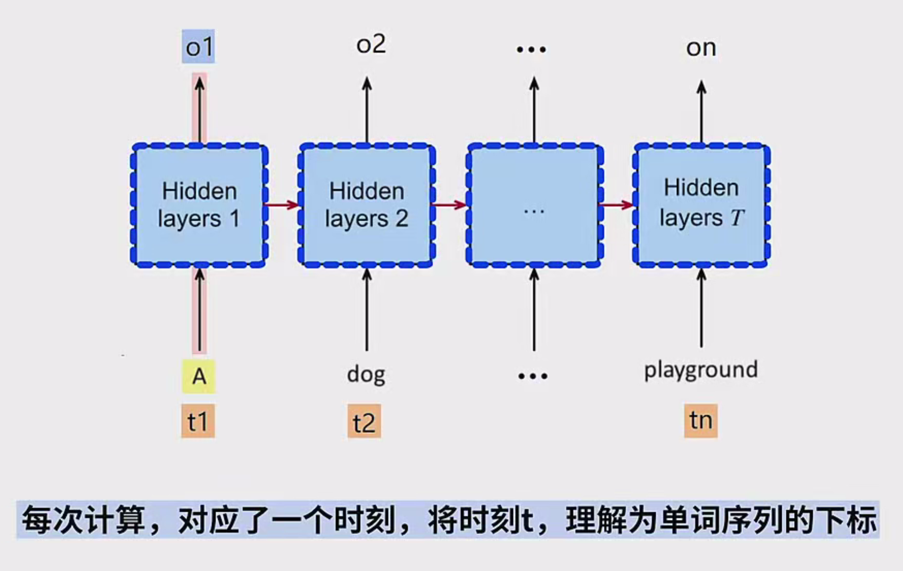
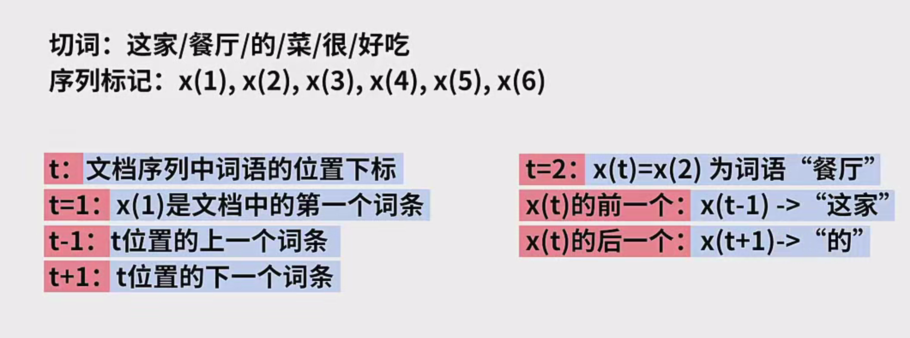
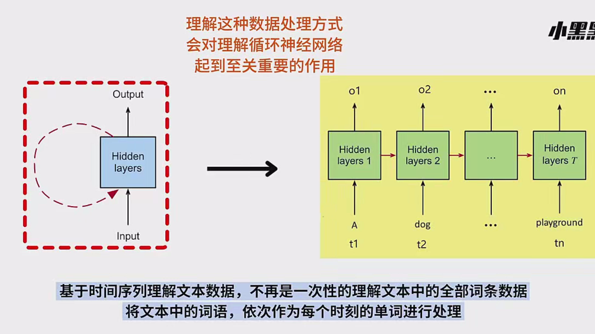

------

### 一、时间序列数据概述

1. **定义**：
   - 时间序列数据指的是按照时间顺序记录的数据点集合。每一个数据点代表了某一时刻的数据，并且不同时间点之间的值通常是有依赖关系的，即后一个数据点与前一个数据点在时间上存在顺序关系。
2. **时间序列的主要特点**：
   - **依赖关系**：数据点之间的依赖是建立在时间顺序上的，也就是说，某一时刻的数据与前后时刻的数据是有联系的。
   - **时间顺序**：数据点按照时间发生的顺序进行排列，因此时间在时间序列中是一个非常重要的维度。
3. **应用领域**：
   - 时间序列数据在多个领域都有广泛的应用。以下是一些常见的领域和例子：
     - **金融领域**：股票价格的变动、外汇汇率的波动等，金融市场中的数据是典型的时间序列数据。
     - **气象领域**：天气变化数据，如各地区的降水量、气温变化等。
     - **经济学领域**：国内生产总值（GDP）、失业率等经济指标随时间变化的趋势。
     - **环境科学**：空气质量、污染物浓度等的长期监测数据。
4. **时间序列数据的特点**：
   - **变化性**：时间序列数据的一个显著特点是随时间变化。通常会用图表来展示其随时间变化的趋势。
   - **周期性和季节性**：很多时间序列数据具有周期性（如一年四季的气温变化）或季节性（如节假日的销售变化）。
   - **趋势性**：随着时间的推移，时间序列数据可能会表现出某种长期趋势，如某种商品的价格长期上涨。
5. **时间序列的依赖性**：
   - 虽然时间序列数据通常是在时间轴上展示，但并不是所有的时间序列都直接依赖于时间。例如，某些类型的时间序列数据，如在自然语言处理中的文本序列，虽然不直接与时间挂钩，但它们依然有类似时间序列的依赖关系（即前后词语或字符的依赖关系）。

------

### 二、时间序列在文本中的应用

1. **文本序列和时间序列的相似性**：
   - 在自然语言处理中，文本序列的处理与时间序列数据处理有很多相似之处。文本序列中的词语或字符之间存在依赖关系，后面的词语或字符往往依赖于前面的词语或字符。例如，在“这家餐厅的菜很好吃”这一句子中，“餐厅”是依赖于“这家”的。
2. **文本序列和时间序列的依赖关系**：
   - 即使文本数据不直接涉及时间，但它依然是一种序列数据。每个词或字符的位置和上下文之间的关系，可以类比为时间序列中的时刻数据。例如，语言理解中的上下文依赖性，也可以看作是一个时间序列问题。
3. **文本序列中的时序性处理**：
   - **切词**：首先，将文本进行切词，将句子转化为一个个单独的词语。这样每个词语就变成了一个数据点。
   - **RNN模型**：例如，在处理切词序列时，循环神经网络（RNN）不会一次性处理所有词语，而是逐个时刻计算每个词语的输出。每次计算时，它依赖于当前时刻的数据和前一个时刻的状态。
   - **时间步长的对应**：每个词语或字符的输入和输出都对应时间序列中的一个“时刻”。

------

### 三、时间序列数据处理的例子

1. **例子：文本“这家餐厅的菜很好吃”**：
   - 假设我们对这句话进行切词，得到如下词语序列：
     - ["这家", "餐厅", "的", "菜", "很", "好吃"]
   - 每个词语都是序列中的一个元素，表示数据点。
   - 假设我们用t表示文档中词语的位置下标，那么t=1就是文档中的第一个词语“这家”，t=2就是“餐厅”，依此类推。
   - 该序列的长度t=6，总共包含了六个元素（词语）。
   - 对于每个时刻的数据（如t=2时是“餐厅”），它的前一个时刻（t=1时）的数据是“这家”，而后一个时刻（t=3时）的数据是“的”。
2. **文本中的依赖关系**：
   - 文本的处理与时间序列数据类似，每个时刻的输入依赖于前一个时刻的输出。例如，在“这家餐厅的菜很好吃”这一句中，理解“餐厅”时，它的含义与前面的“这家”密切相关。
   - 对文本的逐步理解可以类比为时间序列中逐步处理每个数据点的方式。
3. **字符级处理**：
   - 除了处理词语序列外，时间序列数据也可以在字符级别上进行处理。例如，对于文本“hello world”，可以将其拆分为以下字符：
     - x1 = 'h'
     - x2 = 'e'
     - x3 = 'l'
     - x4 = 'l'
     - x5 = 'o'
     - x6 = ' '
     - x7 = 'w'
     - x8 = 'o'
     - x9 = 'r'
     - x10 = 'l'
     - x11 = 'd'
   - 每个字符作为一个数据点，按时间顺序逐个处理。

------

### 四、总结

1. **时间序列数据的理解**：
   - 时间序列数据处理不仅仅局限于时间相关的应用，在文本处理中，我们也可以将文本数据视为时间序列进行处理。
2. **循环神经网络（RNN）**：
   - 这种基于时间序列的逐步处理方式，是理解循环神经网络（RNN）工作原理的关键。RNN通过逐时刻地处理输入数据，形成对整个序列的学习与预测。
3. **文本数据的序列化**：
   - 文本序列的处理并非一次性理解整个文本，而是按时间序列中的每一个元素（词语或字符）逐个进行理解，这也是为什么在自然语言处理中，序列化处理对上下文的依赖至关重要。
4. **结束语**：
   - 本次讲解重点介绍了时间序列数据的基本概念、应用领域，以及如何将文本数据作为时间序列来处理。希望大家能够理解时间序列数据的普遍性及其在文本处理中的重要性。