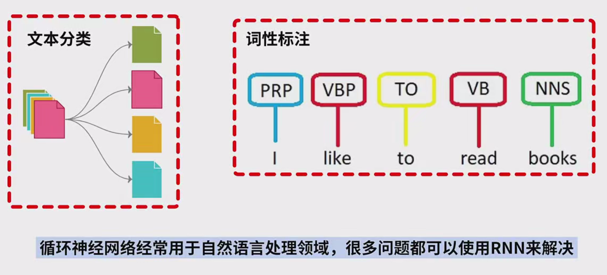
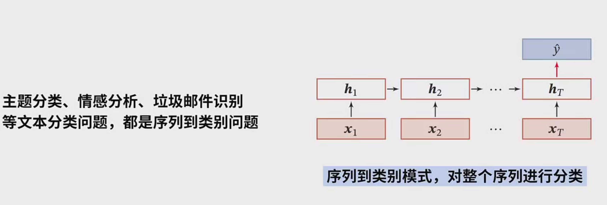
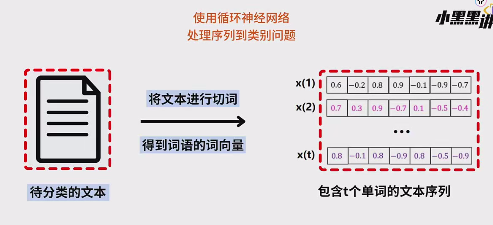
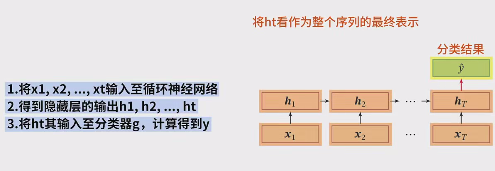
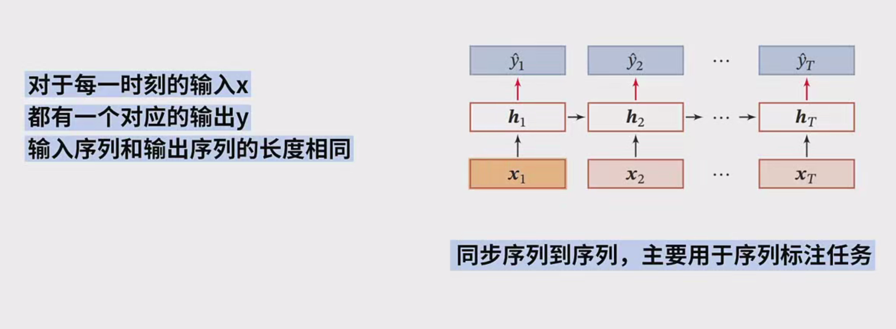
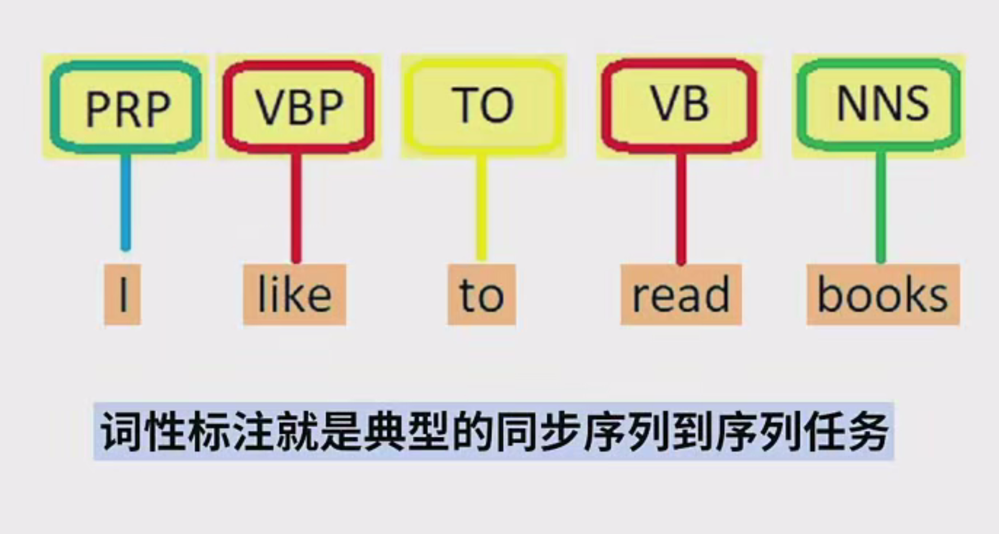
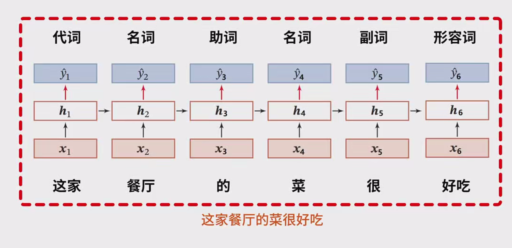
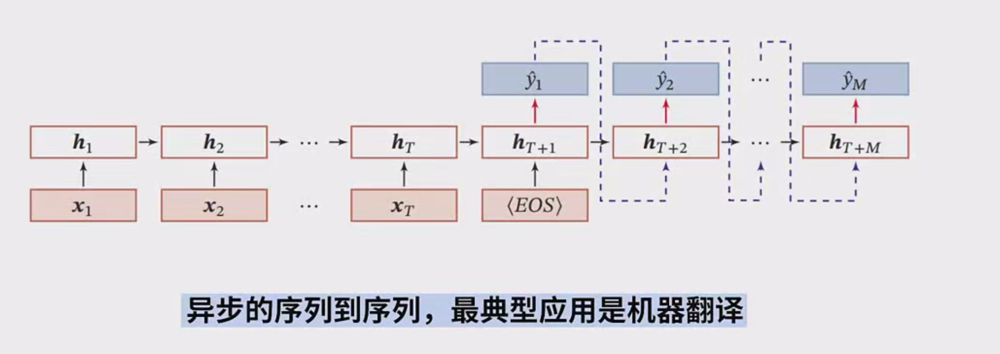

### 序列到类别与序列到序列详细笔记

#### 1. 循环神经网络（RNN）简介
循环神经网络（RNN）是一种常用于自然语言处理（NLP）任务的神经网络模型，特别适合处理序列数据。它具有时间递归特性，即其隐藏层的输出不仅受当前输入的影响，还受前一时刻的状态影响。因此，RNN能够捕捉序列数据中的时序关系。常见的RNN应用包括：
- 文本分类
- 词性标注
- 机器翻译

RNN的核心思想是通过隐藏状态（hidden states）对序列进行建模，逐步传播信息。根据任务的不同，RNN可以被用来处理不同类型的问题，主要分为三种模式：
- **序列到类别（Sequence to Label）**
- **序列到序列（同步，Sequence to Sequence - Synchronous）**
- **序列到序列（异步，Sequence to Sequence - Asynchronous）**

---

#### 2. 序列到类别（Sequence to Label）
**序列到类别（Sequence to Label）**问题是指将一个完整的输入序列进行分类，输出一个类别标签。常见的任务包括：
- 文本分类
- 情感分析
- 垃圾邮件识别

**典型应用场景：**
- **文本分类**：将文章或段落分类为不同的类别（例如，新闻分类：体育、娱乐、政治等）。
- **情感分析**：分析一段文本的情感（例如，判断评论是积极的、消极的还是中立的）。
- **垃圾邮件识别**：将电子邮件分类为正常邮件或垃圾邮件。

在这些任务中，输入通常是一个**文本序列** $ x_1, x_2, ..., x_t $，输出是一个**类别标签** $ y $，类别标签可以是二分类（如情感分析中的积极/消极）或多分类。

##### 2.1 处理流程
1. **输入准备：**
   - 首先将输入文本进行切词（Tokenization），然后将每个词语转化为相应的向量表示。可以使用**one-hot编码**或者更为丰富的**词向量**（如Word2Vec、GloVe等）。
   - 得到一个词向量序列 $ x_1, x_2, ..., x_t $，其中每个 $ x_i $ 是一个表示词语的向量。

2. **RNN传递：**
   - 将词向量序列依次输入RNN网络。
   - 每个时刻 $ t $ 的隐藏层输出为 $ h_t $，即 $ h_1, h_2, ..., h_t $。这些隐藏层的状态捕捉了序列的上下文信息。

3. **最终表示：**
   - 通过RNN传递后，我们可以使用**最后一个隐藏层的输出** $ h_t $ 作为整个序列的表示。
   - $ h_t $ 汇集了整个输入序列的信息，能够表征该序列的特征。

4. **分类器：**
   - 将 $ h_t $ 输入到一个分类器 $ g $ 中进行分类。分类器可以是简单的**线性分类器**（如逻辑回归），也可以是复杂的**多层前馈神经网络**。
   - 最终得到分类结果 $ y $，即序列所属的类别。

##### 2.2 示例：情感分析
- **任务：**对句子**“这家餐厅的菜很好吃”**进行情感分析。
  1. **切词：**将句子分词，得到**["这", "家", "餐厅", "的", "菜", "很", "好", "吃"]**。
  2. **词向量表示：**将每个词转化为词向量 $ x_1, x_2, ..., x_8 $。
  3. **RNN传递：**将每个词的词向量依次输入RNN，得到每个时刻的隐藏层输出 $ h_1, h_2, ..., h_8 $。
  4. **最终表示：**使用最后一个隐藏层输出 $ h_8 $ 作为整个句子的表示。
  5. **分类器：**将 $ h_8 $ 输入到分类器，得到分类结果 $ y $，例如“积极”情感。

##### 2.3 平均隐藏层输出
除了使用最后一个隐藏层输出 $ h_t $ 作为序列表示，还可以将所有时刻的隐藏层输出 $ h_1, h_2, ..., h_t $ 进行**平均**，得到一个表示整个序列的平均向量。然后将该平均向量输入分类器进行分类。

---

#### 3. 序列到序列（Sequence to Sequence）

**序列到序列（Sequence to Sequence）**问题是指输入一个序列，输出另一个序列。它的工作模式可以分为两种：
- **同步序列到序列（Synchronous Sequence to Sequence）**
- **异步序列到序列（Asynchronous Sequence to Sequence）**

##### 3.1 同步序列到序列（Synchronous Sequence to Sequence）
同步序列到序列模式通常用于**序列标注任务**，其特点是：
- 输入序列和输出序列的长度相同。
- 每个时刻的输入 $ x_i $ 对应一个输出 $ y_i $。

**典型应用：**词性标注

##### 3.2 处理流程：
1. **输入序列：**例如，输入句子**“这家餐厅的菜很好吃”**。
2. **RNN传递：**将输入的每个词依次输入到RNN中，得到每个时刻的隐藏层输出 $ h_1, h_2, ..., h_6 $。
3. **标签计算：**每个时刻的隐藏层输出 $ h_i $ 都通过一个分类器 $ g $，计算出对应的标签 $ y_1, y_2, ..., y_6 $，例如**代词、名词、动词**等。

##### 3.3 示例：词性标注
- **任务：**对句子**“这家餐厅的菜很好吃”**进行词性标注。
  1. 将每个词依次输入RNN，得到每个时刻的隐藏层输出。
  2. 对每个隐藏层输出 $ h_1, h_2, ..., h_6 $ 通过一个分类器计算出相应的词性标签，如**代词、名词、动词**等。

##### 3.4 异步序列到序列（Asynchronous Sequence to Sequence）
异步序列到序列模式的特点是：
- 输入序列与输出序列没有严格的一一对应关系。
- 输入和输出序列的长度也可以不同。

这种模式通常采用**编码器-解码器模型**，用于处理更复杂的任务，如**机器翻译**。

##### 3.5 处理流程：
1. **输入序列：**例如，输入中文句子**“这家餐厅的菜很好吃”**。
2. **编码器：**编码器部分将输入的中文句子转换为一个上下文表示。这一过程是通过RNN对输入序列进行逐步编码完成的，最后输出一个上下文向量。
3. **解码器：**解码器部分根据上下文向量生成输出序列（即翻译结果），例如**“The food at this restaurant is delicious”**。
4. 由于中文和英文的词数不匹配，输出序列的长度与输入序列的长度不必相同。

##### 3.6 示例：机器翻译
- **任务：**将中文句子**“这家餐厅的菜很好吃”**翻译为英文。
  1. **输入：**编码器将中文句子输入RNN。
  2. **编码：**编码器生成一个表示句子含义的上下文向量。
  3. **输出：**解码器生成英文翻译结果**“The food at this restaurant is delicious”**。

---

#### 4. 总结
- **序列到类别：**输入一个序列，输出一个类别标签，典型任务包括文本分类、情感分析等。
- **同步序列到序列：**输入和输出序列的长度相同，常用于序列标注任务（如词性标注）。
- **异步序列到序列：**输入和输出序列的长度不必相同，常用于机器翻译等任务，采用编码器-解码器模型。
