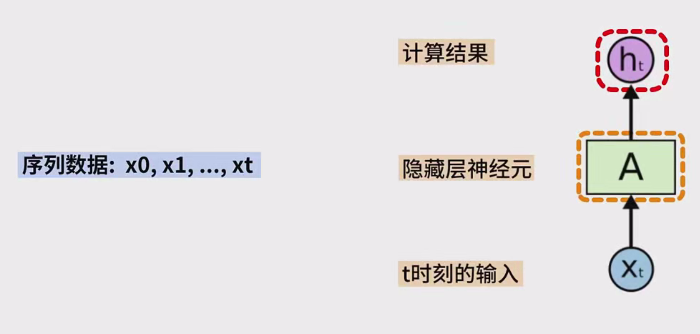

# 循环神经网络（RNN）数学原理笔记

## 1. 循环神经网络（RNN）的基本计算方式

### 1.1 输入与隐藏层输出

在时刻 $ t $，RNN 接收的输入为 $ x_t $，隐藏层的输出为 $ h_t $。该输出是基于当前输入 $ x_t $ 和前一时刻的隐藏层输出 $ h_{t-1} $ 计算得出的。

### 1.2 计算公式

计算公式如下：

$
h_t = f(w \cdot x_t + u \cdot h_{t-1} + b)
$

其中：
- $ w $ 为输入数据 $ x_t $ 的权重
- $ u $ 为前一时刻隐藏层输出 $ h_{t-1} $ 的权重
- $ b $ 为偏置项
- $ f $ 为激活函数，通常使用 Sigmoid、tanh 或 ReLU 等

### 1.3 RNN 相较于前馈神经网络的特点

与前馈神经网络不同，RNN 在计算时额外考虑了 $ u \cdot h_{t-1} $ 这一项，表示了过去的状态信息输入。这个特性使得 RNN 更好地处理序列数据中的上下文信息。

## 2. 具体示例

### 2.1 输入序列

假设输入序列为 $ x_1, x_2, x_3 $，每个输入是一个二维向量，表示三个词语。我们需要计算出对应的隐藏层输出 $ h_1, h_2, h_3 $。

- 网络参数 $ w $ 和 $ u $ 是 $ 2 \times 2 $ 的矩阵
- 偏置 $ b $ 是 $ 1 \times 2 $ 的向量
- 激活函数 $ f $ 为 Sigmoid 函数
- 初始化隐藏层状态 $ h_0 = (0, 0) $

### 2.2 计算过程

1. **计算 $ h_1 $**: 将输入 $ x_1 $ 和隐藏层状态 $ h_0 $ 输入网络，计算：
   $
   h_1 = f(w \cdot x_1 + u \cdot h_0 + b)
   $
   将计算得到的 $ h_1 $ 输出。

2. **计算 $ h_2 $**: 将输入 $ x_2 $ 和隐藏层状态 $ h_1 $ 输入网络，计算：
   $
   h_2 = f(w \cdot x_2 + u \cdot h_1 + b)
   $
   将计算得到的 $ h_2 $ 输出。

3. **计算 $ h_3 $**: 将输入 $ x_3 $ 和隐藏层状态 $ h_2 $ 输入网络，计算：
   $
   h_3 = f(w \cdot x_3 + u \cdot h_2 + b)
   $
   将计算得到的 $ h_3 $ 输出。

### 2.3 最终结果

通过这种方式，输入序列 $ x_1, x_2, x_3 $ 会分别生成对应的隐藏层输出 $ h_1, h_2, h_3 $。

## 3. 循环神经网络的输出计算

### 3.1 输出层计算

每个隐藏层的输出 $ h_t $ 还可以作为网络的最终输出。计算输出时，使用以下公式：

$
y_t = g(v \cdot h_t + d)
$

其中：
- $ v $ 为隐藏层输出 $ h_t $ 的权重
- $ d $ 为偏置项
- $ g $ 为激活函数，用于输出的计算

### 3.2 输出与隐藏层的关系

- 在传统的前馈神经网络中，只有输出层才会输出结果。
- 在 RNN 中，每个隐藏层都可以输出结果。例如，如果 RNN 有三个隐藏层，则每个隐藏层可以分别输出一个结果。

## 4. 总结

### 4.1 计算过程

对于每一个输入序列 $ x_1, x_2, \dots, x_t $，RNN 会使用相同的参数进行计算：
- 权重 $ w $ 用于输入数据
- 权重 $ u $ 用于前一时刻隐藏层的输出
- 权重 $ v $ 用于计算输出

每一时刻的输出 $ y_t $ 是基于序列中所有元素的累积计算结果。

### 4.2 RNN 的记忆能力

由于 RNN 可以利用先前的输出 $ h_{t-1} $ 作为当前计算的一部分，因此 RNN 具备了“记忆”能力，可以通过训练学习如何将更多权重分配给过去的事件。

### 4.3 与前馈神经网络的对比

RNN 在计算时与前馈神经网络的主要区别在于，它通过引入额外的权重 $ u $ 来考虑先前时刻的输出 $ h_{t-1} $，这使得它在处理时间序列数据时更具有优势。

