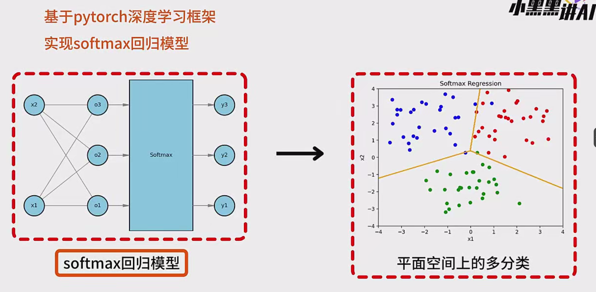
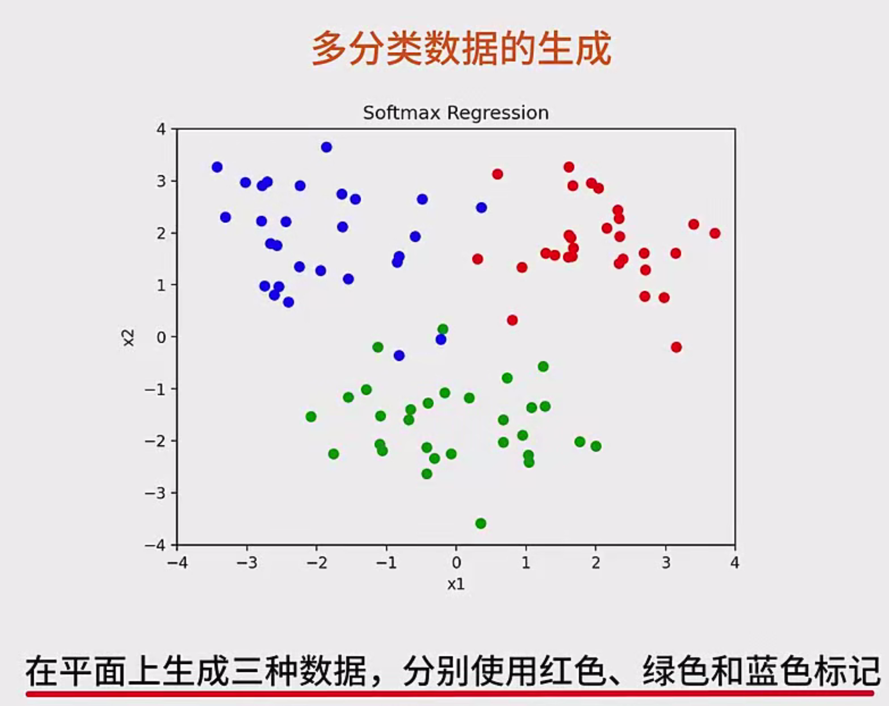
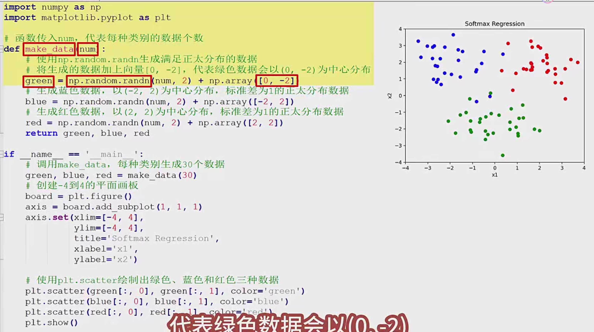
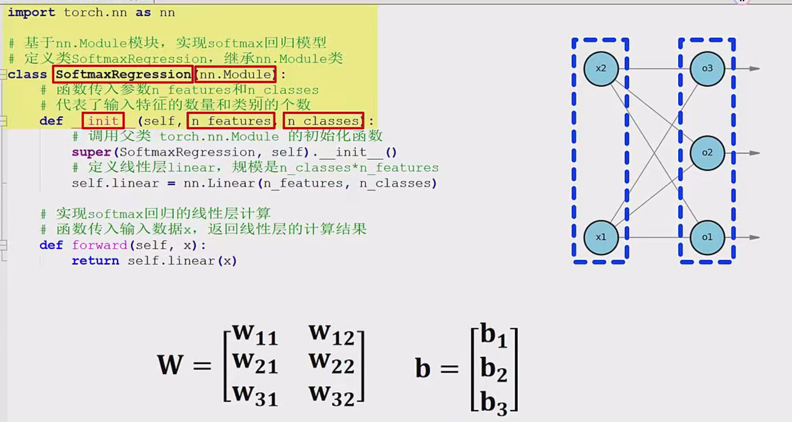
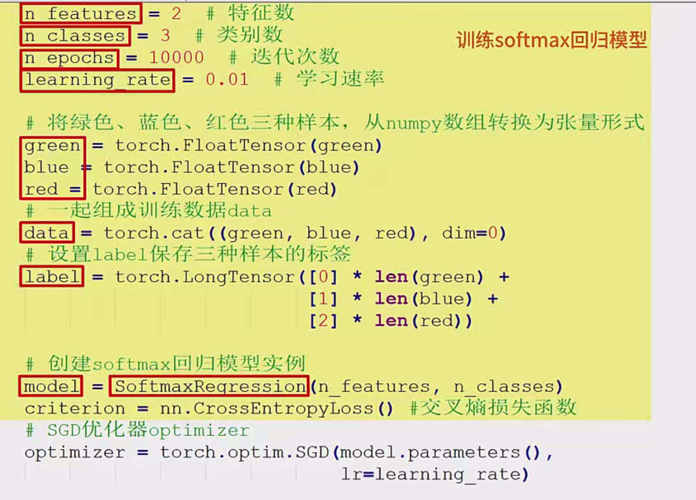
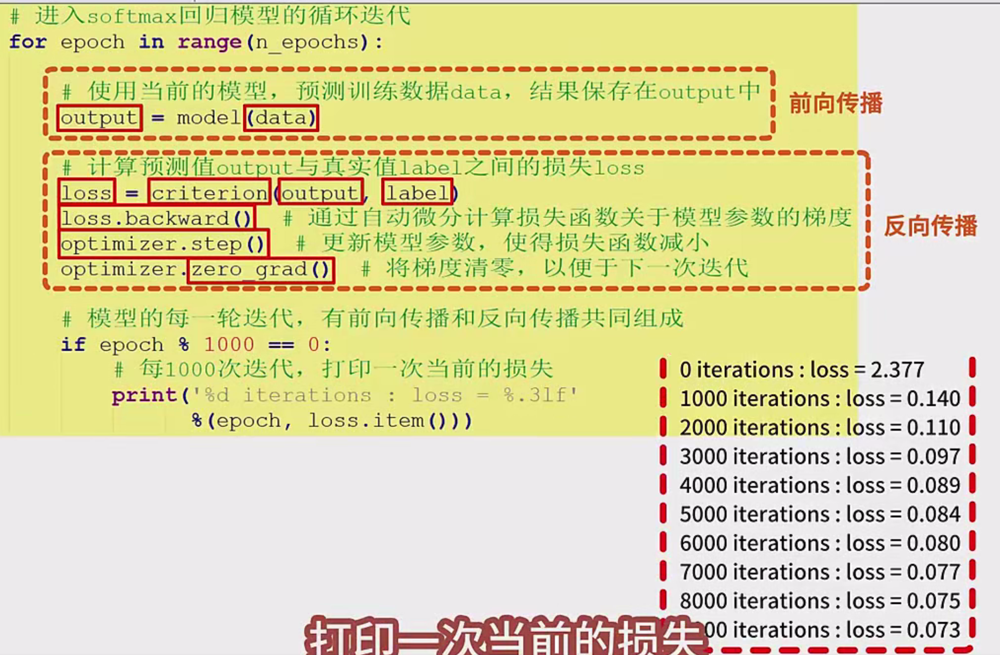
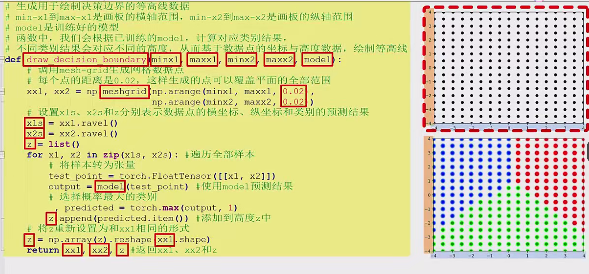
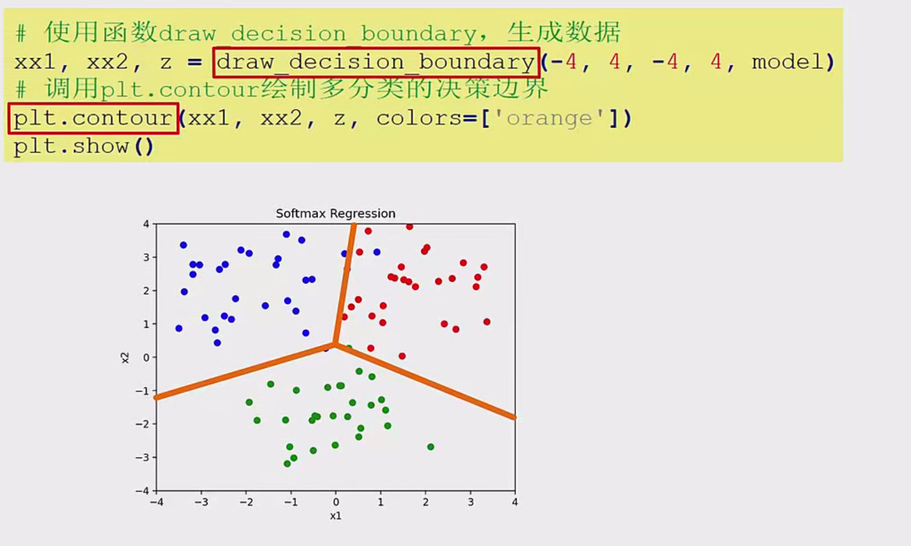

---

## 1. 实验背景及任务
**目标**：使用PyTorch（注：原文中“拍touch/ touch”等可能是语音转写，可理解为“torch”）实现一个Softmax回归模型，对二维平面上的三类数据进行多分类，并可视化分类决策边界。

Softmax回归（Softmax Regression）是一种常见的线性多分类模型。当输入的特征通过线性变换后，会得到各个类别的“分值”，再通过Softmax函数将分值转化为概率分布，从而完成多分类。

---

## 2. 数据生成

### 2.1 需求
我们希望在二维平面上生成三类数据点，各类数据以不同颜色（如红色、绿色、蓝色）标记，便于可视化。

### 2.2 函数 `make_data`
```python
import numpy as np
import matplotlib.pyplot as plt

def make_data(n=30):
    """
    生成三类二维数据，分别以绿色、蓝色、红色表示。
    :param n: 每个类别生成的数据个数
    :return: green, blue, red 三个数组，每个数组为 (n, 2) 形状
    """
    # 绿色数据: 以 (0, -2) 为中心的正态分布
    green = np.random.randn(n, 2) + np.array([0, -2])
    # 蓝色数据: 以 (-2, 2) 为中心的正态分布
    blue = np.random.randn(n, 2) + np.array([-2, 2])
    # 红色数据: 以 (2, 2) 为中心的正态分布
    red = np.random.randn(n, 2) + np.array([2, 2])
    
    return green, blue, red
```

### 2.3 可视化生成的数据
```python
def show_data(green, blue, red):
    """
    可视化生成的三类数据点
    """
    plt.figure(figsize=(6, 6))
    # 绘制绿色点
    plt.scatter(green[:, 0], green[:, 1], c='green', label='Green')
    # 绘制蓝色点
    plt.scatter(blue[:, 0], blue[:, 1], c='blue', label='Blue')
    # 绘制红色点
    plt.scatter(red[:, 0], red[:, 1], c='red', label='Red')
    
    # 设置坐标范围
    plt.xlim(-4, 4)
    plt.ylim(-4, 4)
    plt.legend()
    plt.title("Visualization of 3 Classes Data")
    plt.show()

# 生成数据并可视化
green_data, blue_data, red_data = make_data(30)
show_data(green_data, blue_data, red_data)
```

执行后，我们能看到在二维平面上分布的三种颜色的数据点。

---

## 3. Softmax回归模型定义

### 3.1 模型思想
对于输入 $\mathbf{x} \in \mathbb{R}^d$，如果有$K$个类别，则模型会学到一个权重矩阵 $W$ 和偏置向量 $\mathbf{b}$（或用行向量表示），从而得到**线性变换**：
$
\mathbf{z} = W \mathbf{x} + \mathbf{b}
$
其中$\mathbf{z}$ 是长度为 $K$ 的向量，每个分量 $\mathbf{z}_i$ 表示对应类别的“分值”。将 $\mathbf{z}$ 经过 Softmax 函数就会得到对各类别的预测概率：
$
\hat{y}_i = \frac{e^{z_i}}{\sum_{j=1}^K e^{z_j}}.
$
在训练时，通过交叉熵损失（Cross Entropy Loss）来度量预测概率分布与真实分布的差异，并使用反向传播更新参数 $W, \mathbf{b}$。

### 3.2 具体实现

```python
import torch
import torch.nn as nn

class SoftmaxRegression(nn.Module):
    """
    定义Softmax回归模型
    """
    def __init__(self, n_features, n_classes):
        super(SoftmaxRegression, self).__init__()
        # 线性层: 输出大小为 n_classes, 输入特征维度为 n_features
        self.linear = nn.Linear(n_features, n_classes)
    
    def forward(self, x):
        # 前向传播: 输出线性变换的结果（logits）
        out = self.linear(x)
        return out
```

- `__init__`中使用 `nn.Linear` 定义了一个线性层。  
- `forward`函数中将输入 `x` 传入线性层并输出结果（即未经过softmax的logits）。在训练时，PyTorch的交叉熵损失会内部处理log-softmax，所以我们不需要手动写softmax部分。

---

## 4. 模型训练

### 4.1 数据准备（转换为Tensor）
在进行PyTorch训练前，需要将NumPy数组转换成张量（Tensor）。并且我们要构造对应的标签 `label`。

假设三类数据分别对应标签 0（green）, 1（blue）, 2（red）。

```python
# 将numpy数组转换为tensor
green_tensor = torch.FloatTensor(green_data)
blue_tensor = torch.FloatTensor(blue_data)
red_tensor = torch.FloatTensor(red_data)

# 拼接训练数据
data = torch.cat((green_tensor, blue_tensor, red_tensor), dim=0)  # shape: (n*3, 2)

# 生成标签: green -> 0, blue -> 1, red -> 2
label_green = torch.zeros(green_tensor.size(0), dtype=torch.long)  
label_blue = torch.ones(blue_tensor.size(0), dtype=torch.long)   
label_red = torch.full((red_tensor.size(0),), 2, dtype=torch.long)

label = torch.cat((label_green, label_blue, label_red), dim=0)  # shape: (n*3, )
```

### 4.2 设置训练超参数并实例化模型
```python
# 超参数
n_features = 2       # 每个样本有2个特征(x1, x2)
n_classes = 3        # 共有3个类别
n_epoch = 10000      # 迭代次数
learning_rate = 0.01 # 学习率

# 实例化模型
model = SoftmaxRegression(n_features, n_classes)

# 定义损失函数: 交叉熵
criterion = nn.CrossEntropyLoss()

# 定义优化器: 随机梯度下降
optimizer = torch.optim.SGD(model.parameters(), lr=learning_rate)
```

### 4.3 训练循环
主要包括**前向传播**、**计算损失**、**反向传播**、**更新参数**四个步骤。

```python
for epoch in range(n_epoch):
    # 1. 前向传播: 得到预测值
    output = model(data)  # shape: (n*3, n_classes)
    
    # 2. 计算损失: output与label之间的交叉熵
    loss = criterion(output, label)
    
    # 3. 反向传播: 计算梯度
    optimizer.zero_grad()  # 先清空梯度
    loss.backward()
    
    # 4. 参数更新
    optimizer.step()
    
    # 每1000次迭代打印一次loss
    if (epoch+1) % 1000 == 0:
        print(f"Epoch [{epoch+1}/{n_epoch}], Loss: {loss.item():.4f}")
```

**训练过程说明**：
- `model(data)` 会得到各个样本对3个类别的logits。
- `criterion(output, label)` 则计算每个样本预测概率与真实类别的差异（交叉熵）。
- `loss.backward()` 会自动计算并累加梯度。
- `optimizer.step()` 会根据梯度来更新模型参数 $ W $ 和 $ b $。
- `optimizer.zero_grad()` 每次更新后都要将梯度清零。

---

## 5. 决策边界可视化

### 5.1 决策边界原理
在二维坐标平面上，每个点都可输入到训练好的Softmax回归模型中，得到三个类别的预测概率，进而确定其预测类别。为了可视化分类区域，可以用等高线或颜色块来展示“某点属于哪一类”。

### 5.2 函数 `draw_decision_boundary`
```python
def draw_decision_boundary(min_x1, max_x1, min_x2, max_x2, model, step=0.02):
    """
    生成用于绘制决策边界的等高线数据。
    :param min_x1, max_x1: x轴的最小值和最大值
    :param min_x2, max_x2: y轴的最小值和最大值
    :param model: 训练好的模型
    :param step: 网格步长
    :return: xx1, xx2, Z (分别为网格横坐标, 纵坐标, 预测类别)
    """
    # 生成网格点
    x1_range = np.arange(min_x1, max_x1, step)
    x2_range = np.arange(min_x2, max_x2, step)
    xx1, xx2 = np.meshgrid(x1_range, x2_range)

    # 准备存放预测结果Z
    Z = []
    for (px1, px2) in zip(xx1.ravel(), xx2.ravel()):
        # 变为Tensor
        point = torch.FloatTensor([px1, px2])
        # 预测类别(取logits最大的索引)
        with torch.no_grad():
            logits = model(point)
            pred = torch.argmax(logits).item()
        Z.append(pred)

    # 将Z转换为和xx1形状相同
    Z = np.array(Z).reshape(xx1.shape)
    return xx1, xx2, Z

# 生成决策边界
xx1, xx2, Z = draw_decision_boundary(-4, 4, -4, 4, model)

# 可视化
plt.figure(figsize=(6,6))
plt.contourf(xx1, xx2, Z, alpha=0.3, cmap=plt.cm.coolwarm)  # 使用等高线填充
# 再把原始点绘制出来
plt.scatter(green_data[:, 0], green_data[:, 1], c='green', label='Green')
plt.scatter(blue_data[:, 0], blue_data[:, 1], c='blue', label='Blue')
plt.scatter(red_data[:, 0], red_data[:, 1], c='red', label='Red')

plt.xlim(-4, 4)
plt.ylim(-4, 4)
plt.legend()
plt.title("Softmax Regression Decision Boundary")
plt.show()
```

执行后可以看到一个**多分类决策边界**，在背景色的分布下可以明显分辨出三类数据所处的区域边界。

---

## 6. 总结

1. **数据生成**：利用正态分布随机生成三类二维数据，并可视化以了解其分布形状。
2. **模型定义**：基于 `nn.Module` 定义 `SoftmaxRegression` 类，内含一个线性层（2→3）。
3. **训练流程**：
   - 将NumPy数据转为Tensor并创建对应的标签。
   - 实例化模型、损失函数（交叉熵）和优化器（SGD）。
   - 迭代训练若干轮，每轮进行前向传播、计算损失、反向传播、更新参数。
4. **决策边界可视化**：在二维平面生成网格点，逐点用模型预测类别，构造预测矩阵，最后使用 `contourf` 绘制不同类别的区域。
5. **关键点**：
   - Softmax回归常用于多分类任务，实质是将输入线性映射到 `n_classes` 维，再通过Softmax得到类别概率分布。
   - PyTorch中的 `nn.CrossEntropyLoss` 已经将 `LogSoftmax` 和 `NLLLoss` 封装，不需要手动实现Softmax。
   - 在训练中要注意 `optimizer.zero_grad()` 的位置，以避免梯度累积带来的错误。

