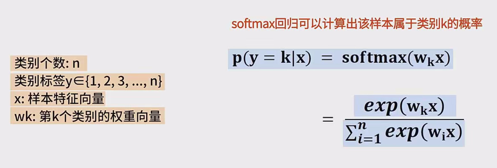
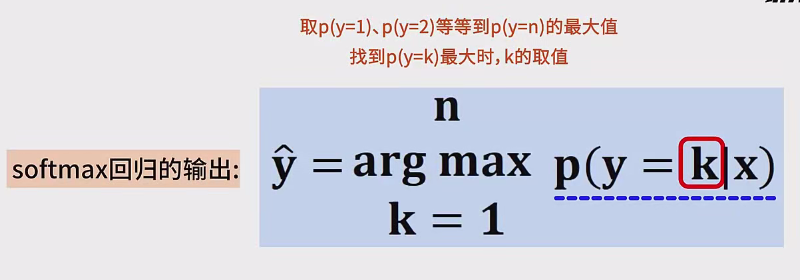
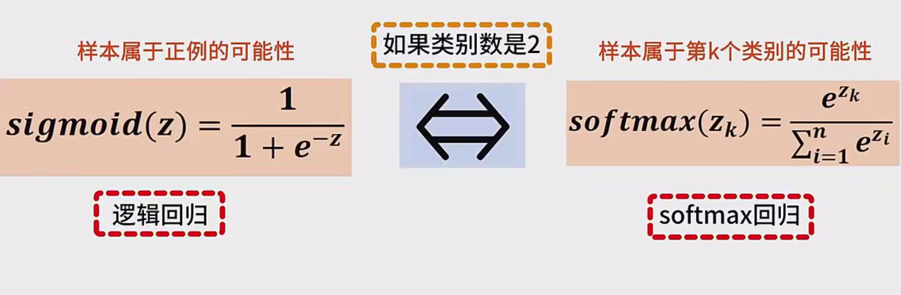
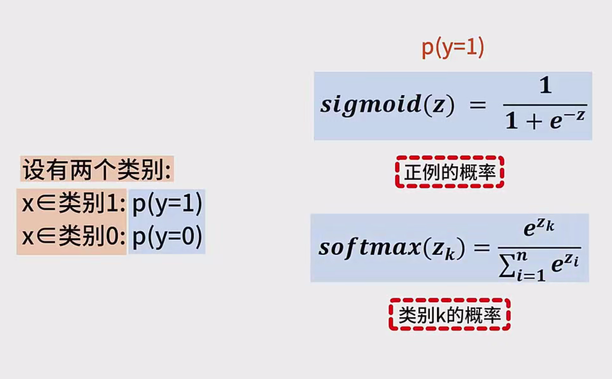
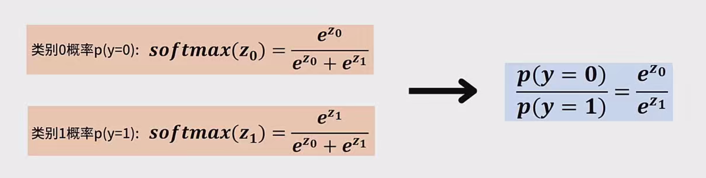
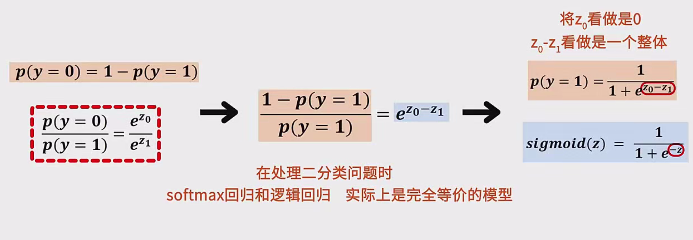
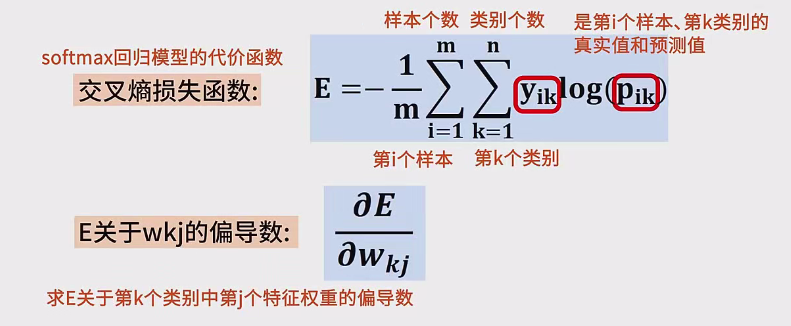
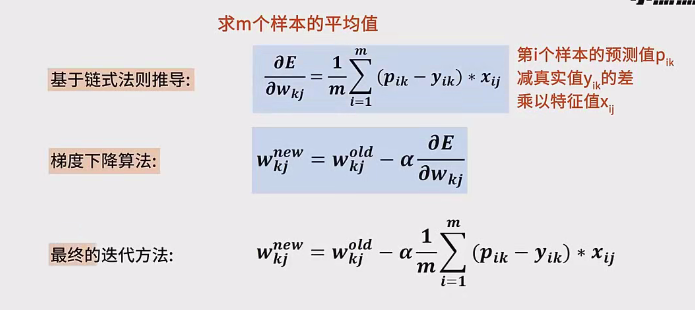

## 一、Softmax 回归简介

1. **什么是 Softmax 回归？**  
   - Softmax 回归（Softmax Regression）也叫**多项逻辑回归（Multinomial Logistic Regression）**。  
   - 它是 Logistic 回归（Logistic Regression）在多分类任务上的扩展版本。  
   - 目标：给定一个输入样本 $\mathbf{x}$，输出它属于每个类别 $k$（$k=1,2,\dots,n$）的**概率**，并保证所有类别概率之和为 1。

2. **为什么需要 Softmax 回归？**  
   - **Logistic 回归**只能处理**二分类**问题（例如“好瓜/坏瓜”）。输出是一个概率 $p$，代表样本是“正类”的可能性；“负类”的可能性则是 $1-p$。  
   - 现实场景中，常常有不止两个类别（例如“三种花”、“十种数字”）。所以我们需要把 Logistic 回归“升级”为**多分类形式**，这就是 Softmax 回归。

---

## 二、Softmax 函数与模型形式

### 2.1 Softmax 函数的基本概念

- 当我们有 $n$ 个类别时，每个类别 $k$ 都会计算一个“分数”或“对数几率”$z_k$。这些分数可能是线性组合得到的（例如 $\mathbf{w}_k^T \mathbf{x}$ 或 $\mathbf{w}_k^T \mathbf{x} + b_k$）。
- **Softmax 函数**的作用：把这些分数 $\{z_1, z_2, \dots, z_n\}$ 映射到 **(0, 1)** 之间，并且所有概率之和等于 1。  
  具体公式为  
  $
  P(y = k \mid \mathbf{x}) 
  = \frac{\exp(z_k)}{\sum_{i=1}^{n} \exp(z_i)}.
  $

### 2.2 线性输出与概率的连接

- 对于每个类别 $k$，我们常用一个向量 $\mathbf{w}_k$（以及可能的偏置 $b_k$）来计算其“线性输出”：
  $
  z_k = \mathbf{w}_k^T \mathbf{x} + b_k.
  $
- 然后将这些 $z_k$ 一起放到 Softmax 函数里，就得到**属于每个类别的概率**。例如，对于类别 $k$：  
  $
  P(y=k \mid \mathbf{x})
  = \frac{e^{\mathbf{w}_k^T \mathbf{x}}}{\sum_{i=1}^n e^{\mathbf{w}_i^T \mathbf{x}}}.
  $

**小贴士：** 偏置 $b_k$ 有时会合并到权重向量 $\mathbf{w}_k$ 的最后一维，或者省略不写，但实际上它的作用仍然存在。

### 2.3 预测时如何得到最终类别

- 训练好模型后，对于一条新的输入样本 $\mathbf{x}$，我们可能需要给出最终的**硬分类结果**（hard label）。  
- 做法：把 Softmax 输出的各类别概率都算出来，选取**概率最大的类别**作为预测标签。即：  
  $
  \hat{y} = \arg\max_{k} P(y=k \mid \mathbf{x}).
  $

---

## 三、Softmax 与 Logistic 回归的关系

### 3.1 二分类时，Softmax 回归会退化成 Logistic 回归

- **Logistic 回归**：输出一个概率 $p$，代表“正例”的概率；剩余 $1-p$ 就是“负例”的概率。  
- **Softmax 回归**：当类别数 $n=2$ 时，我们有两个分数 $z_0$ 与 $z_1$。  
  - 所得概率：  
    $
    P(y=1 \mid \mathbf{x})
    = \frac{e^{z_1}}{e^{z_0}+e^{z_1}}, 
    \quad
    P(y=0 \mid \mathbf{x})
    = \frac{e^{z_0}}{e^{z_0}+e^{z_1}}.
    $
  - 将二者相除，可以得到和 Logistic 回归中相同的指数形式；若再令 $z_0=0$ 或让 $(z_0 - z_1)$ 与 $-z$ 对应，就会回到**Logistic 回归的 Sigmoid 形式**。

### 3.2 直观理解

- 如果只是区分“有/没有”，“好/坏”，那么只要算出一个分数 $z$，通过 Sigmoid 函数就能得到“属于正例”的概率。  
- Softmax 相当于**把二分类 Sigmoid 的思路**拓展到多分类场景，为每个类别都分配一个分数，再通过指数与归一化把它们转换为概率。

---

## 四、Softmax 回归的损失函数 —— 交叉熵

### 4.1 交叉熵的定义

为了训练 Softmax 回归模型，需要定义一个**损失函数（Loss Function）**来衡量预测结果和真实标签之间的差距。多分类场景下，一般使用**交叉熵损失（Cross Entropy）**：

$
E 
= - \frac{1}{m} \sum_{i=1}^{m} \sum_{k=1}^{n} 
  y_{i,k} \log \bigl(p_{i,k}\bigr),
$

- $m$：训练样本个数。  
- $n$：类别总数。  
- $y_{i,k}$：第 $i$ 个样本对类别 $k$ 的真实标签，一般用独热编码（One-Hot Encoding）表示。  
  - 如果样本 $i$ 的真实类别就是 $k$，则 $y_{i,k} = 1$，否则为 0。  
- $p_{i,k}$：模型对第 $i$ 个样本预测为类别 $k$ 的概率（即 Softmax 输出）。

### 4.2 交叉熵的含义

- 当真实标签是 $k$ 时，对应的 $y_{i,k}=1$，其它类别为 0；因此损失主要看 $- \log (p_{i,k})$。  
- 若 $p_{i,k}$ 非常大（说明预测跟真实吻合），那么 $\log(p_{i,k})$ 就很大，$-\log(p_{i,k})$ 就很小，对应损失小。  
- 反之，如果 $p_{i,k}$ 非常小（预测失败），-$\log(p_{i,k})$ 会很大，损失就很大。  
- 最终，交叉熵会对所有样本及所有类别求均值，反映整体预测质量。

---

## 五、参数求解 —— 梯度下降

### 5.1 需要优化的参数

- 对于每个类别 $k$ 的权重向量 $\mathbf{w}_k$（和偏置 $b_k$），我们希望找到能让训练集整体损失最小的那一组参数。  
- 数学形式就是最小化 $\displaystyle E\left(\{\mathbf{w}_k\}\right)$ 。

### 5.2 梯度下降的思想

- **梯度下降（Gradient Descent）**是寻找最优参数的常用方法：  
  1. 随机初始化各参数 $\mathbf{w}_k$。  
  2. 计算**损失函数** $E$。  
  3. 计算损失函数对参数的**偏导数（梯度）**。  
  4. 沿着梯度的**反方向**更新参数。  
  5. 重复迭代，直到收敛（即损失不再显著下降）。

### 5.3 偏导数推导（要点）

- 对于损失函数 $E$，我们关心：
  $
  \frac{\partial E}{\partial w_{k,j}},
  $
  即第 $k$ 个类别的权重向量里，第 $j$ 个分量对应的梯度。  
- 经过较为繁琐的链式法则运算，可得到一个**简洁**结果：  
  $
  \frac{\partial E}{\partial w_{k,j}}
  = \frac{1}{m} \sum_{i=1}^{m} 
  \Bigl(p_{i,k} - y_{i,k}\Bigr) \, x_{i,j}.
  $
  - $p_{i,k} - y_{i,k}$：表示第 $i$ 个样本对类别 $k$ 的“预测值 - 真实值”。  
  - $x_{i,j}$：表示第 $i$ 个样本中第 $j$ 个特征的取值。

### 5.4 参数更新公式

- 用学习率 $\alpha$（也称迭代步长）来控制更新幅度：  
  $
  w_{k,j}^{(\text{new})} 
  = w_{k,j}^{(\text{old})}
  - \alpha \; \frac{\partial E}{\partial w_{k,j}}.
  $
- 代入上一步推导得到的梯度，就可以在每一步迭代时更新所有参数 $\mathbf{w}_k$。  
- 循环往复，通过梯度下降不断**减小**损失函数 $E$，从而让模型的预测趋于准确。

---

## 六、总结

1. **核心思路**  
   - Softmax 回归就是**线性模型 + Softmax 函数**，输出多类别概率。  
   - 训练时使用**交叉熵损失**，并借助**梯度下降**更新权重参数。  
2. **与 Logistic 回归的联系**  
   - 二分类场景下，Softmax 回归和 Logistic 回归是一模一样的。  
   - 多分类场景下，Softmax 回归是更通用的做法。  
3. **为什么可行？**  
   - 交叉熵配合 Softmax 函数，非常容易进行数学推导；且它在优化（梯度下降）时非常稳定，在机器学习和深度学习中非常常见。  
4. **学习建议**  
   - **手推小例子**：可以先在纸上假设只有 2~3 个样本，2~3 个类别，人工算出 Softmax 输出和交叉熵，再根据偏导数公式练习推导。  
   - **上机实验**：用 Python（NumPy、PyTorch 或 TensorFlow）实现一个简单的 Softmax 多分类，用梯度下降或其他优化器看看模型如何学习。

---

### 一个简单的例子（帮助理解）

假设我们只有 2 个样本（$m=2$），有 3 个类别（$n=3$），每个样本有 2 个特征（$x_1$, $x_2$）。我们用 $\mathbf{w}_1, \mathbf{w}_2, \mathbf{w}_3$ 分别对应 3 个类别，每个 $\mathbf{w}_k$ 有 2 个分量 $(w_{k,1}, w_{k,2})$。  

1. **正向计算**  
   - 对样本 $i$：计算  
     $
     z_{i,k} = w_{k,1} x_{i,1} + w_{k,2} x_{i,2} \quad (k=1,2,3),
     $  
     然后  
     $
     p_{i,k} = \frac{e^{z_{i,k}}}{\sum_{r=1}^3 e^{z_{i,r}}}.
     $  
2. **损失**  
   $
   E = -\frac{1}{2} \sum_{i=1}^2 \sum_{k=1}^3 y_{i,k} \log p_{i,k}.
   $
3. **计算梯度并更新**  
   - 假设我们先随机初始化所有 $w_{k,j}$。  
   - 用计算到的梯度，更新每个 $w_{k,j}$：  
     $
     w_{k,j} \leftarrow w_{k,j} - \alpha \times \frac{1}{2} \sum_{i=1}^2 (p_{i,k} - y_{i,k}) x_{i,j}.
     $  
4. **重复多次**：不断迭代，观察交叉熵是否下降，最终权重收敛到较优解。

以下笔记将重点阐述 **Softmax 回归** 与 **Logistic 回归** 的关系，以及“如何从 Logistic 回归（二分类）**一步步**推导出 Softmax 回归（多分类）”。同时，也会给出二分类情形下 Softmax 中 $p(y=0)$ 与 $p(y=1)$ 的详细推导过程，帮助初学者透彻理解其内在联系。

---

## 1. Logistic 回归回顾（以二分类为例）

1. **基本形式**  
   - Logistic 回归常见用于二分类问题，类别通常标记为 $y \in \{0, 1\}$。  
   - 对于一个输入样本 $\mathbf{x}$，Logistic 回归先计算一个“线性得分”：
     $
     z = \mathbf{w}^T \mathbf{x} + b.
     $
   - 然后通过 **Sigmoid 函数** 将这个得分映射到 $(0,1)$，得到**样本属于正类（$y=1$）的概率**：
     $
     P(y=1 \mid \mathbf{x})
     = \sigma(z)
     = \frac{1}{1 + e^{-z}}.
     $
   - 因为是二分类，$P(y=0 \mid \mathbf{x}) = 1 - P(y=1 \mid \mathbf{x})$。

2. **等价的指数形式**  
   有时也可以把 $\sigma(z)$ 写成类似 Softmax 的样子。令：
   $
   P(y=1 \mid \mathbf{x}) 
   = \frac{e^z}{1 + e^z}, 
   \quad
   P(y=0 \mid \mathbf{x}) 
   = \frac{1}{1 + e^z}
   = \frac{e^0}{e^0 + e^z}.
   $
   这样我们会看到一个雏形：分子为 $e^{z_1}$ 或 $e^{z_0}$，分母为二者之和 $e^{z_0} + e^{z_1}$。这正是 Softmax 函数在二分类情形下的一个特例。

---

## 2. 二分类下 Softmax 的形式

### 2.1 写出 $p(y=0)$ 和 $p(y=1)$

当类别只有两种（$y \in \{0,1\}$），Softmax 回归的定义如下：

- 先对类别 $0$ 和类别 $1$ 各自计算一个得分（有时也称“对数几率”）：
  $
  z_0 = \mathbf{w}_0^T \mathbf{x} + b_0, 
  \quad
  z_1 = \mathbf{w}_1^T \mathbf{x} + b_1.
  $
- Softmax 函数把这两个得分映射成概率：
  $
  p(y=0 \mid \mathbf{x})
  = \frac{e^{z_0}}{e^{z_0} + e^{z_1}}, 
  \quad
  p(y=1 \mid \mathbf{x})
  = \frac{e^{z_1}}{e^{z_0} + e^{z_1}}.
  $

### 2.2 等价于 Logistic 回归的推导

1. **先写下比例**  
   $
   \frac{p(y=0 \mid \mathbf{x})}{p(y=1 \mid \mathbf{x})}
   = \frac{\frac{e^{z_0}}{e^{z_0} + e^{z_1}}}{\frac{e^{z_1}}{e^{z_0} + e^{z_1}}}
   = \frac{e^{z_0}}{e^{z_1}}
   = e^{z_0 - z_1}.
   $

2. **记 $p(y=1 \mid \mathbf{x}) = p$，则 $p(y=0 \mid \mathbf{x}) = 1 - p$**  
   $
   \frac{p(y=0 \mid \mathbf{x})}{p(y=1 \mid \mathbf{x})}
   = \frac{1-p}{p}
   = e^{z_0 - z_1}.
   $
   所以  
   $
   \frac{1-p}{p} = e^{z_0 - z_1}
   \quad\Longrightarrow\quad
   p = \frac{1}{1 + e^{z_0 - z_1}}.
   $

3. **令 $z = z_1 - z_0$**  
   - 如果我们把 $z_0$ 看成 0（或看成某一参照点），则 $z_1 - z_0$ 就成了单一的线性输出 $\mathbf{w}^T\mathbf{x} + b$。  
   - 这样
     $
     p(y=1 \mid \mathbf{x})
     = \frac{1}{1 + e^{-z}}
     $
     这就是 **Logistic 回归** 中的 **Sigmoid** 函数形式。  
   - 也可以理解为：二分类的 Softmax 在数学上**完全等价**于 Logistic 回归，只是我们把“正类分数”减去“负类分数”变成一个整体，最终简化成 Sigmoid。

---

## 3. 从二分类推广到多分类 —— Softmax 回归的诞生

### 3.1 推广思路

- 在二分类时，我们只有两个分数 $z_0$ 和 $z_1$。  
- 如果要区分 $n$ 个类别，那么就可以给**每个类别 $k$** 都分配一个分数 $z_k$：
  $
  z_k = \mathbf{w}_k^T \mathbf{x} + b_k, 
  \quad k = 1,2,\dots,n.
  $
- 由于要把这些得分变为概率分布（并且让所有概率之和等于 1），自然就把 Sigmoid 进一步推广为 **Softmax** 函数：
  $
  p(y=k \mid \mathbf{x})
  = \frac{e^{z_k}}{\sum_{i=1}^n e^{z_i}}.
  $

### 3.2 形式对比

- **Logistic 回归（Sigmoid）：**  
  $
  p(y=1 \mid \mathbf{x}) 
  = \frac{1}{1 + e^{-z}}.
  $
- **Softmax 回归：**  
  $
  p(y=k \mid \mathbf{x}) 
  = \frac{e^{z_k}}{\sum_{i=1}^n e^{z_i}}
  \quad\text{(适用任意 }n\ge2\text{)}.
  $
- 当 $n=2$ 时，Softmax 的分母里只有 $e^{z_0} + e^{z_1}$，自然就退化回二分类的 Logistic 回归。

---

## 4. 补充：Softmax 下的二分类推导示例

下面再用一个“从 0 到 1” 的过程，**明确写出**二分类时 Softmax 的 $p(y=0)$ 和 $p(y=1)$ 及其推导：

1. **定义两类的线性分数：**  
   $
   \begin{aligned}
   &z_0 = \mathbf{w}_0^T \mathbf{x} + b_0, \\
   &z_1 = \mathbf{w}_1^T \mathbf{x} + b_1.
   \end{aligned}
   $
2. **Softmax 函数：**  
   $
   \begin{aligned}
   p(y=0 \mid \mathbf{x}) &= 
   \frac{e^{z_0}}{e^{z_0} + e^{z_1}}, 
   \$4pt]
   p(y=1 \mid \mathbf{x}) &= 
   \frac{e^{z_1}}{e^{z_0} + e^{z_1}}.
   \end{aligned}
   $
3. **计算概率之比：**  
   $
   \frac{p(y=0 \mid \mathbf{x})}{p(y=1 \mid \mathbf{x})}
   = \frac{e^{z_0}}{e^{z_1}}
   = e^{z_0 - z_1}.
   $
4. **用 $p$ 表示 $p(y=1 \mid \mathbf{x})$**  
   $
   \begin{aligned}
   &p(y=1 \mid \mathbf{x}) = p, \\
   &p(y=0 \mid \mathbf{x}) = 1 - p.
   \end{aligned}
   $
   得到  
   $
   \frac{1 - p}{p} = e^{z_0 - z_1} 
   \quad\Longrightarrow\quad
   p = \frac{1}{1 + e^{z_0 - z_1}}.
   $
5. **简化（常见约定）**  
   - 若令 $z = z_1 - z_0$，那么  
     $
     p = \frac{1}{1 + e^{-z}},
     $
     这就是我们熟悉的 **Logistic 回归**。  
   - 显而易见，在只有两类时，Softmax 回归和 Logistic 回归数学上是一回事儿。

---

