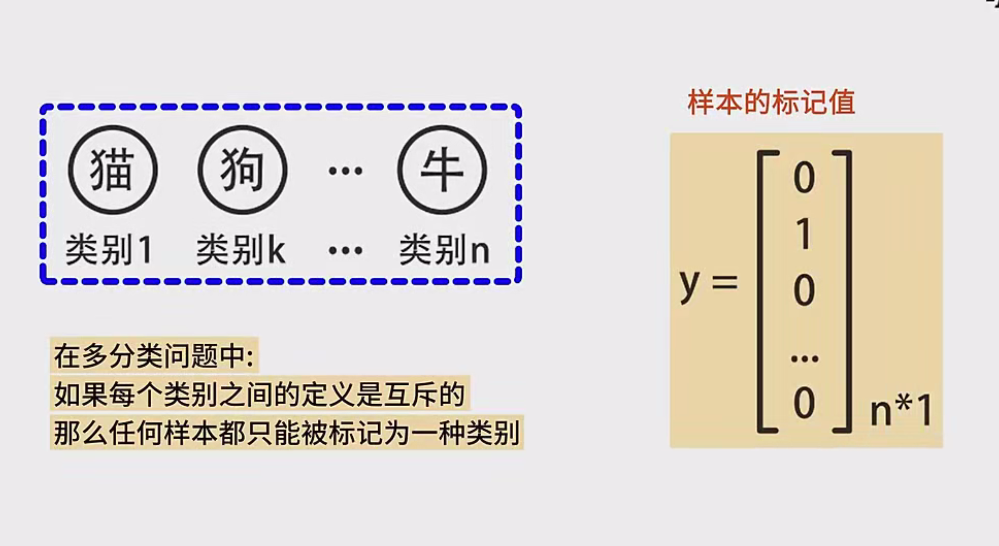
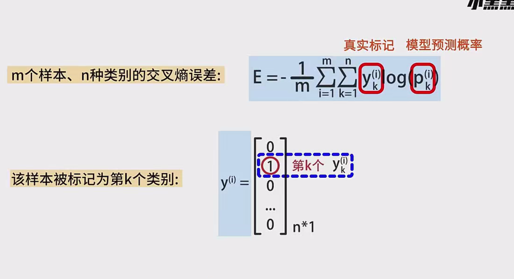
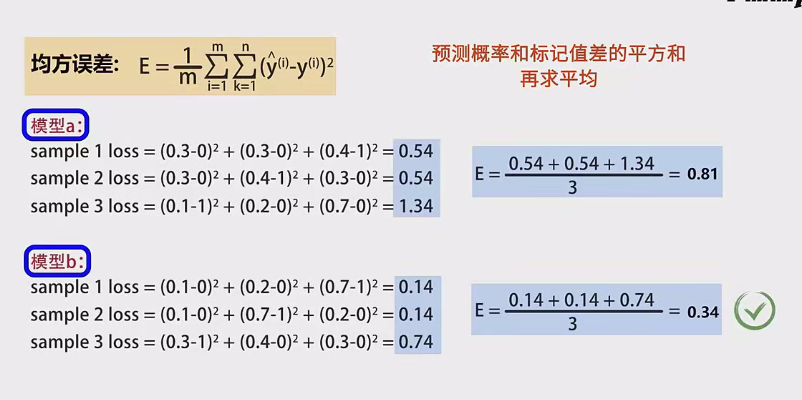
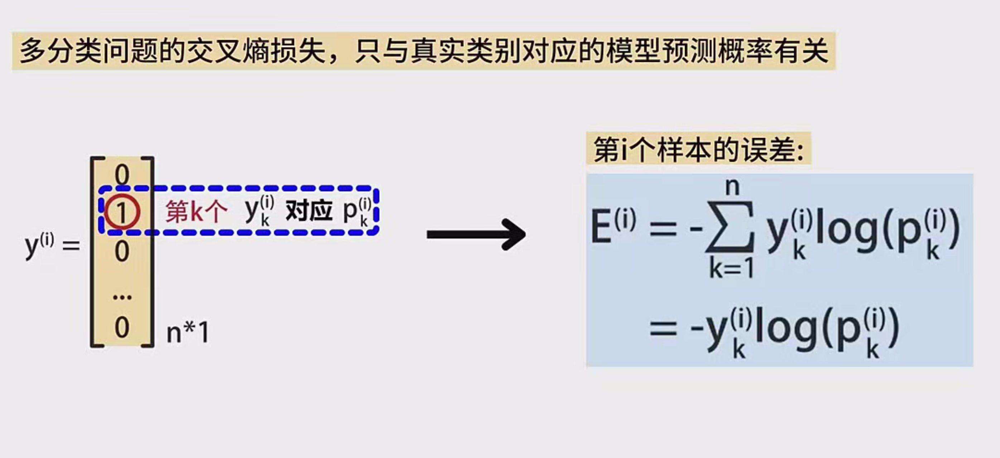
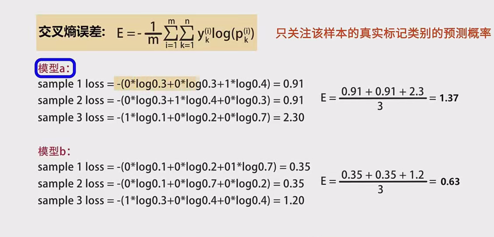
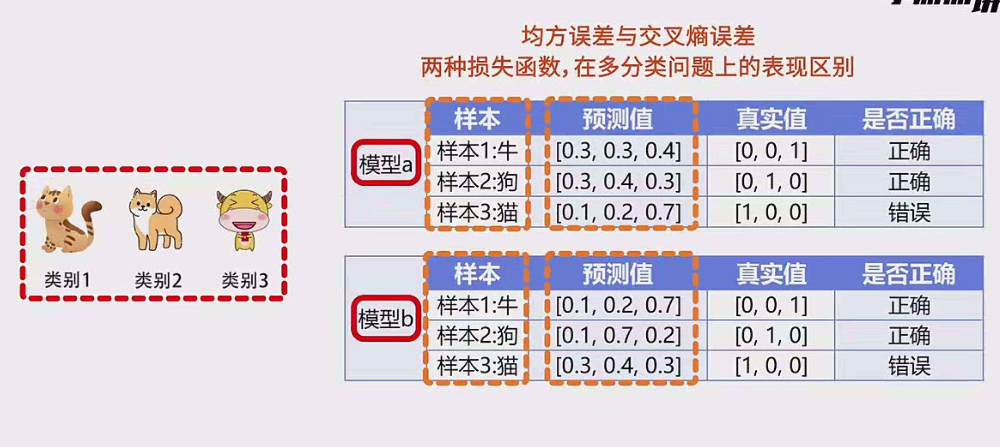
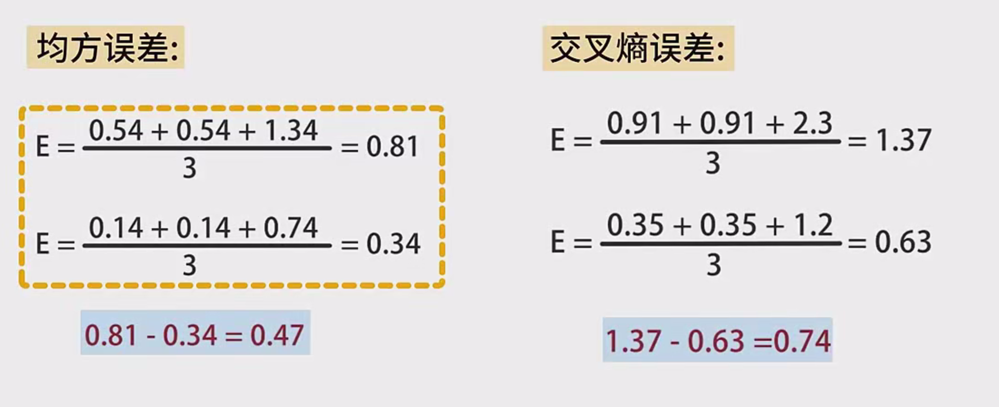

## 1. 交叉熵（Cross Entropy）概念

**交叉熵损失函数**主要用于评估模型输出的**概率分布**与**真实概率分布**之间的差异，常见于**分类任务**（包括二分类与多分类）。  
- 当交叉熵损失越小，表示模型输出的概率分布与真实分布越接近；  
- 当交叉熵损失越大，表示模型输出与真实分布差异越大。

在深度学习中，交叉熵损失因其良好的梯度性质，广泛用于训练**分类模型**（如图像分类、文本分类等）。

---

## 2. 二分类与多分类形式

### 2.1 二分类（Binary Classification）

对于**二分类问题**，交叉熵损失函数通常写作：

$
E = - \Big[ y \log p + (1 - y) \log (1 - p) \Big]
$

- $y \in \{0, 1\}$ 为**真实标签**。  
- $p$ 为模型预测出的属于正类（标签为1）的**概率**。  

如果真实标签 $y=1$，只保留第一项 $-\log p$；  
如果真实标签 $y=0$，只保留第二项 $-\log (1 - p)$。  

---

### 2.2 多分类（Multi-Class Classification）

对于**多分类问题**，样本会被划分到多个互斥的类别之一（例如有3类：猫、狗、牛）。此时交叉熵损失函数通常写为：

$
E = -\sum_{i=1}^{N} y_i \log p_i
$

- $N$ 表示类别的总数。  
- $y_i \in \{0, 1\}$ 表示**第 $i$ 个类别对应的真实标记**（One-Hot形式）。在One-Hot向量中，只有真实类别对应的分量为1，其余均为0。  
- $p_i$ 表示模型预测样本属于第 $i$ 类的**概率**。  

#### One-Hot 向量表示

- 例如，有 $N=3$ 个类别（猫、狗、牛），如果真实类别是“牛”，则真实标记 $\mathbf{y} = [0, 0, 1]^T$。  
- 由于只有真实类别对应的 $y_i=1$，在求和 $\sum y_i \log p_i$ 时，**只会保留真实类别对应的项**。

---

## 3. 样本数为 $M$ 时的平均交叉熵

训练集中如果有 $M$ 个样本，且有 $N$ 个类别，**平均交叉熵损失**可写为：

$
E = -\frac{1}{M} \sum_{m=1}^{M} \sum_{k=1}^{N} y_{mk} \log p_{mk}
$

其中：  
- $y_{mk}$：表示**第 $m$ 个样本**在**第 $k$ 个类别**的真实标记（0 或 1）。  
- $p_{mk}$：模型预测**第 $m$ 个样本**属于**第 $k$ 类的概率**。  

**注意：**对单个样本的损失而言，只保留真实类别对应项。对所有样本求平均后，即得到该批（或整套）数据的平均交叉熵损失。

---

## 4. 为什么交叉熵只关注真实类别？

对于多分类问题，真实标签 One-Hot 向量中仅有一个元素为 1，其余元素均为 0。以单个样本的损失 $E_i$ 为例：

$
E_i = -\sum_{k=1}^{N} y_{ik} \log p_{ik}
$

- 若样本真实类别为第 $k$ 类，则 $y_{ik} = 1$，其它类别对应的 $y_{ij} = 0$。  
- 在上式的求和中，**只有第 $k$ 项为 $1 \cdot -\log p_{ik}$，其余项皆为零**。  
- 因此，对该样本而言，只用到模型对真实类别的预测概率 $p_{ik}$。

**结论：**  
只要模型对真实类别的预测概率较高（即 $\log p_{ik}$ 的值更大、更正），该样本的损失就会相对较低；对于其它类别的预测不准确，并不会在该样本的损失计算中直接产生影响。

---

## 5. 交叉熵与均方误差（MSE）的对比

在分类任务中，也可以使用**均方误差（Mean Squared Error, MSE）**来衡量预测结果与真实标签之间的差异，但通常并不推荐。这主要是由于：  
1. **梯度问题**：均方误差在分类场景下，可能导致梯度不稳定或收敛缓慢。  
2. **关注点不同**：分类问题更关心模型在**正确类别**上的预测概率是否足够大，而交叉熵恰好只对真实类别上的预测概率敏感；MSE则会同时考虑所有类别预测误差，导致对分类任务的判别效果相对不足。

### 5.1 具体示例对比

以**三种类别（猫、狗、牛）**的图片分类为例，假设有三个测试样本，每个模型会输出对于这三类的预测概率。真实标记是One-Hot形式（只有一个类别为1，其他类别为0）。设有两个模型 A 和 B，预测结果如下（仅示意）：

- **模型 A**：  
  - 对样本1的预测为 $[0.3, \, 0.3, \, 0.4]$，真实类别标记为 $[0,\, 0,\, 1]$。  
  - 对样本2的预测为 $[0.4, \, 0.2, \, 0.4]$，真实类别标记为 $[1,\, 0,\, 0]$。  
  - 对样本3的预测为 $[0.1, \, 0.8, \, 0.1]$，真实类别标记为 $[0,\, 1,\, 0]$。（此处假设模型预测错误，概率分布与真实类别对不上）

- **模型 B**：  
  - 对样本1的预测为 $[0.1, \, 0.2, \, 0.7]$，真实类别标记为 $[0,\, 0,\, 1]$。  
  - 对样本2的预测为 $[0.7, \, 0.2, \, 0.1]$，真实类别标记为 $[1,\, 0,\, 0]$。  
  - 对样本3的预测为 $[0.3, \, 0.5, \, 0.2]$，真实类别标记为 $[0,\, 1,\, 0]$。（错误不算特别离谱）

#### （1）使用均方误差（MSE）对比

计算示意（仅举例思路）：  
- 对模型 A 的某个样本：  
  $
  \text{MSE}_\text{sample} 
  = \frac{1}{3}\big[(0 - p_1)^2 + (0 - p_2)^2 + (1 - p_3)^2\big]
  $
- 然后对全部样本求平均得到 **模型A** 的总体 MSE。  
- **模型B** 同理计算，结果可能更低或更高。

在示例中，得到：
- 模型 A 三个样本的 MSE 分别约为 $0.54, 0.54, 1.34$，平均约为 **0.81**。  
- 模型 B 三个样本的 MSE 分别约为 $0.14, 0.14, 0.74$，平均约为 **0.34**。  

可以看出，MSE 指标下，模型B 相比模型A 较优。

#### （2）使用交叉熵对比

   

交叉熵只关注**真实类别**的预测概率：  

- 对模型 A，第1个样本真实类别为“第3类”，其损失 $-\log(0.4)\approx 0.91$。  
- 依次计算所有样本，再对三个样本求平均，即为模型A的平均交叉熵损失。示例结果约为 **1.37**。  
- 对模型 B 亦做同样操作，结果约为 **0.63**。  

同样得出 **模型B** 明显优于 **模型A**，且从数值差距来看，交叉熵给出了更大的差异（1.37 vs. 0.63），比 MSE 更能**显著区分**两个模型的好坏。

---

## 6. 小结

1. **交叉熵用于分类**：在二分类及多分类场景中，交叉熵都能有效衡量预测的概率分布与真实分布的差异。  
2. **二分类与多分类公式**：二分类可写成 $-[y\log p + (1 - y)\log(1 - p)]$，多分类可扩展为 $-\sum y_i\log p_i$。  
3. **One-Hot 表示**：多分类时仅保留真实类别对应概率，从而在训练时鼓励模型提高对真实类别的预测置信度。  
4. **优于均方误差**：在分类任务中，交叉熵往往比 MSE 更能凸显模型在正确类别上的表现差异，也更利于训练稳定和收敛速度。  

**总而言之**，对于分类问题（尤其是多分类），交叉熵损失通常是首选。它能更好地表征模型预测结果与真实标签之间的差距，并在反向传播中提供更有效的梯度信号，从而更快、更准确地引导模型学习到正确的分类决策边界。