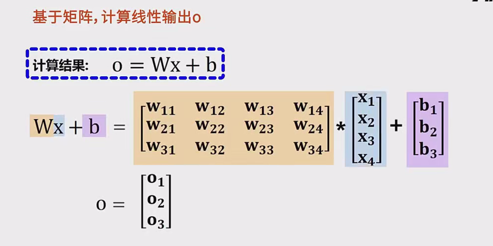

# 多分类与Softmax回归超详细

---

## 多分类任务概述

在机器学习中，**分类任务**指的是对输入样本进行类别标签预测的过程。常见的分类场景有：

- 邮件分类：垃圾邮件 vs. 正常邮件（这是二分类）
- 图片分类：识别图像中是猫、狗还是鸟（这是多分类）

当我们的目标类别有三个或更多时，这就被称为**多分类任务**。例如：
- 手写数字识别（0~9，共10个类别）  
- 新闻文本分类（体育、娱乐、财经、科技……）  
- 图像识别（不同的动物或物体类别）  

---

## 多分类的解决方案

### 方法一：基于1 VS Rest（OvR）策略的多分类

**1 VS Rest**也被称为“**One-vs-Rest**”或“**一对其余**”策略。这种方法将多分类问题拆分为多个二分类问题：

- 对于每一个类别，训练一个“是否属于该类别”的二分类模型。
- 共有$n$个类别就训练$n$个模型，每个模型的正例是该类别的样本，负例是其他类别的样本。

#### 训练与使用

- **训练阶段**：  
  比如有3个类别：绿色、蓝色、红色。  
  1. 模型1：绿色 vs. 非绿色（蓝色+红色）  
  2. 模型2：蓝色 vs. 非蓝色（绿色+红色）  
  3. 模型3：红色 vs. 非红色（绿色+蓝色）

- **预测阶段**：
  对于一个新样本，分别用3个模型进行预测。每个模型都会产生一个置信度或概率。根据任务需求，可以：
  - **只选一个类别**：将置信度最高的类别作为预测结果。  
  - **选多个类别**：如果有多个模型的置信度都超过阈值（如0.5），则同时选择多个类别。

#### 优势
1. **可维护性高**：若要新增一个类别，只需新建一个二分类模型；若要替换某个类别的模型，也不会影响其他类别。
2. **结果可自由组合**：对不同类别使用不同算法（如逻辑回归、SVM、决策树等）也没问题。

#### 劣势
1. **需要训练多个模型**：如果类别很多，训练和预测的成本较高。
2. **类别间的相互关系不被考虑**：每个模型独立工作，无法利用类别之间可能的关联信息。

---

### 方法二：基于Softmax回归的多分类

**Softmax回归**（也称作**多分类逻辑回归**或**归一化指数模型**）可以一次性地处理所有类别，将它们放在同一个模型中。核心是对多个类别同时进行判断，并输出各类别的概率分布，这些概率之和为1。

- **适用场景**：当各类别是**互斥**时（一个样本只能属于一个类别）。比如MNIST手写数字识别，一个数字只能是0~9中的一种。

#### 优点
- 只需**训练一个模型**就能同时完成对所有类别的判别。
- 通过**Softmax函数**实现概率归一化，可以得到“样本属于各个类别的概率”，非常直观。

#### 缺点
- **更新或增加类别时要整体重训**：如果增加一个新的类别，需要重新训练或至少要对原模型做较大的调整。
- **类别间严格互斥**：当一个样本有可能同时属于多个类别时，Softmax回归就不太合适了（OvR更灵活）。

---

## Softmax回归详解

本节将深入探讨Softmax回归，从其思想到具体的数学形式，再到训练和预测。

### 1. Softmax回归的基本思想

在二分类问题里，我们常用**Sigmoid函数**将线性输出转换为“样本属于正例的概率”。  
在多分类问题里，我们需要一种能够把线性输出的向量转换为“多类概率分布”的函数。**Softmax函数**应运而生。

简言之，**Softmax回归**就是用一个线性变换（类似于感知机、线性回归的思想）来对输入进行处理，再用**Softmax函数**把输出转化为各类别的概率。

### 2. Softmax回归的模型结构

假设有$n$个类别，输入特征为$\mathbf{x} \in \mathbb{R}^d$（即包含$d$个特征）。  
Softmax回归模型包含以下元素：

1. **权重矩阵** $ W $，大小为 $(n \times d)$  
2. **偏置向量** $ \mathbf{b} $，大小为 $(n \times 1)$

先进行线性变换：  
$
\mathbf{o} = W \cdot \mathbf{x} + \mathbf{b}
$  
其中，$\mathbf{o} = (o_1, o_2, ..., o_n)$ 为针对每个类别的“分数”或“对数几率”。

### 3. Softmax函数的数学原理和直观理解

在线性变换得到的$\mathbf{o}$（长度为$n$）上，我们需要用**Softmax函数**将其变换成概率分布$\mathbf{y} = (y_1, y_2, ..., y_n)$，其中
$
\sum_{k=1}^{n} y_k = 1,\quad 0 \leq y_k \leq 1.
$

**Softmax函数**公式如下：
$
y_k = \frac{e^{\,o_k}}{\sum_{i=1}^{n} e^{\,o_i}}
$
也可写作：
$
y_k = \text{Softmax}(\mathbf{o})_k
$

#### 3.1 为什么要用指数函数？

- **保证非负**：指数函数$ e^x $永远大于0，可以方便地作为“分数”或“权重”来比较
- **放大差距**：如果$o_i$比$o_j$略大一点，那么$e^{o_i}$和$e^{o_j}$之间会出现更明显的差异，突出了大的分数，便于区分类别。

#### 3.2 为什么要进行归一化？

我们希望输出结果是一个**概率分布**，即各类别概率之和为1。而直接用$e^{o_i}$还没有归一化，所以需要除以$\sum e^{o_i}$，保证所有概率加起来恰好等于1。

这样一来，我们就可以通过比较$y_k$的大小来确定最可能的类别；此外，这些$y_k$还可以作为“置信度”或概率，用于进一步的判断或决策。

---

### 4. Softmax回归的训练与预测

#### 4.1 损失函数

在二分类问题中，我们常用的损失函数是**交叉熵损失**（也可称作对数似然损失），Softmax回归也类似，只是针对多类别情况。

假设训练数据集中有$m$个样本，每个样本$x^{(i)}$对应的真实标签是**One-hot**形式$\mathbf{t}^{(i)}$，其中$\mathbf{t}^{(i)}$长度为$n$且只有一个位置为1（其余为0）。设模型预测值为$\mathbf{y}^{(i)}$。则**交叉熵损失**定义为：

$
\text{Loss} = -\sum_{i=1}^{m} \sum_{k=1}^{n} t_k^{(i)} \log \bigl( y_k^{(i)} \bigr)
$

- 若第$i$个样本真实类别为$c$，则$t_c^{(i)} = 1$，其他$t_k^{(i)}=0$。
- 该损失本质上就是最大化正确类别的概率（等价于最小化对数似然负值）。

通过随机梯度下降（SGD）或其他优化算法（如Adam等），我们可以求得参数$ W $和$ \mathbf{b} $来最小化以上损失函数。

#### 4.2 预测过程

训练完成后，给定一个新样本$\mathbf{x}$：

1. 计算线性输出：
   $
   \mathbf{o} = W \cdot \mathbf{x} + \mathbf{b}
   $
2. 将$\mathbf{o}$输入Softmax：
   $
   y_k = \frac{e^{\,o_k}}{\sum_{i=1}^{n} e^{\,o_i}}, \quad \text{for } k = 1, 2, \ldots, n
   $
3. 得到各类别的预测概率$\mathbf{y}$后，取概率最高的类别为模型预测结果。

---

### 5. Softmax回归的优缺点

**优点**  
1. **模型简单、易实现**：只需一层线性变换+Softmax函数，逻辑清晰，实现难度低。  
2. **一次性处理多类别**：不必为每个类别独立训练一个模型。  
3. **概率输出可解释**：输出可直接视为“样本属于某类别的概率”，对业务解释和决策很友好。  

**缺点**  
1. **类别互斥**：一旦你选定某个类别概率最高（远高于其他类别），就忽略了其他可能性。在某些需要多标签（多类别同时成立）的场景不适用。  
2. **增加新类别成本高**：若想增加一个类别，需要重新训练或对原模型进行全局修改。  
3. **无法利用类别关联**：如果类别之间有相关性（并非互斥），Softmax回归也无法直接体现。

---

## 1 VS Rest与Softmax回归的对比与选择

1. **灵活性**：
   - OvR：可以针对不同类别选择不同模型，容易增减类别或修改单个类别的模型。
   - Softmax：将所有类别纳入同一个模型，增减类别会影响整个模型。

2. **计算效率**：
   - OvR：预测时要跑多个模型。若类别多，效率会下降。
   - Softmax：只需计算一次前向传播即可输出所有类别概率，通常更高效。

3. **适用场景**：
   - OvR：**多标签分类**（一个样本可同时属于多个类别）或需要独立优化单个类别。
   - Softmax：**类别互斥**、对“概率解释”有需求、数据量较大、需要统一训练的场景。

---

---

### Softmax函数的详细解释

为什么用指数+归一化？

1. **指数**：$e^{o_k}$始终为正数，且可以放大不同分数之间的差距。  
2. **归一化**：分母$\sum e^{o_i}$使得所有概率之和=1，这正是概率分布的要求。

#### 例子计算

假设3个类别的线性输出分别是：  
- $o_1=0.3$  
- $o_2=2.9$  
- $o_3=4.0$

先计算指数：  
- $e^{0.3} \approx 1.35$  
- $e^{2.9} \approx 18.17$  
- $e^{4.0} \approx 54.60$

求总和：  
$
1.35 + 18.17 + 54.60 = 74.12
$

所以各类别的概率：  
$
y_1 = \frac{1.35}{74.12} \approx 0.0182, \quad
y_2 = \frac{18.17}{74.12} \approx 0.245, \quad
y_3 = \frac{54.60}{74.12} \approx 0.737
$

---

