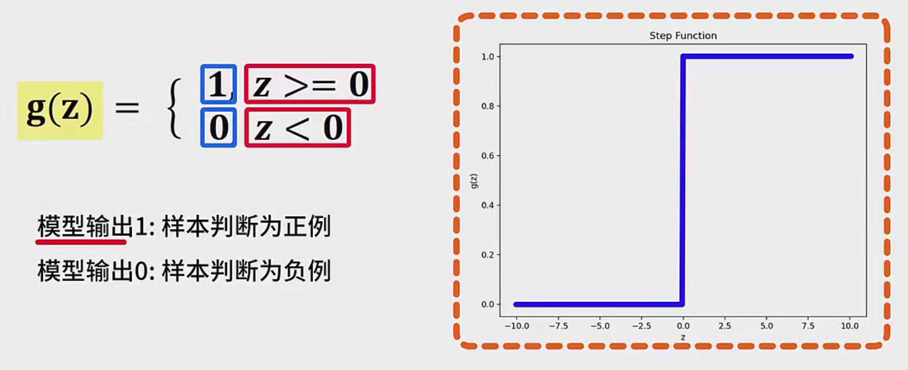

### **感知器的基本概念**

#### 1. **感知器简介**
感知器（Perceptron）是由美国心理学家和计算机科学家弗兰克·罗森布拉特（Frank Rosenblatt）于1958年首次提出的，尽管其最初版本是为模拟人类大脑的神经元工作原理而设计的，但它至今仍是机器学习领域的基础模型之一。

感知器是一个线性分类模型，通常用于二分类任务。它的基本思想是根据输入数据的特征，通过一组权重与偏置进行加权求和，再通过激活函数进行处理，最终输出一个类别（通常是0或1）。

#### 2. **感知器的工作原理**

感知器的基本结构包括：
- **输入层（Features）**：感知器接收多个输入特征 $ x_1, x_2, \dots, x_n $。
- **权重（Weights）**：每个输入特征 $ x_i $ 都有一个对应的权重 $ w_i $，表示该特征对最终决策的影响程度。
- **偏置（Bias）**：偏置 $ b $ 是一个额外的参数，它帮助调整决策边界的位置，确保模型在所有特征都为零时依然能做出合理预测。
- **线性组合（Linear Combination）**：感知器首先对输入特征和权重进行加权求和，并加上偏置项 $ b $，得到一个线性输出 $ z $，即：
  $
  z = w_1 \cdot x_1 + w_2 \cdot x_2 + \dots + w_n \cdot x_n + b
  $
- **激活函数（Activation Function）**：线性组合结果 $ z $ 被传入激活函数。感知器使用一个简单的阶跃函数（Heaviside Step Function）作为激活函数，公式为：
  $
  g(z) = \begin{cases} 
  1 & \text{if } z \geq 0 \\
  0 & \text{if } z < 0
  \end{cases}
  $
  根据激活函数的输出结果，感知器将输入数据分为两类。如果 $ g(z) = 1 $，则预测为正类（通常为1），如果 $ g(z) = 0 $，则预测为负类（通常为0）。

#### 3. **感知器的数学模型**

感知器的数学公式简化后，核心为：
$
y = g(w_1 x_1 + w_2 x_2 + \dots + w_n x_n + b)
$
其中，$ y $ 为预测输出，$ g $ 是激活函数，$ w_i $ 为特征 $ x_i $ 对应的权重，$ b $ 为偏置。

##### **过程解析**：
1. **输入特征**：感知器接收来自外部的数据特征 $ x_1, x_2, \dots, x_n $。
2. **加权求和**：每个特征与对应的权重相乘后求和，再加上偏置 $ b $，形成线性组合 $ z $。
3. **激活函数处理**：将 $ z $ 输入到激活函数中，如果 $ z \geq 0 $，输出为1（正类），否则输出为0（负类）。

#### 4. **感知器案例分析**

##### **案例描述**：
假设我们有一个感知器模型，预测学生在期末考试中是否能够取得好成绩。我们通过两个特征来描述学生的情况：
- $ x_1 $ 代表学生的平时成绩。
- $ x_2 $ 代表学生的期末复习时长。

假设平时成绩和复习时长都经过标准化，值的范围在 -1 和 1 之间，值越高表示该特征越优秀。

##### **设置模型参数**：
- 权重：假定平时成绩对期末成绩的影响较大，设置 $ w_1 = 0.7 $, $ w_2 = 0.3 $。
- 偏置：设置偏置项为 $ b = -0.2 $，这表示在特征值较小或为零时，默认的预测结果偏向负类。

##### **步骤一：计算线性组合**：
假设学生的平时成绩较好，复习时长较长，设：
- $ x_1 = 0.8 $（较好的平时成绩），
- $ x_2 = 0.7 $（较长的复习时长）。

线性组合为：
$
z = 0.7 \times 0.8 + 0.3 \times 0.7 - 0.2 = 0.57
$
由于 $ z > 0 $，激活函数输出为1，预测该学生能够取得好成绩。

##### **步骤二：计算另一个学生的线性组合**：
假设另一个学生的平时成绩较差，复习时长较短，设：
- $ x_1 = 0.1 $（较差的平时成绩），
- $ x_2 = -0.5 $（较短的复习时长）。

线性组合为：
$
z = 0.7 \times 0.1 + 0.3 \times (-0.5) - 0.2 = -0.28
$
由于 $ z < 0 $，激活函数输出为0，预测该学生无法取得好成绩。

#### 5. **感知器与生物神经元的类比**

感知器的设计灵感来自于生物神经元的工作原理，具体类比为：

- **输入（输入特征）**：生物神经元通过树突接收来自其他神经元的信号，感知器通过特征值 $ x_1, x_2, \dots, x_n $ 接收输入信息。
- **突触和权重**：突触负责决定信号的传输强度，感知器中的权重 $ w_1, w_2, \dots, w_n $ 就是信号的传输强度，控制每个输入特征的影响力。
- **神经元激活**：生物神经元通过轴突输出信号，感知器则通过激活函数决定是否输出信号（1或0）。

#### 6. **感知器的局限性**
感知器模型虽然简单易懂，但它存在一些明显的局限性，特别是在面对**非线性可分**问题时。也就是说，当数据无法通过一条直线（或超平面）分割时，感知器就无法有效地进行分类。例如，XOR问题就是一个典型的非线性可分问题。

##### **非线性可分的例子**：
在二维空间中，假设有四个点，分别为 $ (1, 1), (1, 0), (0, 1), (0, 0) $，它们的标签分别是1, 0, 0, 1（类似XOR问题）。这些点不能通过一条直线分割开来，因此感知器不能解决这种问题。

#### 7. **感知器的影响与后续发展**

尽管感知器在处理复杂问题时存在局限，但它为后来的人工神经网络和深度学习模型奠定了基础。感知器的思想发展演化成了多层感知器（MLP）和深度神经网络（DNN）。通过引入隐藏层和非线性激活函数，神经网络能够处理更加复杂的分类和回归任务。

#### 8. **总结**
感知器是一个基础的线性分类模型，尽管在解决非线性问题时存在局限，但其核心思想和数学原理为后续神经网络的发展奠定了重要基础。它通过加权求和和简单的阶跃函数激活，完成对输入数据的分类任务，是深度学习发展史上的重要里程碑。