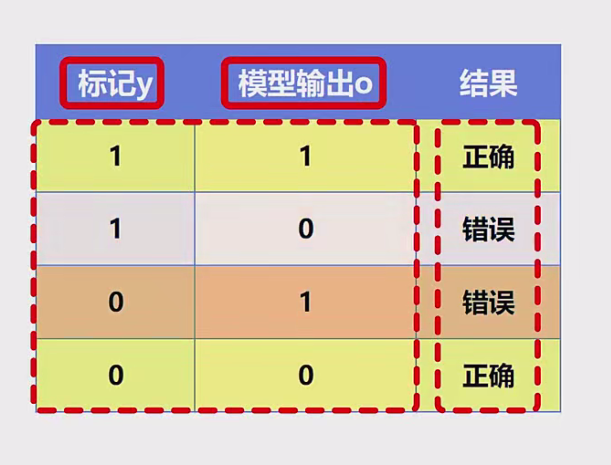
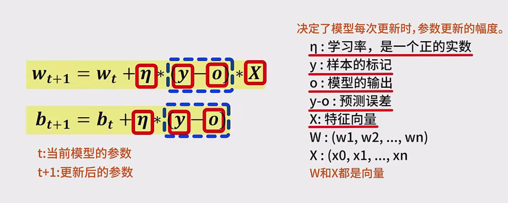
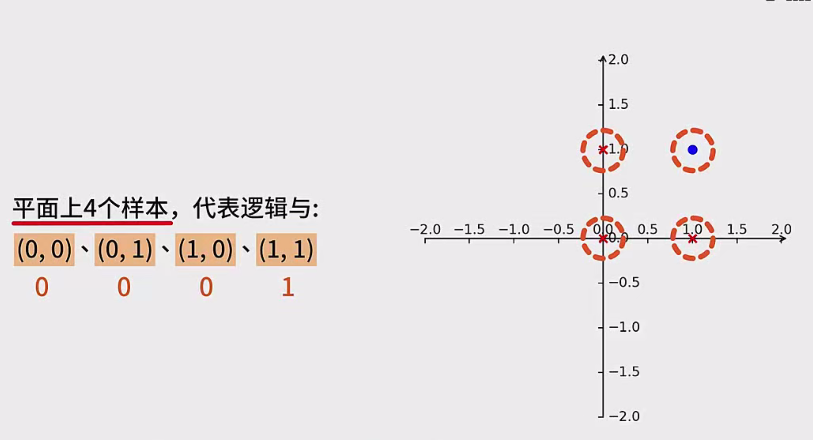
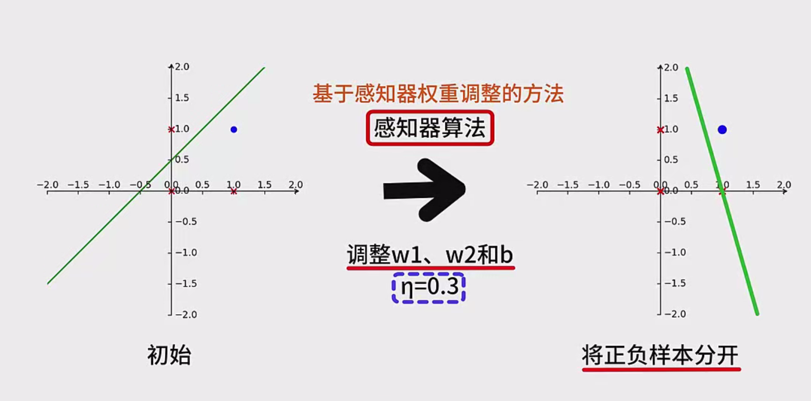
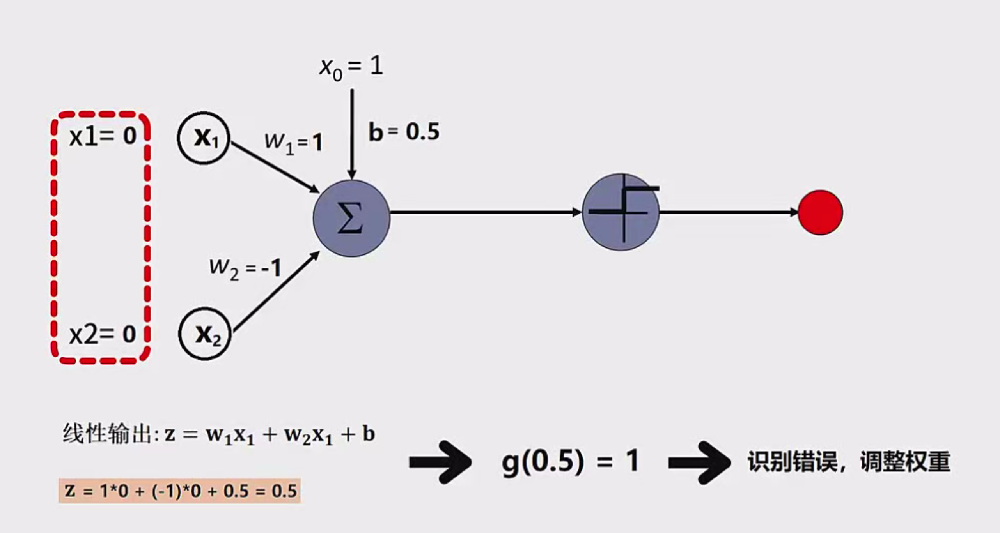
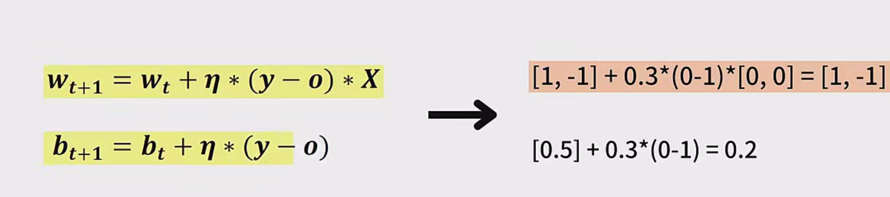
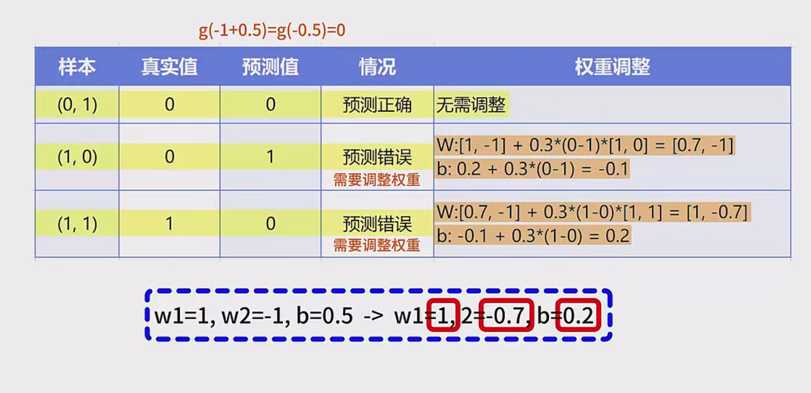
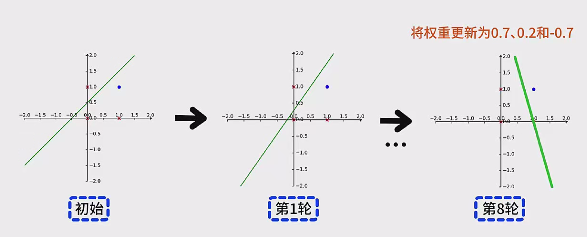

# 感知器学习算法

## 2. 感知器预测过程

### 2.1 感知器的决策边界

感知器是一种线性分类器，其决策边界是一个超平面（在二维空间中为一条直线）。决策边界由权重向量 $ \mathbf{w} $ 和偏置 $ b $ 决定：

$
\mathbf{w}^T \mathbf{x} + b = 0
$

这条直线将特征空间划分为两个区域：

- **正类区域**：$ \mathbf{w}^T \mathbf{x} + b \geq 0 $，预测为 **1**。
- **负类区域**：$ \mathbf{w}^T \mathbf{x} + b < 0 $，预测为 **0**。

### 2.2 预测步骤详解

对于给定的输入样本 $ \mathbf{x} = [x_1, x_2, \ldots, x_n]^T $，感知器的预测过程如下：

1. **计算加权和**：
   
   $
   z = \mathbf{w}^T \mathbf{x} + b = w_1 x_1 + w_2 x_2 + \ldots + w_n x_n + b
   $

2. **应用激活函数**：
   
   使用阶跃函数 $ g(z) $ 来确定输出 $ o $：

   $
   o = g(z) =
   \begin{cases}
   1, & \text{如果 } z \geq 0 \\
   0, & \text{否则}
   \end{cases}
   $

3. **输出预测结果**：
   
   根据激活函数的结果，输出 **0** 或 **1**，作为对样本类别的预测。

### 2.3 示例演示

假设我们有以下感知器参数：

$
\mathbf{w} = \begin{bmatrix} 1 \\ -1 \end{bmatrix}, \quad b = 0.5
$

#### 示例1：预测样本 $ \mathbf{x} = [0, 0]^T $

1. **计算加权和**：
   
   $
   z = 1 \times 0 + (-1) \times 0 + 0.5 = 0.5
   $

2. **应用激活函数**：
   
   $
   o = g(0.5) = 1 \quad (\text{因为 } 0.5 \geq 0)
   $

3. **预测结果**：
   
   输出 **1**。

#### 示例2：预测样本 $ \mathbf{x} = [1, 1]^T $

1. **计算加权和**：
   
   $
   z = 1 \times 1 + (-1) \times 1 + 0.5 = 1 - 1 + 0.5 = 0.5
   $

2. **应用激活函数**：
   
   $
   o = g(0.5) = 1 \quad (\text{因为 } 0.5 \geq 0)
   $

3. **预测结果**：
   
   输出 **1**。

通过上述示例，我们可以看到感知器如何根据当前的权重和偏置，对不同的输入样本进行分类预测。

## 3. 感知器的迭代调整过程

感知器的学习算法通过**迭代调整**权重和偏置，使其逐步逼近能够正确分类所有训练样本的参数。下面将详细介绍这一过程。

### 3.1 迭代调整的基本步骤

1. **初始化参数**：
   
   随机或任意设置初始权重向量 $ \mathbf{w} $ 和偏置 $ b $。

2. **遍历训练集**：
   
   对于每一个训练样本 $ (\mathbf{x}_i, y_i) $：

   a. **预测输出**：
   
      计算 $ o_i = g(\mathbf{w}^T \mathbf{x}_i + b) $。

   b. **计算误差**：
   
      误差 $ e_i = y_i - o_i $。

   c. **调整参数**（仅当 $ e_i \neq 0 $ 时）：
   
      $
      \mathbf{w} \leftarrow \mathbf{w} + \eta e_i \mathbf{x}_i
      $
   
      $
      b \leftarrow b + \eta e_i
      $

3. **检查收敛条件**：
   
   如果所有样本都被正确分类，或者达到最大迭代次数，则停止训练；否则，继续迭代。

### 3.2 学习率 $ \eta $ 的作用

学习率 $ \eta $ 是一个控制参数更新步伐的超参数。选择合适的学习率对算法的收敛速度和稳定性至关重要：

- **较大的 $ \eta $**：可能加快收敛速度，但过大会导致参数更新过大，可能错过最优解。
- **较小的 $ \eta $**：更新步伐较小，可能需要更多的迭代次数，但更稳定。

### 3.3 迭代调整示例

让我们通过一个具体的例子，详细演示感知器的迭代调整过程。

#### 3.3.1 问题描述

考虑逻辑与（AND）操作的训练数据集：

| 样本编号 | $ x_1 $ | $ x_2 $ | $ y $ |
| -------- | ------- | ------- | ----- |
| 1        | 0       | 0       | 0     |
| 2        | 0       | 1       | 0     |
| 3        | 1       | 0       | 0     |
| 4        | 1       | 1       | 1     |

#### 3.3.2 初始参数设置

设定初始权重和偏置：

$
\mathbf{w} = \begin{bmatrix} 1 \\ -1 \end{bmatrix}, \quad b = 0.5
$

学习率：

$
\eta = 0.3
$

#### 3.3.3 迭代过程详解

##### 第一轮迭代

###### 样本1：$ \mathbf{x} = [0, 0]^T $, $ y = 0 $

1. **预测输出**：
   
   $
   z = 1 \times 0 + (-1) \times 0 + 0.5 = 0.5 \quad \Rightarrow \quad o = 1
   $

2. **计算误差**：
   
   $
   e = 0 - 1 = -1
   $

3. **调整参数**：
   
   $
   \mathbf{w} \leftarrow \mathbf{w} + \eta e \mathbf{x} = \begin{bmatrix} 1 \\ -1 \end{bmatrix} + 0.3 \times (-1) \times \begin{bmatrix} 0 \\ 0 \end{bmatrix} = \begin{bmatrix} 1 \\ -1 \end{bmatrix}
   $
   
   $
   b \leftarrow b + \eta e = 0.5 + 0.3 \times (-1) = 0.2
   $

**结果**：权重保持不变，偏置调整为 $ b = 0.2 $。

###### 样本2：$ \mathbf{x} = [0, 1]^T $, $ y = 0 $

1. **预测输出**：
   
   $
   z = 1 \times 0 + (-1) \times 1 + 0.2 = -0.8 \quad \Rightarrow \quad o = 0
   $

2. **计算误差**：
   
   $
   e = 0 - 0 = 0
   $

3. **调整参数**：无需调整。

###### 样本3：$ \mathbf{x} = [1, 0]^T $, $ y = 0 $

1. **预测输出**：
   
   $
   z = 1 \times 1 + (-1) \times 0 + 0.2 = 1.2 \quad \Rightarrow \quad o = 1
   $

2. **计算误差**：
   
   $
   e = 0 - 1 = -1
   $

3. **调整参数**：
   
   $
   \mathbf{w} \leftarrow \mathbf{w} + \eta e \mathbf{x} = \begin{bmatrix} 1 \\ -1 \end{bmatrix} + 0.3 \times (-1) \times \begin{bmatrix} 1 \\ 0 \end{bmatrix} = \begin{bmatrix} 0.7 \\ -1 \end{bmatrix}
   $
   
   $
   b \leftarrow b + \eta e = 0.2 + 0.3 \times (-1) = -0.1
   $

**结果**：权重调整为 $ \mathbf{w} = \begin{bmatrix} 0.7 \\ -1 \end{bmatrix} $，偏置调整为 $ b = -0.1 $。

###### 样本4：$ \mathbf{x} = [1, 1]^T $, $ y = 1 $

1. **预测输出**：
   
   $
   z = 0.7 \times 1 + (-1) \times 1 + (-0.1) = 0.7 - 1 - 0.1 = -0.4 \quad \Rightarrow \quad o = 0
   $

2. **计算误差**：
   
   $
   e = 1 - 0 = 1
   $

3. **调整参数**：
   
   $
   \mathbf{w} \leftarrow \mathbf{w} + \eta e \mathbf{x} = \begin{bmatrix} 0.7 \\ -1 \end{bmatrix} + 0.3 \times 1 \times \begin{bmatrix} 1 \\ 1 \end{bmatrix} = \begin{bmatrix} 1.0 \\ -0.7 \end{bmatrix}
   $
   
   $
   b \leftarrow b + \eta e = -0.1 + 0.3 \times 1 = 0.2
   $

**结果**：权重调整为 $ \mathbf{w} = \begin{bmatrix} 1.0 \\ -0.7 \end{bmatrix} $，偏置调整为 $ b = 0.2 $。

##### 第一轮迭代总结

经过对四个样本的第一次迭代，参数更新如下：

$
\mathbf{w} = \begin{bmatrix} 1.0 \\ -0.7 \end{bmatrix}, \quad b = 0.2
$

此时，感知器的决策边界为：

$
1.0 \times x_1 - 0.7 \times x_2 + 0.2 = 0 \quad \Rightarrow \quad x_2 = \frac{1.0}{0.7} x_1 + \frac{0.2}{0.7} \approx 1.4286 x_1 + 0.2857
$

该决策边界将四个样本点进行了部分分离，但仍有错误分类的情况。

##### 后续迭代

继续按照相同的方法，对训练样本进行多轮迭代和参数调整，直到所有样本被正确分类或达到预定的迭代次数。以下为伪代码示例，展示整个迭代过程：

## 4. 感知器学习算法的伪代码与实现

为了更直观地理解感知器的预测与迭代过程，我们提供一个伪代码示例，并辅以Python代码实现。

### 4.1 伪代码

```
初始化权重向量 w 和偏置 b
设置学习率 η
重复直到收敛或达到最大迭代次数：
    错误计数 = 0
    对于每个训练样本 (x, y):
        计算 z = w · x + b
        预测 o = g(z)
        计算误差 e = y - o
        如果 e ≠ 0:
            更新权重 w = w + η * e * x
            更新偏置 b = b + η * e
            错误计数 += 1
    如果 错误计数 == 0:
        收敛，停止训练
```

### 4.2 Python代码实现

以下是使用Python实现感知器学习算法的示例代码：

```python
import numpy as np

class Perceptron:
    def __init__(self, learning_rate=0.3, max_iterations=100):
        self.learning_rate = learning_rate
        self.max_iterations = max_iterations
        self.weights = None
        self.bias = None

    def activation(self, z):
        return 1 if z >= 0 else 0

    def fit(self, X, y):
        n_samples, n_features = X.shape
        # 初始化权重和偏置
        self.weights = np.zeros(n_features)
        self.bias = 0.0

        for iteration in range(self.max_iterations):
            error_count = 0
            for idx in range(n_samples):
                linear_output = np.dot(self.weights, X[idx]) + self.bias
                y_pred = self.activation(linear_output)
                error = y[idx] - y_pred

                if error != 0:
                    # 更新权重和偏置
                    self.weights += self.learning_rate * error * X[idx]
                    self.bias += self.learning_rate * error
                    error_count += 1

            print(f"Iteration {iteration + 1}: Weights={self.weights}, Bias={self.bias}, Errors={error_count}")
            if error_count == 0:
                print("模型已收敛，停止训练。")
                break

    def predict(self, X):
        linear_output = np.dot(X, self.weights) + self.bias
        return np.array([self.activation(z) for z in linear_output])

# 示例：逻辑与（AND）操作
if __name__ == "__main__":
    # 训练数据
    X = np.array([
        [0, 0],
        [0, 1],
        [1, 0],
        [1, 1]
    ])
    y = np.array([0, 0, 0, 1])

    # 创建感知器实例
    perceptron = Perceptron(learning_rate=0.3, max_iterations=10)

    # 训练模型
    perceptron.fit(X, y)

    # 预测
    predictions = perceptron.predict(X)
    print("预测结果：", predictions)
```

### 4.3 代码运行与解释

运行上述代码，将输出每轮迭代后的权重、偏置以及错误计数，直至模型收敛。以下为可能的输出示例：

```
Iteration 1: Weights=[1.  -1. ], Bias=0.2, Errors=2
Iteration 2: Weights=[1.  -1. ], Bias=0.2, Errors=2
Iteration 3: Weights=[1.  -1. ], Bias=0.2, Errors=2
...
模型已收敛，停止训练。
预测结果： [0 0 0 1]
```

**解释**：

- **Iteration 1**：模型进行了参数更新，修正了一些错误预测。
- **后续迭代**：继续调整参数，直至所有样本被正确分类（错误计数为0）。
- **预测结果**：显示模型对所有训练样本的预测结果，与真实标签一致，表明模型已成功学习。

## 5. 迭代过程的详细理解

通过上述示例和代码实现，我们可以更深入地理解感知器的迭代调整过程。

### 5.1 参数更新的直观理解

- **误分类样本**：仅当模型对某个样本的预测错误时，才会调整参数。
- **方向调整**：
  
  - 如果模型预测为 **1**，但真实标签为 **0**（即 $ e = -1 $），则需要减小权重向量 $ \mathbf{w} $ 和偏置 $ b $，使决策边界向负类区域移动。
  
  - 如果模型预测为 **0**，但真实标签为 **1**（即 $ e = 1 $），则需要增大权重向量 $ \mathbf{w} $ 和偏置 $ b $，使决策边界向正类区域移动。

### 5.2 收敛性的直观理解

- **线性可分**：对于线性可分的数据集，感知器学习算法保证在有限的迭代次数内收敛，找到一个能够正确分类所有样本的决策边界。
  
- **线性不可分**：对于线性不可分的数据集，感知器算法将无法在有限的迭代次数内收敛，需采用其他方法（如引入非线性特征或使用其他分类算法）解决。

### 5.3 学习率的影响

- **适当的学习率**可以加快收敛速度，使模型更快地找到合适的决策边界。
  
- **过大的学习率**可能导致参数更新过度，导致模型无法稳定收敛。
  
- **过小的学习率**会使参数更新步伐过小，导致收敛速度缓慢，甚至陷入局部最优。

## 6. 总结

通过本节的扩展内容，我们深入探讨了感知器学习算法中的**预测与迭代调整过程**。关键要点包括：

- **预测过程**：通过计算加权和并应用激活函数，感知器对输入样本进行分类预测。
  
- **迭代调整**：仅在预测错误时调整权重和偏置，逐步优化模型参数，直至所有样本被正确分类或达到最大迭代次数。
  
- **收敛性**：感知器算法在数据线性可分的情况下，能够在有限的迭代次数内收敛，找到合适的决策边界。

