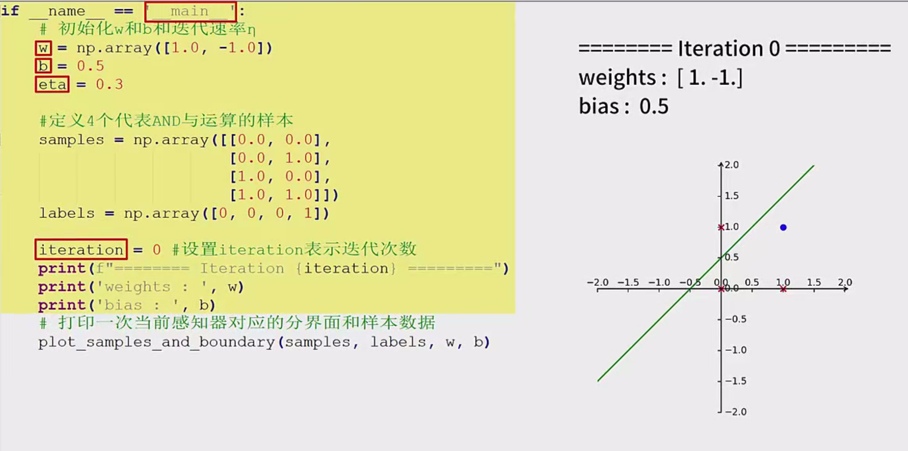

# 感知器算法入门笔记

## 感知器算法概述

感知器是一种最简单的线性分类模型，由Frank Rosenblatt在1957年提出。它通过学习权重（weights）和偏置（bias），将输入特征映射到输出类别。感知器算法通过迭代调整权重和偏置，以最小化分类错误。

### 感知器模型

- **输入层**：接收输入特征。
- **权重向量（w）**：每个输入特征对应一个权重。
- **偏置（b）**：用于调整决策边界的位置。
- **激活函数**：通常为阶跃函数，根据加权和决定输出类别。

### 感知器算法步骤

1. 初始化权重和偏置。
2. 对于每个训练样本：
   - 计算加权和。
   - 通过激活函数得到预测结果。
   - 如果预测错误，更新权重和偏置。
3. 重复步骤2，直到所有样本被正确分类或达到最大迭代次数。

## 程序设计步骤

### 1. 绘制数学坐标系

为了更清晰地观察样本点和感知器模型的分界线，我们将自定义绘制一个包含x轴和y轴的数学坐标系，而不是使用默认的Matplotlib坐标系。

**函数定义：`draw_clear_board(left, right, down, up)`**

- **参数说明**：
  - `left`：x轴左边界的最大刻度。
  - `right`：x轴右边界的最大刻度。
  - `down`：y轴下边界的最大刻度。
  - `up`：y轴上边界的最大刻度。

**实现步骤**：

1. 创建一个画布和坐标轴对象。
2. 将坐标轴添加到画布中，并设置坐标轴的厚度。
3. 隐藏原有的画布坐标轴。
4. 自定义x轴的显示样式：
   - 使用`new_float`函数创建新的悬浮坐标。
   - 设置x轴样式，包括末端箭头。
   - 设置x轴刻度方向向上（`set_direction('hop')`）。
   - 设置x轴显示范围为`left`到`right`。
5. 按同样的方式设置y轴的样式。
6. 绘制一个从-2到2的坐标系进行调试。

**示例代码**：
```python
import matplotlib.pyplot as plt

def draw_clear_board(left, right, down, up):
    fig, ax = plt.subplots()
    ax.set_xlim(left, right)
    ax.set_ylim(down, up)
    # 隐藏默认坐标轴
    ax.spines['top'].set_visible(False)
    ax.spines['right'].set_visible(False)
    # 设置x轴和y轴位置
    ax.spines['bottom'].set_position('zero')
    ax.spines['left'].set_position('zero')
    # 设置箭头
    ax.plot(right, 0, "k>")
    ax.plot(0, up, "k^")
    return fig, ax
```

### 2. 绘制样本点与感知器分界线

为了展示样本数据及其对应的感知器模型分界线，我们需要将样本点绘制在坐标系上，并根据感知器的参数`w`和`b`绘制分界线。

**函数定义：`plot_samples_and_boundary(samples, labels, w, b)`**

- **参数说明**：
  - `samples`：样本特征列表。
  - `labels`：样本标签列表。
  - `w`：感知器的权重向量。
  - `b`：感知器的偏置。

**实现步骤**：

1. 调用`draw_clear_board`绘制坐标系。
2. 遍历所有样本：
   - 如果样本标签为0，绘制红色叉号（×）。
   - 如果样本标签为1，绘制蓝色圆圈（○）。
3. 生成100个x坐标点，并根据感知器参数`w`和`b`计算对应的y坐标，形成分界线。
4. 使用`plt.plot`绘制分界线。

**示例代码**：
```python
def plot_samples_and_boundary(samples, labels, w, b):
    fig, ax = draw_clear_board(-2, 2, -2, 2)
    for sample, label in zip(samples, labels):
        if label == 0:
            ax.plot(sample[0], sample[1], 'rx')
        else:
            ax.plot(sample[0], sample[1], 'bo')
    # 生成分界线
    x_vals = np.linspace(-2, 2, 100)
    y_vals = -(w[0] * x_vals + b) / w[1]
    ax.plot(x_vals, y_vals, 'g-')
    plt.show()
```

### 3. 感知器预测函数

用于根据当前的权重和偏置对输入样本进行预测。

**函数定义：`predict(x, w, b)`**

- **参数说明**：
  - `x`：输入样本特征向量。
  - `w`：权重向量。
  - `b`：偏置。

**实现步骤**：

1. 计算加权和：`wx + b`。
2. 如果加权和大于0，返回1；否则返回0。

**示例代码**：
```python
def predict(x, w, b):
    activation = np.dot(w, x) + b
    return 1 if activation > 0 else 0
```

### 4. 感知器参数更新函数

用于在预测错误时调整权重和偏置，以减少分类错误。

**函数定义：`update(x, y, w, b, learning_rate)`**

- **参数说明**：
  - `x`：输入样本特征向量。
  - `y`：实际标签。
  - `w`：当前权重向量。
  - `b`：当前偏置。
  - `learning_rate`：学习率。

**实现步骤**：

1. 计算预测结果`o = predict(x, w, b)`。
2. 更新权重：`w = w + learning_rate * (y - o) * x`。
3. 更新偏置：`b = b + learning_rate * (y - o)`。
4. 返回更新后的`w`和`b`。

**示例代码**：
```python
def update(x, y, w, b, learning_rate):
    o = predict(x, w, b)
    w = w + learning_rate * (y - o) * x
    b = b + learning_rate * (y - o)
    return w, b
```

### 5. 主函数实现

负责整体流程的控制，包括初始化参数、迭代训练、绘制结果等。

**实现步骤**：

1. 初始化权重`w`和偏置`b`，设置学习率（如0.3）。
2. 定义用于AND运算的四个样本及其标签。
3. 在迭代开始前，打印初始感知器参数及对应的分界线。
4. 进入迭代循环：
   - 设置错误计数`errors = 0`。
   - 遍历所有样本：
     - 对每个样本进行预测。
     - 如果预测错误，调用`update`函数更新参数，并将`errors`加1。
   - 每轮迭代后，打印当前迭代次数、感知器参数及分界线。
   - 如果`errors`为0，说明所有样本已正确分类，退出循环。
5. 输出最终的权重`w`和偏置`b`。

**示例代码**：
```python
def main():
    # 初始化参数
    w = np.array([0.0, 0.0])
    b = 0.0
    learning_rate = 0.3
    # 定义AND运算的样本及标签
    samples = [np.array([0,0]), np.array([0,1]), np.array([1,0]), np.array([1,1])]
    labels = [0, 0, 0, 1]
    iteration = 0
    # 初始绘图
    print(f"迭代前: 权重={w}, 偏置={b}")
    plot_samples_and_boundary(samples, labels, w, b)
    # 迭代训练
    while True:
        errors = 0
        for x, y in zip(samples, labels):
            o = predict(x, w, b)
            if o != y:
                w, b = update(x, y, w, b, learning_rate)
                errors += 1
        iteration += 1
        print(f"迭代次数: {iteration}, 权重: {w}, 偏置: {b}")
        plot_samples_and_boundary(samples, labels, w, b)
        if errors == 0:
            break
    print(f"训练完成: 权重={w}, 偏置={b}")

if __name__ == "__main__":
    main()
```

## 实验结果与分析

运行程序后，经过多次迭代，感知器会逐步调整权重和偏置，使得样本点能够被正确分类。对于AND运算，由于四个样本是线性可分的，感知器最终会找到一条能够将正样本（1,1）与负样本（0,0）、（0,1）、（1,0）区分开的直线。

**示例输出**：
```
迭代前: 权重=[0. 0.], 偏置=0.0
...
迭代次数: 8, 权重: [0.3, 0.3], 偏置: -0.6
训练完成: 权重=[0.3, 0.3], 偏置=-0.6
```

**可视化效果**：

- 红色叉号表示负样本。
- 蓝色圆圈表示正样本。
- 绿色直线表示感知器的分界线。

通过图示，可以直观地看到感知器如何通过调整参数来实现对样本的正确分类。

## 线性可分与不可分情况

在本实验中，我们使用的四个样本代表了AND运算，这些样本是线性可分的，意味着存在一条直线可以将正负样本完全分开。因此，感知器算法能够在有限的迭代次数内找到合适的权重和偏置。

**线性不可分情况**：

如果样本是线性不可分的，例如XOR运算，其正负样本无法通过一条直线分开，感知器算法将无法收敛。这时，程序将会一直在迭代循环中，因为总会存在预测错误的样本。

**解决方法**：

- 引入非线性特征，通过核方法（如在支持向量机中）。
- 使用多层感知器（神经网络），引入隐藏层和非线性激活函数。

## 总结与展望

通过本次实验，我们深入了解了感知器算法的基本原理及其在简单逻辑运算中的应用。感知器作为一种基础的线性分类器，为后续更复杂的神经网络模型奠定了基础。

**关键学习点**：

- 感知器的结构与工作原理。
- 权重和偏置的迭代更新机制。
- 线性可分与不可分对感知器训练的影响。
- 可视化工具在理解模型中的重要性。

**未来展望**：

- 探索多层感知器和深度学习模型，处理更复杂的非线性问题。
- 学习其他分类算法，如支持向量机、决策树等，比较其优劣。
- 应用感知器算法于实际问题，如图像分类、文本分类等领域。

# 附录：完整代码

```python
import numpy as np
import matplotlib.pyplot as plt

def draw_clear_board(left, right, down, up):
    fig, ax = plt.subplots()
    ax.set_xlim(left, right)
    ax.set_ylim(down, up)
    # 隐藏默认坐标轴
    ax.spines['top'].set_visible(False)
    ax.spines['right'].set_visible(False)
    # 设置x轴和y轴的位置
    ax.spines['bottom'].set_position('zero')
    ax.spines['left'].set_position('zero')
    # 设置箭头
    ax.plot(right, 0, "k>")
    ax.plot(0, up, "k^")
    return fig, ax

def plot_samples_and_boundary(samples, labels, w, b):
    fig, ax = draw_clear_board(-2, 2, -2, 2)
    for sample, label in zip(samples, labels):
        if label == 0:
            ax.plot(sample[0], sample[1], 'rx')
        else:
            ax.plot(sample[0], sample[1], 'bo')
    # 生成分界线
    x_vals = np.linspace(-2, 2, 100)
    if w[1] != 0:
        y_vals = -(w[0] * x_vals + b) / w[1]
        ax.plot(x_vals, y_vals, 'g-')
    plt.show()

def predict(x, w, b):
    activation = np.dot(w, x) + b
    return 1 if activation > 0 else 0

def update(x, y, w, b, learning_rate):
    o = predict(x, w, b)
    w = w + learning_rate * (y - o) * x
    b = b + learning_rate * (y - o)
    return w, b

def main():
    # 初始化参数
    w = np.array([0.0, 0.0])
    b = 0.0
    learning_rate = 0.3
    # 定义AND运算的样本及标签
    samples = [np.array([0,0]), np.array([0,1]), np.array([1,0]), np.array([1,1])]
    labels = [0, 0, 0, 1]
    iteration = 0
    # 初始绘图
    print(f"迭代前: 权重={w}, 偏置={b}")
    plot_samples_and_boundary(samples, labels, w, b)
    # 迭代训练
    while True:
        errors = 0
        for x, y in zip(samples, labels):
            o = predict(x, w, b)
            if o != y:
                w, b = update(x, y, w, b, learning_rate)
                errors += 1
        iteration += 1
        print(f"迭代次数: {iteration}, 权重: {w}, 偏置: {b}")
        plot_samples_and_boundary(samples, labels, w, b)
        if errors == 0:
            break
    print(f"训练完成: 权重={w}, 偏置={b}")

if __name__ == "__main__":
    main()
```

