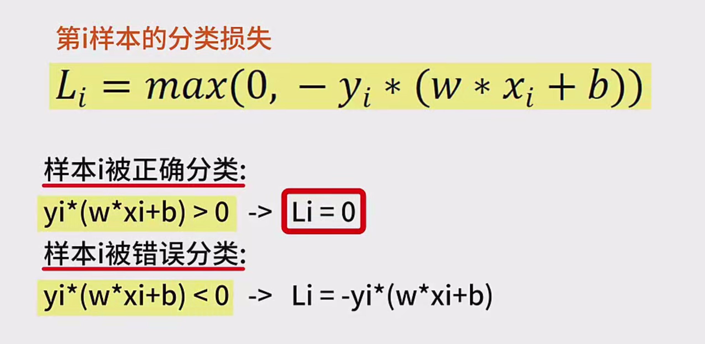

 

# 权重更新的数学原理

---

## 1. 感知器算法简介

感知器（Perceptron）是一种基础的线性分类算法，旨在通过学习将数据集中的样本分为两类。它是神经网络的雏形，广泛应用于二分类问题中。感知器算法通过不断调整权重，找到一个能够将不同类别样本分隔开的超平面。

---

## 2. 基本概念与定义

### 数据集与样本

- **数据集**：记作 $ T $，包含 $ m $ 个样本。
- **样本**：每个样本由特征向量 $ \mathbf{x}_i $ 和标记 $ y_i $ 组成，其中 $ i = 1, 2, \ldots, m $。

### 特征向量与标签

- **特征向量 $ \mathbf{x}_i $**：一个 $ N $ 维的实数向量，表示样本的特征。
- **标签 $ y_i $**：标记样本的类别，取值为 **正一（+1）** 或 **负一（-1）**。
  - **+1**：表示样本是正例。
  - **-1**：表示样本是负例。

### 超平面

- **超平面 $ s $**：在 $ N $ 维空间中的一个 $ (N-1) $ 维子空间，用于将不同类别的样本分开。
- **决策边界**：超平面 $ s $ 定义为 $ \mathbf{w} \cdot \mathbf{x} + b = 0 $，其中 $ \mathbf{w} $ 是权重向量，$ b $ 是偏置。

---

## 3. 感知器问题的定义

对于**线性可分问题**，我们希望在 $ N $ 维空间中找到一个超平面 $ s $，能够将所有正例和负例完全正确地划分到超平面的两侧。具体要求如下：

- **正例**：对于所有正例样本 $ (\mathbf{x}_i, y_i = +1) $，满足
  $
  \mathbf{w} \cdot \mathbf{x}_i + b > 0
  $
  
- **负例**：对于所有负例样本 $ (\mathbf{x}_i, y_i = -1) $，满足
  $
  \mathbf{w} \cdot \mathbf{x}_i + b < 0
  $

以上定义构成了**感知器问题**，即找到满足上述条件的权重向量 $ \mathbf{w} $ 和偏置 $ b $。

---

## 4. 感知器算法的目标函数

为了实现上述目标，我们需要定义一个**目标函数**，以便评估当前模型的性能并指导权重的更新。感知器算法的目标是最小化分类错误的损失。

### 标记表示

为了简化表示，我们将：

- 正例标记为 **+1**。
- 负例标记为 **-1**。

### 分类损失函数

对于第 $ i $ 个样本，定义其分类损失 $ l_i $ 如下：
$
l_i = \max(0, -y_i (\mathbf{w} \cdot \mathbf{x}_i + b))
$
- **解释**：
  - 如果样本被正确分类，即 $ y_i (\mathbf{w} \cdot \mathbf{x}_i + b) > 0 $，则 $ l_i = 0 $。
  - 如果样本被错误分类，即 $ y_i (\mathbf{w} \cdot \mathbf{x}_i + b) \leq 0 $，则 $ l_i = -y_i (\mathbf{w} \cdot \mathbf{x}_i + b) $。

### 整体损失函数

整体损失函数 $ L $ 是所有样本损失的累加：
$
L = \sum_{i=1}^{m} l_i = \sum_{i=1}^{m} \max(0, -y_i (\mathbf{w} \cdot \mathbf{x}_i + b))
$
- **目标**：最小化 $ L $，即尽量减少分类错误的样本数量。

---

## 5. 权重更新机制

感知器算法的核心在于如何根据分类结果调整权重 $ \mathbf{w} $ 和偏置 $ b $，以逐步逼近理想的决策边界。

### 关注错误分类的样本

- **正确分类的样本**：不会对权重和偏置产生影响。
- **错误分类的样本**：会驱动权重和偏置的更新。

### 权重更新规则

当某个样本 $ (\mathbf{x}_i, y_i) $ 被错误分类时，调整权重和偏置：

$
\mathbf{w} \leftarrow \mathbf{w} + \eta y_i \mathbf{x}_i
$
$
b \leftarrow b + \eta y_i
$

- **$ \eta $**：学习率，决定了每次更新的步长。

**更新逻辑**：

- 如果 $ y_i = +1 $ 且样本被错误分类为负例，增加 $ \mathbf{w} $ 以提高 $ \mathbf{w} \cdot \mathbf{x}_i + b $。
- 如果 $ y_i = -1 $ 且样本被错误分类为正例，减少 $ \mathbf{w} $ 以降低 $ \mathbf{w} \cdot \mathbf{x}_i + b $。

---

## 6. 梯度下降与权重更新

感知器算法可以被视为一种**随机梯度下降（Stochastic Gradient Descent, SGD）**方法，基于错误分类样本驱动权重更新。

### 损失函数的偏导数

为了应用梯度下降，我们需要计算损失函数 $ L $ 对 $ \mathbf{w} $ 和 $ b $ 的偏导数。

$
\frac{\partial L}{\partial \mathbf{w}} = -\sum_{i=1}^{m} y_i \mathbf{x}_i \cdot \mathbb{I}(y_i (\mathbf{w} \cdot \mathbf{x}_i + b) \leq 0)
$

$
\frac{\partial L}{\partial b} = -\sum_{i=1}^{m} y_i \cdot \mathbb{I}(y_i (\mathbf{w} \cdot \mathbf{x}_i + b) \leq 0)
$

- **$ \mathbb{I} $**：指示函数，当条件满足时取1，否则取0。

### 权重与偏置的更新

在每次迭代中，随机选择一个错误分类的样本 $ (\mathbf{x}_i, y_i) $，然后根据梯度下降法的原则更新权重和偏置：

$
\mathbf{w} \leftarrow \mathbf{w} - \eta \frac{\partial L}{\partial \mathbf{w}} = \mathbf{w} + \eta y_i \mathbf{x}_i
$

$
b \leftarrow b - \eta \frac{\partial L}{\partial b} = b + \eta y_i
$

- **解释**：
  - 当选择一个错误分类的样本时，梯度的方向指向需要调整的方向。
  - 更新规则与前述的权重更新规则一致。

### 更新规则的推导

感知器的权重更新规则与基于梯度下降法的推导结果一致。这表明感知器算法实质上是在执行一种特定形式的梯度下降，用于最小化分类错误的损失。

---

## 7. 感知器算法的特点与局限性

### 特点

- **简单高效**：算法实现简单，计算效率高，适用于大规模数据集。
- **在线学习**：可以逐个样本地更新权重，适合实时学习场景。
- **收敛性**：对于线性可分的数据集，感知器算法保证收敛，即在有限的步数内找到一个完美分隔的超平面。

### 局限性

- **非最优决策边界**：
  - 感知器算法只关注将错误分类的样本分类正确，而不关注分类边界与样本的距离。
  - 可能找到多个满足条件的超平面之一，而不一定是最佳的。
  
- **对数据排列敏感**：
  - 权重更新依赖于样本的输入顺序，不同的排列可能导致不同的决策边界。
  - 可能导致算法的不稳定性，尤其在样本顺序变化时。

- **线性可分性**：
  - 仅适用于线性可分的数据集，对于非线性可分的数据集，感知器算法无法保证找到一个完美的分隔超平面。

- **泛化能力**：
  - 感知器找到的决策边界不一定能很好地泛化到未见过的数据上。

---

## 8. 总结

感知器算法作为一种基础的线性分类器，通过不断调整权重和偏置，寻找能够将不同类别样本分隔开的超平面。其权重更新机制基于错误分类样本，采用类似梯度下降的方法进行优化。尽管感知器算法在处理线性可分问题时表现良好，但其在面对非线性数据和对最优决策边界的需求时存在局限性。

通过理解感知器算法的数学原理，初学者可以为深入学习更复杂的机器学习算法打下坚实的基础

