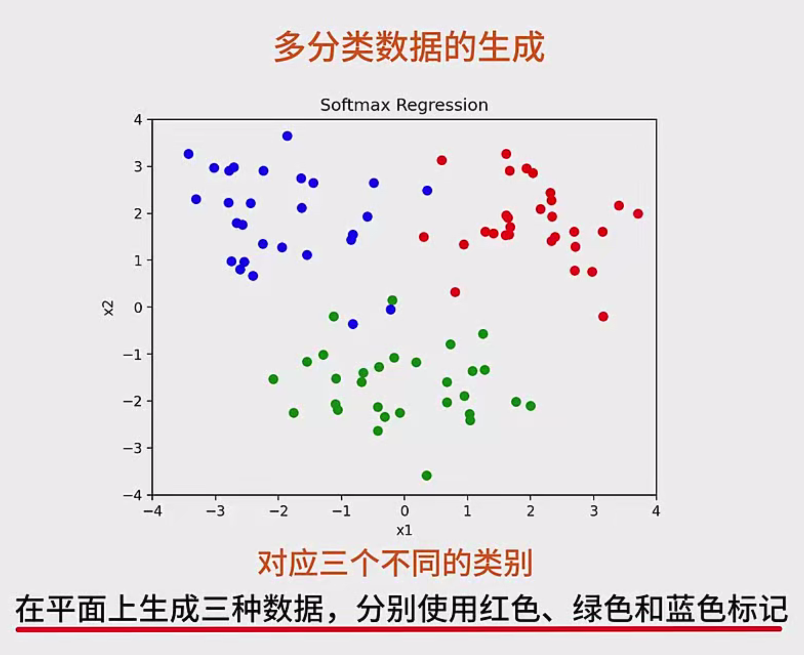
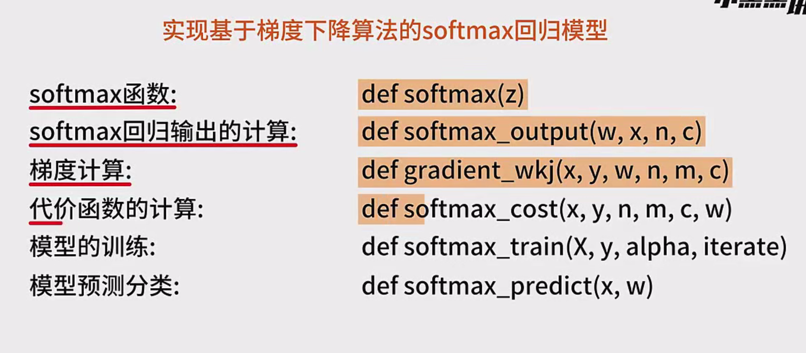

---

## 1. 实验概述

- **目的**  
  通过手动实现梯度下降算法和 Softmax 回归模型，掌握多分类问题的基本思想与实现流程。  
- **主要步骤**  
  1. **生成三类二维数据**（绿色、蓝色、红色）。  
  2. **实现 Softmax 回归所需的各个功能函数**：  
     - Softmax 函数  
     - 线性输出函数  
     - 梯度计算  
     - 代价函数（交叉熵）计算  
     - 模型训练（梯度下降迭代）  
     - 模型预测  
  3. **在训练完成后绘制决策边界**，可视化分类结果。

---

## 2. 多分类数据生成

### 2.1 数据分布

在二维平面上，我们希望分别生成三类数据点：
- **绿色**数据分布在中心 $(0, -2)$ 附近。
- **蓝色**数据分布在中心 $(-2, 2)$ 附近。
- **红色**数据分布在中心 $(2, 2)$ 附近。

每个类别的数据服从正态分布（高斯分布），并且都带有一定的随机性。

### 2.2 `make_data` 函数示例

```python
import numpy as np
import matplotlib.pyplot as plt

def make_data(n):
    # 生成绿色数据，以 (0, -2) 为中心
    green = np.random.randn(n, 2) + np.array([0, -2])
    # 生成蓝色数据，以 (-2, 2) 为中心
    blue = np.random.randn(n, 2) + np.array([-2, 2])
    # 生成红色数据，以 (2, 2) 为中心
    red = np.random.randn(n, 2) + np.array([2, 2])
    return green, blue, red

# 使用示例
n = 30  # 每个类别的数据数
green, blue, red = make_data(n)

# 可视化
plt.figure(figsize=(6, 6))
plt.scatter(green[:, 0], green[:, 1], color='g', label='Green')
plt.scatter(blue[:, 0], blue[:, 1], color='b', label='Blue')
plt.scatter(red[:, 0], red[:, 1], color='r', label='Red')
plt.xlim(-4, 4)
plt.ylim(-4, 4)
plt.legend()
plt.show()
```

---

## 3. Softmax 回归模型

Softmax 回归是一种常见的多分类模型。其核心步骤包括：

1. **线性变换**：  
   对每个类别 $k$，计算线性输出  
   $
   z_k = \mathbf{w}_k \cdot \mathbf{x} = w_{k0} + w_{k1} x_1 + \dots + w_{kn} x_n
   $  
   （其中 $\mathbf{x}$ 通常额外包含偏置项 1 以简化表示）

2. **Softmax 函数**：  
   将线性输出转化为概率分布：  
   $
   p_k = \frac{e^{z_k}}{\sum_{i=1}^{C} e^{z_i}}
   $

3. **代价函数（交叉熵损失）**：  
   对于真实类别 $y$ 和预测概率 $p$，交叉熵定义为：  
   $
   \text{Cost} = - \sum_{k=1}^{C} y_k \log(p_k)
   $  
   通常对所有样本取平均作为最终损失。

4. **梯度下降更新参数**：  
   不断计算梯度并更新参数 $\mathbf{w}$ ，直到收敛或达到设定的迭代次数。

下面介绍关键函数的实现思路。

---

### 3.1 Softmax 函数

由于指数运算容易导致数值溢出，一般先减去每个样本对应的最大值（`max_z`）再做指数运算：

```python
def softmax(z):
    """
    z: (C,) 维度的向量，表示对 C 个类别的线性输出
    返回: (C,) 维度的向量，表示每个类别的预测概率
    """
    # 减去最大值，避免数值溢出
    z_shift = z - np.max(z)  
    exp_z = np.exp(z_shift)
    return exp_z / np.sum(exp_z)
```

---

### 3.2 计算单个样本的 Softmax 输出

```python
def softmax_output(w, x, n, c):
    """
    w: (C, n) 维参数矩阵 (c 个类别, n 个特征)
    x: (n,)   维向量（包含偏置项）
    n: 特征总数
    c: 类别数
    返回: (C,) 对应 c 个类别的预测概率
    """
    z = np.zeros(c)
    # 计算每个类别的线性输出
    for k in range(c):
        z[k] = np.dot(w[k], x)
    return softmax(z)
```

> 注意：在使用时，通常需要先对训练数据 `X` 中每个样本增加一列或一维偏置项 1。

---

### 3.3 梯度计算（`gradient_w_kj`）

对交叉熵损失 $L$ 相对于权重 $w_{kj}$ 求偏导。在有 $C$ 个类别、$n$ 个特征、$m$ 个样本时，批量梯度可表示为：

$
\frac{\partial L}{\partial w_{kj}} = \frac{1}{m}\sum_{i=1}^{m}\Big( p_{k}^{(i)} - y_{k}^{(i)} \Big)x_j^{(i)}
$

实现方法：
1. 创建与 $w$ 相同维度的梯度矩阵 `gradient`，初始化为 0。
2. 对每个样本 $i$：
   - 计算该样本对每个类别的预测概率 $p$。
   - 对每个类别 $k$：累加 $(p_k^{(i)} - y_k^{(i)}) \cdot x_j^{(i)}$。
3. 最后对累加结果取平均（除以 $m$）。

```python
def gradient_w(w, X, Y, m, n, c):
    """
    w: (C, n) 参数矩阵
    X: (m, n) 样本特征矩阵 (每个样本含偏置项)
    Y: (m, C) 独热编码的标记矩阵 (one-hot)，m 个样本，每个样本 C 维
    m, n, c: 样本数、特征数、类别数
    返回: (C, n) 的梯度矩阵
    """
    grad = np.zeros((c, n))

    for i in range(m):
        # 计算第 i 个样本的预测概率
        p = softmax_output(w, X[i], n, c)
        # y_i: 第 i 个样本的真实标签 (C,)
        y_i = Y[i]

        # 累加梯度
        for k in range(c):
            for j in range(n):
                grad[k, j] += (p[k] - y_i[k]) * X[i, j]

    # 取平均
    grad /= m
    return grad
```

---

### 3.4 代价函数（`softmax_cost`）

使用交叉熵损失，对所有样本取平均值：

$
J = -\frac{1}{m}\sum_{i=1}^{m}\sum_{k=1}^{C} y_k^{(i)} \log\bigl(p_k^{(i)}\bigr)
$

```python
def softmax_cost(w, X, Y, m, n, c):
    """
    w: (C, n)
    X: (m, n)
    Y: (m, C)
    m, n, c: 样本数、特征数、类别数
    返回: 标量，表示平均交叉熵损失
    """
    total_cost = 0.0
    for i in range(m):
        p = softmax_output(w, X[i], n, c)
        # 仅当 y_i[k] == 1 时才累加 -log(p_k)
        cost_i = 0.0
        for k in range(c):
            if Y[i, k] == 1:
                cost_i += -np.log(p[k] + 1e-12)  # 避免 log(0)
        total_cost += cost_i
    return total_cost / m
```

---

### 3.5 模型训练（`softmax_train`）

在训练过程中，使用梯度下降方法不断更新参数 $w$。  
更新公式：  
$
w_{kj} := w_{kj} - \alpha \cdot \frac{\partial L}{\partial w_{kj}}
$

```python
def softmax_train(X, Y, alpha, iters):
    """
    X: (m, n) 训练样本
    Y: (m, c) 独热编码标签
    alpha: 学习率
    iters: 迭代次数
    返回: 训练好的参数 w
    """
    m, n = X.shape         # m 个样本, n 个特征(含偏置)
    c = Y.shape[1]         # c 个类别

    # 初始化参数 w
    w = np.zeros((c, n))

    for i in range(iters):
        # 计算梯度
        grad = gradient_w(w, X, Y, m, n, c)
        # 参数更新
        w -= alpha * grad

        # 每迭代 100 次打印一下损失
        if (i+1) % 100 == 0:
            cost_val = softmax_cost(w, X, Y, m, n, c)
            print(f"Iteration {i+1}, Cost = {cost_val:.4f}")

    return w
```

---

### 3.6 模型预测（`softmax_predict`）

在预测时，输入特征向量（同样含偏置 1），计算各类别概率 `p`，然后选择最大概率对应的类别作为预测类别。

```python
def softmax_predict(w, x):
    """
    w: (C, n) 参数矩阵
    x: (n,)   单个样本特征 (含偏置)
    返回: 整数，预测类别 k
    """
    # 计算各类别概率
    c, n = w.shape
    z = np.zeros(c)
    for k in range(c):
        z[k] = np.dot(w[k], x)
    p = softmax(z)

    # 返回最大概率的类别索引
    return np.argmax(p)
```

---

## 4. 训练与可视化决策边界

### 4.1 数据拼接与独热编码

1. 将绿色、蓝色、红色三类数据合并得到 `X`。  
2. 为每个样本添加一列偏置项 1。  
3. 构造独热编码标签矩阵 `Y`，例如：  
   - Green 类别 $\rightarrow (1, 0, 0)$  
   - Blue 类别 $\rightarrow (0, 1, 0)$  
   - Red 类别 $\rightarrow (0, 0, 1)$  

```python
# 假设 green, blue, red 均为 (n, 2) 维
X_all = np.vstack([green, blue, red])           # (3n, 2)
m_all = X_all.shape[0]

# 添加偏置项
X_bias = np.hstack([np.ones((m_all, 1)), X_all])  # (3n, 3)

# 构造标签 Y
# green -> 0, blue -> 1, red -> 2
y_labels = np.array([0]*n + [1]*n + [2]*n)
Y_onehot = np.zeros((m_all, 3))
for i, label in enumerate(y_labels):
    Y_onehot[i, label] = 1
```

---

### 4.2 训练模型

```python
alpha = 0.01    # 学习率
iters = 1000    # 迭代次数
w_trained = softmax_train(X_bias, Y_onehot, alpha, iters)
```

---

### 4.3 绘制决策边界

为了更好地展示分类效果，需要在平面上对一系列点进行预测并上色，或者画出不同分类之间的边界。

常见方法：  
1. 生成一个网格坐标范围，比如 x 从 -4 到 4， y 从 -4 到 4。  
2. 对网格中的每个坐标点拼上偏置项 1 后，调用 `softmax_predict`。  
3. 根据预测结果标记对应颜色。  
4. 在图中显示样本点及分类边界（即不同预测类别的分界线）。

```python
def draw_decision_boundary(w, x_min=-4, x_max=4, y_min=-4, y_max=4, step=0.05):
    xx, yy = np.meshgrid(
        np.arange(x_min, x_max, step),
        np.arange(y_min, y_max, step)
    )
    grid_points = np.c_[xx.ravel(), yy.ravel()]
    
    # 加偏置 1
    grid_points_bias = np.hstack([np.ones((grid_points.shape[0], 1)), grid_points])
    
    # 对网格中每个点进行预测
    Z = []
    for i in range(grid_points_bias.shape[0]):
        pred_label = softmax_predict(w, grid_points_bias[i])
        Z.append(pred_label)
    Z = np.array(Z).reshape(xx.shape)

    # 绘制等高线或直接使用 plt.contourf
    plt.contourf(xx, yy, Z, cmap=plt.cm.Spectral, alpha=0.5)

# 可视化决策边界 + 训练样本
plt.figure(figsize=(6, 6))
draw_decision_boundary(w_trained)
plt.scatter(green[:, 0], green[:, 1], color='g', label='Green')
plt.scatter(blue[:, 0], blue[:, 1], color='b', label='Blue')
plt.scatter(red[:, 0], red[:, 1], color='r', label='Red')
plt.xlim(-4, 4)
plt.ylim(-4, 4)
plt.legend()
plt.show()
```


# 完整代码

```python
import numpy as np
import matplotlib.pyplot as plt

# ========== 1. 生成数据 ==========

def make_data(n):
    """
    生成三类二维数据：
    - 绿色数据：中心 (0, -2)
    - 蓝色数据：中心 (-2, 2)
    - 红色数据：中心 (2, 2)
    每类数据个数为 n。
    """
    green = np.random.randn(n, 2) + np.array([0, -2])
    blue  = np.random.randn(n, 2) + np.array([-2, 2])
    red   = np.random.randn(n, 2) + np.array([2, 2])
    return green, blue, red

# ========== 2. Softmax 相关函数 ==========

def softmax(z):
    """
    对向量 z (长度 C) 应用 Softmax，返回 (C,) 的概率向量。
    通过减去最大值来避免数值溢出。
    """
    z_shift = z - np.max(z)
    exp_z = np.exp(z_shift)
    return exp_z / np.sum(exp_z)

def softmax_output(w, x, n, c):
    """
    计算单个样本 x 对 c 个类别的预测概率。
    w: (C, n) 参数矩阵
    x: (n,)   单个样本特征(含偏置)
    n: 特征总数（含偏置）
    c: 类别数
    返回: (C,) 预测概率向量
    """
    z = np.zeros(c)
    for k in range(c):
        z[k] = np.dot(w[k], x)
    return softmax(z)

def gradient_w(w, X, Y, m, n, c):
    """
    计算所有样本在当前参数 w 下的梯度 (C, n)。
    X: (m, n) 样本特征矩阵 (含偏置)
    Y: (m, C) One-hot 标签
    m, n, c: 样本数, 特征数(含偏置), 类别数
    返回: (C, n) 的梯度矩阵
    """
    grad = np.zeros((c, n))

    for i in range(m):
        p = softmax_output(w, X[i], n, c)  # (C,)
        y_i = Y[i]                         # (C,)
        for k in range(c):
            for j in range(n):
                grad[k, j] += (p[k] - y_i[k]) * X[i, j]

    return grad / m

def softmax_cost(w, X, Y, m, n, c):
    """
    计算当前参数 w 下的平均交叉熵损失。
    X: (m, n)
    Y: (m, C)
    w: (C, n)
    """
    total_cost = 0.0
    for i in range(m):
        p = softmax_output(w, X[i], n, c)
        for k in range(c):
            if Y[i, k] == 1:
                # 加一个小量，防止 log(0)
                total_cost += -np.log(p[k] + 1e-12)
    return total_cost / m

def softmax_train(X, Y, alpha, iters):
    """
    使用梯度下降训练 Softmax 回归模型。
    X: (m, n) 训练样本 (含偏置)
    Y: (m, c) One-hot 标签
    alpha: 学习率
    iters: 迭代次数
    返回: 训练好的参数 w
    """
    m, n = X.shape        # m 个样本, n 个特征(含偏置)
    c = Y.shape[1]        # c 个类别
    w = np.zeros((c, n))  # (C, n)

    for i in range(iters):
        grad = gradient_w(w, X, Y, m, n, c)
        w -= alpha * grad

        # 每迭代100次打印一次当前损失
        if (i+1) % 100 == 0:
            cost_val = softmax_cost(w, X, Y, m, n, c)
            print(f"Iteration {i+1}, Cost = {cost_val:.4f}")

    return w

def softmax_predict(w, x):
    """
    对单个样本 x 进行预测，返回类别索引。
    w: (C, n)
    x: (n,) 含偏置
    """
    c, n = w.shape
    z = np.zeros(c)
    for k in range(c):
        z[k] = np.dot(w[k], x)
    p = softmax(z)
    return np.argmax(p)

# ========== 3. 绘制决策边界 ==========

def draw_decision_boundary(w, x_min=-4, x_max=4, y_min=-4, y_max=4, step=0.05):
    """
    绘制决策边界。
    w: 训练好的参数 (C, n)
    (x_min, x_max, y_min, y_max): 网格范围
    step: 网格步长 (越小越精细，计算量也越大)
    """
    xx, yy = np.meshgrid(
        np.arange(x_min, x_max, step),
        np.arange(y_min, y_max, step)
    )
    # 拼合网格点
    grid_points = np.c_[xx.ravel(), yy.ravel()]
    # 加偏置
    grid_points_bias = np.hstack([np.ones((grid_points.shape[0], 1)), grid_points])

    # 对每个网格点预测
    Z = []
    for i in range(grid_points_bias.shape[0]):
        pred_label = softmax_predict(w, grid_points_bias[i])
        Z.append(pred_label)
    Z = np.array(Z).reshape(xx.shape)

    # 使用 contourf 进行填充
    plt.contourf(xx, yy, Z, cmap=plt.cm.Spectral, alpha=0.5)

# ========== 4. 主流程演示 ==========

if __name__ == "__main__":
    # 4.1 生成数据
    n = 30
    green, blue, red = make_data(n)

    # 4.2 可视化原始数据点
    plt.figure(figsize=(6, 6))
    plt.scatter(green[:, 0], green[:, 1], color='g', label='Green')
    plt.scatter(blue[:, 0], blue[:, 1], color='b', label='Blue')
    plt.scatter(red[:, 0], red[:, 1], color='r', label='Red')
    plt.xlim(-4, 4)
    plt.ylim(-4, 4)
    plt.legend()
    plt.title("Original 2D Data")
    plt.show()

    # 4.3 构建训练数据与标签
    X_all = np.vstack([green, blue, red])         # (3n, 2)
    m_all = X_all.shape[0]
    # 添加偏置列
    X_bias = np.hstack([np.ones((m_all, 1)), X_all])  # (3n, 3)

    # 构造独热编码标签
    # green -> 0, blue -> 1, red -> 2
    y_labels = np.array([0]*n + [1]*n + [2]*n)
    c = 3  # 类别数
    Y_onehot = np.zeros((m_all, c))
    for i, label in enumerate(y_labels):
        Y_onehot[i, label] = 1

    # 4.4 使用 Softmax 回归训练
    alpha = 0.01   # 学习率
    iters = 1000   # 迭代次数
    w_trained = softmax_train(X_bias, Y_onehot, alpha, iters)

    # 4.5 绘制决策边界 + 数据点
    plt.figure(figsize=(6, 6))
    draw_decision_boundary(w_trained)
    # 再绘制原始数据
    plt.scatter(green[:, 0], green[:, 1], color='g', label='Green')
    plt.scatter(blue[:, 0], blue[:, 1], color='b', label='Blue')
    plt.scatter(red[:, 0], red[:, 1], color='r', label='Red')
    plt.xlim(-4, 4)
    plt.ylim(-4, 4)
    plt.legend()
    plt.title("Softmax Decision Boundary")
    plt.show()

```

