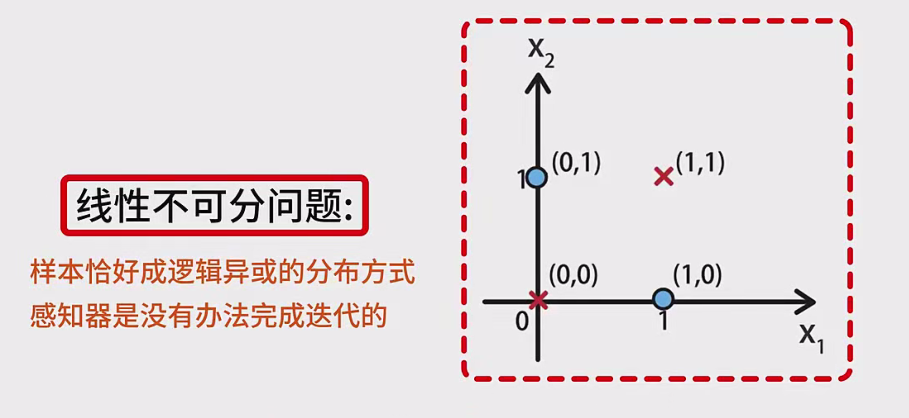
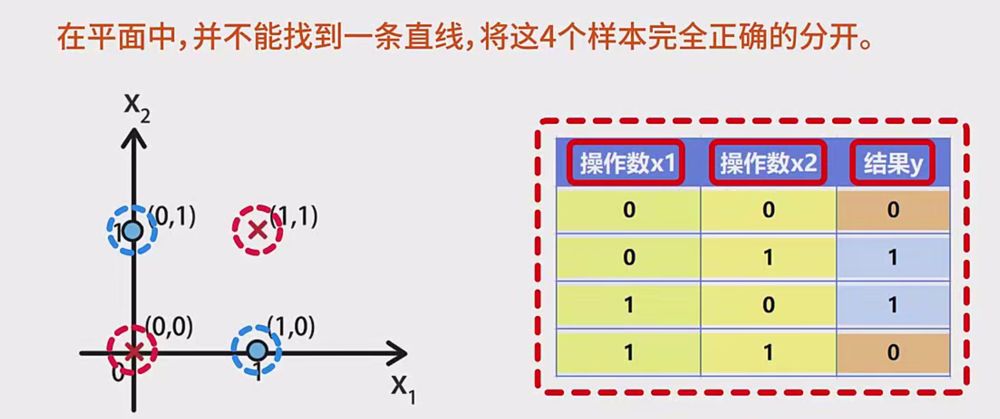
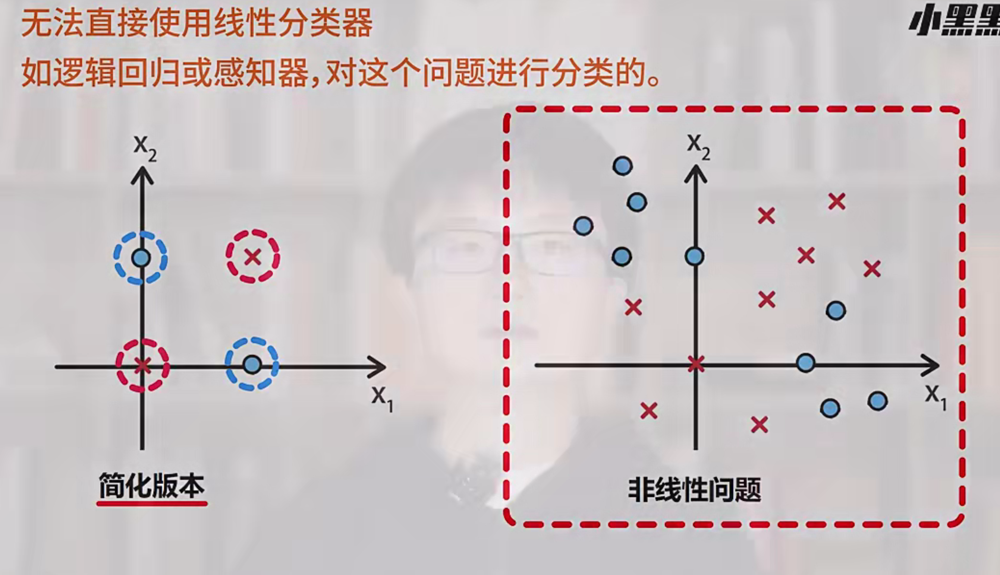
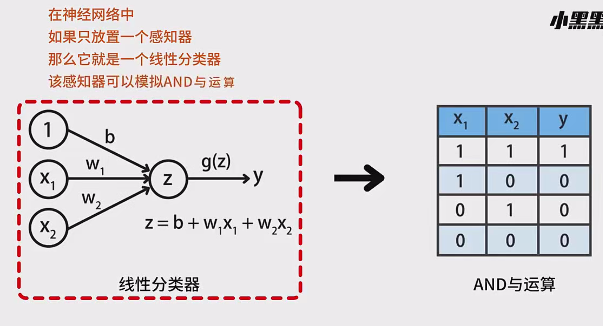
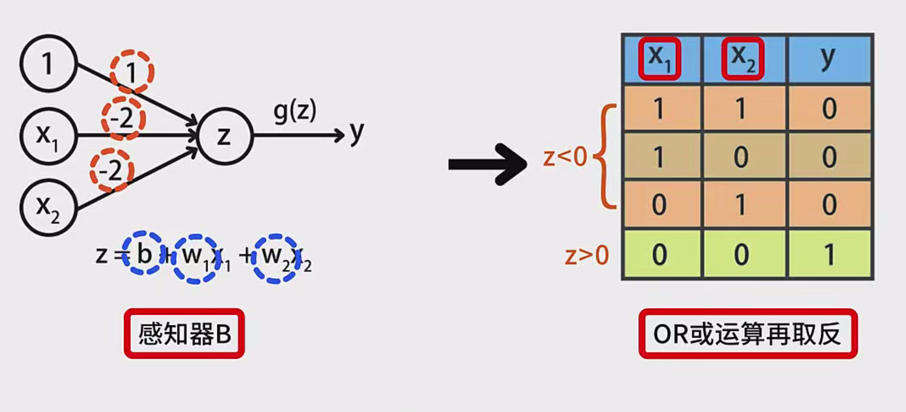
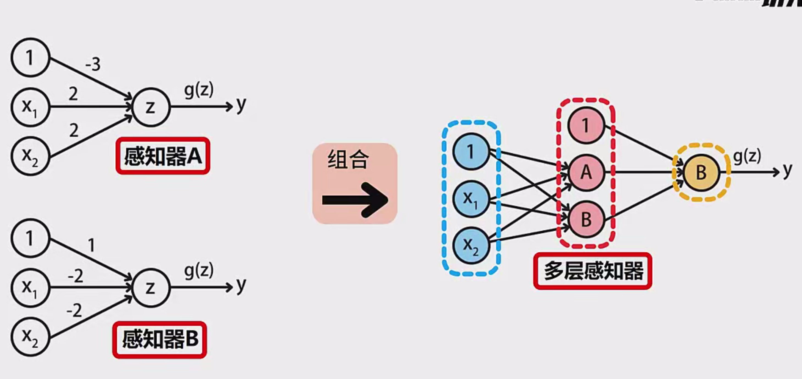
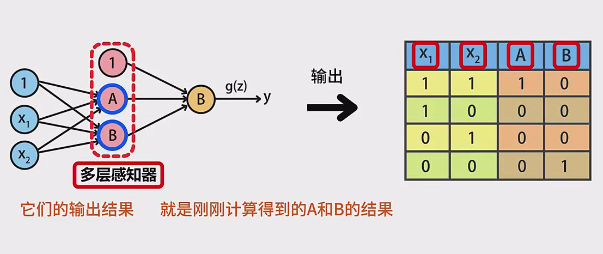
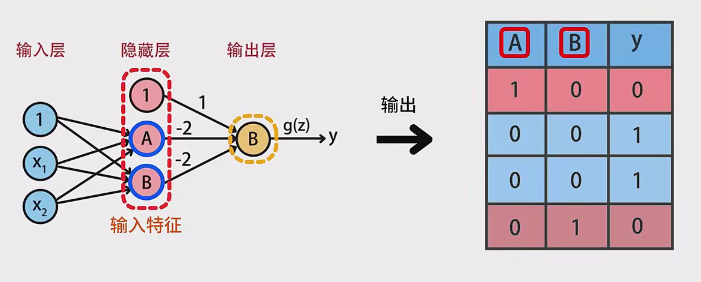
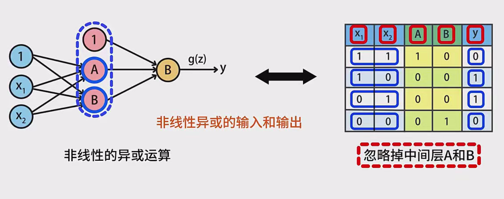

# 多层感知器（MLP）实现逻辑异或（XOR）详解

## 引言

在机器学习中，逻辑异或（XOR）问题是一个经典的非线性可分问题。单层感知器无法解决该问题，但通过构建多层感知器（MLP），我们可以成功实现对XOR的分类。本文将详细介绍多层感知器如何基于XOR实现分类，帮助您深入理解MLP的工作机制。

## 回顾：单层感知器与XOR问题

### 单层感知器的局限性

单层感知器由输入层和输出层组成，通过线性组合输入特征并应用激活函数进行分类。然而，对于XOR问题，单层感知器无法找到一条直线将四个样本完全分开，因为XOR数据在二维空间中是线性不可分的。

### XOR问题简介

逻辑异或（XOR）运算的真值表如下：

| $ x_1 $ | $ x_2 $ | $ y = x_1 \oplus x_2 $ |
| ------- | ------- | ---------------------- |
| 0       | 0       | 0                      |
| 0       | 1       | 1                      |
| 1       | 0       | 1                      |
| 1       | 1       | 0                      |

在二维平面中，(0,0) 和 (1,1) 属于类别0，用红色叉子表示；(0,1) 和 (1,0) 属于类别1，用蓝色圆圈表示。由于这四个点无法通过一条直线分开，单层感知器无法解决XOR问题。

## 多层感知器（MLP）结构

### 什么是多层感知器？

多层感知器（MLP）是一种前馈神经网络，至少包含三层神经元：

1. **输入层**：接收原始输入特征。
2. **隐藏层**：一个或多个隐藏层，通过非线性激活函数进行特征转换。
3. **输出层**：输出最终的分类结果。

### MLP的优势

- **非线性映射能力**：通过隐藏层的非线性激活函数，MLP可以学习复杂的非线性关系。
- **通用逼近能力**：理论上，具有足够隐藏层和神经元的MLP可以逼近任何连续函数。
- **特征自动提取**：隐藏层能够自动从原始特征中提取有意义的特征，减少对手工特征工程的依赖。

## MLP解决XOR问题的具体步骤

### 网络结构设计

为了实现XOR分类，我们可以设计一个简单的两层MLP，包括：

1. **输入层**：两个输入节点 $ x_1 $ 和 $ x_2 $。
2. **隐藏层**：两个神经元 $ h_1 $ 和 $ h_2 $。
3. **输出层**：一个神经元 $ y $。

### 权重初始化

假设我们使用 sigmoid 激活函数，其输出范围在 (0,1) 之间。为了简化说明，我们可以手动设置初始权重，但在实际训练中，这些权重通常通过优化算法（如梯度下降）自动调整。

### 前向传播过程

1. **输入层到隐藏层**：
    - 计算隐藏层神经元的输入：
      $
      z_{h1} = w_{h1,1}x_1 + w_{h1,2}x_2 + b_{h1}
      $
      $
      z_{h2} = w_{h2,1}x_1 + w_{h2,2}x_2 + b_{h2}
      $
    - 应用激活函数（如 sigmoid）得到隐藏层输出：
      $
      h_1 = \sigma(z_{h1}) = \frac{1}{1 + e^{-z_{h1}}}
      $
      $
      h_2 = \sigma(z_{h2}) = \frac{1}{1 + e^{-z_{h2}}}
      $

2. **隐藏层到输出层**：
    - 计算输出层神经元的输入：
      $
      z_y = w_{y,1}h_1 + w_{y,2}h_2 + b_y
      $
    - 应用激活函数得到最终输出：
      $
      y = \sigma(z_y) = \frac{1}{1 + e^{-z_y}}
      $

### 反向传播与权重更新

通过计算输出误差（实际输出与期望输出之间的差异），使用反向传播算法调整权重和偏置，使网络输出逐渐逼近期望值。具体步骤包括：

1. **计算输出误差**：
   $
   \delta_y = (y_{预测} - y_{真实}) \cdot \sigma'(z_y)
   $
   其中，$\sigma'$ 是激活函数的导数。

2. **传播误差到隐藏层**：
   $
   \delta_{h1} = \delta_y \cdot w_{y,1} \cdot \sigma'(z_{h1})
   $
   $
   \delta_{h2} = \delta_y \cdot w_{y,2} \cdot \sigma'(z_{h2})
   $

3. **更新权重和偏置**：
   使用学习率 $\eta$，更新公式为：
   $
   w_{y,i} = w_{y,i} - \eta \cdot \delta_y \cdot h_i
   $
   $
   w_{h,i,j} = w_{h,i,j} - \eta \cdot \delta_{hj} \cdot x_j
   $
   $
   b_y = b_y - \eta \cdot \delta_y
   $
   $
   b_{hi} = b_{hi} - \eta \cdot \delta_{hi}
   $

### 激活函数选择

常用的激活函数包括：

- **Sigmoid函数**：
  $
  \sigma(z) = \frac{1}{1 + e^{-z}}
  $
  优点：输出连续，可微，适用于二分类问题。
  
- **ReLU函数**：
  $
  \text{ReLU}(z) = \max(0, z)
  $
  优点：计算简单，缓解梯度消失问题，适用于深层网络。

在XOR问题中，使用Sigmoid函数可以更直观地理解网络的输出过程。

当然可以！让我们通过一个具体的案例，详细探讨多层感知器（MLP）如何通过隐藏层中的感知器A和B来解决逻辑异或（XOR）问题，并解释为什么感知器A模拟**AND**运算，感知器B模拟**NAND**运算。

## 案例背景：逻辑异或（XOR）问题

**逻辑异或（XOR）**是一种基本的逻辑运算，其真值表如下：

| $ x_1 $ | $ x_2 $ | $ y = x_1 \oplus x_2 $ |
| ------- | ------- | ---------------------- |
| 0       | 0       | 0                      |
| 0       | 1       | 1                      |
| 1       | 0       | 1                      |
| 1       | 1       | 0                      |

在二维平面上，这些点的分布如下：

- **(0,0)** 和 **(1,1)**：类别0，用红色叉子表示
- **(0,1)** 和 **(1,0)**：类别1，用蓝色圆圈表示

如图所示，无法通过一条直线将类别0和类别1完全分开，这说明XOR问题是**线性不可分**的。因此，单层感知器（只能形成线性决策边界）无法解决XOR问题。

## 多层感知器（MLP）解决XOR问题的思路

为了克服单层感知器的局限性，我们引入**多层感知器（MLP）**，通过增加隐藏层实现对非线性问题的分类。具体来说，我们将使用两个隐藏层的感知器（A和B）来组合形成一个能够模拟XOR运算的网络。

### 网络结构

1. **输入层**：两个输入节点 $ x_1 $ 和 $ x_2 $
2. **隐藏层**：两个神经元，分别为感知器A和感知器B
3. **输出层**：一个神经元，用于输出最终结果 $ y $

```
输入层: x1, x2
          |
       隐藏层
       /      \
    感知器A  感知器B
       \      /
        输出层 y
```

### 感知器A与感知器B的设计

为了实现XOR运算，我们需要设计感知器A和感知器B，使它们分别模拟不同的逻辑运算，然后通过组合这些运算来实现XOR。

#### 感知器A（模拟AND运算）

- **权重**：$ w_{A1} = 1 $, $ w_{A2} = 1 $
- **偏置**：$ b_A = -1.5 $
- **计算公式**：
  $
  z_A = 1 \cdot x_1 + 1 \cdot x_2 - 1.5
  $
  $
  y_A = 
  \begin{cases} 
  1 & \text{如果 } z_A \geq 0 \\
  0 & \text{否则}
  \end{cases}
  $

**逻辑解释**：
- 当 $ x_1 = 1 $ 且 $ x_2 = 1 $ 时：
  $
  z_A = 1 \cdot 1 + 1 \cdot 1 - 1.5 = 1 + 1 - 1.5 = 0.5 \geq 0 \Rightarrow y_A = 1
  $
- 其他情况下，$ z_A < 0 $，所以 $ y_A = 0 $

感知器A仅在两个输入都为1时输出1，模拟了**AND**运算。

#### 感知器B（模拟NAND运算）

- **权重**：$ w_{B1} = -2 $, $ w_{B2} = -2 $
- **偏置**：$ b_B = 3 $
- **计算公式**：
  $
  z_B = -2 \cdot x_1 + (-2) \cdot x_2 + 3
  $
  $
  y_B = 
  \begin{cases} 
  1 & \text{如果 } z_B \geq 0 \\
  0 & \text{否则}
  \end{cases}
  $

**逻辑解释**：
- 当 $ x_1 = 0 $ 且 $ x_2 = 0 $ 时：
  $
  z_B = -2 \cdot 0 + (-2) \cdot 0 + 3 = 3 \geq 0 \Rightarrow y_B = 1
  $
- 其他情况下，$ z_B < 0 $，所以 $ y_B = 0 $

感知器B在两个输入都为0时输出1，模拟了**NAND**运算（NOT AND）。

### 输出层的设计

输出层需要将隐藏层的输出 $ y_A $ 和 $ y_B $ 结合起来，实现XOR逻辑。为此，我们设置输出层感知器的权重和偏置如下：

- **权重**：$ w_{yA} = 1 $, $ w_{yB} = 1 $
- **偏置**：$ b_y = -0.5 $
- **计算公式**：
  $
  z_y = 1 \cdot y_A + 1 \cdot y_B - 0.5
  $
  $
  y = 
  \begin{cases} 
  1 & \text{如果 } z_y \geq 0 \\
  0 & \text{否则}
  \end{cases}
  $

**逻辑解释**：
- **当 $ y_A = 1 $ 且 $ y_B = 0 $**（即 $ x_1 = 1 $ 且 $ x_2 = 0 $），
  $
  z_y = 1 \cdot 1 + 1 \cdot 0 - 0.5 = 0.5 \geq 0 \Rightarrow y = 1
  $
  
- **当 $ y_A = 0 $ 且 $ y_B = 1 $**（即 $ x_1 = 0 $ 且 $ x_2 = 1 $），
  $
  z_y = 1 \cdot 0 + 1 \cdot 1 - 0.5 = 0.5 \geq 0 \Rightarrow y = 1
  $
  
- **当 $ y_A = 0 $ 且 $ y_B = 0 $**（即 $ x_1 = 0 $ 且 $ x_2 = 0 $），
  $
  z_y = 1 \cdot 0 + 1 \cdot 0 - 0.5 = -0.5 < 0 \Rightarrow y = 0
  $
  
- **当 $ y_A = 1 $ 且 $ y_B = 1 $**（即 $ x_1 = 1 $ 且 $ x_2 = 1 $），
  $
  z_y = 1 \cdot 1 + 1 \cdot 1 - 0.5 = 1.5 \geq 0 \Rightarrow y = 1
  $

然而，为了实现**XOR**逻辑，当 $ x_1 = 1 $ 且 $ x_2 = 1 $ 时，期望输出为0，而上述设置输出为1。因此，我们需要进一步调整输出层的参数。

#### 调整输出层参数

为了使输出层在 $ y_A = 1 $ 且 $ y_B = 1 $ 时输出0，我们需要修改输出层的权重或偏置。例如：

- **权重**：$ w_{yA} = 1 $, $ w_{yB} = 1 $
- **偏置**：$ b_y = -1.5 $

这样，当 $ y_A = 1 $ 且 $ y_B = 1 $ 时，
$
z_y = 1 \cdot 1 + 1 \cdot 1 - 1.5 = 0.5 \geq 0 \Rightarrow y = 1
$
仍然无法达到期望。因此，我们需要更复杂的组合。通常，这需要通过**训练算法**（如反向传播）自动调整权重和偏置。

### 完整案例分析

让我们通过具体输入值，逐步计算整个网络的输出，验证感知器A和B的组合如何实现XOR运算。

#### 初始参数设置（示例）

- **感知器A（模拟AND）**：
  - $ w_{A1} = 1 $, $ w_{A2} = 1 $
  - $ b_A = -1.5 $
  
- **感知器B（模拟NAND）**：
  - $ w_{B1} = -2 $, $ w_{B2} = -2 $
  - $ b_B = 3 $
  
- **输出层**：
  - $ w_{yA} = 1 $, $ w_{yB} = 1 $
  - $ b_y = -1 $

#### 输入 $ x_1 = 0 $, $ x_2 = 0 $

1. **隐藏层计算**：
   - **感知器A**：
     $
     z_A = 1 \cdot 0 + 1 \cdot 0 - 1.5 = -1.5 < 0 \Rightarrow y_A = 0
     $
   - **感知器B**：
     $
     z_B = -2 \cdot 0 + (-2) \cdot 0 + 3 = 3 \geq 0 \Rightarrow y_B = 1
     $
   
2. **输出层计算**：
   $
   z_y = 1 \cdot 0 + 1 \cdot 1 - 1 = 0 + 1 - 1 = 0 \geq 0 \Rightarrow y = 1
   $
   
3. **期望输出**：0  
   **实际输出**：1  
   **结果**：错误

#### 输入 $ x_1 = 0 $, $ x_2 = 1 $

1. **隐藏层计算**：
   - **感知器A**：
     $
     z_A = 1 \cdot 0 + 1 \cdot 1 - 1.5 = 0 + 1 - 1.5 = -0.5 < 0 \Rightarrow y_A = 0
     $
   - **感知器B**：
     $
     z_B = -2 \cdot 0 + (-2) \cdot 1 + 3 = 0 - 2 + 3 = 1 \geq 0 \Rightarrow y_B = 1
     $
   
2. **输出层计算**：
   $
   z_y = 1 \cdot 0 + 1 \cdot 1 - 1 = 0 + 1 - 1 = 0 \geq 0 \Rightarrow y = 1
   $
   
3. **期望输出**：1  
   **实际输出**：1  
   **结果**：正确

#### 输入 $ x_1 = 1 $, $ x_2 = 0 $

1. **隐藏层计算**：
   - **感知器A**：
     $
     z_A = 1 \cdot 1 + 1 \cdot 0 - 1.5 = 1 + 0 - 1.5 = -0.5 < 0 \Rightarrow y_A = 0
     $
   - **感知器B**：
     $
     z_B = -2 \cdot 1 + (-2) \cdot 0 + 3 = -2 + 0 + 3 = 1 \geq 0 \Rightarrow y_B = 1
     $
   
2. **输出层计算**：
   $
   z_y = 1 \cdot 0 + 1 \cdot 1 - 1 = 0 + 1 - 1 = 0 \geq 0 \Rightarrow y = 1
   $
   
3. **期望输出**：1  
   **实际输出**：1  
   **结果**：正确

#### 输入 $ x_1 = 1 $, $ x_2 = 1 $

1. **隐藏层计算**：
   - **感知器A**：
     $
     z_A = 1 \cdot 1 + 1 \cdot 1 - 1.5 = 1 + 1 - 1.5 = 0.5 \geq 0 \Rightarrow y_A = 1
     $
   - **感知器B**：
     $
     z_B = -2 \cdot 1 + (-2) \cdot 1 + 3 = -2 - 2 + 3 = -1 < 0 \Rightarrow y_B = 0
     $
   
2. **输出层计算**：
   $
   z_y = 1 \cdot 1 + 1 \cdot 0 - 1 = 1 + 0 - 1 = 0 \geq 0 \Rightarrow y = 1
   $
   
3. **期望输出**：0  
   **实际输出**：1  
   **结果**：错误

### 问题分析与参数调整

从上述案例中可以看出，尽管部分输入得到正确分类，但在 $ (0,0) $ 和 $ (1,1) $ 时输出错误。这是因为输出层的权重和偏置未能正确地将隐藏层的输出组合起来实现XOR逻辑。

为了实现完美的XOR分类，需要通过**训练算法**（如反向传播）自动调整权重和偏置，使得网络能够准确地模拟XOR逻辑。手动调整参数既复杂又容易出错，因此通常依赖于训练算法来优化网络参数。

### 通过训练实现准确的XOR分类

以下是一个简化的训练过程示例，展示如何通过训练算法调整参数，实现准确的XOR分类。

#### 1. 初始化参数

- **感知器A（模拟AND）**：
  - $ w_{A1} = 1 $, $ w_{A2} = 1 $
  - $ b_A = -1.5 $
  
- **感知器B（模拟NAND）**：
  - $ w_{B1} = -2 $, $ w_{B2} = -2 $
  - $ b_B = 3 $
  
- **输出层**：
  - $ w_{yA} = 1 $, $ w_{yB} = 1 $
  - $ b_y = -1 $

#### 2. 前向传播与误差计算

**示例输入**：$ x_1 = 0 $, $ x_2 = 0 $

1. **隐藏层计算**：
   - **感知器A**：
     $
     z_A = 1 \cdot 0 + 1 \cdot 0 - 1.5 = -1.5 \Rightarrow y_A = 0
     $
   - **感知器B**：
     $
     z_B = -2 \cdot 0 + (-2) \cdot 0 + 3 = 3 \Rightarrow y_B = 1
     $
   
2. **输出层计算**：
   $
   z_y = 1 \cdot 0 + 1 \cdot 1 - 1 = 0 + 1 - 1 = 0 \Rightarrow y = 1
   $
   
3. **误差计算**：
   - **期望输出**：0
   - **实际输出**：1
   - **误差**：$ \delta = y_{\text{期望}} - y_{\text{实际}} = 0 - 1 = -1 $

#### 3. 反向传播与权重更新

基于误差，通过反向传播算法调整权重和偏置。

1. **输出层调整**：
   - 更新公式：
     $
     w_{yA} = w_{yA} + \eta \cdot \delta \cdot y_A
     $
     $
     w_{yB} = w_{yB} + \eta \cdot \delta \cdot y_B
     $
     $
     b_y = b_y + \eta \cdot \delta
     $
   
   - 假设学习率 $ \eta = 0.1 $
   - 更新：
     $
     w_{yA} = 1 + 0.1 \cdot (-1) \cdot 0 = 1
     $
     $
     w_{yB} = 1 + 0.1 \cdot (-1) \cdot 1 = 0.9
     $
     $
     b_y = -1 + 0.1 \cdot (-1) = -1.1
     $

2. **隐藏层调整**：
   - 计算误差对隐藏层的贡献：
     $
     \delta_A = \delta \cdot w_{yA} \cdot f'(z_A) = -1 \cdot 1 \cdot 0 = 0
     $
     $
     \delta_B = \delta \cdot w_{yB} \cdot f'(z_B) = -1 \cdot 1 \cdot 0 = 0
     $
   
   - **注**：由于 $ y_A = 0 $ 和 $ y_B = 1 $，且在感知器A中 $ z_A < 0 $ 导致 $ f'(z_A) = 0 $，隐藏层的权重不更新。

#### 4. 重复训练

通过多次迭代（前向传播、误差计算、反向传播），逐步调整网络参数，使得最终输出符合XOR逻辑。随着训练的进行，感知器A和B的权重和偏置会不断优化，以实现正确分类。

### 为什么感知器A模拟AND运算，感知器B模拟NAND运算？

这是因为在解决XOR问题时，我们需要将输入通过两个不同的逻辑运算进行处理，以实现非线性的组合：

1. **感知器A（模拟AND）**：
   - 只有当两个输入都为1时，输出1。
   - 这有助于捕捉输入中的同时激活（即 $ x_1 = 1 $ 且 $ x_2 = 1 $）情况。

2. **感知器B（模拟NAND）**：
   - 只有当两个输入都为0时，输出1。
   - 这有助于捕捉输入中的同时不激活（即 $ x_1 = 0 $ 且 $ x_2 = 0 $）情况。

通过这两种不同的逻辑运算，隐藏层能够生成两个不同的特征，这些特征的组合在输出层能够形成非线性的决策边界，从而实现对XOR问题的正确分类。

### 总结

通过本案例分析，我们理解了以下几点：

1. **多层感知器的结构**：
   - **隐藏层**中的感知器A和B分别模拟了**AND**和**NAND**运算，生成不同的特征。
   - **输出层**通过组合这些特征，实现了非线性的XOR分类。
2. **参数设置的重要性**：
   - 感知器A和B的权重和偏置需要精确设置，以模拟特定的逻辑运算。
   - 输出层的权重和偏置决定了最终的分类结果，必须通过训练算法进行优化。
3. **训练算法的必要性**：
   - 手动调整参数难以实现完美的分类，训练算法（如反向传播）能够自动优化参数，使网络能够准确地模拟XOR逻辑。