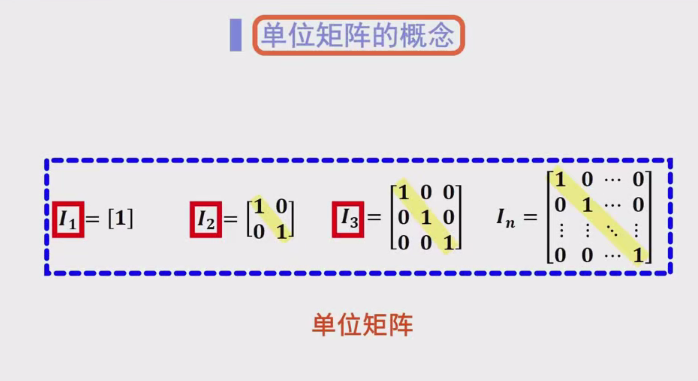
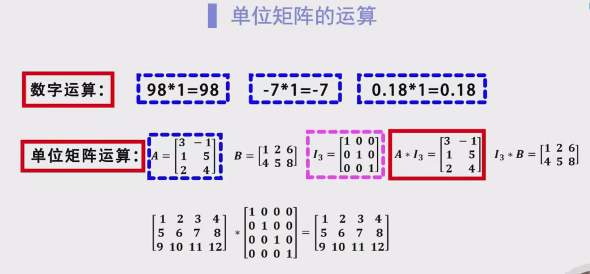
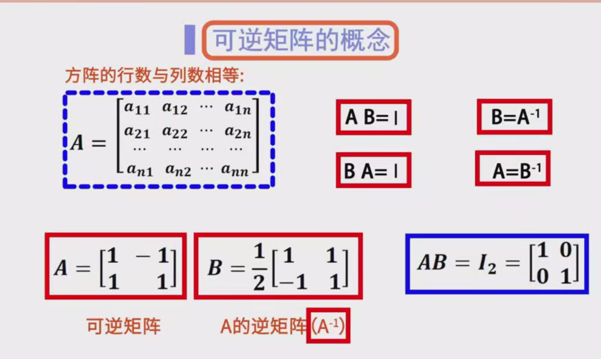
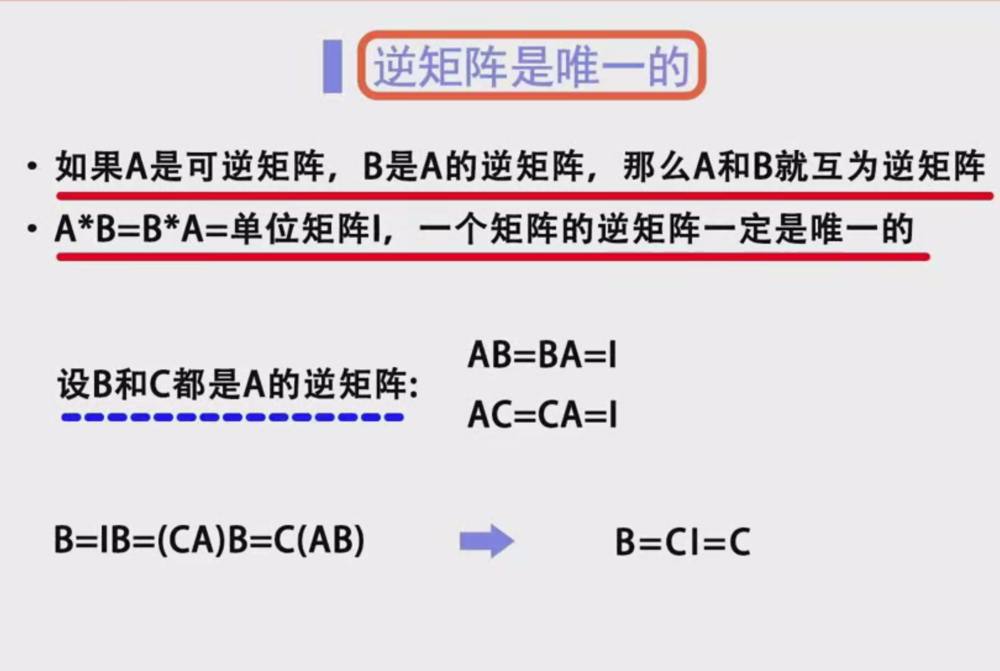
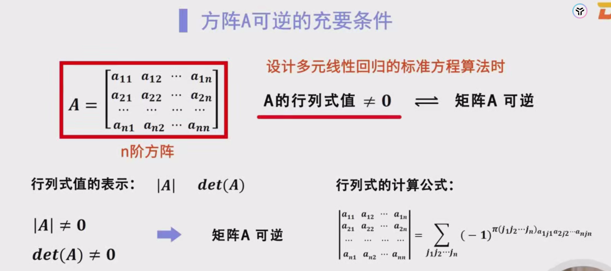
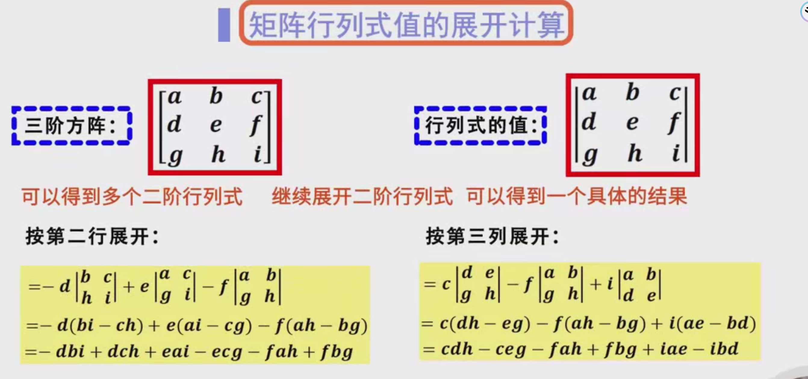

## 1. 单位矩阵

### 1.1 定义
**单位矩阵（Identity Matrix）** 是一个特殊的方阵（行数等于列数）：
- 主对角线（从左上角到右下角）上的元素全部为 1；
- 其余位置上的元素全部为 0。

通常用大写字母 $I$ 表示，$n$ 阶的单位矩阵记作 $I_n$。

$
I_n = 
\begin{pmatrix}
1 & 0 & \cdots & 0 \\
0 & 1 & \cdots & 0 \\
\vdots & \vdots & \ddots & \vdots \\
0 & 0 & \cdots & 1
\end{pmatrix}_{n \times n}
$

**示例**：  
- 2 阶单位矩阵 $I_2$  
  $
  I_2 = 
  \begin{pmatrix}
  1 & 0 \\
  0 & 1
  \end{pmatrix}
  $
- 3 阶单位矩阵 $I_3$  
  $
  I_3 = 
  \begin{pmatrix}
  1 & 0 & 0 \\
  0 & 1 & 0 \\
  0 & 0 & 1
  \end{pmatrix}
  $

### 1.2 性质：乘法恒等性
单位矩阵在矩阵运算中起到与数值运算中“1”相同的作用。  
- 若 $A$ 是任意 $m \times n$ 矩阵，则有
  $
  A \times I_n = A, \quad I_m \times A = A.
  $
  这里的 $I_m$ 和 $I_n$ 分别是 $m$ 阶与 $n$ 阶的单位矩阵。

这说明只要维度匹配，单位矩阵乘到任何矩阵的左边或右边，都不会改变那个矩阵的值。

---

## 2. 可逆矩阵（逆矩阵）

### 2.1 方阵与可逆性的初步认知
- **方阵（Square Matrix）**：行数等于列数的矩阵。  
- **可逆矩阵（Invertible Matrix）**：对于一个 $n$ 阶方阵 $A$，如果存在另一个 $n$ 阶方阵 $B$，使得
  $
  A \times B = I_n \quad \text{且} \quad B \times A = I_n,
  $
  那么称 $A$ 为**可逆矩阵**，而 $B$ 则是 $A$ 的**逆矩阵**，记作 $A^{-1}$。

换言之，“可逆”表示这个方阵在乘法运算下存在“逆元”，就好比在实数运算中，数字 5 的逆元是 $1/5$，两者相乘得到 1。

### 2.2 逆矩阵的唯一性
假设 $B$ 和 $C$ 都是 $A$ 的逆矩阵，那么：
$
A \times B = I, \quad A \times C = I.
$
要证明 $B$ 与 $C$ 实际上是同一个矩阵，可利用结合律与单位矩阵的替换：
$
B = B \times I = B \times (A \times C) = (B \times A) \times C = I \times C = C.
$
因此，逆矩阵在存在的情况下是**唯一**的。

### 2.3 可逆矩阵的必要条件
1. **矩阵必须是方阵**。非方阵（如 $m \times n$ 且 $m \neq n$）不可能存在逆矩阵。
2. **行列式（Determinant）不为 0**。  
   对于 $n$ 阶方阵 $A$，若 $\det(A) = 0$，则 $A$ 不可逆；若 $\det(A) \neq 0$，则 $A$ 可逆。

这也可以理解为：只有在行列式非零时，方阵才有“逆元”。这是判断一个矩阵是否可逆的经典准则，也经常用在实际计算中。

---

## 3. 行列式与可逆性的关系

### 3.1 行列式的定义（简要）
行列式是与方阵相关的一个标量函数。  
- 对于 2 阶方阵  
  $
  A = \begin{pmatrix}
  a & b \\
  c & d
  \end{pmatrix},
  \quad
  \det(A) = ad - bc.
  $
- 对于 3 阶方阵  
  $
  A = \begin{pmatrix}
  a & b & c \\
  d & e & f \\
  g & h & i 
  \end{pmatrix},
  \quad
  \det(A) = a(ei - fh) - b(di - fg) + c(dh - eg).
  $
- 更高阶的行列式可以按“**递归展开**”或通过“**行列变换**”计算。

### 3.2 行列式与可逆矩阵
- 若 $\det(A) \neq 0$，则 $A$ 必可逆。  
- 若 $\det(A) = 0$，则 $A$ 不可逆。

这种“**行列式非零**”与“**可逆**”的等价关系在后续的线性代数、机器学习算法（例如线性回归的正规方程）中经常出现。

---

## 4. 逆矩阵的求解方法与推导

对小规模矩阵（如 2×2、3×3）可以手工推导逆矩阵；对大规模矩阵时，则通常借助数值方法或计算机软件来完成。

### 4.1 2×2 矩阵的逆矩阵公式

#### 4.1.1 直接公式  
对 2×2 矩阵：
$
A = \begin{pmatrix}
a & b \\
c & d
\end{pmatrix},
$
若 $\det(A) = ad - bc \neq 0$，则其逆矩阵
$
A^{-1} = \frac{1}{ad - bc}
\begin{pmatrix}
d & -b \\
-c & a
\end{pmatrix}.
$

#### 4.1.2 待定系数法（推导过程）
1. 令逆矩阵
   $
   B = 
   \begin{pmatrix}
   x & y \\
   z & w
   \end{pmatrix}.
   $
2. 要满足 $A \times B = I$，即
   $
   \begin{pmatrix}
   a & b \\
   c & d
   \end{pmatrix}
   \times
   \begin{pmatrix}
   x & y \\
   z & w
   \end{pmatrix}
   =
   \begin{pmatrix}
   1 & 0 \\
   0 & 1
   \end{pmatrix}.
   $
   由矩阵乘法规则，可写出方程组：
   $
   \begin{cases}
   ax + bz = 1, \\
   ay + bw = 0, \\
   cx + dz = 0, \\
   cy + dw = 1.
   \end{cases}
   $
3. 解此方程组可得到
   $
   x = \frac{d}{ad - bc}, \quad y = \frac{-b}{ad - bc}, \quad z = \frac{-c}{ad - bc}, \quad w = \frac{a}{ad - bc}.
   $
   这就推导出同样的结果：
   $
   B = \frac{1}{ad - bc} \begin{pmatrix} d & -b \\ -c & a \end{pmatrix}.
   $

### 4.2 伴随矩阵（Adjoint/Adjugate）与行列式法

对于任意 $n$ 阶方阵 $A$，其逆矩阵可通过以下公式给出（前提是 $\det(A) \neq 0$）：
$
A^{-1} = \frac{1}{\det(A)} \,\text{adj}(A),
$
其中 $\text{adj}(A)$ 称为**伴随矩阵**，构造步骤如下：
1. 计算 $A$ 的每个元素所对应的**代数余子式**；
2. 将这些代数余子式排成一个矩阵；
3. 对这个矩阵**转置**（或“转置”再排余子式，具体看教材定义风格）就得到 $\text{adj}(A)$。

**2×2 情况下**：
- 伴随矩阵 $\text{adj}(A)$ 就是
  $
  \begin{pmatrix}
  d & -b \\
  -c & a
  \end{pmatrix}.
  $

### 4.3 矩阵初等变换法（Gauss-Jordan 消去法）
此法适用于任何阶数的方阵，且在实际中很常用：
1. 将矩阵 $A$ 与同阶单位矩阵 $I$ 拼成一个**增广矩阵** $[A \mid I]$。
2. 通过对增广矩阵做**初等行变换**（加倍行、互换行、行加行等操作），将左半部分 $A$ 化为单位矩阵 $I$ 的形式。
3. 变换结束后，右半部分就变为 $A^{-1}$，从而可得到逆矩阵。

**示例**：  
$
A = 
\begin{pmatrix}
1 & 2 \\
3 & 4
\end{pmatrix}
\quad \Longrightarrow \quad
\bigl[A \mid I\bigr] = 
\begin{pmatrix}
1 & 2 & \mid & 1 & 0 \\
3 & 4 & \mid & 0 & 1
\end{pmatrix}.
$

- 经过高斯-若尔当消去，目标是把左边化为
  $
  \begin{pmatrix}
  1 & 0 \\
  0 & 1
  \end{pmatrix}.
  $
- 右边的部分就变为
  $
  \begin{pmatrix}
  -2 & 1 \\
  1.5 & -0.5
  \end{pmatrix},
  $
  即 $A^{-1}$。

---

## 5. 为什么并非所有矩阵都有逆？

1. **非方阵**：  
   若矩阵不是方阵，则无法定义逆矩阵。比如 $3 \times 4$ 矩阵没有逆矩阵的概念。

2. **行列式为 0**：  
   即使是方阵，如果行列式为 0，也无法求出它的逆矩阵（说法：此时矩阵**不可逆**，也称**奇异矩阵**）。  
   - 比如
     $
     A = 
     \begin{pmatrix}
     2 & 4 \\
     1 & 2
     \end{pmatrix}
     \quad \Rightarrow \quad \det(A) = 2 \times 2 - 4 \times 1 = 0.
     $
     该矩阵不可逆。

---

## 6. 可逆矩阵在机器学习中的应用

### 6.1 多元线性回归
在多元线性回归的标准方程（正规方程）法中，需要使用到逆矩阵：
$
\theta = (X^T X)^{-1} X^T y.
$
- $X$ 为特征矩阵，$y$ 为目标值向量。
- 如果 $(X^T X)$ 不可逆（或条件数很大），则不能直接用该公式，需要其他方法（如正则化、奇异值分解等）。

### 6.2 其他算法
- **最优化**：在牛顿法等算法中，常用到 Hessian 矩阵的逆来进行迭代更新。
- **协方差矩阵**：在统计与机器学习中，协方差矩阵的可逆性也很重要。例如，在判别分析、PCA 等算法中，需要用到 $\Sigma^{-1}$（协方差矩阵的逆）。

---

## 7. 总结与思考

1. **单位矩阵**：在矩阵乘法中，单位矩阵起到与数值运算中“1”相同的作用。  
2. **可逆矩阵**：  
   - 只有方阵才可能有逆矩阵；  
   - 行列式非零是它可逆的充要条件；  
   - 逆矩阵在存在时是唯一的。  
3. **求逆方法**：对小阶矩阵可用公式，对大阶矩阵常用数值分析方法（如 Gauss-Jordan 消去）。  
4. **机器学习中应用**：在线性回归、特征分解、最优化等场合经常出现需要逆矩阵或近似逆矩阵的操作。

