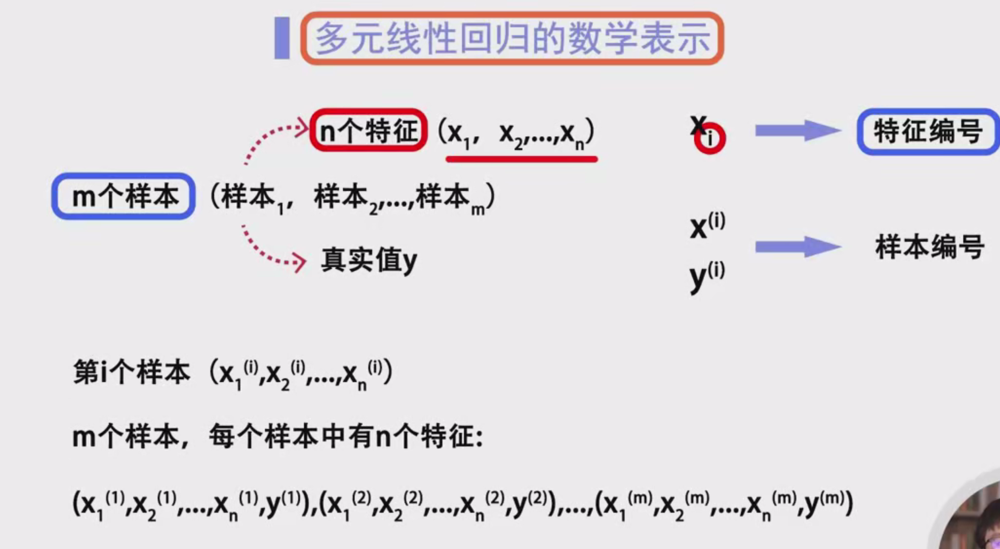

# 多元线性回归概述

### 预测房价的示例
在预测房价时，我们不仅需要考虑房屋面积，还应同时关注以下特征：
- 楼层
- 小区位置
- 朝向
- 卧室数量等

因此，在这种情况下，需要通过多个特征进行预测，从而构建一个 **多元线性回归模型**。多元线性回归的目标是在 **多维空间** 中找到一条 **超平面**，以最佳拟合样本特征和预测值之间的关系。

---

## 2. 多元线性回归的数学表示

### 数据集的形式

假设训练集中有 $ m $ 个样本，每个样本有 $ n $ 个特征。

- 使用 $ x_i $ 表示第 $ i $ 个特征（如面积、楼层等）
- 使用 $ x^{(i)} $ 表示第 $ i $ 个样本的特征向量：
  $
  x^{(i)} = [x_1^{(i)}, x_2^{(i)}, \cdots, x_n^{(i)}]
  $
- 使用 $ y^{(i)} $ 表示第 $ i $ 个样本的真实值

例如：
- 样本数量 $ m = 6 $
- 特征数量 $ n = 4 $

这 4 个特征为：
1. **面积**
2. **卧室数量**
3. **朝向**
4. **楼层**

对于第 1 个样本的特征数据，可以表示为：
$
x^{(1)} = (96.7, 9, 21, 287)
$
对应的真实值（如房价）为 $ y^{(1)} $。

---

## 3. 多元线性回归的假设函数

**假设函数** 是线性回归模型用于进行预测的函数，表示为：
$
h_{\theta}(x) = \theta_0 + \theta_1 x_1 + \theta_2 x_2 + \cdots + \theta_n x_n
$
其中：
- $ \theta_0, \theta_1, \cdots, \theta_n $ 为 **参数**
- 每个特征 $ x_i $ 对应一个参数 $ \theta_i $，表示该特征对预测结果的贡献

### 示例

假设：
$
h_{\theta}(x) = 1 + 2x_1 + 3x_2 + 4x_3 - x_4
$
- $ x_1, x_2, x_3 $ 的系数为正值，表示房价随着这些特征增加而 **升高**。
- $ x_4 $（楼层）的系数为负值，表示房价随着楼层增加而 **下降**。
- 参数值的大小代表特征的重要性：
  - $ \theta_2 = 3 $ 大于 $ \theta_1 = 2 $，说明 **卧室数量** 对房价的影响大于 **面积**。

---

## 4. 偏置项的引入及其原因

在假设函数中，**偏置项** $ x_0 = 1 $ 的引入是为了提升模型的表达能力，尤其是应对以下情况：

### 4.1 为什么引入偏置项？
**原因 1：确保回归方程不过原点**  
假设没有偏置项 $ \theta_0 $，即假设函数形式为：
$
h_{\theta}(x) = \theta_1 x_1 + \theta_2 x_2 + \cdots + \theta_n x_n
$
当所有 $ x_i = 0 $ 时，预测值必定为 0：
$
h_{\theta}(x) = 0
$
然而，在实际情况中，即使所有特征的值为 0，预测结果 $ y $ 并不一定为 0。例如：
- 房价模型中，即使所有特征（面积、卧室数量等）取值为 0，房价也不会为 0。  
这时需要偏置项 $ \theta_0 $ 来提供一个 **基础值**，使模型具有更大的灵活性。

**原因 2：提高模型的拟合能力**  
引入偏置项可以通过增加常数项，增加超平面在多维空间中的位置偏移，使模型能更好地拟合数据点，减少偏差。

---

### 4.2 偏置项的数学表示

为了引入偏置项，将假设函数改写为：
$
h_{\theta}(x) = \theta_0 \cdot x_0 + \theta_1 \cdot x_1 + \theta_2 \cdot x_2 + \cdots + \theta_n \cdot x_n
$
其中：
- $ x_0 = 1 $ 固定为 1，确保该项始终存在
- $ \theta_0 $ 称为 **截距项**（intercept term）

此时，每个样本的特征向量扩展为：
$
x^{(i)} = [1, x_1^{(i)}, x_2^{(i)}, \cdots, x_n^{(i)}]
$

---

## 5. 矩阵形式表示

为了简化表示，我们将假设函数写成矩阵形式：

### 特征矩阵 $ X $
- 将所有样本的特征向量放入矩阵 $ X $
- $ X $ 的维度为 $ m \times (n+1) $：
  $
  X = \begin{bmatrix}
  1 & x_1^{(1)} & x_2^{(1)} & \cdots & x_n^{(1)} \\
  1 & x_1^{(2)} & x_2^{(2)} & \cdots & x_n^{(2)} \\
  \vdots & \vdots & \vdots & \ddots & \vdots \\
  1 & x_1^{(m)} & x_2^{(m)} & \cdots & x_n^{(m)}
  \end{bmatrix}
  $

### 参数向量 $ \theta $
$
\theta = \begin{bmatrix}
\theta_0 \\
\theta_1 \\
\theta_2 \\
\vdots \\
\theta_n
\end{bmatrix}
$

### 真实值向量 $ y $
$
y = \begin{bmatrix}
y^{(1)} \\
y^{(2)} \\
\vdots \\
y^{(m)}
\end{bmatrix}
$

### 假设函数的矩阵形式

假设函数可写为：
$
h_{\theta}(x) = X \theta
$

---

## 6. 多元线性回归的代价函数

为了衡量模型的预测结果与真实值之间的误差，我们使用 **均方误差**（MSE）来定义代价函数 $ J(\theta) $：
$
J(\theta) = \frac{1}{2m} \sum_{i=1}^{m} \left( h_{\theta}(x^{(i)}) - y^{(i)} \right)^2
$
其中：
- $ m $ 为样本数量
- $ h_{\theta}(x^{(i)}) $ 为第 $ i $ 个样本的预测值
- $ y^{(i)} $ 为第 $ i $ 个样本的真实值

---

## 7. 不同的参数符号表示法

除了用 $ \theta $ 表示参数，还可以使用以下形式：
$
f(x) = w_1 x_1 + w_2 x_2 + \cdots + w_n x_n + b
$

- $ w_1, w_2, \cdots, w_n $ 对应 $ \theta_1, \theta_2, \cdots, \theta_n $
- $ b $ 对应 $ \theta_0 $

这两种符号表示只是记号不同，具体使用哪种形式可根据个人习惯。

---

## 8. 总结

- **多元线性回归** 使用多个特征来预测因变量，提高预测精度。
- 假设函数形式：
  $
  h_{\theta}(x) = \theta_0 + \sum_{i=1}^{n} \theta_i x_i
  $
- **偏置项** 的引入解决了当所有特征值为 0 时预测值不为 0 的问题，提高了模型拟合能力。
- 矩阵形式简化了计算，假设函数可表示为 $ h_{\theta}(x) = X \theta $。
- **代价函数** 依旧为均方误差形式，用于衡量模型预测结果与真实值的差异。