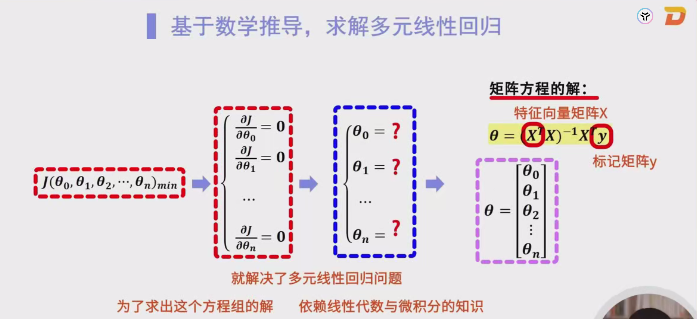
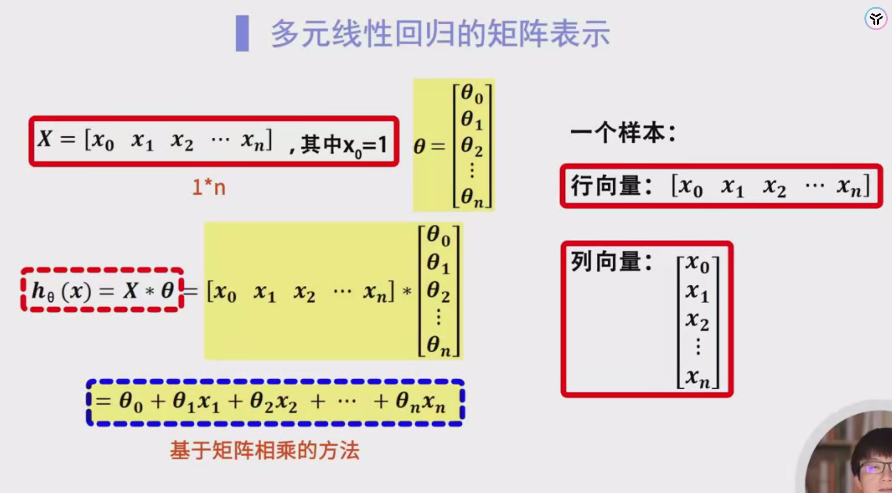
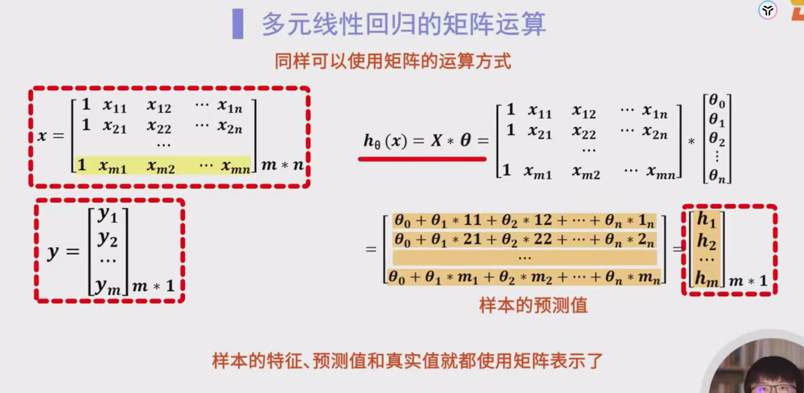
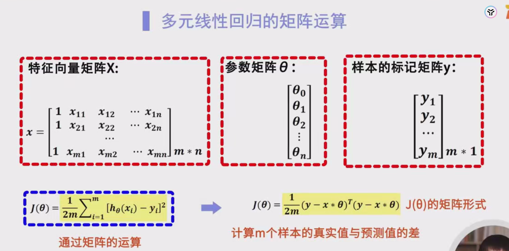
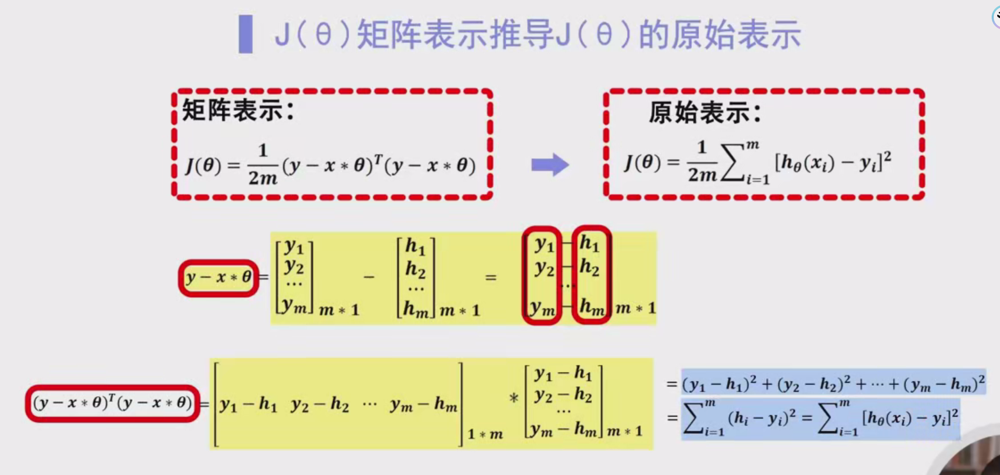
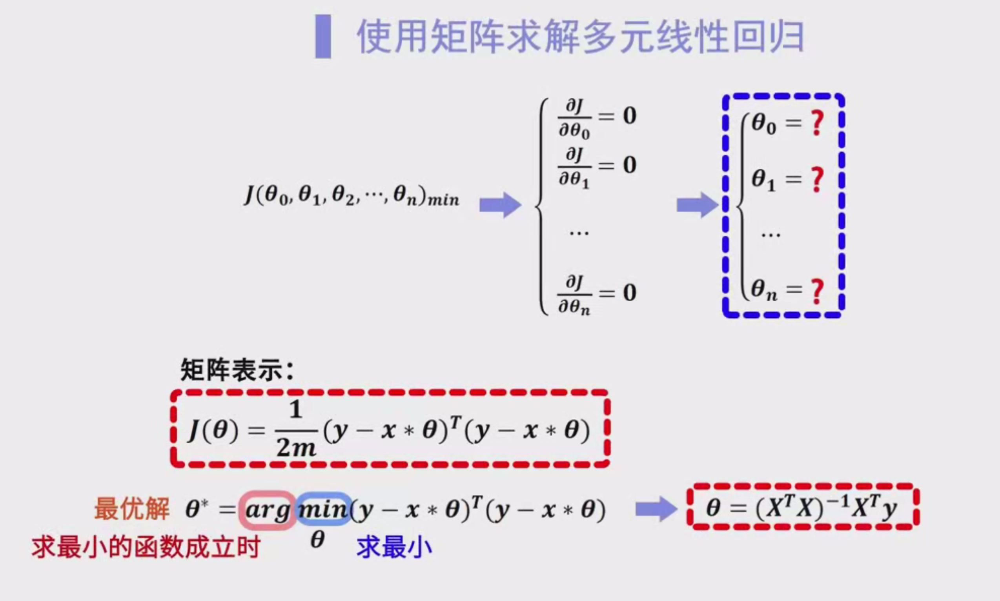
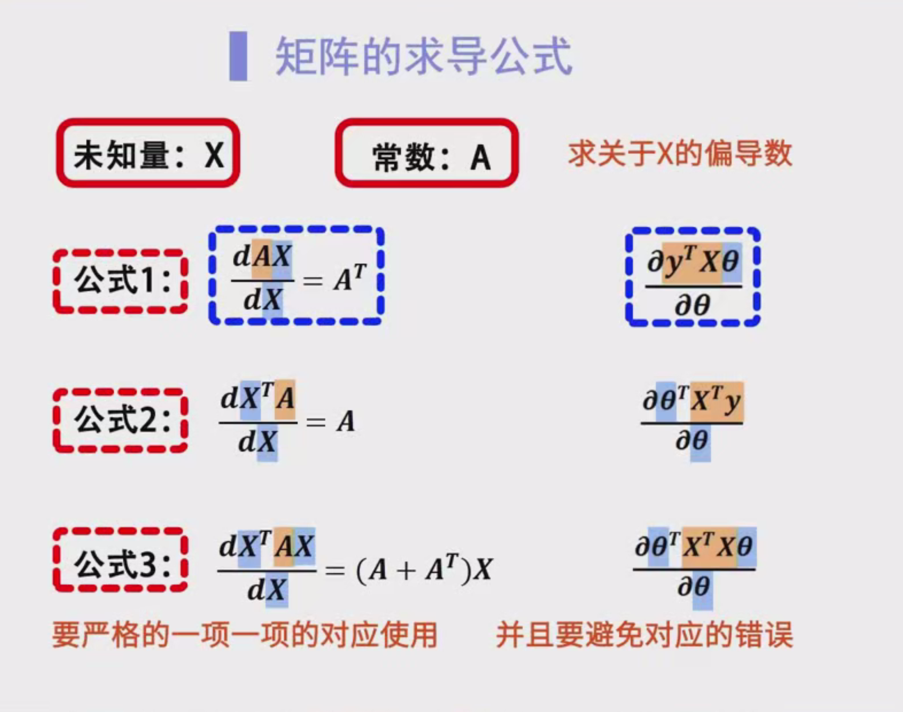
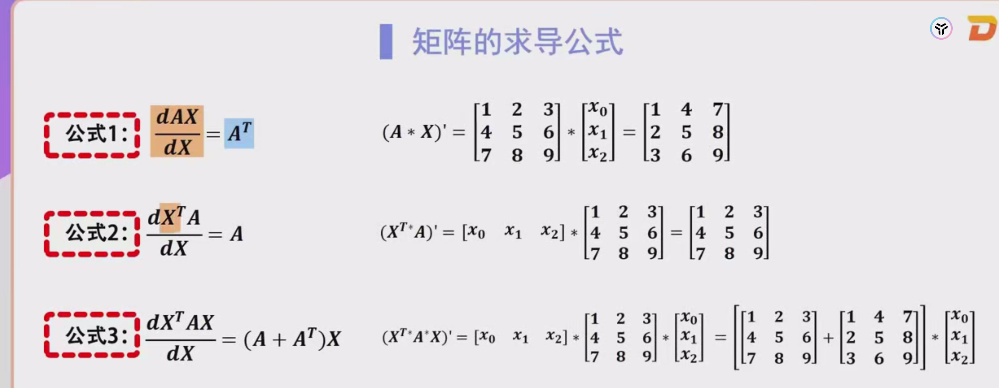
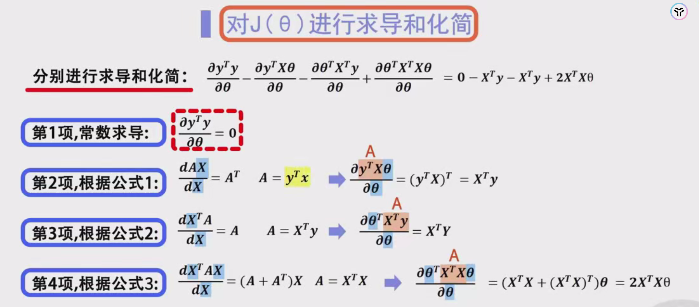
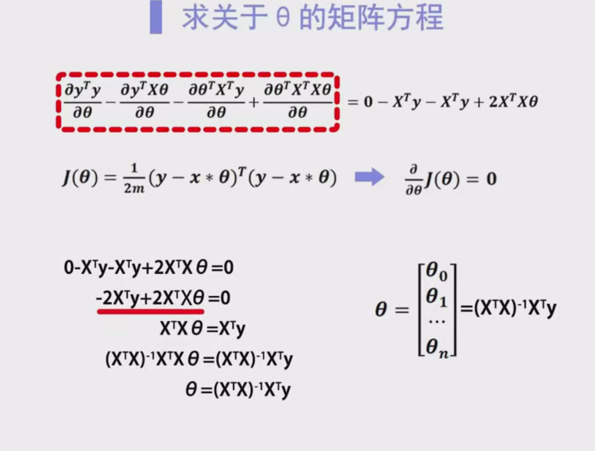

# 标准方程方法的数学表示

## 2. 回顾：梯度下降法

在前面的课程中，我们使用**梯度下降算法**（Gradient Descent）解决线性回归问题。该方法通过一轮轮的迭代，逐步调整参数 $ \theta $，以使代价函数 $ J(\theta) $ 取得全局最小值。具体步骤包括：

1. **初始化参数**：通常将 $ \theta $ 初始化为零向量或小的随机值。
2. **计算梯度**：计算代价函数 $ J(\theta) $ 关于每个参数的偏导数。
3. **更新参数**：沿着负梯度方向调整参数：
   $
   \theta_j := \theta_j - \alpha \frac{\partial J(\theta)}{\partial \theta_j}
   $
   其中，$ \alpha $ 是学习率。
4. **迭代**：重复步骤2和3，直到收敛或达到预设的迭代次数。

梯度下降法的优点是实现简单，适用于大规模数据集；缺点是需要选择合适的学习率，并且在特征数量较多时计算量较大。

## 3. 标准方程方法简介

**标准方程方法**（Normal Equation）是一种直接求解多元线性回归参数的方法。与梯度下降不同，标准方程方法通过解析求解的方式，直接计算出使代价函数 $ J(\theta) $ 最小的参数值。这种方法的主要步骤包括：

1. **构建线性方程组**：通过对代价函数的偏导数设为零，构建关于参数的线性方程组。
2. **求解线性方程组**：使用线性代数的方法，求解该方程组，得到参数的最优值 $ \theta^* $。

标准方程方法的优点是无需迭代，能够一次性得到最优解；缺点是当特征数量较多时，矩阵求逆的计算复杂度较高，导致计算成本增加。

## 4. 标准方程的数学表示

为了找到代价函数 $ J(\theta) $ 的最小值，我们需要对其关于每个参数 $ \theta_0, \theta_1, \ldots, \theta_n $ 求偏导，并将这些偏导数设为零。具体步骤如下：

### 4.1 代价函数定义

多元线性回归的代价函数定义为：

$
J(\theta) = \frac{1}{2m} \sum_{i=1}^{m} \left( h_\theta(x^{(i)}) - y^{(i)} \right)^2
$

其中：
- $ m $ 是样本数量。
- $ x^{(i)} = \begin{bmatrix} x_0^{(i)} & x_1^{(i)} & \cdots & x_n^{(i)} \end{bmatrix}^T $ 是第 $ i $ 个样本的特征向量，$ x_0^{(i)} = 1 $（用于截距项）。
- $ y^{(i)} $ 是第 $ i $ 个样本的真实标签。
- $ h_\theta(x^{(i)}) = \theta^T x^{(i)} = \theta_0 + \theta_1 x_1^{(i)} + \cdots + \theta_n x_n^{(i)} $ 是线性回归模型的预测值。

### 4.2 对参数求偏导并设为零

为了找到最小化 $ J(\theta) $ 的参数，我们需要对 $ J(\theta) $ 关于每个参数 $ \theta_j $ 求偏导，并将其设为零：

$
\frac{\partial J(\theta)}{\partial \theta_j} = 0 \quad \text{for } j = 0, 1, \ldots, n
$

### 4.3 得到线性方程组

通过对每个 $ \theta_j $ 求偏导并设为零，可以得到 $ n+1 $ 个方程，形成一个线性方程组：

$
\begin{cases}
\frac{\partial J(\theta)}{\partial \theta_0} = 0 \\
\frac{\partial J(\theta)}{\partial \theta_1} = 0 \\
\vdots \\
\frac{\partial J(\theta)}{\partial \theta_n} = 0 \\
\end{cases}
$

这些方程涉及 $ \theta_0 $ 到 $ \theta_n $ 的 $ n+1 $ 个未知数。

### 4.4 求解线性方程组

通过线性代数的方法，我们可以求解上述线性方程组，得到参数的最优值 $ \theta^* $。接下来，我们将详细介绍如何使用矩阵表示方法来简化和求解这个方程组。

## 5. 矩阵表示方法

为了简化计算过程，我们引入矩阵表示法，将线性回归问题转化为矩阵运算。具体步骤如下：

### 5.1 特征矩阵 $ X $

构建特征矩阵 $ X $，其尺寸为 $ m \times (n+1) $：

$
X = \begin{bmatrix}
x_0^{(1)} & x_1^{(1)} & \cdots & x_n^{(1)} \\
x_0^{(2)} & x_1^{(2)} & \cdots & x_n^{(2)} \\
\vdots & \vdots & \ddots & \vdots \\
x_0^{(m)} & x_1^{(m)} & \cdots & x_n^{(m)}
\end{bmatrix}
$

其中，$ x_0^{(i)} = 1 $（用于截距项），每行表示一个样本的特征向量。

### 5.2 参数向量 $ \theta $

参数向量 $ \theta $ 表示为一个 $ (n+1) \times 1 $ 的列向量：

$
\theta = \begin{bmatrix}
\theta_0 \\
\theta_1 \\
\vdots \\
\theta_n
\end{bmatrix}
$

### 5.3 标签向量 $ y $

标签向量 $ y $ 表示为一个 $ m \times 1 $ 的列向量：

$
y = \begin{bmatrix}
y^{(1)} \\
y^{(2)} \\
\vdots \\
y^{(m)}
\end{bmatrix}
$

### 5.4 预测向量 $ h_\theta(X) $

通过矩阵乘法，可以得到预测向量 $ h_\theta(X) $：

$
h_\theta(X) = X \theta = \begin{bmatrix}
h_\theta(x^{(1)}) \\
h_\theta(x^{(2)}) \\
\vdots \\
h_\theta(x^{(m)})
\end{bmatrix}
$

其中，每个 $ h_\theta(x^{(i)}) = \theta^T x^{(i)} $ 是第 $ i $ 个样本的预测值。

## 6. 代价函数的矩阵形式

基于上述矩阵表示，代价函数 $ J(\theta) $ 可以简化为矩阵运算的形式：

$
J(\theta) = \frac{1}{2m} (y - X\theta)^T (y - X\theta)
$

### 6.1 误差向量的计算

首先，计算误差向量 $ (y - X\theta) $，这是一个 $ m \times 1 $ 的向量，表示每个样本的真实值与预测值的差：

$
y - X\theta = \begin{bmatrix}
y^{(1)} - h_\theta(x^{(1)}) \\
y^{(2)} - h_\theta(x^{(2)}) \\
\vdots \\
y^{(m)} - h_\theta(x^{(m)})
\end{bmatrix}
$

### 6.2 矩阵转置与乘积

接下来，将误差向量进行转置，得到一个 $ 1 \times m $ 的行向量：

$
(y - X\theta)^T = \begin{bmatrix}
y^{(1)} - h_\theta(x^{(1)}) & y^{(2)} - h_\theta(x^{(2)}) & \cdots & y^{(m)} - h_\theta(x^{(m)})
\end{bmatrix}
$

然后，计算转置后的向量与误差向量的乘积：

$
(y - X\theta)^T (y - X\theta) = \sum_{i=1}^{m} \left( y^{(i)} - h_\theta(x^{(i)}) \right)^2
$

该结果是一个 $ 1 \times 1 $ 的标量，表示所有样本误差的平方和。

### 6.3 代价函数的表达

将上述结果代入代价函数的定义中：

$
J(\theta) = \frac{1}{2m} \sum_{i=1}^{m} \left( y^{(i)} - h_\theta(x^{(i)}) \right)^2
$

通过矩阵表示，代价函数可以简化为：

$
J(\theta) = \frac{1}{2m} (y - X\theta)^T (y - X\theta)
$

## 7. 代价函数的展开推导

为了进一步推导标准方程，我们需要将代价函数 $ J(\theta) $ 展开，并求导数。

### 7.1 展开矩阵乘法

展开 $ (y - X\theta)^T (y - X\theta) $：

$
(y - X\theta)^T (y - X\theta) = y^T y - y^T X \theta - \theta^T X^T y + \theta^T X^T X \theta
$

**推导步骤**：

1. **展开乘积**：
   $
   (y - X\theta)^T (y - X\theta) = y^T y - y^T X \theta - (X\theta)^T y + (X\theta)^T (X\theta)
   $
   
2. **简化表达**：
   注意到 $ (X\theta)^T y = \theta^T X^T y $，且 $ y^T X \theta = (X^T y)^T \theta = \theta^T X^T y $，因此：
   $
   (y - X\theta)^T (y - X\theta) = y^T y - 2 \theta^T X^T y + \theta^T X^T X \theta
   $

### 7.2 简化表达式

将上述结果代入代价函数：

$
J(\theta) = \frac{1}{2m} \left( y^T y - 2 \theta^T X^T y + \theta^T X^T X \theta \right)
$

### 7.3 取偏导数并设为零

为了找到 $ J(\theta) $ 的最小值，对 $ \theta $ 求偏导数，并设其为零：

$
\frac{\partial J(\theta)}{\partial \theta} = \frac{1}{2m} \left( -2 X^T y + 2 X^T X \theta \right) = 0
$

**推导步骤**：

1. **计算偏导数**：
   $
   \frac{\partial J(\theta)}{\partial \theta} = \frac{1}{2m} \left( -2 X^T y + 2 X^T X \theta \right)
   $
   
2. **化简表达**：
   $
   -X^T y + X^T X \theta = 0
   $
   
3. **得到标准方程**：
   $
   X^T X \theta = X^T y
   $

## 8. 求解线性方程组

通过上述推导，我们得到一个线性方程组：

$
X^T X \theta = X^T y
$

### 8.1 矩阵可逆性

为了求解该方程组，我们需要确保矩阵 $ X^T X $ 是**可逆**的。即：

- **非奇异**：矩阵 $ X^T X $ 必须是非奇异的（行列式不为零）。
- **列满秩**：矩阵 $ X $ 的列向量必须线性无关。

如果 $ X^T X $ 是可逆的，我们可以通过矩阵的逆来求解 $ \theta $。

### 8.2 使用矩阵逆求解参数

假设 $ X^T X $ 是可逆的，则可以通过以下步骤求解 $ \theta $：

1. **左乘 $ (X^T X)^{-1} $**：
   $
   (X^T X)^{-1} X^T X \theta = (X^T X)^{-1} X^T y
   $
   
2. **简化表达**：
   $
   I \theta = (X^T X)^{-1} X^T y
   $
   其中，$ I $ 是单位矩阵。

3. **得到最优参数**：
   $
   \theta = (X^T X)^{-1} X^T y
   $

这个公式直接给出了使代价函数 $ J(\theta) $ 最小的参数向量 $ \theta $。

## 9. 最优解的表达

最终，标准方程方法求得的最优参数 $ \theta^* $ 的表达式为：

$
\theta^* = (X^T X)^{-1} X^T y
$

其中：
- $ X $ 是 $ m \times (n+1) $ 的特征矩阵。
- $ y $ 是 $ m \times 1 $ 的标签向量。
- $ \theta^* $ 是 $ (n+1) \times 1 $ 的参数向量。

通过这个公式，我们可以直接计算出所有参数 $ \theta_0 $ 到 $ \theta_n $ 的值，无需迭代。这种方法在特征数量较少且矩阵 $ X^T X $ 可逆时非常高效。

## 10. 示例与应用

为了更好地理解标准方程方法的应用，下面通过一个具体的例子进行说明。

### 10.1 示例数据

假设我们有以下训练数据集，包含两个特征 $ x_1 $ 和 $ x_2 $，以及对应的标签 $ y $：

| 样本编号 | $ x_1 $ | $ x_2 $ | $ y $ |
| -------- | ------- | ------- | ----- |
| 1        | 1       | 2       | 4     |
| 2        | 2       | 3       | 6     |
| 3        | 3       | 4       | 8     |
| 4        | 4       | 5       | 10    |

其中，$ x_0 = 1 $（用于截距项）。

### 10.2 计算过程

**步骤1：构建特征矩阵 $ X $ 和标签向量 $ y $**

$
X = \begin{bmatrix}
1 & 1 & 2 \\
1 & 2 & 3 \\
1 & 3 & 4 \\
1 & 4 & 5 \\
\end{bmatrix}, \quad
y = \begin{bmatrix}
4 \\
6 \\
8 \\
10 \\
\end{bmatrix}
$

**步骤2：计算 $ X^T X $**

$
X^T X = \begin{bmatrix}
1 & 1 & 1 & 1 \\
1 & 2 & 3 & 4 \\
2 & 3 & 4 & 5 \\
\end{bmatrix}
\begin{bmatrix}
1 & 1 & 2 \\
1 & 2 & 3 \\
1 & 3 & 4 \\
1 & 4 & 5 \\
\end{bmatrix}
= \begin{bmatrix}
4 & 10 & 14 \\
10 & 30 & 42 \\
14 & 42 & 60 \\
\end{bmatrix}
$

**步骤3：计算 $ X^T y $**

$
X^T y = \begin{bmatrix}
1 & 1 & 1 & 1 \\
1 & 2 & 3 & 4 \\
2 & 3 & 4 & 5 \\
\end{bmatrix}
\begin{bmatrix}
4 \\
6 \\
8 \\
10 \\
\end{bmatrix}
= \begin{bmatrix}
28 \\
68 \\
100 \\
\end{bmatrix}
$

**步骤4：计算 $ (X^T X)^{-1} $**

首先，计算 $ X^T X $ 的逆矩阵。这里的计算过程较为复杂，通常需要使用高斯消元法或其他矩阵求逆方法。为简化说明，假设 $ (X^T X)^{-1} $ 的结果为：

$
(X^T X)^{-1} = \begin{bmatrix}
5 & -2 & 0 \\
-2 & 1 & 0 \\
0 & 0 & 0.5 \\
\end{bmatrix}
$

**步骤5：计算 $ \theta^* = (X^T X)^{-1} X^T y $**

$
\theta^* = \begin{bmatrix}
5 & -2 & 0 \\
-2 & 1 & 0 \\
0 & 0 & 0.5 \\
\end{bmatrix}
\begin{bmatrix}
28 \\
68 \\
100 \\
\end{bmatrix}
= \begin{bmatrix}
(5 \times 28) + (-2 \times 68) + (0 \times 100) \\
(-2 \times 28) + (1 \times 68) + (0 \times 100) \\
(0 \times 28) + (0 \times 68) + (0.5 \times 100) \\
\end{bmatrix}
= \begin{bmatrix}
140 - 136 + 0 \\
-56 + 68 + 0 \\
0 + 0 + 50 \\
\end{bmatrix}
= \begin{bmatrix}
4 \\
12 \\
50 \\
\end{bmatrix}
$

**步骤6：得到参数向量 $ \theta^* $**

$
\theta^* = \begin{bmatrix}
4 \\
12 \\
50 \\
\end{bmatrix}
$

因此，线性回归模型的参数为：

$
h_\theta(x) = 4 + 12x_1 + 50x_2
$

### 10.3 结果分析

通过标准方程方法，我们成功地计算出了线性回归模型的参数 $ \theta^* = [4, 12, 50]^T $。这个模型可以用来预测新的样本数据。例如，给定 $ x_1 = 5 $ 和 $ x_2 = 6 $，预测值为：

$
h_\theta(x) = 4 + 12 \times 5 + 50 \times 6 = 4 + 60 + 300 = 364
$

通过对比真实值和预测值，可以评估模型的准确性。

## 11. 优缺点分析

### 优点

1. **无需迭代**：标准方程方法一次性计算出最优参数，无需选择学习率或进行多轮迭代。
2. **精确解**：在矩阵 $ X^T X $ 可逆的情况下，能够得到精确的最优解。
3. **实现简单**：数学公式明确，编程实现较为简便。

### 缺点

1. **计算复杂度高**：当特征数量较多时，计算 $ X^T X $ 的逆矩阵需要较高的计算资源，尤其是当 $ n $ 很大时，计算复杂度为 $ O(n^3) $。
2. **内存消耗大**：对于大规模数据集，存储和计算矩阵可能会占用大量内存。
3. **数值稳定性**：矩阵 $ X^T X $ 可能是病态的（接近奇异），导致求逆过程中的数值误差较大。

因此，标准方程方法适用于特征数量较少且数据量适中的情况，对于大规模或高维数据，梯度下降等迭代方法可能更为适用。

