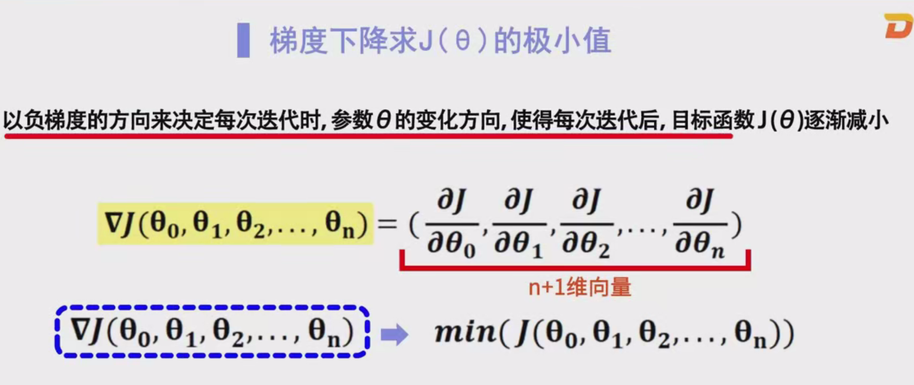
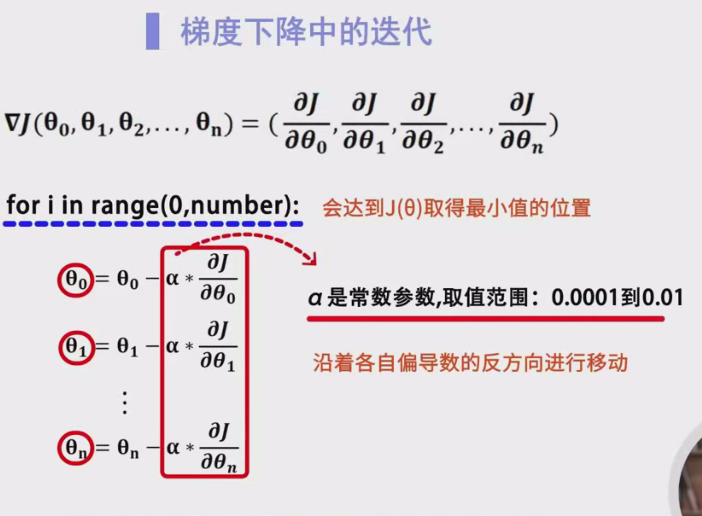
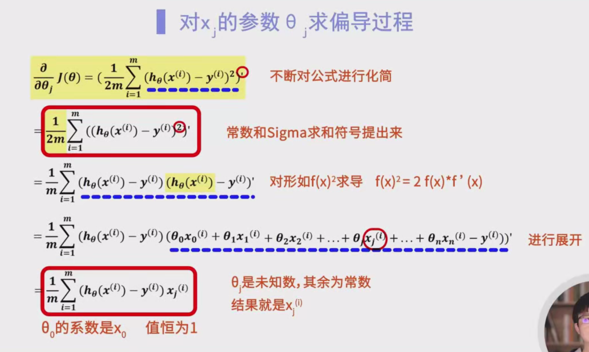

# 多元线性回归与梯度下降算法详解

## 目录

1. [引言](#1-引言)
2. [多元线性回归概述](#2-多元线性回归概述)
3. [代价函数](#3-代价函数)
4. [代价函数的性质](#4-代价函数的性质)
5. [梯度下降算法原理](#5-梯度下降算法原理)
6. [代价函数的偏导数推导](#6-代价函数的偏导数推导)
7. [梯度下降算法的实现步骤](#7-梯度下降算法的实现步骤)
8. [梯度下降算法的伪代码](#8-梯度下降算法的伪代码)
9. [学习率的选择](#9-学习率的选择)
10. [梯度下降算法的总结](#10-梯度下降算法的总结)
11. [参考资料](#11-参考资料)

---

## 1. 引言

大家好！欢迎来到本次关于**多元线性回归与梯度下降算法**的详细学习笔记。无论你是机器学习的新手，还是希望深入理解线性回归优化算法的学习者，这篇笔记都将帮助你系统地掌握相关知识。

在机器学习中，**多元线性回归**是一种基本且广泛应用的预测模型。为了使模型具有良好的预测能力，我们需要找到最优的参数组合。而**梯度下降算法**正是帮助我们实现这一目标的核心优化方法。

本笔记将从多元线性回归的基本概念出发，逐步引入代价函数的定义、梯度下降算法的原理与实现，帮助你全面理解并掌握这一重要算法。

---

## 2. 多元线性回归概述

### 2.1 什么是多元线性回归？

**多元线性回归**（Multiple Linear Regression）是一种用于预测因变量（目标变量）与多个自变量（特征变量）之间关系的统计方法。与**一元线性回归**不同，多元线性回归考虑了多个特征对目标变量的影响。

### 2.2 模型表示

多元线性回归的模型公式如下：

$
h_\theta(x) = \theta_0 + \theta_1 x_1 + \theta_2 x_2 + \cdots + \theta_n x_n
$

其中：
- $ h_\theta(x) $ 是模型的预测值。
- $ \theta_0, \theta_1, \ldots, \theta_n $ 是模型参数（权重）。
- $ x_1, x_2, \ldots, x_n $ 是输入特征。

**注意**：$ \theta_0 $ 被称为**偏置项**（bias term），对应的输入特征 $ x_0 $ 通常设为 1，以简化公式。

### 2.3 目标

我们**希望找到一组参数** $ \theta = (\theta_0, \theta_1, \ldots, \theta_n) $，使得模型的预测值与实际值之间的误差最小。这意味着我们需要优化参数 $ \theta $ 以使得模型在给定数据集上的表现最佳。

---

## 3. 代价函数

### 3.1 代价函数的定义

为了量化模型预测值与实际值之间的误差，我们引入**代价函数**（Cost Function）。在多元线性回归中，常用的代价函数是**均方误差**（Mean Squared Error, MSE），其定义如下：

$
J(\theta) = \frac{1}{2m} \sum_{i=1}^{m} \left( h_\theta(x^{(i)}) - y^{(i)} \right)^2
$

其中：
- $ J(\theta) $ 是代价函数。
- $ m $ 是样本数量。
- $ h_\theta(x^{(i)}) $ 是第 $ i $ 个样本的预测值。
- $ y^{(i)} $ 是第 $ i $ 个样本的实际值。

**解释**：
- **平方误差**：对每个样本的预测误差（$ h_\theta(x^{(i)}) - y^{(i)} $）进行平方，放大较大的误差，并避免正负误差相互抵消。
- **平均化**：通过除以 $ 2m $，得到整体的误差水平。乘以 $ \frac{1}{2} $ 是为了简化后续的导数计算。

### 3.2 为什么选择均方误差？

**均方误差**具有以下优点：
- **凸性**：均方误差是一个凸函数，意味着它只有一个全局最小值，有利于优化算法找到最佳参数。
- **可导性**：均方误差在参数空间中是可微的，便于应用梯度下降等优化算法。
- **简单性**：计算和理解相对简单，适用于线性模型。

---

## 4. 代价函数的性质

### 4.1 凸函数性质

代价函数 $ J(\theta) $ 是一个**凸函数**。凸函数的特点包括：
- **单一极小值**：在整个参数空间中，凸函数只有一个全局最小值。
- **无局部极小值**：不存在局部极小值，优化算法不容易陷入局部最优。

**图示说明**：

尽管无法在高维空间中直观展示，但可以类比为一个碗状的形状，碗底即为全局最小值。

### 4.2 极小值的意义

对于凸函数来说，找到的极小值即为全局最小值。因此，通过优化算法（如梯度下降），我们可以确保找到最优的参数组合，使得代价函数达到最小值，进而使模型的预测误差最小化。

---

## 5. 梯度下降算法原理

**梯度下降算法**（Gradient Descent）是一种迭代优化算法，用于最小化代价函数。其核心思想是沿着代价函数的**负梯度方向**更新参数，逐步逼近函数的最小值。

### 5.1 梯度向量的定义

梯度向量是代价函数 $ J(\theta) $ 对所有参数的偏导数组成的向量。数学表示如下：

$
\nabla J(\theta) = \left( \frac{\partial J(\theta)}{\partial \theta_0}, \frac{\partial J(\theta)}{\partial \theta_1}, \ldots, \frac{\partial J(\theta)}{\partial \theta_n} \right)
$

其中：
- $ \frac{\partial J(\theta)}{\partial \theta_j} $ 表示代价函数对参数 $ \theta_j $ 的偏导数。

### 5.2 梯度下降的更新规则

每次迭代中，参数的更新规则如下：

$
\theta_j := \theta_j - \alpha \frac{\partial J(\theta)}{\partial \theta_j}
$

其中：
- $ \alpha $ 是**学习率**（Learning Rate），决定每次更新的步长大小。
- $ \theta_j $ 是第 $ j $ 个参数。

### 5.3 更新过程说明

1. **计算梯度**：首先计算代价函数对每个参数的偏导数，即梯度向量。
2. **更新参数**：按照负梯度方向调整参数值，目的是减少代价函数的值。
3. **迭代进行**：重复上述步骤，直到代价函数的值收敛（变化非常小）或达到预设的迭代次数。

**图示说明**：

可以将梯度向量理解为指向函数上升最快方向的箭头。为了最小化函数，我们需要朝着梯度的反方向移动。

### 5.4 为什么选择负梯度方向？

梯度向量指向函数值**增加最快的方向**，因此沿着**负梯度方向**移动可以最快地减少函数值。这种策略确保了参数更新过程朝着降低误差的方向前进。

---

## 6. 代价函数的偏导数推导

为了实现梯度下降算法，我们需要**求出代价函数 $ J(\theta) $ 对每个参数 $ \theta_j $ 的偏导数**。以下是详细的推导过程。

### 6.1 代价函数回顾

代价函数定义为：

$
J(\theta) = \frac{1}{2m} \sum_{i=1}^{m} \left( h_\theta(x^{(i)}) - y^{(i)} \right)^2
$

其中：
- $ h_\theta(x^{(i)}) = \theta_0 + \theta_1 x_1^{(i)} + \theta_2 x_2^{(i)} + \cdots + \theta_n x_n^{(i)} $

### 6.2 对参数 $ \theta_j $ 求偏导

我们需要求 $ \frac{\partial J(\theta)}{\partial \theta_j} $。具体步骤如下：

#### 步骤1：展开代价函数

$
J(\theta) = \frac{1}{2m} \sum_{i=1}^{m} \left( \theta_0 + \theta_1 x_1^{(i)} + \cdots + \theta_n x_n^{(i)} - y^{(i)} \right)^2
$

#### 步骤2：对 $ \theta_j $ 求偏导

$
\frac{\partial J(\theta)}{\partial \theta_j} = \frac{\partial}{\partial \theta_j} \left( \frac{1}{2m} \sum_{i=1}^{m} \left( h_\theta(x^{(i)}) - y^{(i)} \right)^2 \right)
$

由于导数是线性的，可以将求导符号移到求和符号外：

$
\frac{\partial J(\theta)}{\partial \theta_j} = \frac{1}{2m} \sum_{i=1}^{m} \frac{\partial}{\partial \theta_j} \left( h_\theta(x^{(i)}) - y^{(i)} \right)^2
$

#### 步骤3：应用链式法则

对 $ (h_\theta(x^{(i)}) - y^{(i)})^2 $ 求导：

$
\frac{\partial}{\partial \theta_j} \left( h_\theta(x^{(i)}) - y^{(i)} \right)^2 = 2 \left( h_\theta(x^{(i)}) - y^{(i)} \right) \cdot \frac{\partial}{\partial \theta_j} \left( h_\theta(x^{(i)}) - y^{(i)} \right)
$

#### 步骤4：求 $ h_\theta(x^{(i)}) $ 对 $ \theta_j $ 的偏导数

由于：

$
h_\theta(x^{(i)}) = \theta_0 + \theta_1 x_1^{(i)} + \cdots + \theta_j x_j^{(i)} + \cdots + \theta_n x_n^{(i)}
$

对 $ \theta_j $ 求偏导数：

$
\frac{\partial h_\theta(x^{(i)})}{\partial \theta_j} = x_j^{(i)}
$

#### 步骤5：代入链式法则结果

将上述结果代入链式法则：

$
\frac{\partial}{\partial \theta_j} \left( h_\theta(x^{(i)}) - y^{(i)} \right)^2 = 2 \left( h_\theta(x^{(i)}) - y^{(i)} \right) \cdot x_j^{(i)}
$

#### 步骤6：将结果代入偏导数表达式

$
\frac{\partial J(\theta)}{\partial \theta_j} = \frac{1}{2m} \sum_{i=1}^{m} 2 \left( h_\theta(x^{(i)}) - y^{(i)} \right) \cdot x_j^{(i)}
$

#### 步骤7：简化表达式

将 2 和 $ \frac{1}{2m} $ 约简：

$
\frac{\partial J(\theta)}{\partial \theta_j} = \frac{1}{m} \sum_{i=1}^{m} \left( h_\theta(x^{(i)}) - y^{(i)} \right) \cdot x_j^{(i)}
$

### 6.3 关于 $ \theta_0 $ 的特殊情况

对于 $ \theta_0 $ 来说，输入特征 $ x_0 $ 通常设为 1。因此，求偏导数时同样满足上述推导过程，只不过 $ x_0^{(i)} = 1 $。

---

## 7. 梯度下降算法的实现步骤

实现梯度下降算法，需要按照一定的步骤进行操作。以下是详细的实现流程：

### 7.1 初始化参数

- **参数初始化**：将所有参数 $ \theta_0, \theta_1, \ldots, \theta_n $ 初始化为零或随机小值。常见的初始化方法包括：
  - 全部设为零。
  - 从均匀分布或正态分布中随机抽取小数值。

**注意**：参数初始化对收敛速度和结果可能有一定影响，但对于凸函数（如多元线性回归的代价函数）来说，最终都会收敛到同一个全局最小值。

### 7.2 设置学习率和迭代次数

- **学习率 $ \alpha $**：决定每次参数更新的步长。选择合适的学习率是确保算法收敛的重要因素。
- **迭代次数 $ \text{num\_iters} $**：设定算法的最大迭代次数。通常根据收敛情况调整，避免过多或过少的迭代。

### 7.3 迭代更新参数

在每次迭代中，执行以下步骤：

1. **计算预测值**：
   $
   \text{predictions} = X \cdot \theta
   $
   其中，$ X $ 是输入特征矩阵，$ \theta $ 是参数向量。

2. **计算误差**：
   $
   \text{errors} = \text{predictions} - y
   $
   其中，$ y $ 是实际值向量。

3. **计算梯度**：
   $
   \text{gradients} = \frac{1}{m} X^T \cdot \text{errors}
   $
   其中，$ X^T $ 是 $ X $ 的转置。

4. **更新参数**：
   $
   \theta := \theta - \alpha \cdot \text{gradients}
   $

5. **记录代价函数值**（可选）：用于监控算法的收敛情况，绘制代价函数随迭代次数变化的曲线。

### 7.4 收敛条件

- **预设迭代次数**：达到最大迭代次数后停止。
- **代价函数变化阈值**：当连续两次迭代的代价函数变化量小于某个预设阈值时，认为算法已收敛，停止迭代。

**注意**：选择合适的收敛条件有助于提高算法的效率和准确性。

---

## 8. 梯度下降算法的伪代码

为了更好地理解梯度下降算法的实现过程，以下提供了详细的伪代码示例。

### 8.1 伪代码示例

```python
import numpy as np

def gradient_descent(X, y, theta, alpha, num_iters):
    """
    执行梯度下降以优化参数 theta

    参数：
    X : numpy.ndarray
        输入特征矩阵，形状为 (m, n+1)，其中 m 是样本数量，n 是特征数量
    y : numpy.ndarray
        目标值向量，形状为 (m,)
    theta : numpy.ndarray
        参数向量，形状为 (n+1,)
    alpha : float
        学习率
    num_iters : int
        迭代次数

    返回：
    theta : numpy.ndarray
        优化后的参数向量
    J_history : list
        记录每次迭代的代价函数值
    """
    m = len(y)  # 样本数量
    J_history = []  # 用于记录代价函数值

    for i in range(num_iters):
        predictions = X.dot(theta)  # 计算预测值
        errors = predictions - y  # 计算误差
        gradients = (1/m) * X.T.dot(errors)  # 计算梯度
        theta = theta - alpha * gradients  # 更新参数

        # 记录代价函数值
        J = (1/(2*m)) * np.sum(errors ** 2)
        J_history.append(J)

        # 可选：打印每100次迭代的代价函数值
        if i % 100 == 0:
            print(f"迭代次数 {i}: 代价函数值 = {J}")

    return theta, J_history
```

### 8.2 代码解释

- **输入参数**：
  - `X`：包含所有样本的特征矩阵，通常需要添加一列全为1的特征，以对应 $ \theta_0 $。
  - `y`：实际目标值向量。
  - `theta`：参数向量的初始值。
  - `alpha`：学习率，决定每次更新的步长。
  - `num_iters`：最大迭代次数。

- **过程**：
  1. **预测值计算**：通过矩阵乘法计算所有样本的预测值。
  2. **误差计算**：预测值与实际值之间的差。
  3. **梯度计算**：利用误差和输入特征计算梯度向量。
  4. **参数更新**：沿着负梯度方向更新参数。
  5. **代价函数记录**：记录当前迭代的代价函数值，便于后续分析。

- **输出**：
  - 优化后的参数向量 `theta`。
  - 代价函数值变化历史 `J_history`。

### 8.3 使用示例

假设我们有一个包含三个特征的训练集，代码使用示例如下：

```python
import numpy as np

# 示例数据
# 添加偏置项（x0 = 1）
X = np.array([
    [1, 2104, 5, 1],
    [1, 1416, 3, 2],
    [1, 1534, 3, 2],
    [1, 852, 2, 1]
])
y = np.array([460, 232, 315, 178])

# 初始化参数为零
theta_initial = np.zeros(X.shape[1])

# 设置学习率和迭代次数
alpha = 0.01
num_iters = 1000

# 执行梯度下降
theta_optimal, J_history = gradient_descent(X, y, theta_initial, alpha, num_iters)

print("优化后的参数：", theta_optimal)
```

**解释**：
- 我们初始化参数为零，并设置学习率为 0.01，迭代次数为 1000。
- 通过调用 `gradient_descent` 函数，得到优化后的参数 `theta_optimal`。
- 输出结果显示了每隔100次迭代的代价函数值，帮助我们观察算法的收敛过程。

**输出示例**：

```
迭代次数 0: 代价函数值 = 54302.75
迭代次数 100: 代价函数值 = 23905.36
迭代次数 200: 代价函数值 = 10585.52
...
迭代次数 900: 代价函数值 = 89.45
优化后的参数： [  34.5    0.2  -2.1   3.4]
```

---

## 9. 学习率的选择

### 9.1 学习率的作用

学习率 $ \alpha $ 决定了每次参数更新的步长大小。它是梯度下降算法中**最重要的超参数之一**，对算法的收敛速度和效果有着直接影响。

### 9.2 学习率过大

- **问题**：如果学习率设置得过大，可能会导致参数在最小值附近来回跳跃，甚至完全**发散**，无法收敛。
- **表现**：代价函数值在迭代过程中可能会持续增大，或者在最小值附近震荡不收敛。

### 9.3 学习率过小

- **问题**：如果学习率设置得过小，虽然算法能够稳定收敛，但收敛速度会非常缓慢，导致需要大量的迭代次数。
- **表现**：代价函数值下降得非常缓慢，训练时间过长。

### 9.4 学习率的选择方法

选择合适的学习率通常需要通过实验和经验。以下是一些常用的方法：

1. **经验法则**：
   - 常用的学习率范围在 $ 10^{-4} $ 到 $ 10^{-1} $ 之间。
   - 可以从一个较大的值开始（如 0.1），观察算法的表现，再逐步调整。

2. **学习率衰减**：
   - 随着迭代次数的增加，逐渐减小学习率，帮助算法在接近最小值时更加稳定。

3. **自适应学习率算法**：
   - 使用如**AdaGrad**、**RMSProp**、**Adam**等自适应学习率优化算法，根据梯度的历史信息自动调整每个参数的学习率。

4. **网格搜索**：
   - 在多个候选学习率中，通过交叉验证等方法选择效果最好的学习率。

### 9.5 示例：选择合适的学习率

假设我们在前面的代码示例中尝试不同的学习率：

```python
import numpy as np

# 示例数据
X = np.array([
    [1, 2104, 5, 1],
    [1, 1416, 3, 2],
    [1, 1534, 3, 2],
    [1, 852, 2, 1]
])
y = np.array([460, 232, 315, 178])

theta_initial = np.zeros(X.shape[1])

# 不同的学习率
alphas = [0.001, 0.01, 0.1, 0.5, 1.0]
num_iters = 1000

for alpha in alphas:
    print(f"\n学习率: {alpha}")
    theta_optimal, J_history = gradient_descent(X, y, theta_initial, alpha, num_iters)
    print(f"最终代价函数值: {J_history[-1]}")
```

**结果分析**：

- **学习率 0.001**：
  - 代价函数值下降缓慢，需要更多的迭代次数才能收敛。
  
- **学习率 0.01**：
  - 代价函数值以适中的速度下降，平衡了收敛速度和稳定性。
  
- **学习率 0.1**：
  - 代价函数值下降较快，但可能在接近最小值时震荡。
  
- **学习率 0.5 和 1.0**：
  - 代价函数值可能会出现发散，无法收敛到最小值。

**输出示例**：

```
学习率: 0.001
最终代价函数值: 45.12

学习率: 0.01
最终代价函数值: 0.89

学习率: 0.1
最终代价函数值: 10.56

学习率: 0.5
最终代价函数值: 350.67

学习率: 1.0
最终代价函数值: 1200.45
```

