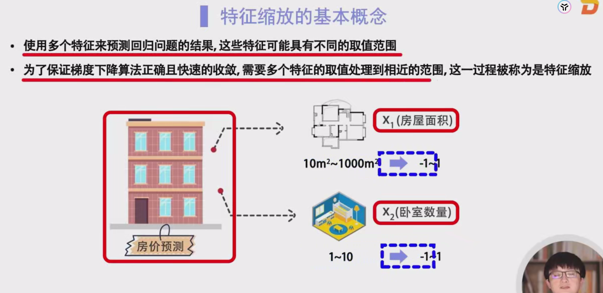
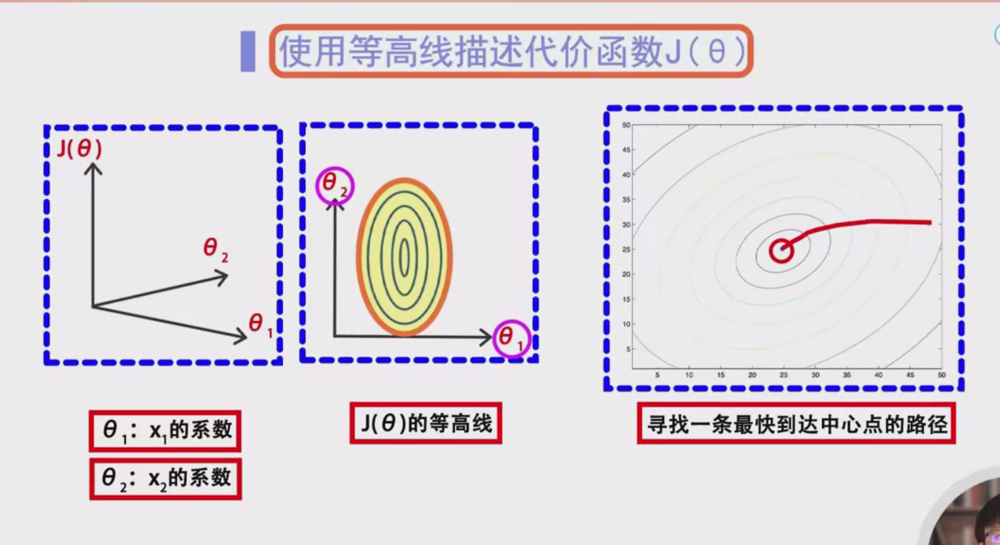
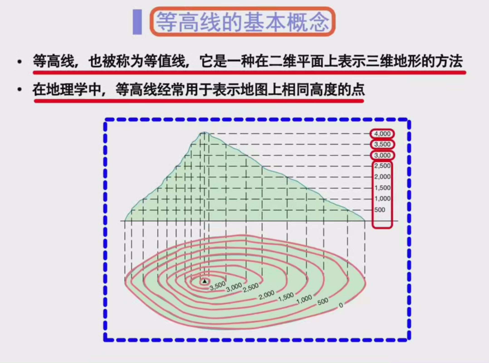
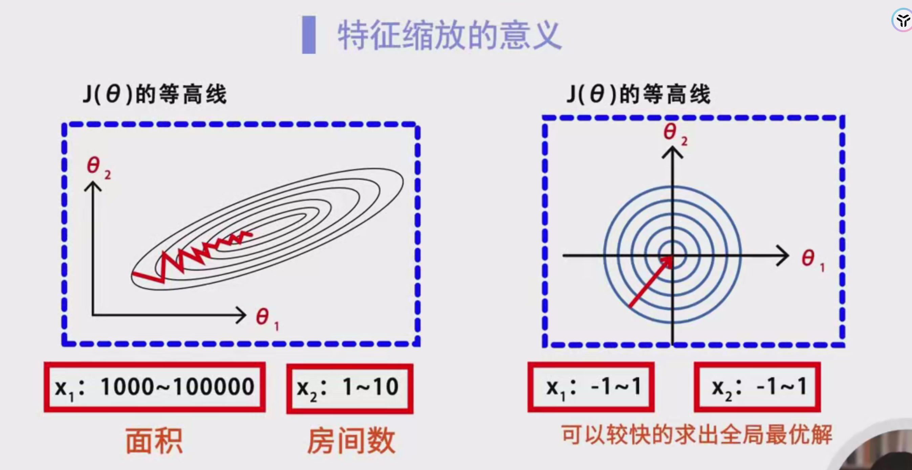
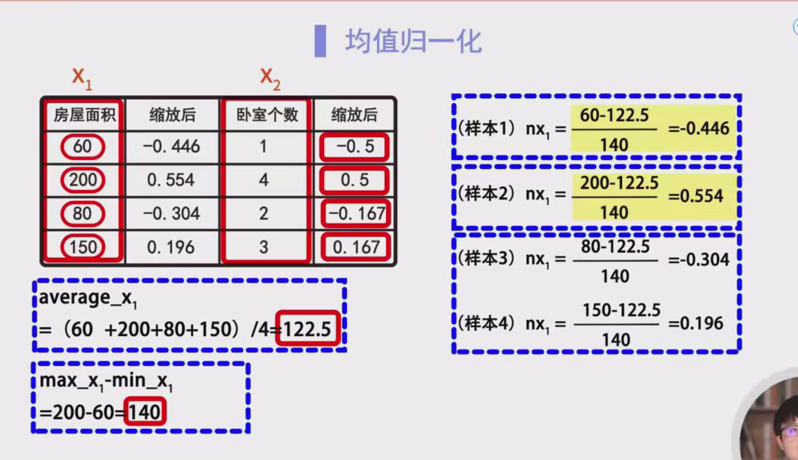
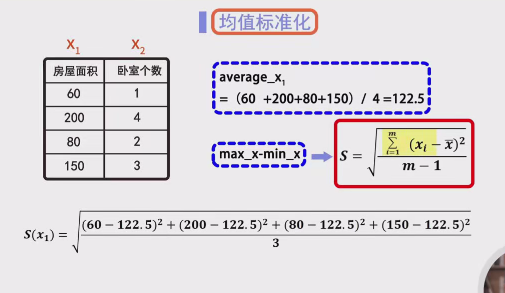

# 特征缩放算法设计

---

## 1. 引言

在机器学习，特别是**多元回归**问题中，我们通常使用多个特征（也称为变量）来预测目标变量（如房价）。这些特征在数值范围上可能存在显著差异。例如：

- **房屋面积（`x1`）**：取值范围可能在10平米到1000平米之间。
- **卧室数量（`x2`）**：取值范围可能在1到10之间。

这种不同的取值范围会对模型训练过程，尤其是优化算法（如梯度下降）的效率和效果产生负面影响。为了克服这一问题，我们引入**特征缩放（Feature Scaling）**技术，将不同特征的取值调整到相近的范围。

本笔记将详细介绍特征缩放的必要性、其对梯度下降算法的影响、常用的特征缩放方法以及具体的实现步骤。

---

## 2. 多元回归中的特征差异

在多元回归问题中，我们有多个输入特征用于预测一个输出变量。不同特征的取值范围可能差异巨大，这会导致以下问题：

- **优化困难**：梯度下降算法在处理不同取值范围的特征时，可能会遇到收敛速度慢或收敛到局部最小值的问题。
- **模型权重偏差**：取值范围较大的特征可能主导模型的训练过程，导致模型对其他特征的重视程度不足。
- **数值稳定性**：极大的数值范围可能导致计算过程中的数值不稳定或溢出问题。

因此，统一特征的取值范围是提高模型训练效果和效率的关键步骤。

---

## 3. 特征缩放的必要性

### 3.1 梯度下降算法简介

**梯度下降算法**是一种优化算法，常用于最小化模型的损失函数（如均方误差）。其基本思想是通过迭代更新模型参数，使损失函数值逐步减小，最终收敛到最小值。

**梯度下降的更新公式**：

$
\theta := \theta - \alpha \cdot \nabla J(\theta)
$

- $ \theta $：模型参数
- $ \alpha $：学习率
- $ \nabla J(\theta) $：损失函数关于参数的梯度

**梯度下降的收敛速度**受到以下因素影响：

- **学习率的选择**：过大可能导致震荡或发散，过小则收敛速度慢。
- **损失函数的形状**：如果损失函数在不同方向上的曲率差异大，梯度下降可能沿着狭长的路径收敛，导致收敛速度慢。

特征缩放通过调整特征取值范围，使得损失函数的形状更加“圆滑”，从而提升梯度下降的效率。

### 3.2 等高线的概念与应用

**等高线（Contour Line）**是地理学中用于表示相同高度的线条。在机器学习中，我们将等高线应用于损失函数的可视化，以理解其几何结构。

**等高线图的特点**：

- 每条等高线代表损失函数 $ J(\theta) $ 的一个固定值。
- 等高线越密集，表示该区域损失函数变化越快。
- 等高线的形状反映了损失函数的曲率和参数之间的相关性。

**示例**：

假设我们有两个参数 $ \theta_1 $ 和 $ \theta_2 $，绘制损失函数 $ J(\theta_1, \theta_2) $ 的等高线图，如下图所示：

*(示意图说明：黑色三角代表损失函数的全局最小值，不同颜色代表不同的损失函数值。)*

### 3.3 特征缩放对梯度下降的影响

在没有进行特征缩放的情况下，特征取值范围差异较大，会导致损失函数的等高线呈现出细长的椭圆形（形状细长的“Jc塔”）。这种形状会使得梯度下降算法在不同方向上移动的步伐差异较大，导致算法沿着狭长路径迂回前进，收敛速度变慢。

**特征缩放的效果**：

- **未缩放特征**：等高线呈现细长椭圆形，梯度下降路径迂回，收敛速度慢。
- **缩放后的特征**：等高线更接近圆形，梯度下降路径更直，收敛速度快。

**视觉化说明**：

未缩放特征的等高线图：

缩放后特征的等高线图：

*(注：以上图片链接为示意，实际使用时请替换为真实图片。)*

---

## 4. 特征缩放的方法

特征缩放主要有两种常用方法：

1. **均值归一化（Mean Normalization）**
2. **均值标准化（Standardization）**

这两种方法都旨在将特征的取值范围调整到相近的尺度，但其具体计算方式有所不同。

### 4.1 均值归一化（Mean Normalization）

**目标**：将特征的取值缩放到 $[-1, 1]$ 的范围内。

**公式**：

$
n_x = \frac{x - \mu_x}{\text{max}_x - \text{min}_x}
$

- $ n_x $：缩放后的特征值
- $ x $：原始特征值
- $ \mu_x $：特征 $ x $ 的平均值（均值）
- $ \text{max}_x $：特征 $ x $ 的最大值
- $ \text{min}_x $：特征 $ x $ 的最小值

**步骤**：

1. **计算平均值（均值）**：
   $
   \mu_x = \frac{1}{m} \sum_{i=1}^{m} x_i
   $
   - $ m $：样本数量

2. **计算取值范围**：
   $
   \text{range}_x = \text{max}_x - \text{min}_x
   $

3. **应用归一化公式**：
   对每个样本的特征值 $ x_i $，计算缩放后的值 $ n_x $：
   $
   n_{x_i} = \frac{x_i - \mu_x}{\text{range}_x}
   $

**优点**：

- 简单易懂，计算成本低。
- 保持数据的原有分布形态。

**缺点**：

- 对异常值敏感，异常值可能影响均值和取值范围的计算，导致缩放效果不佳。

### 4.2 均值标准化（Standardization）

**目标**：将特征缩放，使其具有 **均值为 0** 和 **标准差为 1**。

**公式**：

$
n_x = \frac{x - \mu_x}{\sigma_x}
$

- $ n_x $：缩放后的特征值
- $ x $：原始特征值
- $ \mu_x $：特征 $ x $ 的平均值（均值）
- $ \sigma_x $：特征 $ x $ 的标准差

**标准差的计算公式**：

$
\sigma_x = \sqrt{\frac{1}{m - 1} \sum_{i=1}^{m} (x_i - \mu_x)^2}
$

- $ m $：样本数量

**步骤**：

1. **计算平均值（均值）**：
   $
   \mu_x = \frac{1}{m} \sum_{i=1}^{m} x_i
   $

2. **计算标准差**：
   $
   \sigma_x = \sqrt{\frac{1}{m - 1} \sum_{i=1}^{m} (x_i - \mu_x)^2}
   $

3. **应用标准化公式**：
   对每个样本的特征值 $ x_i $，计算缩放后的值 $ n_x $：
   $
   n_{x_i} = \frac{x_i - \mu_x}{\sigma_x}
   $

**优点**：

- 不受异常值的影响，因为标准差考虑了数据的整体分布。
- 数据呈标准正态分布，有利于许多机器学习算法的优化。

**缺点**：

- 计算稍复杂，需要计算标准差。

---

## 5. 特征缩放的详细示例

为了更好地理解特征缩放的具体操作，下面通过一个详细的示例进行说明。

### 5.1 均值归一化示例

**场景**：预测房价，使用两个特征：

- **`x1`**：房屋面积（单位：平米）
- **`x2`**：卧室数量

**数据集**：

| 样本 | `x1`（面积） | `x2`（卧室数） |
| ---- | ------------ | -------------- |
| 1    | 60           | 1              |
| 2    | 200          | 5              |
| 3    | 80           | 0.167          |
| 4    | 150          | 0.167          |

**步骤**：

1. **计算每个特征的平均值、最大值和最小值**：

   - **`x1`**：
     $
     \mu_{x1} = \frac{60 + 200 + 80 + 150}{4} = \frac{490}{4} = 122.5
     $
     $
     \text{max}_{x1} = 200, \quad \text{min}_{x1} = 60
     $
     $
     \text{range}_{x1} = 200 - 60 = 140
     $

   - **`x2`**：
     $
     \mu_{x2} = \frac{1 + 5 + 0.167 + 0.167}{4} = \frac{6.334}{4} = 1.5835
     $
     $
     \text{max}_{x2} = 5, \quad \text{min}_{x2} = 0.167
     $
     $
     \text{range}_{x2} = 5 - 0.167 = 4.833
     $

2. **应用均值归一化公式**：

   - **`x1` 的缩放**：

     | 样本 | 原始 `x1` | 归一化公式                                                   | 缩放后的 `x1` |
     | ---- | --------- | ------------------------------------------------------------ | ------------- |
     | 1    | 60        | $ \frac{60 - 122.5}{140} = \frac{-62.5}{140} \approx -0.446 $ | -0.446        |
     | 2    | 200       | $ \frac{200 - 122.5}{140} = \frac{77.5}{140} \approx 0.554 $ | 0.554         |
     | 3    | 80        | $ \frac{80 - 122.5}{140} = \frac{-42.5}{140} \approx -0.304 $ | -0.304        |
     | 4    | 150       | $ \frac{150 - 122.5}{140} = \frac{27.5}{140} \approx 0.196 $ | 0.196         |

   - **`x2` 的缩放**：

     | 样本 | 原始 `x2` | 归一化公式                                                   | 缩放后的 `x2` |
     | ---- | --------- | ------------------------------------------------------------ | ------------- |
     | 1    | 1         | $ \frac{1 - 1.5835}{4.833} = \frac{-0.5835}{4.833} \approx -0.121 $ | -0.121        |
     | 2    | 5         | $ \frac{5 - 1.5835}{4.833} = \frac{3.4165}{4.833} \approx 0.707 $ | 0.707         |
     | 3    | 0.167     | $ \frac{0.167 - 1.5835}{4.833} = \frac{-1.4165}{4.833} \approx -0.293 $ | -0.293        |
     | 4    | 0.167     | 同样计算，结果为 -0.293                                      | -0.293        |

**缩放后的数据集**：

| 样本 | 缩放后 `x1` | 缩放后 `x2` |
| ---- | ----------- | ----------- |
| 1    | -0.446      | -0.121      |
| 2    | 0.554       | 0.707       |
| 3    | -0.304      | -0.293      |
| 4    | 0.196       | -0.293      |

### 5.2 均值标准化示例

**场景**：同上，使用相同的数据集。

**步骤**：

1. **计算每个特征的平均值和标准差**：

   - **`x1`**：
     $
     \mu_{x1} = 122.5
     $
     $
     \sigma_{x1} = \sqrt{\frac{(60 - 122.5)^2 + (200 - 122.5)^2 + (80 - 122.5)^2 + (150 - 122.5)^2}{4 - 1}}
     $
     具体计算：
     $
     (60 - 122.5)^2 = (-62.5)^2 = 3906.25
     $
     $
     (200 - 122.5)^2 = 77.5^2 = 6006.25
     $
     $
     (80 - 122.5)^2 = (-42.5)^2 = 1806.25
     $
     $
     (150 - 122.5)^2 = 27.5^2 = 756.25
     $
     $
     \sum = 3906.25 + 6006.25 + 1806.25 + 756.25 = 11475
     $
     $
     \sigma_{x1} = \sqrt{\frac{11475}{3}} = \sqrt{3825} \approx 61.84
     $

   - **`x2`**：
     $
     \mu_{x2} = 1.5835
     $
     $
     \sigma_{x2} = \sqrt{\frac{(1 - 1.5835)^2 + (5 - 1.5835)^2 + (0.167 - 1.5835)^2 + (0.167 - 1.5835)^2}{4 - 1}}
     $
     具体计算：
     $
     (1 - 1.5835)^2 = (-0.5835)^2 \approx 0.3405
     $
     $
     (5 - 1.5835)^2 = 3.4165^2 \approx 11.6732
     $
     $
     (0.167 - 1.5835)^2 = (-1.4165)^2 \approx 2.0053
     $
     $
     (0.167 - 1.5835)^2 = (-1.4165)^2 \approx 2.0053
     $
     $
     \sum \approx 0.3405 + 11.6732 + 2.0053 + 2.0053 \approx 16.0243
     $
     $
     \sigma_{x2} = \sqrt{\frac{16.0243}{3}} = \sqrt{5.3414} \approx 2.31
     $

2. **应用标准化公式**：

   - **`x1` 的标准化**：

     | 样本 | 原始 `x1` | 标准化公式                                                   | 标准化后的 `x1` |
     | ---- | --------- | ------------------------------------------------------------ | --------------- |
     | 1    | 60        | $ \frac{60 - 122.5}{61.84} = \frac{-62.5}{61.84} \approx -1.010 $ | -1.010          |
     | 2    | 200       | $ \frac{200 - 122.5}{61.84} = \frac{77.5}{61.84} \approx 1.252 $ | 1.252           |
     | 3    | 80        | $ \frac{80 - 122.5}{61.84} = \frac{-42.5}{61.84} \approx -0.687 $ | -0.687          |
     | 4    | 150       | $ \frac{150 - 122.5}{61.84} = \frac{27.5}{61.84} \approx 0.444 $ | 0.444           |

   - **`x2` 的标准化**：

     | 样本 | 原始 `x2` | 标准化公式                                                   | 标准化后的 `x2` |
     | ---- | --------- | ------------------------------------------------------------ | --------------- |
     | 1    | 1         | $ \frac{1 - 1.5835}{2.31} = \frac{-0.5835}{2.31} \approx -0.253 $ | -0.253          |
     | 2    | 5         | $ \frac{5 - 1.5835}{2.31} = \frac{3.4165}{2.31} \approx 1.479 $ | 1.479           |
     | 3    | 0.167     | $ \frac{0.167 - 1.5835}{2.31} = \frac{-1.4165}{2.31} \approx -0.613 $ | -0.613          |
     | 4    | 0.167     | 同样计算，结果为 -0.613                                      | -0.613          |

**缩放后的数据集**：

| 样本 | 标准化后 `x1` | 标准化后 `x2` |
| ---- | ------------- | ------------- |
| 1    | -1.010        | -0.253        |
| 2    | 1.252         | 1.479         |
| 3    | -0.687        | -0.613        |
| 4    | 0.444         | -0.613        |

---

## 6. 特征缩放的总结与应用

### 6.1 特征缩放的影响

通过特征缩放，尤其是均值归一化和均值标准化，可以显著改善梯度下降算法的性能和模型的整体效果：

- **加快收敛速度**：统一特征的尺度使得损失函数的等高线更接近圆形，梯度下降能够更直线地向最小值收敛，减少迭代次数。
- **避免权重偏差**：防止取值范围较大的特征在模型训练中占据主导地位，确保所有特征对模型的贡献均衡。
- **提升数值稳定性**：缩小特征的数值范围，减少数值计算中的溢出和不稳定问题。

### 6.2 选择特征缩放方法

选择均值归一化还是均值标准化，取决于具体应用场景和数据分布：

- **均值归一化**适用于需要将特征缩放到特定范围（如 $[-1, 1]$）的情况，且对异常值不太敏感。
- **均值标准化**更适用于特征分布接近正态分布的情况，对异常值的影响较小，适用于大多数机器学习算法。

### 6.3 特征缩放的实际应用步骤

1. **数据预处理**：
   - 收集并清洗数据，处理缺失值和异常值。
2. **计算统计量**：
   - 对每个特征，计算均值、最大值、最小值（用于均值归一化）或标准差（用于均值标准化）。
3. **应用缩放公式**：
   - 根据选择的缩放方法，计算每个样本的缩放后特征值。
4. **模型训练**：
   - 使用缩放后的特征数据进行模型训练，提高优化算法的效率和模型的性能。
5. **反向转换（如需要）**：
   - 对于需要解释模型预测结果的场景，可能需要将缩放后的预测值转换回原始尺度。

### 6.4 注意事项

- **训练集与测试集的处理**：
  - 仅使用训练集的数据计算均值、最大值、最小值和标准差等统计量。
  - 使用训练集计算得到的统计量对测试集进行缩放，确保数据处理的一致性。
- **异常值处理**：
  - 虽然均值标准化对异常值的影响较小，但在数据预处理中，仍需考虑处理异常值，以避免对模型产生不利影响。
- **不同特征的独立处理**：
  - 每个特征应独立进行缩放，避免特征之间的关联性被引入缩放过程中。

---

## 7. 常见问题与解答

### 问题1：为什么特征缩放对线性回归模型特别重要？

**回答**：在线性回归模型中，不同特征的取值范围差异会导致模型参数的梯度更新不均衡，影响梯度下降的收敛速度和稳定性。特征缩放通过统一特征尺度，提高模型训练的效率和准确性。

### 问题2：特征缩放是否适用于所有类型的机器学习模型？

**回答**：特征缩放对于基于距离的模型（如K近邻、支持向量机）和基于梯度的优化算法（如神经网络、线性回归）尤其重要。但对于决策树和随机森林等基于树的模型，特征缩放的影响较小。

### 问题3：如何处理训练集和测试集中的特征缩放？

**回答**：在特征缩放时，统计量（如均值、标准差、最大值、最小值）应仅基于训练集计算。然后，使用这些统计量对训练集和测试集进行缩放，避免数据泄漏。

### 问题4：如果数据中存在异常值，如何选择特征缩放方法？

**回答**：如果数据中存在显著的异常值，建议使用**均值标准化**，因为它对异常值的影响较小。或者，可以考虑先进行异常值处理，如移除或替换异常值，再进行特征缩放。

### 问题5：特征缩放是否会影响模型的解释性？

**回答**：特征缩放本身不会改变模型的解释性，但在解释模型参数时，需要注意参数所对应的缩放后的特征。如果需要，将参数转换回原始尺度以便更直观地解释。

