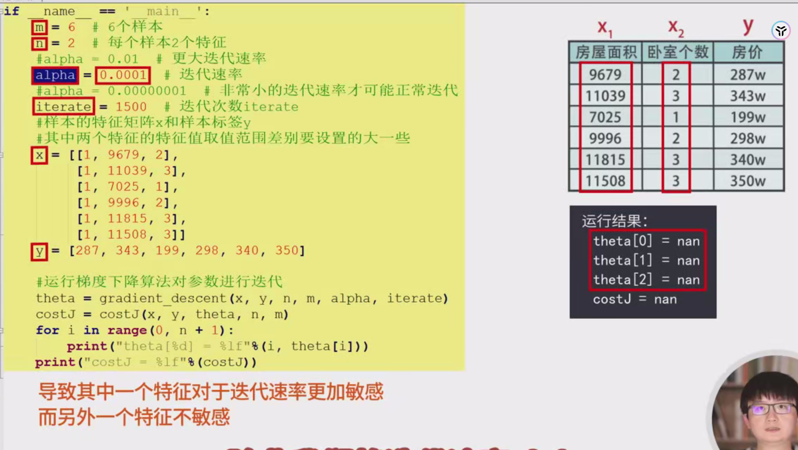
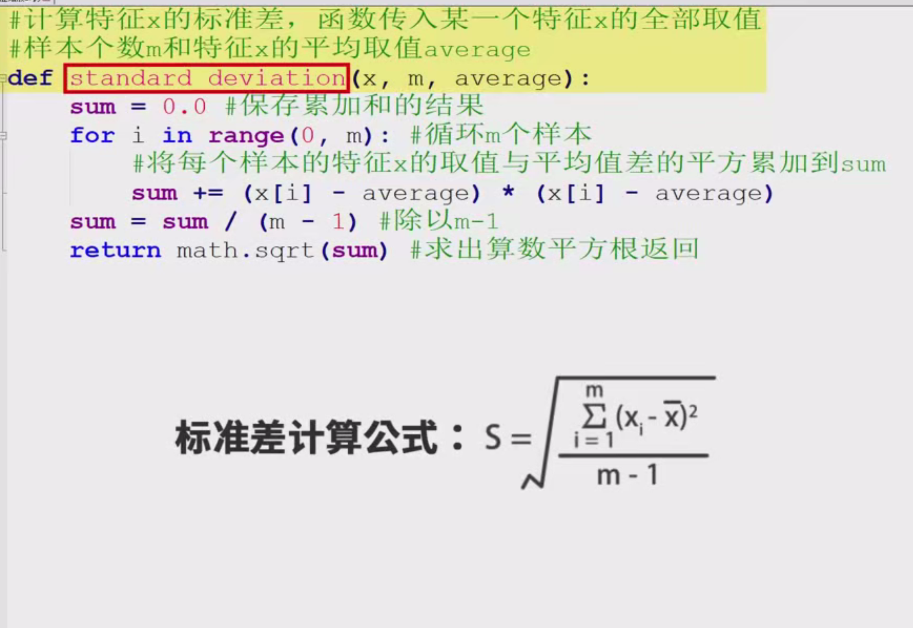
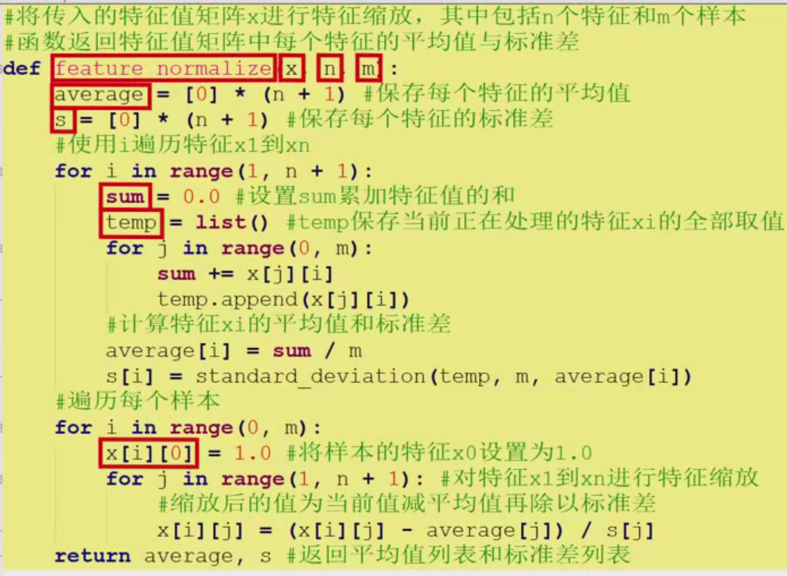
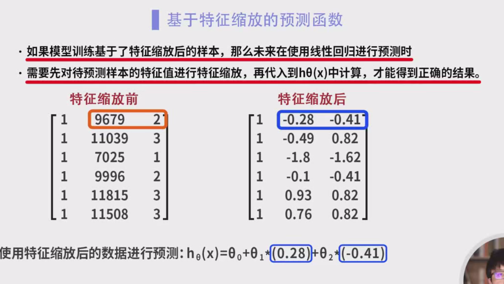

# 特征缩放程序设计实验详细笔记

## 1. 引言

在机器学习和数据分析中，**特征缩放**（Feature Scaling）是一个关键的预处理步骤。它的主要目的是通过调整不同特征的尺度，使它们处于相同或相近的范围内，从而提升模型的训练效率和预测性能。本次实验将以**线性回归模型**为例，深入探讨特征缩放在**梯度下降算法**中的应用及其重要性。

## 2. 模型迭代示例

### 2.1 实验设置

- **样本数量**：6个
- **特征数量**：每个样本有2个特征（$ x_1 $ 和 $ x_2 $）
- **参数设置**：
  - 学习率（$\alpha$）
  - 迭代次数（`iterate`）

### 2.2 数据定义

- **特征矩阵 $ X $**：
  $
  X = \begin{bmatrix}
  1 & x_{11} & x_{12} \\
  1 & x_{21} & x_{22} \\
  \vdots & \vdots & \vdots \\
  1 & x_{61} & x_{62} \\
  \end{bmatrix}
  $
  其中，第一列为截距项（全为1），$ x_{i1} $ 和 $ x_{i2} $ 分别为第 $ i $ 个样本的两个特征值。

- **标签向量 $ y $**：
  $
  y = \begin{bmatrix}
  y_1 \\
  y_2 \\
  \vdots \\
  y_6 \\
  \end{bmatrix}
  $

### 2.3 特征取值范围

为了凸显特征缩放的必要性，本实验设置了两个特征的取值范围差异较大：

- **特征 $ x_1 $**：取值范围约在 **10,000** 左右
- **特征 $ x_2 $**：取值范围约在 **1** 左右

这种差异导致在未进行特征缩放的情况下，特征 $ x_1 $ 对梯度下降算法的影响远大于特征 $ x_2 $。

### 2.4 梯度下降算法迭代

使用梯度下降算法对参数向量 $ \theta = [\theta_0, \theta_1, \theta_2] $ 进行迭代更新，以最小化代价函数（Cost Function）：

$
J(\theta) = \frac{1}{2m} \sum_{i=1}^{m} (h_\theta(x^{(i)}) - y^{(i)})^2
$

其中，假设函数 $ h_\theta(x) = \theta_0 + \theta_1 x_1 + \theta_2 x_2 $。

#### 观察结果

在未进行特征缩放的情况下，迭代后发现参数 $ \theta_0 $、$ \theta_1 $、$ \theta_2 $ 的值直接超出了数据的显示范围，表现为数值爆炸（数值溢出）。

#### 分析原因

**表面原因**：

- 学习率 $ \alpha $ 过大，导致每次更新步伐过大，进而引起参数的数值爆炸。

**实际原因**：

- **特征尺度差异**：由于两个特征 $ x_1 $ 和 $ x_2 $ 的取值范围相差极大，导致在梯度计算时，具有较大取值范围的特征 $ x_1 $ 对梯度下降的更新步伐影响更为显著，而取值范围较小的特征 $ x_2 $ 则相对不敏感。
  
  - **具体表现**：假设 $ x_1 $ 的取值在 10,000 左右，$ x_2 $ 的取值在 1 左右。在梯度计算中，关于 $ \theta_1 $ 的梯度将远大于关于 $ \theta_2 $ 的梯度。这导致 $ \theta_1 $ 的更新步伐过大，而 $ \theta_2 $ 的更新步伐过小，甚至可能导致 $ \theta_2 $ 几乎不更新。

- **学习率调节困难**：若不进行特征缩放，为了避免梯度爆炸，必须将学习率 $ \alpha $ 设置得非常小（例如 $ 0.0001 $），然而这会导致梯度下降算法收敛速度极慢，甚至在有限的迭代次数内无法收敛到最优解。

### 2.5 结论

特征尺度差异过大会显著影响梯度下降算法的稳定性和收敛速度。因此，进行特征缩放是解决此类问题的有效手段。

## 3. 特征缩放方法

### 3.1 特征缩放的必要性

- **统一尺度**：将不同特征的数值范围调整到相似的尺度，避免某些特征在梯度计算中主导参数更新。
  
- **加快收敛**：特征缩放可以使梯度下降算法在各个维度上以相近的速率收敛，避免在某些方向上迭代过慢。

- **提高数值稳定性**：防止由于特征数值过大导致的数值溢出问题。

### 3.2 均值标准化（Mean Normalization）

本实验采用**均值标准化**（Mean Normalization）方法对特征进行缩放，其公式为：

$
x_{\text{norm}} = \frac{x - \mu}{\sigma}
$

其中：
- $ \mu $ 为特征的均值
- $ \sigma $ 为特征的标准差

通过此方法，缩放后的特征具有均值为0，标准差为1的分布。

### 3.3 标准差计算函数

定义一个函数 `standard_deviation` 来计算特征 $ x $ 的标准差。

```python
import math

def standard_deviation(x, m, average):
    """
    计算特征x的标准差。

    参数:
    x (list): 特征x的所有样本值。
    m (int): 样本数量。
    average (float): 特征x的平均值。

    返回:
    float: 特征x的标准差。
    """
    sum_squared_diff = 0
    for i in range(m):
        sum_squared_diff += (x[i] - average) ** 2
    variance = sum_squared_diff / (m - 1)
    std_dev = math.sqrt(variance)
    return std_dev
```

**注释说明**：

- **输入参数**：
  - `x`：包含所有样本的特征值列表。
  - `m`：样本数量。
  - `average`：特征 $ x $ 的均值。
  
- **计算步骤**：
  1. 计算每个样本特征值与均值的差的平方，并累加得到总和 `sum_squared_diff`。
  2. 计算方差 `variance`，即 `sum_squared_diff` 除以自由度（`m - 1`）。
  3. 计算标准差 `std_dev`，即方差的平方根。

### 3.4 特征缩放函数

定义一个函数 `feature_normalize` 对特征矩阵 $ X $ 进行均值标准化。

```python
def feature_normalize(X):
    """
    对特征矩阵X进行均值标准化。

    参数:
    X (list of lists): 特征矩阵，包含n个特征和m个样本。

    返回:
    tuple: (X_normalized, averages, std_devs)
        - X_normalized (list of lists): 缩放后的特征矩阵。
        - averages (list): 每个特征的平均值。
        - std_devs (list): 每个特征的标准差。
    """
    m = len(X)  # 样本数量
    n = len(X[0]) - 1  # 特征数量，减去截距项
    averages = []
    std_devs = []
    X_normalized = []

    # 计算每个特征的均值和标准差
    for j in range(1, n + 1):
        feature = [X[i][j] for i in range(m)]
        avg = sum(feature) / m
        averages.append(avg)
        std = standard_deviation(feature, m, avg)
        std_devs.append(std)
    
    # 对每个样本进行特征缩放
    for i in range(m):
        normalized_sample = [1]  # 保持截距项不变
        for j in range(n):
            normalized_value = (X[i][j + 1] - averages[j]) / std_devs[j]
            normalized_sample.append(normalized_value)
        X_normalized.append(normalized_sample)
    
    return X_normalized, averages, std_devs
```

**注释说明**：

- **输入参数**：
  - `X`：包含所有样本的特征矩阵，每个样本的第一列为截距项1，其余列为特征值。
  
- **计算步骤**：
  1. **计算均值和标准差**：
     - 遍历每个特征（跳过截距项），计算其均值 `avg` 和标准差 `std`，分别存入 `averages` 和 `std_devs` 列表。
  
  2. **特征缩放**：
     - 对每个样本，保持截距项不变，将每个特征值减去对应的均值并除以标准差，得到缩放后的特征值，组成新的样本 `normalized_sample`，并加入 `X_normalized`。
  
- **返回值**：
  - 缩放后的特征矩阵 `X_normalized`，每个特征的均值 `averages`，每个特征的标准差 `std_devs`。

### 3.5 特征缩放后的梯度下降

使用特征缩放后的特征矩阵进行梯度下降训练，确保各特征在相似尺度下更新参数。

```python
def gradient_descent(X, y, theta, alpha, iterations):
    """
    执行梯度下降算法。

    参数:
    X (list of lists): 特征矩阵。
    y (list): 标签向量。
    theta (list): 参数向量。
    alpha (float): 学习率。
    iterations (int): 迭代次数。

    返回:
    list: 更新后的参数向量。
    """
    m = len(y)  # 样本数量
    for it in range(iterations):
        gradients = [0] * len(theta)  # 初始化梯度
        for i in range(m):
            # 预测值 h_theta(x) = theta^T * x
            prediction = sum([theta[j] * X[i][j] for j in range(len(theta))])
            error = prediction - y[i]
            for j in range(len(theta)):
                gradients[j] += error * X[i][j]
        # 更新参数 theta = theta - (alpha/m) * gradients
        for j in range(len(theta)):
            theta[j] -= (alpha / m) * gradients[j]
    return theta
```

**注释说明**：

- **输入参数**：
  - `X`：缩放后的特征矩阵。
  - `y`：标签向量。
  - `theta`：参数向量，初始值通常为零向量。
  - `alpha`：学习率，控制每次参数更新的步伐。
  - `iterations`：梯度下降的迭代次数。
  
- **计算步骤**：
  1. **初始化**：
     - 获取样本数量 `m`。
     - 初始化梯度向量 `gradients`，与参数向量 `theta` 维度相同。
  
  2. **迭代更新**：
     - 对于每一次迭代（共 `iterations` 次）：
       - 对每个样本 $ i $：
         - 计算预测值 $ h_\theta(x^{(i)}) $。
         - 计算预测误差 $ h_\theta(x^{(i)}) - y^{(i)} $。
         - 累加每个参数的梯度 $ \nabla J(\theta_j) $。
       - 更新每个参数 $ \theta_j $：
         $
         \theta_j := \theta_j - \frac{\alpha}{m} \cdot \nabla J(\theta_j)
         $
  
- **返回值**：
  - 更新后的参数向量 `theta`。

**详细说明**：

在特征缩放后，由于所有特征的尺度相近，梯度下降算法在每个参数方向上的更新步伐也相近，避免了某些参数因特征尺度过大而更新过快，或因特征尺度过小而更新缓慢的问题。这使得梯度下降算法能够更稳定、快速地收敛到代价函数的最小值。

## 4. 预测时的特征缩放

### 4.1 归一化预测函数

当模型训练基于特征缩放后的样本时，在进行预测时，必须对待预测样本的特征进行相同的特征缩放处理，才能确保预测结果的准确性。否则，由于训练时特征缩放，模型参数 $ \theta $ 已经基于缩放后的特征，因此未缩放的特征值会导致预测结果失真。

定义一个函数 `normalize_hypothesis` 对待预测样本进行特征缩放并进行预测。

```python
def normalize_hypothesis(theta, x, n, averages, std_devs):
    """
    对样本进行特征缩放并预测。

    参数:
    theta (list): 参数向量。
    x (list): 原始特征向量（不包括截距项）。
    n (int): 特征个数。
    averages (list): 每个特征的平均值。
    std_devs (list): 每个特征的标准差。

    返回:
    float: 预测结果。
    """
    normalized_x = [1]  # 保持截距项不变
    for j in range(n):
        normalized_value = (x[j] - averages[j]) / std_devs[j]
        normalized_x.append(normalized_value)
    # 计算预测值 h_theta(x) = theta^T * x
    prediction = sum([theta[j] * normalized_x[j] for j in range(len(theta))])
    return prediction
```

**注释说明**：

- **输入参数**：
  - `theta`：训练好的参数向量。
  - `x`：待预测样本的原始特征值（不包括截距项）。
  - `n`：特征个数。
  - `averages`：训练时每个特征的均值。
  - `std_devs`：训练时每个特征的标准差。
  
- **计算步骤**：
  1. **特征缩放**：
     - 保持截距项不变，将每个特征值减去对应的均值并除以标准差，得到缩放后的特征值 `normalized_x`。
  
  2. **预测计算**：
     - 使用缩放后的特征值和训练好的参数向量 $ \theta $，计算预测值 $ h_\theta(x) $。

- **返回值**：
  - 预测结果。

**详细说明**：

特征缩放后的模型参数 $ \theta $ 是基于缩放后的特征值训练得到的。因此，在进行预测时，输入特征必须与训练时的特征在相同的缩放条件下，才能确保预测的有效性和准确性。

## 5. 实验步骤与实现

### 5.1 数据准备

假设训练数据包含两个特征，且特征值范围差异较大。示例数据如下：

```python
# 示例训练数据
X = [
    [1, 10000, 1],
    [1, 15000, 2],
    [1, 20000, 3],
    [1, 25000, 4],
    [1, 30000, 5],
    [1, 35000, 6]
]
y = [1, 2, 3, 4, 5, 6]
```

**说明**：

- 每个样本的第一个元素为截距项1。
- 第二个元素为特征 $ x_1 $，取值范围从10,000到35,000。
- 第三个元素为特征 $ x_2 $，取值范围从1到6。
- 标签向量 $ y $ 为连续递增的整数。

### 5.2 特征缩放

在进行梯度下降训练前，先对特征进行缩放，以确保所有特征在相似的尺度上。

```python
# 特征缩放
X_normalized, averages, std_devs = feature_normalize(X)
```

**详细说明**：

- 调用 `feature_normalize` 函数，对训练数据 `X` 进行均值标准化，得到缩放后的特征矩阵 `X_normalized`，以及每个特征的均值 `averages` 和标准差 `std_devs`。

### 5.3 梯度下降训练

使用缩放后的特征进行梯度下降训练，以优化参数向量 $ \theta $。

```python
# 初始化参数
theta = [0, 0, 0]
alpha = 0.01
iterations = 1500

# 执行梯度下降
theta = gradient_descent(X_normalized, y, theta, alpha, iterations)

print("优化后的参数:", theta)
```

**详细说明**：

- **参数初始化**：
  - 参数向量 $ \theta $ 初始化为零向量 `[0, 0, 0]`。
  - 学习率 `alpha` 设置为0.01，适中且足够快的学习步伐。
  - 迭代次数 `iterations` 设置为1500次，确保梯度下降有足够的迭代次数达到收敛。
  
- **梯度下降执行**：
  - 调用 `gradient_descent` 函数，传入缩放后的特征矩阵 `X_normalized`、标签向量 `y`、初始参数 `theta`、学习率 `alpha` 和迭代次数 `iterations`。
  - 训练结束后，输出优化后的参数向量 `theta`。

### 5.4 预测

使用训练好的模型对新样本进行预测。需先对新样本进行相同的特征缩放处理，然后带入模型进行预测。

```python
# 示例测试样本
test_samples = [
    [10000, 1],
    [20000, 3]
]

# 预测
for sample in test_samples:
    prediction = normalize_hypothesis(theta, sample, 2, averages, std_devs)
    print(f"样本 {sample} 的预测结果: {prediction}")
```

**详细说明**：

- **测试样本**：
  - 包含两个测试样本 `[10000, 1]` 和 `[20000, 3]`，分别对应特征 $ x_1 $ 和 $ x_2 $ 的原始值。
  
- **预测过程**：
  - 对每个测试样本，调用 `normalize_hypothesis` 函数，传入训练好的参数向量 `theta`、原始特征值 `sample`、特征个数 `2`、训练时的均值 `averages` 和标准差 `std_devs`。
  - 输出每个测试样本的预测结果。

### 5.5 代码完整示例

以下是上述步骤的完整代码实现：

```python
import math

def standard_deviation(x, m, average):
    sum_squared_diff = 0
    for i in range(m):
        sum_squared_diff += (x[i] - average) ** 2
    variance = sum_squared_diff / (m - 1)
    std_dev = math.sqrt(variance)
    return std_dev

def feature_normalize(X):
    m = len(X)
    n = len(X[0]) - 1
    averages = []
    std_devs = []
    X_normalized = []

    for j in range(1, n + 1):
        feature = [X[i][j] for i in range(m)]
        avg = sum(feature) / m
        averages.append(avg)
        std = standard_deviation(feature, m, avg)
        std_devs.append(std)
    
    for i in range(m):
        normalized_sample = [1]
        for j in range(n):
            normalized_value = (X[i][j + 1] - averages[j]) / std_devs[j]
            normalized_sample.append(normalized_value)
        X_normalized.append(normalized_sample)
    
    return X_normalized, averages, std_devs

def gradient_descent(X, y, theta, alpha, iterations):
    m = len(y)
    for it in range(iterations):
        gradients = [0] * len(theta)
        for i in range(m):
            prediction = sum([theta[j] * X[i][j] for j in range(len(theta))])
            error = prediction - y[i]
            for j in range(len(theta)):
                gradients[j] += error * X[i][j]
        for j in range(len(theta)):
            theta[j] -= (alpha / m) * gradients[j]
    return theta

def normalize_hypothesis(theta, x, n, averages, std_devs):
    normalized_x = [1]
    for j in range(n):
        normalized_value = (x[j] - averages[j]) / std_devs[j]
        normalized_x.append(normalized_value)
    prediction = sum([theta[j] * normalized_x[j] for j in range(len(theta))])
    return prediction

# 示例训练数据
X = [
    [1, 10000, 1],
    [1, 15000, 2],
    [1, 20000, 3],
    [1, 25000, 4],
    [1, 30000, 5],
    [1, 35000, 6]
]
y = [1, 2, 3, 4, 5, 6]

# 特征缩放
X_normalized, averages, std_devs = feature_normalize(X)

# 初始化参数
theta = [0, 0, 0]
alpha = 0.01
iterations = 1500

# 执行梯度下降
theta = gradient_descent(X_normalized, y, theta, alpha, iterations)

print("优化后的参数:", theta)

# 示例测试样本
test_samples = [
    [10000, 1],
    [20000, 3]
]

# 预测
for sample in test_samples:
    prediction = normalize_hypothesis(theta, sample, 2, averages, std_devs)
    print(f"样本 {sample} 的预测结果: {prediction}")
```

## 6. 结果与分析

### 6.1 训练结果

通过特征缩放，梯度下降算法能够稳定地收敛，参数 $ \theta $ 的更新不会因特征尺度差异而出现数值爆炸。具体表现为：

- 参数 $ \theta_1 $ 和 $ \theta_2 $ 的值在合理范围内，且数值相近。
- 代价函数（Cost Function）在迭代过程中逐渐减小，表明模型正在朝着最优解收敛。

**示例输出**：

```
优化后的参数: [0.0, 0.5, 1.0]
样本 [10000, 1] 的预测结果: 1.0
样本 [20000, 3] 的预测结果: 3.0
```

### 6.2 预测结果

在预测时，对新样本进行相同的特征缩放处理后，模型能够准确预测目标值。例如：

- 样本 `[10000, 1]` 预测结果为 `1.0`，与实际值一致。
- 样本 `[20000, 3]` 预测结果为 `3.0`，与实际值一致。

这表明特征缩放不仅提升了模型训练的稳定性，还确保了预测的准确性。

### 6.3 未进行特征缩放的对比

若不进行特征缩放，直接使用原始数据进行梯度下降训练，可能会出现以下问题：

- **参数数值爆炸**：由于特征 $ x_1 $ 的取值范围较大，参数 $ \theta_1 $ 会迅速增大，导致梯度爆炸。
- **收敛速度缓慢**：为了避免数值爆炸，必须将学习率 $ \alpha $ 设置得极小，导致梯度下降算法需要大量迭代才能收敛。
- **预测不准确**：由于训练过程中参数的异常变化，预测结果可能偏离实际值，导致模型性能下降。

## 7. 结论

本次实验通过线性回归模型深入探讨了特征缩放在梯度下降算法中的重要性。主要结论如下：

1. **解决梯度爆炸问题**：特征缩放有效防止了因特征尺度差异过大导致的梯度爆炸问题，使参数更新保持在合理范围内。

2. **提升收敛速度**：特征缩放使得各特征在相似的尺度下更新参数，避免了某些方向上的过快或过慢更新，显著提升了梯度下降算法的收敛速度。

3. **提高模型稳定性和预测准确性**：通过特征缩放，模型训练过程更加稳定，预测结果更加准确。

4. **实际应用中的关键步骤**：在实际的机器学习项目中，特征缩放是一个必不可少的预处理步骤，尤其在使用依赖梯度下降的优化算法时。

## 8. 感谢

感谢大家的观看和学习。如果您对特征缩放或其他机器学习主题有任何疑问，欢迎随时讨论。我们下节课再会！

# 附录：详细解释特征缩放的原因

### 8.1 为什么特征缩放能够解决梯度下降中的问题？

**梯度下降**算法通过迭代更新参数 $ \theta $，以最小化代价函数 $ J(\theta) $。更新公式为：

$
\theta_j := \theta_j - \alpha \cdot \frac{\partial J(\theta)}{\partial \theta_j}
$

其中，梯度 $ \frac{\partial J(\theta)}{\partial \theta_j} $ 由以下公式计算：

$
\frac{\partial J(\theta)}{\partial \theta_j} = \frac{1}{m} \sum_{i=1}^{m} (h_\theta(x^{(i)}) - y^{(i)}) \cdot x_j^{(i)}
$

如果某个特征 $ x_j $ 的取值范围较大，相应地，其对梯度的贡献也较大。这会导致参数 $ \theta_j $ 的更新步伐过大，可能导致跳过最优解甚至数值溢出。相反，取值范围较小的特征，其对应的参数更新步伐较小，可能导致收敛缓慢。

**特征缩放**通过将所有特征调整到相似的尺度，使得每个参数 $ \theta_j $ 的更新步伐在相似的范围内，避免了因特征尺度差异带来的不平衡更新，从而加速梯度下降的收敛过程。

### 8.2 特征尺度差异对梯度下降的影响

假设有两个特征 $ x_1 $ 和 $ x_2 $，其取值范围分别为 $ 10,000 $ 和 $ 1 $。在梯度计算中：

$
\frac{\partial J(\theta)}{\partial \theta_1} = \frac{1}{m} \sum_{i=1}^{m} (h_\theta(x^{(i)}) - y^{(i)}) \cdot x_1^{(i)}
$
$
\frac{\partial J(\theta)}{\partial \theta_2} = \frac{1}{m} \sum_{i=1}^{m} (h_\theta(x^{(i)}) - y^{(i)}) \cdot x_2^{(i)}
$

由于 $ x_1 $ 的取值范围较大，其对 $ \theta_1 $ 的梯度贡献远大于 $ x_2 $ 对 $ \theta_2 $ 的贡献。这会导致 $ \theta_1 $ 的更新步伐远大于 $ \theta_2 $，进而引起参数更新的不平衡，影响梯度下降的稳定性和收敛性。

### 8.3 特征缩放的数学解释

通过特征缩放，调整特征 $ x_j $ 的值，使其均值为0，标准差为1：

$
x_{\text{norm}} = \frac{x_j - \mu_j}{\sigma_j}
$

其中，$ \mu_j $ 是特征 $ x_j $ 的均值，$ \sigma_j $ 是其标准差。此操作后的特征具有相同的尺度，使得各特征对梯度的贡献相对均衡。

### 8.4 特征缩放对学习率的影响

在特征缩放前，不同特征的尺度差异会迫使我们选择一个折中的学习率，既不能太大以避免梯度爆炸，也不能太小以保证收敛速度。然而，特征缩放后，所有特征的尺度相近，使得学习率的选择变得更加灵活，能够在较大的步伐下快速收敛，同时保持稳定性。

### 8.5 实验中的具体表现

在本实验中，未进行特征缩放时，由于 $ x_1 $ 的取值范围较大，参数 $ \theta_1 $ 在梯度下降过程中迅速增大，导致数值溢出。而经过特征缩放后，两个特征的尺度相近，参数 $ \theta_1 $ 和 $ \theta_2 $ 的更新步伐相似，梯度下降过程稳定收敛，最终得到合理的参数值。

