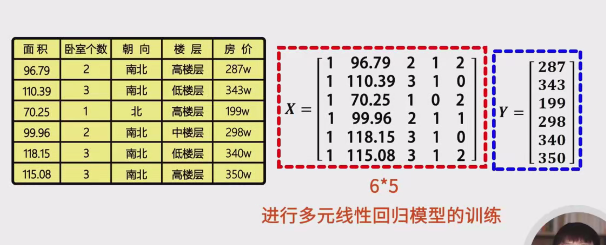

# 矩阵基本概念和运算详细笔记

## 一、矩阵的基本概念

### 1. 矩阵的定义
- **矩阵（Matrix）**：矩阵是一个由 $ m \times n $ 个数字（称为元素）组成的二维数组，具有 $ m $ 行和 $ n $ 列。矩阵常用于表示和处理多维数据。
  
  **符号表示**：
  - 矩阵通常用大写字母表示，如 $ A, B, C $。
  - 矩阵中的元素用小写字母表示，并加上下标表示其位置，如 $ a_{ij} $ 表示矩阵 $ A $ 中第 $ i $ 行第 $ j $ 列的元素。

  **示例**：
  $
  A = \begin{pmatrix}
  a_{11} & a_{12} & a_{13} & a_{14} \\
  a_{21} & a_{22} & a_{23} & a_{24} \\
  a_{31} & a_{32} & a_{33} & a_{34}
  \end{pmatrix}
  $
  这是一个 $ 3 \times 4 $ 的矩阵，包含 12 个元素。

### 2. 向量的特殊矩阵
- **列向量（Column Vector）**：只有一列的矩阵，表示为 $ m \times 1 $，称为 $ m $ 维列向量。
  
  **示例**：
  $
  b = \begin{pmatrix}
  b_1 \\
  b_2 \\
  b_3 \\
  b_4 \\
  b_5
  \end{pmatrix}
  $
  这是一个 5 维列向量。

- **行向量（Row Vector）**：只有一行的矩阵，表示为 $ 1 \times n $，称为 $ n $ 维行向量。
  
  **示例**：
  $
  c = \begin{pmatrix}
  c_1 & c_2 & c_3 & c_4 & c_5 & c_6
  \end{pmatrix}
  $
  这是一个 6 维行向量。

### 3. 矩阵的表示实例
- **矩阵 $ A $**：一个 $ 3 \times 4 $ 的矩阵，包含 12 个元素。
  
  **示例**：
  $
  A = \begin{pmatrix}
  1 & 2 & 3 & 4 \\
  5 & 6 & 7 & 8 \\
  9 & 10 & 11 & 12
  \end{pmatrix}
  $

- **向量 $ b $**：一个 5 维的列向量。
  
  **示例**：
  $
  b = \begin{pmatrix}
  1 \\
  2 \\
  3 \\
  4 \\
  5
  \end{pmatrix}
  $

- **向量 $ c $**：一个 6 维的行向量。
  
  **示例**：
  $
  c = \begin{pmatrix}
  1 & 2 & 3 & 4 & 5 & 6
  \end{pmatrix}
  $

## 二、矩阵在机器学习中的应用

### 1. 特征向量的存储
在机器学习中，矩阵常用于存储特征向量，以高效管理和计算大量数据。

- **特征矩阵（Feature Matrix）**：用于存储训练集中所有样本的特征。
  
  **定义**：
  - 若训练集中有 $ m $ 个样本，每个样本有 $ n $ 个特征，则特征矩阵 $ X $ 为 $ m \times n $ 的矩阵。
  
  **示例**：
  - 假设有 6 个样本，每个样本有 4 个特征，添加一个值为 1 的偏置特征（通常用于线性模型中的截距项），则特征矩阵 $ X $ 为 $ 6 \times 5 $ 的矩阵。

  $
  X = \begin{pmatrix}
  1 & x_{11} & x_{12} & x_{13} & x_{14} \\
  1 & x_{21} & x_{22} & x_{23} & x_{24} \\
  1 & x_{31} & x_{32} & x_{33} & x_{34} \\
  1 & x_{41} & x_{42} & x_{43} & x_{44} \\
  1 & x_{51} & x_{52} & x_{53} & x_{54} \\
  1 & x_{61} & x_{62} & x_{63} & x_{64}
  \end{pmatrix}
  $

### 2. 标记值的存储
每个样本通常对应一个标记值（如分类标签或回归目标）。

- **标记向量（Label Vector）**：使用 $ m \times 1 $ 的列向量 $ y $ 来保存所有样本的标记值。
  
  **示例**：
  $
  y = \begin{pmatrix}
  y_1 \\
  y_2 \\
  y_3 \\
  y_4 \\
  y_5 \\
  y_6
  \end{pmatrix}
  $

### 3. 应用实例
- **模型训练**：例如，多元线性回归模型的训练可以通过操作特征矩阵 $ X $ 和标记向量 $ y $ 来实现。
  
  **示例**：
  $
  y = X\beta + \epsilon
  $
  其中，$ \beta $ 是待求的回归系数向量，$ \epsilon $ 是误差向量。

## 三、矩阵的基本运算

### 1. 矩阵作为整体进行运算
矩阵运算时，通常将矩阵视为一个整体，按照特定的规则进行加减乘等操作。

### 2. 基础矩阵运算
基础的矩阵运算包括加法、减法、数乘、矩阵乘法和转置。

#### （一）矩阵的加法与减法
- **定义**：
  - 两个矩阵相加（或减），是指它们对应位置的元素进行加法（或减法）运算。
  
- **条件**：
  - 只有当两个矩阵的行数和列数分别相等时，才能进行加法或减法运算。
  
- **运算法则**：
  $
  (A \pm B)_{ij} = A_{ij} \pm B_{ij}
  $
  
- **示例**：
  设矩阵 $ A $ 和 $ B $ 都是 $ 3 \times 4 $ 的矩阵：
  $
  A = \begin{pmatrix}
  1 & 2 & 3 & 4 \\
  5 & 6 & 7 & 8 \\
  9 & 10 & 11 & 12
  \end{pmatrix}, \quad
  B = \begin{pmatrix}
  2 & 0 & 1 & 3 \\
  4 & 5 & 6 & 7 \\
  8 & 9 & 10 & 11
  \end{pmatrix}
  $
  
  则 $ A + B $ 为：
  $
  A + B = \begin{pmatrix}
  1+2 & 2+0 & 3+1 & 4+3 \\
  5+4 & 6+5 & 7+6 & 8+7 \\
  9+8 & 10+9 & 11+10 & 12+11
  \end{pmatrix} = \begin{pmatrix}
  3 & 2 & 4 & 7 \\
  9 & 11 & 13 & 15 \\
  17 & 19 & 21 & 23
  \end{pmatrix}
  $

- **性质**：
  - **交换律**：$ A + B = B + A $
  - **结合律**：$ (A + B) + C = A + (B + C) $
  
  **示例**：
  $
  A + B = B + A
  $
  $
  (A + B) + C = A + (B + C)
  $
  
#### （二）矩阵与数的乘法
- **定义**：
  - 数 $ \lambda $ 乘以矩阵 $ A $，表示将 $ \lambda $ 乘以矩阵 $ A $ 中的每一个元素。
  
  **运算法则**：
  $
  (\lambda A)_{ij} = \lambda \cdot A_{ij}
  $
  
- **示例**：
  设矩阵 $ A $ 为：
  $
  A = \begin{pmatrix}
  1 & 2 \\
  3 & 4
  \end{pmatrix}
  $
  则 $ 2A $ 为：
  $
  2A = \begin{pmatrix}
  2 \cdot 1 & 2 \cdot 2 \\
  2 \cdot 3 & 2 \cdot 4
  \end{pmatrix} = \begin{pmatrix}
  2 & 4 \\
  6 & 8
  \end{pmatrix}
  $
  
- **性质**：
  - **结合律**：
    $
    \lambda (\mu A) = (\lambda \mu) A
    $
  - **分配律**：
    $
    \lambda (A + B) = \lambda A + \lambda B
    $
    $
    (\lambda + \mu) A = \lambda A + \mu A
    $
  
- **运算示例**：
  已知矩阵 $ A $ 和 $ B $ 满足：
  $
  A + 2X = B
  $
  求矩阵 $ X $：
  1. **移项**：
     $
     2X = B - A
     $
  2. **数乘运算**：
     $
     X = \frac{1}{2}(B - A)
     $
  
  **结论**：矩阵 $ X $ 等于矩阵 $ B $ 减去矩阵 $ A $ 后，再乘以二分之一。

#### （三）矩阵的乘法
- **定义**：
  - 设矩阵 $ A $ 是 $ m \times p $ 的矩阵，矩阵 $ B $ 是 $ p \times n $ 的矩阵。
  - 矩阵 $ A $ 和 $ B $ 的乘积 $ C = AB $ 是一个 $ m \times n $ 的矩阵。
  
  **运算法则**：
  $
  C_{ij} = \sum_{k=1}^{p} A_{ik} \cdot B_{kj}
  $
  
- **条件**：
  - 矩阵 $ A $ 的列数 $ p $ 必须等于矩阵 $ B $ 的行数 $ p $，即内维度相等。

- **示例**：
  设矩阵 $ A $ 为 $ 2 \times 2 $ 矩阵，矩阵 $ B $ 为 $ 2 \times 3 $ 矩阵：
  $
  A = \begin{pmatrix}
  1 & 2 \\
  3 & 4
  \end{pmatrix}, \quad
  B = \begin{pmatrix}
  5 & 6 & 7 \\
  8 & 9 & 10
  \end{pmatrix}
  $
  
  则 $ C = AB $ 为 $ 2 \times 3 $ 矩阵：
  $
  C = \begin{pmatrix}
  (1 \cdot 5 + 2 \cdot 8) & (1 \cdot 6 + 2 \cdot 9) & (1 \cdot 7 + 2 \cdot 10) \\
  (3 \cdot 5 + 4 \cdot 8) & (3 \cdot 6 + 4 \cdot 9) & (3 \cdot 7 + 4 \cdot 10)
  \end{pmatrix} = \begin{pmatrix}
  21 & 24 & 27 \\
  47 & 54 & 61
  \end{pmatrix}
  $
  
  **具体计算**：
  - **计算 $ C_{11} $**：
    $
    C_{11} = 1 \cdot 5 + 2 \cdot 8 = 5 + 16 = 21
    $
  - **计算 $ C_{12} $**：
    $
    C_{12} = 1 \cdot 6 + 2 \cdot 9 = 6 + 18 = 24
    $
  - **计算 $ C_{13} $**：
    $
    C_{13} = 1 \cdot 7 + 2 \cdot 10 = 7 + 20 = 27
    $
  - **计算 $ C_{21} $**：
    $
    C_{21} = 3 \cdot 5 + 4 \cdot 8 = 15 + 32 = 47
    $
  - **计算 $ C_{22} $**：
    $
    C_{22} = 3 \cdot 6 + 4 \cdot 9 = 18 + 36 = 54
    $
  - **计算 $ C_{23} $**：
    $
    C_{23} = 3 \cdot 7 + 4 \cdot 10 = 21 + 40 = 61
    $
  
- **性质**：
  - **结合律**：
    $
    (A \times B) \times C = A \times (B \times C)
    $
  - **分配律**：
    $
    A \times (B + C) = A \times B + A \times C
    $
    $
    (A + B) \times C = A \times C + B \times C
    $
  - **不满足交换律**：
    $
    A \times B \neq B \times A \quad \text{（一般情况下）}
    $
    **示例**：
    继续以上矩阵 $ A $ 和 $ B $：
    $
    BA = \begin{pmatrix}
    5 & 6 & 7 \\
    8 & 9 & 10
    \end{pmatrix} \times \begin{pmatrix}
    1 & 2 \\
    3 & 4
    \end{pmatrix}
    $
    由于 $ B $ 是 $ 2 \times 3 $ 矩阵，$ A $ 是 $ 2 \times 2 $ 矩阵，矩阵乘法 $ BA $ 不满足条件（$ B $ 的列数 3 ≠ $ A $ 的行数 2），因此 $ BA $ 无法计算。

#### （四）矩阵的转置
- **定义**：
  - 对一个 $ m \times n $ 的矩阵 $ A $ 进行转置操作，得到一个 $ n \times m $ 的矩阵 $ A^T $，其元素满足 $ A^T_{ij} = A_{ji} $。
  
  **示例**：
  $
  A = \begin{pmatrix}
  1 & 2 & 3 \\
  4 & 5 & 6
  \end{pmatrix} \quad \Rightarrow \quad A^T = \begin{pmatrix}
  1 & 4 \\
  2 & 5 \\
  3 & 6
  \end{pmatrix}
  $
  
- **符号**：矩阵的转置通常用大写字母 $ T $ 表示，如 $ A^T $。

- **性质**：
  1. **双重转置**：
     $
     (A^T)^T = A
     $
  2. **加法的转置**：
     $
     (A + B)^T = A^T + B^T
     $
  3. **乘法的转置**：
     $
     (A \times B)^T = B^T \times A^T
     $
  4. **数乘的转置**：
     $
     (\lambda A)^T = \lambda A^T
     $
  
  **示例**：
  设矩阵 $ A $ 和 $ B $ 为：
  $
  A = \begin{pmatrix}
  1 & 2 \\
  3 & 4
  \end{pmatrix}, \quad
  B = \begin{pmatrix}
  5 & 6 \\
  7 & 8
  \end{pmatrix}
  $
  
  - **双重转置**：
    $
    (A^T)^T = A
    $
  
  - **加法的转置**：
    $
    (A + B)^T = A^T + B^T = \begin{pmatrix}
    1 & 3 \\
    2 & 4
    \end{pmatrix} + \begin{pmatrix}
    5 & 7 \\
    6 & 8
    \end{pmatrix} = \begin{pmatrix}
    6 & 10 \\
    8 & 12
    \end{pmatrix}
    $
  
  - **乘法的转置**：
    $
    (A \times B)^T = B^T \times A^T
    $
    计算 $ A \times B $：
    $
    A \times B = \begin{pmatrix}
    1 \cdot 5 + 2 \cdot 7 & 1 \cdot 6 + 2 \cdot 8 \\
    3 \cdot 5 + 4 \cdot 7 & 3 \cdot 6 + 4 \cdot 8
    \end{pmatrix} = \begin{pmatrix}
    19 & 22 \\
    43 & 50
    \end{pmatrix}
    $
    则转置为：
    $
    (A \times B)^T = \begin{pmatrix}
    19 & 43 \\
    22 & 50
    \end{pmatrix}
    $
    计算 $ B^T \times A^T $：
    $
    B^T = \begin{pmatrix}
    5 & 7 \\
    6 & 8
    \end{pmatrix}, \quad
    A^T = \begin{pmatrix}
    1 & 3 \\
    2 & 4
    \end{pmatrix}
    $
    $
    B^T \times A^T = \begin{pmatrix}
    5 \cdot 1 + 7 \cdot 2 & 5 \cdot 3 + 7 \cdot 4 \\
    6 \cdot 1 + 8 \cdot 2 & 6 \cdot 3 + 8 \cdot 4
    \end{pmatrix} = \begin{pmatrix}
    19 & 43 \\
    22 & 50
    \end{pmatrix}
    $
    结果一致，验证了性质。

## 四、矩阵运算的案例分析

### 案例1：求解矩阵 $ X $

**已知条件**：
$
A + 2X = B
$

**求解目标**：求矩阵 $ X $。

**解题步骤**：
1. **移项**：
   $
   2X = B - A
   $
2. **数乘运算**：
   $
   X = \frac{1}{2}(B - A)
   $
   

**示例**：
设矩阵 $ A $ 和 $ B $ 为：
$
A = \begin{pmatrix}
2 & 4 \\
6 & 8
\end{pmatrix}, \quad
B = \begin{pmatrix}
10 & 12 \\
14 & 16
\end{pmatrix}
$
则：
$
B - A = \begin{pmatrix}
10 - 2 & 12 - 4 \\
14 - 6 & 16 - 8
\end{pmatrix} = \begin{pmatrix}
8 & 8 \\
8 & 8
\end{pmatrix}
$
$
X = \frac{1}{2} \begin{pmatrix}
8 & 8 \\
8 & 8
\end{pmatrix} = \begin{pmatrix}
4 & 4 \\
4 & 4
\end{pmatrix}
$
**结论**：矩阵 $ X $ 为：
$
X = \begin{pmatrix}
4 & 4 \\
4 & 4
\end{pmatrix}
$

### 案例2：矩阵乘法的具体计算

**已知条件**：
- 矩阵 $ A $ 为 $ 2 \times 2 $ 矩阵：
  $
  A = \begin{pmatrix}
  1 & 2 \\
  3 & 4
  \end{pmatrix}
  $
- 矩阵 $ B $ 为 $ 2 \times 3 $ 矩阵：
  $
  B = \begin{pmatrix}
  5 & 6 & 7 \\
  8 & 9 & 10
  \end{pmatrix}
  $
  

**计算目标**：求 $ C = AB $，并计算 $ C $ 中的每一个元素。

**解题步骤**：
1. **确定 $ C $ 的维度**：
   - $ C $ 的行数等于 $ A $ 的行数 $ m = 2 $。
   - $ C $ 的列数等于 $ B $ 的列数 $ n = 3 $。
   - 因此，$ C $ 是 $ 2 \times 3 $ 的矩阵。

2. **计算 $ C $ 的每个元素**：
   $
   C_{ij} = \sum_{k=1}^{2} A_{ik} \cdot B_{kj}
   $
   
   - **计算 $ C_{11} $**：
     $
     C_{11} = A_{11} \cdot B_{11} + A_{12} \cdot B_{21} = 1 \cdot 5 + 2 \cdot 8 = 5 + 16 = 21
     $
   - **计算 $ C_{12} $**：
     $
     C_{12} = A_{11} \cdot B_{12} + A_{12} \cdot B_{22} = 1 \cdot 6 + 2 \cdot 9 = 6 + 18 = 24
     $
   - **计算 $ C_{13} $**：
     $
     C_{13} = A_{11} \cdot B_{13} + A_{12} \cdot B_{23} = 1 \cdot 7 + 2 \cdot 10 = 7 + 20 = 27
     $
   - **计算 $ C_{21} $**：
     $
     C_{21} = A_{21} \cdot B_{11} + A_{22} \cdot B_{21} = 3 \cdot 5 + 4 \cdot 8 = 15 + 32 = 47
     $
   - **计算 $ C_{22} $**：
     $
     C_{22} = A_{21} \cdot B_{12} + A_{22} \cdot B_{22} = 3 \cdot 6 + 4 \cdot 9 = 18 + 36 = 54
     $
   - **计算 $ C_{23} $**：
     $
     C_{23} = A_{21} \cdot B_{13} + A_{22} \cdot B_{23} = 3 \cdot 7 + 4 \cdot 10 = 21 + 40 = 61
     $
   
3. **最终结果**：
   $
   C = AB = \begin{pmatrix}
   21 & 24 & 27 \\
   47 & 54 & 61
   \end{pmatrix}
   $
   

**结论**：矩阵乘积 $ C $ 为 $ 2 \times 3 $ 矩阵：
$
C = \begin{pmatrix}
21 & 24 & 27 \\
47 & 54 & 61
\end{pmatrix}
$

### 案例3：矩阵转置的应用

**已知条件**：
- 矩阵 $ A $ 为 $ 2 \times 3 $ 矩阵：
  $
  A = \begin{pmatrix}
  1 & 2 & 3 \\
  4 & 5 & 6
  \end{pmatrix}
  $
  

**计算目标**：求 $ A^T $ 和 $ (A + B)^T $，其中 $ B $ 为 $ 2 \times 3 $ 矩阵：
$
B = \begin{pmatrix}
7 & 8 & 9 \\
10 & 11 & 12
\end{pmatrix}
$

**解题步骤**：
1. **计算 $ A^T $**：
   $
   A^T = \begin{pmatrix}
   1 & 4 \\
   2 & 5 \\
   3 & 6
   \end{pmatrix}
   $
   
2. **计算 $ A + B $**：
   $
   A + B = \begin{pmatrix}
   1+7 & 2+8 & 3+9 \\
   4+10 & 5+11 & 6+12
   \end{pmatrix} = \begin{pmatrix}
   8 & 10 & 12 \\
   14 & 16 & 18
   \end{pmatrix}
   $
   
3. **计算 $ (A + B)^T $**：
   $
   (A + B)^T = \begin{pmatrix}
   8 & 14 \\
   10 & 16 \\
   12 & 18
   \end{pmatrix}
   $
   
4. **验证性质**：
   $
   (A + B)^T = A^T + B^T
   $
   计算 $ A^T + B^T $：
   $
   B^T = \begin{pmatrix}
   7 & 10 \\
   8 & 11 \\
   9 & 12
   \end{pmatrix}
   $
   $
   A^T + B^T = \begin{pmatrix}
   1+7 & 4+10 \\
   2+8 & 5+11 \\
   3+9 & 6+12
   \end{pmatrix} = \begin{pmatrix}
   8 & 14 \\
   10 & 16 \\
   12 & 18
   \end{pmatrix}
   $
   与 $ (A + B)^T $ 相同，验证了加法转置的性质。

**结论**：矩阵转置操作满足加法转置的性质，即 $ (A + B)^T = A^T + B^T $。
