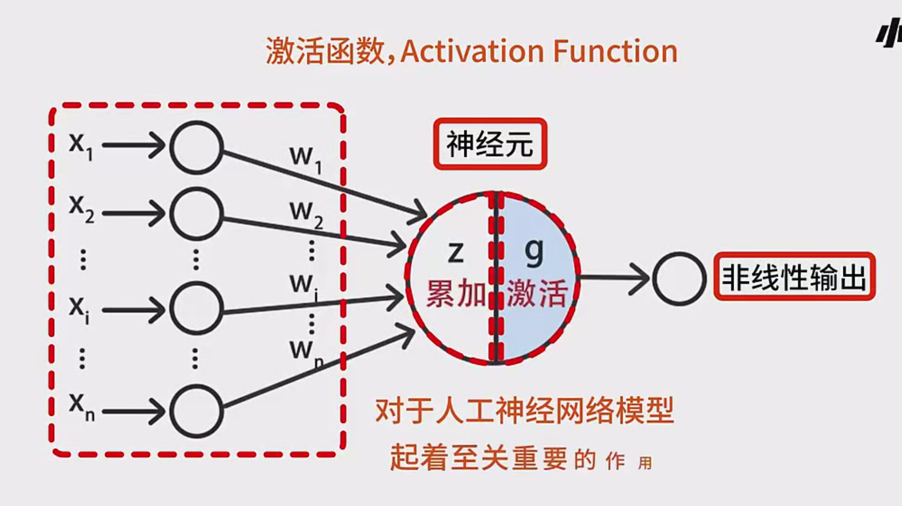

## 1. 什么是激活函数

在人工神经网络（Artificial Neural Network, ANN）中，**激活函数**通常指的是作用在神经元输出上的非线性变换函数。用数学符号可表示为：

$
y = g(z)
$

其中，$z$ 是神经元对各输入的加权求和（包含偏置项 $b$ ），$g$ 就是激活函数。  
- **线性累加**：$z = w_1 x_1 + w_2 x_2 + \cdots + w_n x_n + b$  
- **激活函数转换**：$y = g(z)$

如果没有非线性的激活函数，那么整个神经网络的输出将会是线性函数，很难处理复杂的非线性问题，网络的表达能力会受到极大限制。因此，激活函数在神经网络中起到“**引入非线性**”的关键作用，能够帮助模型更好地拟合复杂的函数关系。

---

## 2. 激活函数的作用和重要性

1. **提供非线性**  
   - 若仅使用线性运算（即加权求和再输出），即使堆叠多层，网络仍是一个整体的线性函数，无法表示非线性边界和复杂映射。  
   - 激活函数将输入映射到非线性输出，使深层网络具备更强的表达能力。

2. **决定网络性能**  
   - 不同的激活函数往往会导致不同的收敛速度、训练效果以及最终的准确率。  
   - 选择合适的激活函数能加速训练并获得更好的结果。

3. **影响梯度与更新**  
   - 激活函数往往需要是**可导或分段可导**，这样在反向传播时才能得到有效的梯度信息。  
   - 如果激活函数的梯度接近零，会带来梯度消失等问题；如果梯度过大，则可能导致梯度爆炸。

---

## 3. 常见的激活函数

在神经网络发展历史中，出现了多种激活函数。以下介绍几类常见且重要的激活函数及其特点。

### 3.1 阶跃函数（Step Function）

- **定义**  
  $
  g(z) = 
  \begin{cases} 
  1 & \text{if } z > 0 \\
  0 & \text{if } z \leq 0
  \end{cases}
  $  

- **特点**  
  1. **输出只有 0 和 1**，是典型的二值函数；  
  2. 在感知器早期模型中使用，计算简单；  
  3. 梯度为零，**不可导**，无法通过微小改变权重获得输出上的微小变化，这会导致参数难以优化；  
  4. 在现代的神经网络中极少使用，几乎已被其他更平滑、更可导的激活函数所替代。

- **总结**  
  - 虽然概念简单，但不利于反向传播的梯度更新；  
  - 适用于非常简单的分类场景或在理论上做模型推导参考。

### 3.2 Sigmoid 函数

- **定义**  
  Sigmoid 常用的形式为 **逻辑函数**（Logistic Function）：
  $
  g(z) = \frac{1}{1 + e^{-z}}
  $
  
- **输出范围**  
  $
  (0, 1)
  $

- **性质**  
  1. **平滑且处处可导**；  
  2. 当 $z \gg 0$ 时，输出接近 1；当 $z \ll 0$ 时，输出接近 0；  
  3. 通常用在二分类问题的输出层或将其变形用于概率输出。

- **优点**  
  1. 输出是连续且在 (0,1) 之间，可解释为“概率”；  
  2. 函数连续可导，适合反向传播。

- **缺点**  
  1. **梯度消失**：在输入绝对值较大时，函数梯度变得非常小，容易导致反向传播中的梯度衰减；  
  2. 计算时包含指数运算，在大型网络或大型数据时效率可能较低。

### 3.3 ReLU 函数

- **定义**  
  全称：Rectified Linear Unit  
  $
  \text{ReLU}(z) = \max(0, z)
  $

- **特点**  
  1. **正输入**：输出等于输入本身（$y = z$）；  
  2. **负输入**：输出为 0；  
  3. 函数在 $z > 0$ 时的梯度为 1，在 $z < 0$ 时的梯度为 0。

- **优点**  
  1. 计算速度快，函数形式简单；  
  2. 当 $z>0$ 时，梯度为 1，有助于缓解梯度消失问题；  
  3. 在实践中，被广泛运用于 CNN、RNN 等深度网络中。

- **缺点**  
  1. **神经元“死亡”问题（Dead ReLU）**：当输入一直小于 0 时，梯度恒为 0，该神经元不再更新，网络会出现一部分“死”掉的神经元；  
  2. 不能输出负值，仅能输出非负数。

### 3.4 Leaky ReLU 函数

- **定义**  
  为了解决 ReLU 的“死亡”问题，出现了 Leaky ReLU 等变体。  
  $
  \text{Leaky ReLU}(z) = 
  \begin{cases}
  z & \text{if } z \ge 0 \\
  \alpha z & \text{if } z < 0
  \end{cases}
  $
  其中 $\alpha$ 通常是一个很小的正数（如 0.01）。

- **特点**  
  1. 当 $z<0$ 时，不再是 0，而是给一个负斜率 $\alpha z$；  
  2. 在负区间也保留了微小的梯度，避免神经元彻底“死亡”；  
  3. 在实战中也有其他类似参数可学习的变体，如 **Parametric ReLU**。

### 3.5 Tanh 函数

- **定义**  
  双曲正切函数（Hyperbolic Tangent）：
  $
  \tanh(z) = \frac{e^z - e^{-z}}{e^z + e^{-z}}
  $
  
- **输出范围**  
  $
  (-1, 1)
  $

- **特点**  
  1. 是 Sigmoid 的平移和缩放版本；  
  2. 当 $z \gg 0$ 时，输出接近 1；当 $z \ll 0$ 时，输出接近 -1；  
  3. 常用于一些需要将输入标准化到 [-1,1] 的场景，例如部分循环神经网络（RNN）的隐藏层。

- **优点**  
  1. 输出范围在 (-1,1)，在一定程度上减轻了梯度消失问题（相比 Sigmoid 略好）；  
  2. 当输入在 0 附近时，梯度较大。

- **缺点**  
  1. 与 Sigmoid 类似，输入绝对值过大时，仍存在梯度消失的风险；  
  2. 计算也包含指数运算，计算量大于 ReLU 系列。

### 3.6 其他激活函数

- **Swish**：由 Google 提出，形式为 $x * \sigma(x)$，在一些网络中表现出比 ReLU 更好的收敛性。  
- **Mish**：类似于 Swish，也是一种平滑的非线性函数。  
- **ELU**、**SELU** 等：在负区间有指数衰减，常用于一些特定网络结构中。  

在实际应用中，除了最经典和常用的 Sigmoid、Tanh、ReLU/Leaky ReLU 之外，还有很多针对不同问题或网络结构的激活函数变体。在深度学习中选用哪一种激活函数，需要兼顾以下因素：  
1. **网络结构**（CNN、RNN、MLP 等）；  
2. **优化难度**（梯度消失、梯度爆炸、收敛速度等）；  
3. **实际效果和实验结果**；  
4. **计算复杂度**和**部署需求**（移动端、服务器端等）。

---

## 4. 不同激活函数对网络训练的影响

1. **收敛速度**  
   - ReLU 一般收敛速度快，因为在正区间梯度为 1。  
   - Sigmoid/Tanh 会出现饱和区域，训练时可能速度较慢。

2. **准确率**  
   - 不同激活函数在相同网络结构、相同超参数下，对最终测试集的准确率会有不同影响；  
   - 经常需要通过实验对比来选择最优激活函数。

3. **稳定性**  
   - 在负区间容易出现梯度为 0 或梯度消失的激活函数（如 ReLU）要考虑到是否会有大量负输入；  
   - Leaky ReLU、ELU 等在负区间仍保留一定的梯度，可避免神经元死亡，但在实际中也需要调参（如 $\alpha$ 值）。

4. **对网络层数的影响**  
   - 网络层数较浅时，对激活函数的选择往往**影响较小**；  
   - 深度网络（几十层、上百层）中，梯度消失或爆炸更明显，需要更加谨慎地选择和搭配激活函数。

---

