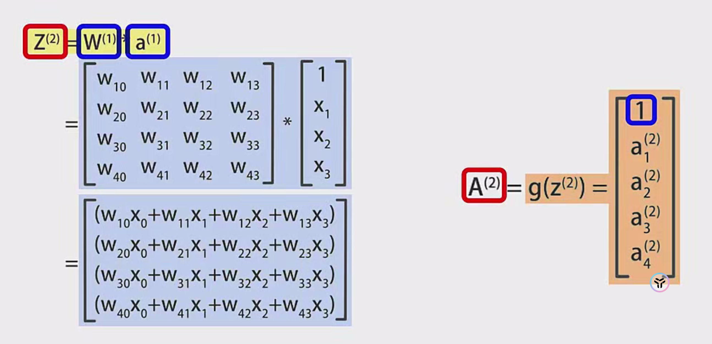

# 神经网络前向传播算法的矩阵表示

## 一、核心概念
### 1. 前向传播基本流程
- 特征向量输入 → 逐层线性组合 → 激活函数处理 → 最终输出
- 所有计算通过矩阵运算实现

### 2. 参数矩阵表示
| 符号 | 含义                   | 维度说明        |
| ---- | ---------------------- | --------------- |
| W⁽ʲ⁾ | 第j层到j+1层的权重矩阵 | (n_{j+1} × n_j) |
| b⁽ʲ⁾ | 第j层偏置向量          | (n_{j+1} × 1)   |
| a⁽ʲ⁾ | 第j层输出向量          | (n_j × 1)       |

### 3. 神经网络结构示例
输入层（3节点） → 隐藏层1（4节点） → 隐藏层2（5节点） → 输出层（2节点）

## 二、矩阵运算过程
### 1. 基础计算式
$$
\begin{aligned}
z^{(j+1)} &= W^{(j)}a^{(j)} + b^{(j)} \\
a^{(j+1)} &= g(z^{(j+1)})
\end{aligned}
$$

### 2. 偏置项优化处理
- 扩展输入向量：在a⁽ʲ⁾中添加常数项1
- 扩展权重矩阵：将b⁽ʲ⁾并入W⁽ʲ⁾作为最后一列
$$
\tilde{a}^{(j)} = \begin{bmatrix} a^{(j)} \\ 1 \end{bmatrix}, \quad 
\tilde{W}^{(j)} = [W^{(j)} \quad b^{(j)}]
$$

### 3. 具体计算示例（三层网络）
**第一层 → 第二层：**
- 输入：$\tilde{a}^{(1)} = \begin{bmatrix} x_1 \\ x_2 \\ x_3 \\ 1 \end{bmatrix}$
- 权重矩阵：$\tilde{W}^{(1)} \in \mathbb{R}^{4×4}$（原4×3权重 + 偏置列）
- 计算过程：
$$
z^{(2)} = \tilde{W}^{(1)}\tilde{a}^{(1)}, \quad a^{(2)} = g(z^{(2)})
$$

**第二层 → 第三层：**
- 扩展后的输入：$\tilde{a}^{(2)} = \begin{bmatrix} a^{(2)} \\ 1 \end{bmatrix} \in \mathbb{R}^{5×1}$
- 权重矩阵：$\tilde{W}^{(2)} \in \mathbb{R}^{2×5}$（原2×4权重 + 偏置列）
- 最终输出：
$$
z^{(3)} = \tilde{W}^{(2)}\tilde{a}^{(2)}, \quad a^{(3)} = g(z^{(3)})
$$

## 三、维度变化验证
| 计算步骤 | 矩阵维度   | 运算结果维度 |
| -------- | ---------- | ------------ |
| W⁽¹⁾a⁽¹⁾ | (4×3)(3×1) | 4×1          |
| +b⁽¹⁾    | 4×1 + 4×1  | 4×1          |
| W⁽²⁾a⁽²⁾ | (2×5)(5×1) | 2×1          |

## 一、数学符号体系
$$
\begin{aligned}
& \text{网络总层数}: L \\
& \text{第}j\text{层神经元数}: n_j \quad (j=1,2,...,L) \\
& \text{权重矩阵}: W^{(j)} \in \mathbb{R}^{n_{j+1} \times n_j} \\
& \text{偏置向量}: b^{(j)} \in \mathbb{R}^{n_{j+1} \times 1} \\
& \text{第}j\text{层输出}: a^{(j)} = g(z^{(j)}) \in \mathbb{R}^{n_j \times 1} \\
& \text{激活函数}: g(\cdot) \quad (\text{sigmoid, ReLU等})
\end{aligned}
$$

---

## 二、基础推导流程（以三层网络为例）

### 1. 输入层处理（第1层）
**输入特征向量**：
$$
x = \begin{bmatrix} x_1 \\ x_2 \\ x_3 \end{bmatrix} \in \mathbb{R}^{3 \times 1}
$$

**添加偏置项**：
$$
\tilde{a}^{(1)} = \begin{bmatrix} x \\ 1 \end{bmatrix} = \begin{bmatrix} x_1 \\ x_2 \\ x_3 \\ 1 \end{bmatrix} \in \mathbb{R}^{4 \times 1}
$$

---

### 2. 隐藏层1计算（第1→2层）
**扩展权重矩阵**：
$$
\tilde{W}^{(1)} = [W^{(1)} \quad b^{(1)}] = \begin{bmatrix}
w_{11}^{(1)} & w_{12}^{(1)} & w_{13}^{(1)} & b_1^{(1)} \\
w_{21}^{(1)} & w_{22}^{(1)} & w_{23}^{(1)} & b_2^{(1)} \\
w_{31}^{(1)} & w_{32}^{(1)} & w_{33}^{(1)} & b_3^{(1)} \\
w_{41}^{(1)} & w_{42}^{(1)} & w_{43}^{(1)} & b_4^{(1)}
\end{bmatrix} \in \mathbb{R}^{4 \times 4}
$$

**线性组合计算**：
$$
z^{(2)} = \tilde{W}^{(1)} \tilde{a}^{(1)} = \begin{bmatrix}
\sum_{i=1}^3 w_{1i}^{(1)}x_i + b_1^{(1)} \\
\sum_{i=1}^3 w_{2i}^{(1)}x_i + b_2^{(1)} \\
\sum_{i=1}^3 w_{3i}^{(1)}x_i + b_3^{(1)} \\
\sum_{i=1}^3 w_{4i}^{(1)}x_i + b_4^{(1)}
\end{bmatrix} \in \mathbb{R}^{4 \times 1}
$$

**激活处理**：
$$
a^{(2)} = g(z^{(2)}) = \begin{bmatrix}
g(z_1^{(2)}) \\
g(z_2^{(2)}) \\
g(z_3^{(2)}) \\
g(z_4^{(2)})
\end{bmatrix} \in \mathbb{R}^{4 \times 1}
$$

**添加新偏置项**：
$$
\tilde{a}^{(2)} = \begin{bmatrix} a^{(2)} \\ 1 \end{bmatrix} = \begin{bmatrix}
a_1^{(2)} \\
a_2^{(2)} \\
a_3^{(2)} \\
a_4^{(2)} \\
1
\end{bmatrix} \in \mathbb{R}^{5 \times 1}
$$

---

### 3. 隐藏层2计算（第2→3层）
**扩展权重矩阵**：
$$
\tilde{W}^{(2)} = [W^{(2)} \quad b^{(2)}] = \begin{bmatrix}
w_{11}^{(2)} & w_{12}^{(2)} & w_{13}^{(2)} & w_{14}^{(2)} & b_1^{(2)} \\
w_{21}^{(2)} & w_{22}^{(2)} & w_{23}^{(2)} & w_{24}^{(2)} & b_2^{(2)}
\end{bmatrix} \in \mathbb{R}^{2 \times 5}
$$

**线性组合计算**：
$$
z^{(3)} = \tilde{W}^{(2)} \tilde{a}^{(2)} = \begin{bmatrix}
\sum_{i=1}^4 w_{1i}^{(2)}a_i^{(2)} + b_1^{(2)} \\
\sum_{i=1}^4 w_{2i}^{(2)}a_i^{(2)} + b_2^{(2)}
\end{bmatrix} \in \mathbb{R}^{2 \times 1}
$$

**最终输出**：
$$
a^{(3)} = g(z^{(3)}) = \begin{bmatrix}
g(z_1^{(3)}) \\
g(z_2^{(3)})
\end{bmatrix} \in \mathbb{R}^{2 \times 1}
$$

---

## 三、广义数学表达（任意层网络）

### 1. 递推公式
对任意层 $j=1,2,...,L-1$：
$$
\begin{cases}
\tilde{a}^{(j)} = \begin{bmatrix} a^{(j)} \\ 1 \end{bmatrix} \in \mathbb{R}^{(n_j+1) \times 1} \\
\tilde{W}^{(j)} = [W^{(j)} \quad b^{(j)}] \in \mathbb{R}^{n_{j+1} \times (n_j+1)} \\
z^{(j+1)} = \tilde{W}^{(j)} \tilde{a}^{(j)} \in \mathbb{R}^{n_{j+1} \times 1} \\
a^{(j+1)} = g(z^{(j+1)}) \in \mathbb{R}^{n_{j+1} \times 1}
\end{cases}
$$

---

### 2. 批量数据处理（m个样本）
**输入矩阵**：
$$
X = [x^{(1)} \quad x^{(2)} \quad \cdots \quad x^{(m)}] \in \mathbb{R}^{n_1 \times m}
$$

**扩展输入矩阵**：
$$
\tilde{A}^{(1)} = \begin{bmatrix} X \\ \mathbf{1}_m^T \end{bmatrix} \in \mathbb{R}^{(n_1+1) \times m}
$$

**各层计算**：
$$
\begin{aligned}
Z^{(j+1)} &= \tilde{W}^{(j)} \tilde{A}^{(j)} \in \mathbb{R}^{n_{j+1} \times m} \\
A^{(j+1)} &= g(Z^{(j+1)}) \\
\tilde{A}^{(j+1)} &= \begin{bmatrix} A^{(j+1)} \\ \mathbf{1}_m^T \end{bmatrix}
\end{aligned}
$$

---

## 四、维度验证体系
| 计算步骤 | 数学表达式                                          | 维度验证                                                     |
| -------- | --------------------------------------------------- | ------------------------------------------------------------ |
| 输入扩展 | $\tilde{A}^{(j)} \in \mathbb{R}^{(n_j+1) \times m}$ | 原始维度$(n_j \times m)$ + 偏置行                            |
| 矩阵乘法 | $\tilde{W}^{(j)} \tilde{A}^{(j)}$                   | $(n_{j+1} \times (n_j+1)) \times ((n_j+1) \times m) = n_{j+1} \times m$ |
| 激活处理 | $A^{(j+1)} = g(Z^{(j+1)})$                          | 保持维度$n_{j+1} \times m$                                   |
| 输出扩展 | $\tilde{A}^{(j+1)}$                                 | $(n_{j+1}+1) \times m$                                       |

---

## 五、关键推导要点

1. **偏置项合并原理**  
   通过增广矩阵将偏置计算融入矩阵乘法：
   $$
   Wx + b \equiv [W \quad b] \begin{bmatrix} x \\ 1 \end{bmatrix}
   $$
   该操作使得：
   - 计算过程统一为矩阵乘法
   - 便于批量数据并行计算
   - 简化反向传播推导

2. **激活函数作用**  
   每个神经元的非线性变换：
   $$
   a_i^{(j)} = g(z_i^{(j)}) = \begin{cases}
   \frac{1}{1+e^{-z_i^{(j)}}} & (\text{sigmoid}) \\
   \max(0,z_i^{(j)}) & (\text{ReLU}) \\
   \vdots & 
   \end{cases}
   $$
   关键特性：
   - 保持维度不变
   - 引入非线性表达能力

3. **批量计算优势**  
   - 单样本计算：$\mathbb{R}^{n \times 1}$ → $\mathbb{R}^{m \times 1}$
   - 批量计算：$\mathbb{R}^{n \times k}$ → $\mathbb{R}^{m \times k}$
   - 矩阵运算复杂度：$O(nmk)$ < $k \times O(nm)$

---

## 六、实例验证（数值计算示例）

### 给定参数
- 输入：$x = [0.5, -1.2, 2.3]^T$
- 权重矩阵：
  $$
  W^{(1)} = \begin{bmatrix}
  0.1 & -0.4 & 0.7 \\
  0.3 & 0.5 & -0.2 \\
  -0.6 & 0.8 & 0.9 \\
  0.2 & -0.1 & 0.4
  \end{bmatrix}, \quad 
  b^{(1)} = \begin{bmatrix} 0.2 \\ -0.3 \\ 0.5 \\ 0.1 \end{bmatrix}
  $$
- 激活函数：ReLU

### 计算过程
1. 扩展输入：
   $$
   \tilde{a}^{(1)} = [0.5, -1.2, 2.3, 1]^T
   $$

2. 计算$z^{(2)}$：
   $$
   \tilde{W}^{(1)} = \begin{bmatrix}
   0.1 & -0.4 & 0.7 & 0.2 \\
   0.3 & 0.5 & -0.2 & -0.3 \\
   -0.6 & 0.8 & 0.9 & 0.5 \\
   0.2 & -0.1 & 0.4 & 0.1
   \end{bmatrix}
   $$
   $$
   z^{(2)} = \tilde{W}^{(1)}\tilde{a}^{(1)} = [1.39, -0.86, 3.43, 0.77]^T
   $$

3. 激活处理：
   $$
   a^{(2)} = \text{ReLU}(z^{(2)}) = [1.39, 0, 3.43, 0.77]^T
   $$

---

