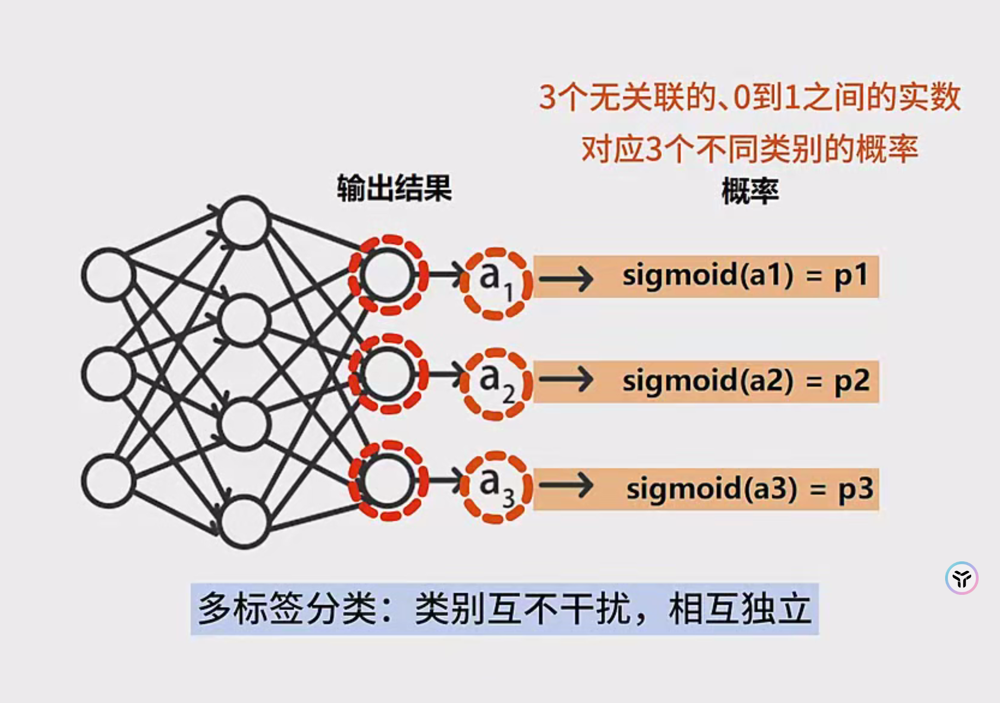

 

以下笔记系统地整理了“神经网络的代价函数”相关内容，涵盖了神经网络在回归和分类任务中常见的输出层设置与代价函数选择，并给出了相应的公式和要点，便于理解和复习。

---

## 1. 神经网络在回归与分类任务中的差异

### 1.1 回归任务

- **输出层激活函数：**  
  对回归问题常采用**恒等函数**（Identity Function），即  
  $
  f(x) = x
  $  
  这意味着输出层神经元的输出值不会经过任何非线性变换，直接作为最终的回归预测值。

- **输出层神经元个数：**  
  - 若预测的是**单个**回归值，则输出层通常只有**1个**神经元。  
  - 若预测的是**多个**回归值（例如 3 个），则输出层对应多个神经元，每个神经元分别预测一个目标值。

### 1.2 分类任务

- **输出层激活函数：**  
  - **互斥多分类（Multi-class, single-label）**：常使用 **Softmax** 函数，将输出层的线性组合 $\{a_1, a_2, \dots\}$ 转化为 $\{p_1, p_2, \dots\}$，并满足
    $
    p_1 + p_2 + \cdots + p_n = 1
    $  
    每个 $p_i$ 表示样本属于第 $i$ 类的概率，且所有类互斥。  
  - **多标签分类（Multi-label, non-exclusive）**：常使用 **Sigmoid** 函数分别作用于输出层每个神经元的输出 $\{a_1, a_2, \dots\}$，得到 $\{p_1, p_2, \dots\}$，其中每个 $p_i$ 独立表示样本属于第 $i$ 类的概率，取值在 $[0, 1]$ 之间。此时各类别**不互斥**，一个样本可以同时属于多个类别。

- **输出层神经元个数：**  
  - 一般情况下，分类问题的输出层神经元个数 = 类别数。  
  - **二分类**时若使用 **Sigmoid**，可以只用**1个**输出神经元（与逻辑回归类似），也可以用**2个**输出神经元（与 Softmax 相似）。两种方案本质上都可实现二分类。

---

## 2. 回归问题的代价函数

### 2.1 均方误差（MSE, Mean Squared Error）

在回归任务中，常使用**均方误差（MSE）**作为代价函数。若有 $m$ 个训练样本，每个样本有 $n$ 个回归目标，记：

- $y_{ij}$ ：表示第 $i$ 个样本的第 $j$ 个目标的**真实值**  
- $\hat{y}_{ij}$ ：表示第 $i$ 个样本的第 $j$ 个目标的**预测值**  

则总的MSE可表示为：

$
E = \frac{1}{m \times n} \sum_{i=1}^{m} \sum_{j=1}^{n} \bigl( \hat{y}_{ij} - y_{ij} \bigr)^2
$

- 若只有**单个回归目标**（$n=1$），代价函数与**线性回归**中的MSE形式完全相同：
  $
  E = \frac{1}{m} \sum_{i=1}^{m} \left( \hat{y}_{i} - y_{i} \right)^2
  $
- 若**多个回归目标**，则将各个目标的均方误差累加并取平均即可。

---

## 3. 分类问题的代价函数

在分类任务中，常用的代价函数是**交叉熵损失（Cross Entropy Loss）**。根据问题的类别性质（互斥或不互斥），交叉熵的具体形式会略有差异。

### 3.1 互斥多分类（Softmax + 交叉熵）

若类别之间**互斥**（即每个样本只属于**唯一**一个类别），则输出层各神经元的激活值 $\{a_1, a_2, \dots, a_n\}$ 会经过 **Softmax** 函数变换成为 $\{p_1, p_2, \dots, p_n\}$：

$
p_k = \frac{e^{a_k}}{\sum_{j=1}^{n} e^{a_j}}, \quad k = 1, 2, \dots, n
$
其中 $\sum_{k=1}^{n} p_k = 1$，$p_k$ 表示预测为第 $k$ 类的概率。

**交叉熵**损失函数可写为：
$
E = -\sum_{k=1}^n y_k \log(p_k)
$
其中 $y_k$ 是样本在第 $k$ 类上的真实标签（在互斥多分类中，$y_k$ 通常是独热向量，其中某个分量为 1，其余为 0）。

在对所有训练样本求平均后，即得到对整个数据集的交叉熵损失。

### 3.2 多标签分类（Sigmoid + 交叉熵）

对于**多标签分类**（各类别相互独立、互不排斥），网络输出层对每个类别都得到一个激活值 $a_k$，并使用 **Sigmoid** 函数：
$
p_k = \frac{1}{1 + e^{-a_k}}
$
这样得到的 $p_k$ 表示样本属于类别 $k$ 的概率，且各 $p_k$ 并不要求总和为 1。

在多标签场景下，一个样本可以同时属于多个类别（例如同时属于类别 1 和 3，而不属于类别 2）。此时，样本第 $k$ 类上的真实标签 $y_k$ 可以是 0 或 1，互不影响。

**交叉熵**损失函数在这里与逻辑回归形式相同，对于单个样本可写为（对各类别损失求和）：
$
E_i = - \sum_{k=1}^{n} \Bigl[ y_{ik}\log(p_{ik}) + (1 - y_{ik})\log\bigl(1 - p_{ik}\bigr) \Bigr]
$
其中：
- $y_{ik} \in \{0,1\}$ 表示第 $i$ 个样本在类别 $k$ 上的真实标签；
- $p_{ik}$ 表示网络对第 $i$ 个样本在类别 $k$ 上预测的概率。

对所有训练样本（共有 $m$ 个）进行平均，即：
$
E = \frac{1}{m} \sum_{i=1}^{m} E_i
$

**示例：** 某个样本有 3 个可能类别，网络计算出的概率分别是 $(p_1, p_2, p_3)$。若真实情况是“属于类别1和类别3，不属于类别2”，则 $(y_1, y_2, y_3) = (1, 0, 1)$。将 $(p_1, p_2, p_3)$ 和 $(y_1, y_2, y_3)$ 带入交叉熵公式，即可得到该样本的总损失。

---

## 4. 二分类问题简要讨论

在**二分类**场景下，使用 Softmax 和使用 Sigmoid 本质上都可以实现。实际中常见做法：

1. **Softmax + 2 个输出神经元**：输出层会得到 $(a_1, a_2)$，经过 Softmax，得到 $(p_1, p_2)$，并满足 $p_1 + p_2 = 1$。
2. **Sigmoid + 1 个输出神经元**：输出层只输出一个值 $a$，通过 Sigmoid 得到 $p$，表示样本为正类的概率（另一个概率自然是 $1 - p$）。  
   - 这种情况下，网络相当于在最后一层得到一个特征表示，然后再用**逻辑回归**形式（Sigmoid + 交叉熵）来进行二分类。

在二分类情形下，这两种方案在理论上等价，只是实现或表达上的差异。

---

## 5. 总结

1. **回归任务：**  
   - 输出层使用恒等函数；  
   - 代价函数通常为 **均方误差（MSE）**；  
   - 若有多个回归目标，分别计算每个目标的 MSE 后求和（或平均）。

2. **分类任务：**  
   - **互斥多分类**：使用 **Softmax** 变换输出概率，配合 **交叉熵**损失。  
   - **多标签分类**：对每个类别使用 **Sigmoid**，配合 **交叉熵**损失，各类别独立计算并求和。  
   - **二分类**：可使用 (1) **Softmax + 2个神经元**，或 (2) **Sigmoid + 1个神经元**。

无论是回归还是分类，在神经网络中选择合适的输出层激活函数和对应的代价函数，对于模型的收敛与准确度都至关重要。了解这些组合方式以及背后的数学原理，可以帮助我们根据实际任务目标选择合适的网络结构和损失函数。
