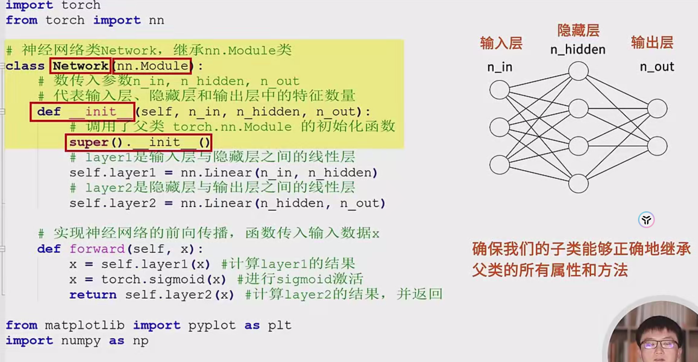
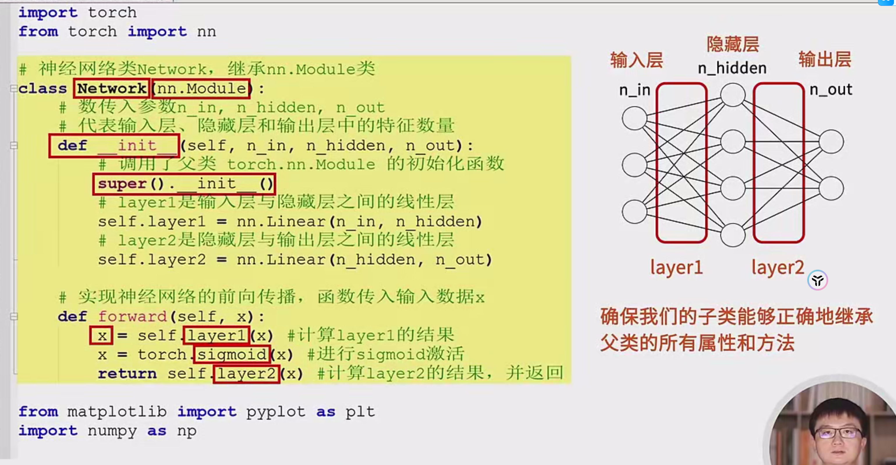
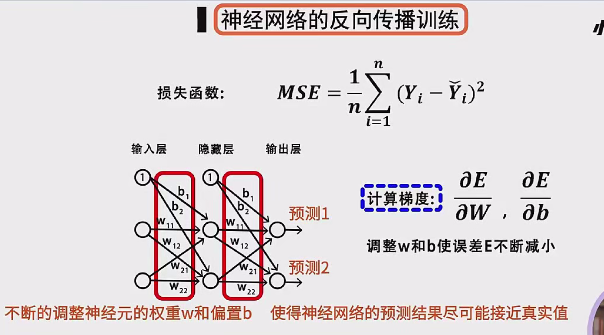
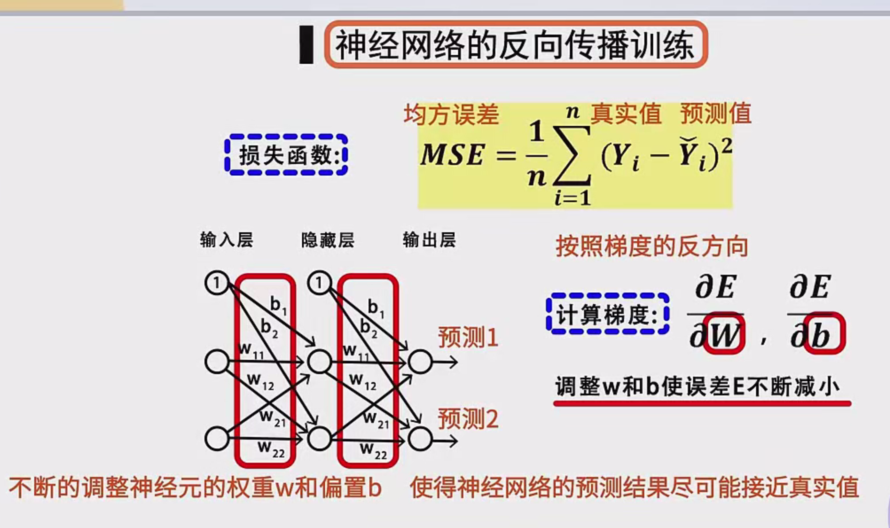
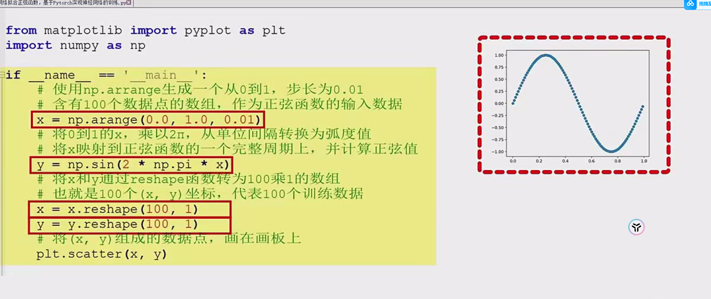
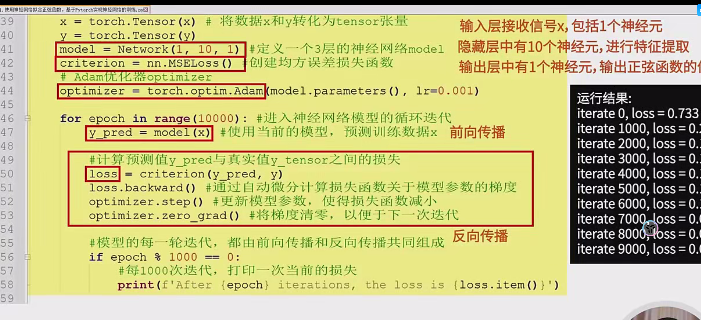

以下是一份使用 **PaddlePaddle** 实现“神经网络拟合正弦函数”的**完整示例代码**。代码中包含了从数据生成、网络定义、训练到可视化的所有流程，方便大家直接运行学习。

> **说明：** 如果您想在本地运行，建议使用安装了 **PaddlePaddle**（2.0 及以上版本）和 **matplotlib** 的 Python 环境。代码中包含中文注释，便于理解。

```python
import numpy as np
import matplotlib.pyplot as plt
import paddle
import paddle.nn as nn
import paddle.nn.functional as F

# ========================
# 1. 数据准备
# ========================

# 生成 [0, 1) 步长为 0.01 的数组，共 100 个数据点
x = np.arange(0, 1, 0.01)
# 将 [0, 1) 映射到 [0, 2π)，对应正弦函数一个完整周期
x_radian = x * 2 * np.pi
# 计算正弦函数值
y = np.sin(x_radian)

# reshape 为 (100, 1)，方便后续输入神经网络
x = x.reshape(-1, 1).astype('float32')
y = y.reshape(-1, 1).astype('float32')

# 将 numpy 数组转换为 Paddle 张量
x_tensor = paddle.to_tensor(x)
y_tensor = paddle.to_tensor(y)

# ========================
# 2. 定义网络结构
# ========================
# 在 Paddle 中自定义网络时，一般继承自 paddle.nn.Layer

class Network(nn.Layer):
    def __init__(self, n_in, n_hidden, n_out):
        super(Network, self).__init__()
        # 定义全连接层（线性层）
        self.layer1 = nn.Linear(in_features=n_in, out_features=n_hidden)
        self.layer2 = nn.Linear(in_features=n_hidden, out_features=n_out)
        
    def forward(self, x):
        # 前向传播
        x = self.layer1(x)
        # 使用 sigmoid 作为激活函数
        x = F.sigmoid(x)
        x = self.layer2(x)
        return x

# 创建网络实例
n_in = 1       # 输入层神经元数量
n_hidden = 10  # 隐藏层神经元数量
n_out = 1      # 输出层神经元数量
model = Network(n_in, n_hidden, n_out)

# ========================
# 3. 定义损失函数和优化器
# ========================
loss_fn = nn.MSELoss()  # 均方误差
optimizer = paddle.optimizer.Adam(learning_rate=0.01, parameters=model.parameters())

# ========================
# 4. 训练循环
# ========================
num_epochs = 10000  # 迭代轮数

for epoch in range(num_epochs):
    # 前向传播，得到预测值
    y_pred = model(x_tensor)

    # 计算损失
    loss = loss_fn(y_pred, y_tensor)

    # 反向传播，计算梯度并更新参数
    loss.backward()
    optimizer.step()
    optimizer.clear_grad()  # 清空梯度

    # 每隔 1000 轮打印一次当前损失
    if (epoch + 1) % 1000 == 0:
        print(f"Epoch [{epoch+1}/{num_epochs}], Loss: {loss.item():.6f}")

# ========================
# 5. 训练结果可视化
# ========================
# 使用模型再次预测
y_predict = model(x_tensor)
y_predict_np = y_predict.numpy()

# 绘图观察拟合效果
plt.figure(figsize=(8,6))
plt.scatter(x, y, label='True Sine', color='blue', s=10)         # 真实正弦值（蓝色）
plt.scatter(x, y_predict_np, label='Predicted', color='orange', s=10)  # 预测值（橙色）
plt.title("Neural Network Fitting Sine Function")
plt.xlabel("x")
plt.ylabel("sin(x)")
plt.legend()
plt.show()
```

### 代码说明

1. **数据生成**

   - 使用 `np.arange(0, 1, 0.01)` 生成 0 到 1 的数组，共 100 个数据点，步长为 0.01。
   - 将其映射到 [0,2π)[0, 2\pi) 区间，计算对应的正弦值。
   - 最终 `x` 和 `y` 的形状都为 (100,1)(100, 1)。

2. **模型定义**

   - 创建一个名为 `Network` 的类，继承自 `paddle.nn.Layer`。
   - 在 `__init__` 方法中定义两层线性层：`layer1` 和 `layer2`。
   - 在 `forward` 方法中先通过 `layer1`，然后使用 `F.sigmoid` 激活，最后经过 `layer2` 输出结果。

3. **损失函数和优化器**

   - 损失函数：MSE（均方误差），`nn.MSELoss()`。
   - 优化器：Adam，自适应学习率算法，学习率设为 0.01。

4. **训练循环**

   - 重复 

     ```
     num_epochs
     ```

      次：

     1. 前向传播 `y_pred = model(x_tensor)`。
     2. 计算损失 `loss = loss_fn(y_pred, y_tensor)`。
     3. `loss.backward()` 自动计算梯度。
     4. `optimizer.step()` 更新参数。
     5. `optimizer.clear_grad()` 清空累积的梯度。

   - 定期打印损失值，以监测训练情况。

5. **可视化**

   - 训练完成后，将模型对同一批 `x` 的预测结果画在图上，与真实正弦函数对比。
   - 如果训练成功，橙色的“预测”点会与蓝色的真实正弦曲线基本重合。

