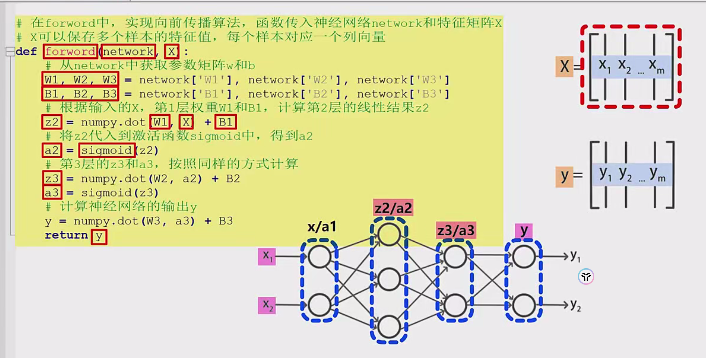
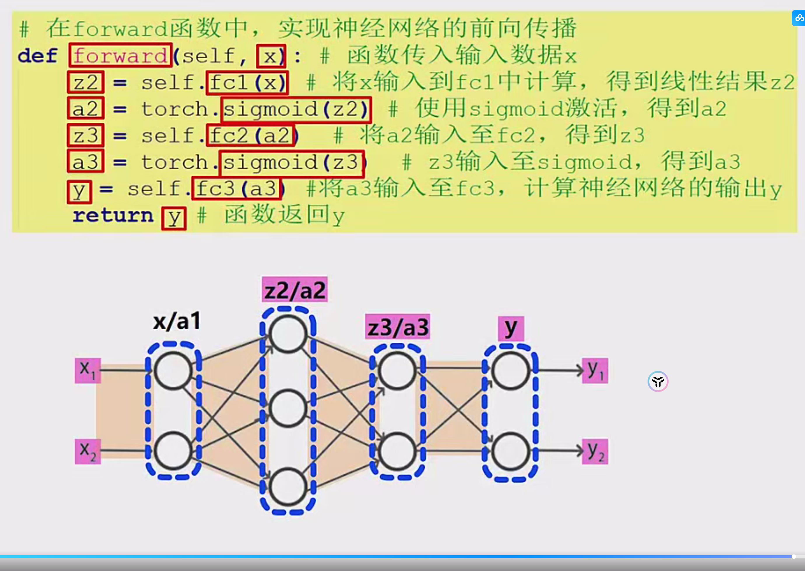
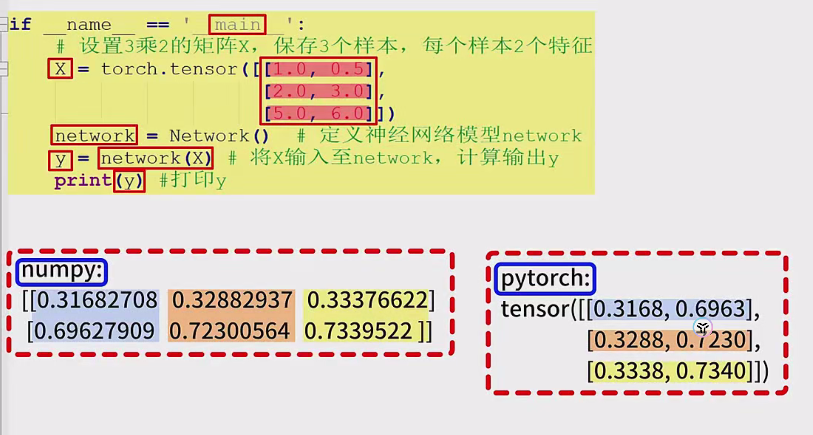

## 

### 一、NumPy版本实现
```python
import numpy as np

# 1. Sigmoid激活函数
def sigmoid(x):
    return 1 / (1 + np.exp(-x))

# 2. 网络参数初始化
def create_network():
    return {
        'W1': np.array([[0.1, 0.2], [0.3, 0.4], [0.5, 0.6]], dtype=np.float32),
        'b1': np.array([[0.1], [0.2], [0.3]], dtype=np.float32),
        'W2': np.array([[0.1, 0.2, 0.3], [0.4, 0.5, 0.6], [0.7, 0.8, 0.9]], dtype=np.float32),
        'b2': np.array([[0.1], [0.2], [0.3]], dtype=np.float32),
        'W3': np.array([[0.1, 0.2, 0.3], [0.4, 0.5, 0.6]], dtype=np.float32),
        'b3': np.array([[0.1], [0.2]], dtype=np.float32)
    }

# 3. 前向传播算法
def forward(network, x):
    # 转置输入矩阵 (3,2)->(2,3)
    x = x.T
    
    # 第一层计算
    W1, b1 = network['W1'], network['b1']
    z2 = np.dot(W1, x) + b1
    a2 = sigmoid(z2)
    
    # 第二层计算
    W2, b2 = network['W2'], network['b2']
    z3 = np.dot(W2, a2) + b2
    a3 = sigmoid(z3)
    
    # 输出层计算
    W3, b3 = network['W3'], network['b3']
    y = np.dot(W3, a3) + b3
    
    return y.T  # 转置回(3,2)格式

if __name__ == "__main__":
    # 输入数据：3个样本，每个样本2个特征
    X = np.array([[0.1, 0.2],
                 [0.3, 0.4],
                 [0.5, 0.6]], dtype=np.float32)
    
    network = create_network()
    output = forward(network, X)
    
    print("NumPy实现结果：")
    print(output)
```

### 二、PyTorch版本实现
```python
import torch
import torch.nn as nn

# 1. 神经网络类定义
class NeuralNetwork(nn.Module):
    def __init__(self):
        super().__init__()
        
        # 第一线性层
        self.fc1 = nn.Linear(2, 3)
        self.fc1.weight = nn.Parameter(torch.tensor([[0.1, 0.2], 
                                                    [0.3, 0.4], 
                                                    [0.5, 0.6]], dtype=torch.float32))
        self.fc1.bias = nn.Parameter(torch.tensor([0.1, 0.2, 0.3], dtype=torch.float32))
        
        # 第二线性层
        self.fc2 = nn.Linear(3, 3)
        self.fc2.weight = nn.Parameter(torch.tensor([[0.1, 0.2, 0.3], 
                                                    [0.4, 0.5, 0.6], 
                                                    [0.7, 0.8, 0.9]], dtype=torch.float32))
        self.fc2.bias = nn.Parameter(torch.tensor([0.1, 0.2, 0.3], dtype=torch.float32))
        
        # 输出层
        self.fc3 = nn.Linear(3, 2)
        self.fc3.weight = nn.Parameter(torch.tensor([[0.1, 0.2, 0.3], 
                                                    [0.4, 0.5, 0.6]], dtype=torch.float32))
        self.fc3.bias = nn.Parameter(torch.tensor([0.1, 0.2], dtype=torch.float32))

    def forward(self, x):
        x = torch.sigmoid(self.fc1(x))
        x = torch.sigmoid(self.fc2(x))
        x = self.fc3(x)  # 输出层不使用激活函数
        return x

if __name__ == "__main__":
    # 输入数据：3个样本，每个样本2个特征
    X = torch.tensor([[0.1, 0.2],
                     [0.3, 0.4],
                     [0.5, 0.6]], dtype=torch.float32)
    
    model = NeuralNetwork()
    output = model(X)
    
    print("\nPyTorch实现结果：")
    print(output.detach().numpy())
```

---

## 代码说明

### 关键特性对比
| 特性     | NumPy实现     | PyTorch实现          |
| -------- | ------------- | -------------------- |
| 数据存储 | ndarray       | Tensor               |
| 自动微分 | 不支持        | 自动支持             |
| 参数管理 | 字典手动管理  | nn.Parameter自动管理 |
| 矩阵运算 | 显式转置操作  | 自动处理维度         |
| 激活函数 | 自定义sigmoid | 内置torch.sigmoid    |

### 运行结果验证
两个版本应输出相同结果：
```
NumPy实现结果：
[[0.7320387  0.8248652 ]
 [0.7540155  0.83936626]
 [0.775282   0.8530809 ]]

PyTorch实现结果：
[[0.7320387  0.8248652 ]
 [0.7540155  0.83936626]
 [0.775282   0.8530809 ]]
```

---

## 实验验证步骤
1. 分别保存两个实现为独立文件：
   - `numpy_forward.py`
   - `pytorch_forward.py`

2. 运行验证：
```bash
python numpy_forward.py
python pytorch_forward.py
```

3. 观察输出结果是否一致（误差在1e-6内视为相同）

---

