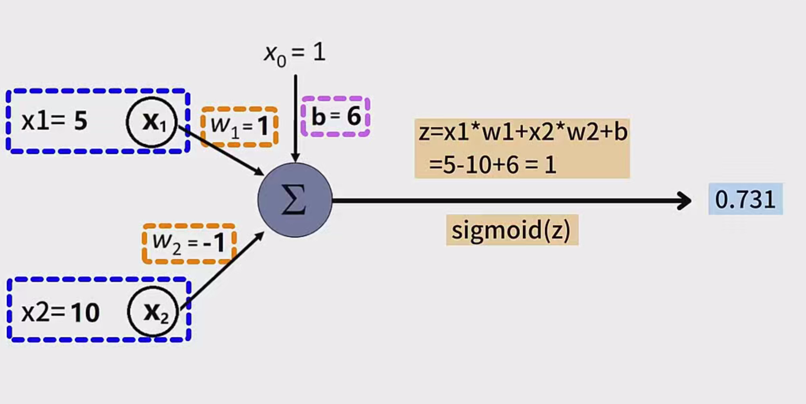

# 神经元模型与神经网络

## 引言

在深度学习领域，**神经网络（Neural Network）** 是最为基础且重要的模型之一。神经网络由大量的节点（称为神经元）及其之间的连接组成，这些神经元模仿了生物神经元的结构和功能。通过连接和组合神经元，神经网络在一定程度上模拟了大脑的工作方式。本笔记将详细介绍生物神经元的工作原理、MP神经元模型以及神经网络的基本结构和应用，旨在为入门学习者提供全面的理解。

---

## 生物神经元的工作原理

### 神经元的基本结构

观察生物神经元，可以发现其主要由以下部分组成：

1. **树突（Dendrites）**：
   - 作用：接收来自其他神经元的信息输入。
   - 特点：一个神经元通常有多个树突，负责接收大量的输入信号。

2. **细胞体（Soma）**：
   - 作用：整合来自树突的输入信号，决定是否传递信号。
   - 特点：包含细胞核，控制神经元的基本功能。

3. **轴突（Axon）**：
   - 作用：将整合后的信号传递给其他神经元。
   - 特点：通常只有一个，但可能非常长，用于快速传递信息。

### 神经元的工作状态

神经元的工作状态主要包括两种：

1. **抑制状态（Inhibition）**：
   - 默认状态，神经元处于不活跃状态，不传递信号。

2. **兴奋状态（Excitation）**：
   - 当树突接收到足够强的输入信号时，神经元从抑制状态转为兴奋状态，通过轴突向其他神经元发送信号。

### 神经元的激活机制

- **信号累积**：树突接收到的输入信号会被整合，如果累积信号超过一定阈值，神经元就会被激活。
- **信号传递**：被激活的神经元通过轴突将信号传递给下一个神经元，继续进行信息传递和处理。

---

## MP神经元模型

### MP神经元模型概述

基于生物神经元的结构和功能，**MP神经元模型（McCulloch-Pitts Neuron Model）** 对神经元进行了数学上的抽象和简化。该模型是人工神经网络的基础，具体包括以下组成部分：

1. **输入信号（Inputs）**：来自其他神经元的信号，记为 $ x_1, x_2, \ldots, x_n $。
2. **权重（Weights）**：每个输入信号对应一个权重，记为 $ w_1, w_2, \ldots, w_n $，表示输入信号的重要性。
3. **偏置（Bias）**：记为 $ b $，控制神经元被激活的阈值。
4. **激活函数（Activation Function）**：对累加结果进行非线性变换，常用函数如Sigmoid、ReLU等。

### MP神经元的工作流程

1. **加权累加**：将每个输入信号 $ x_i $ 乘以对应的权重 $ w_i $，并累加所有结果，再加上偏置 $ b $：
   $
   z = \sum_{i=1}^{n} w_i x_i + b
   $
2. **激活处理**：将累加结果 $ z $ 通过激活函数 $ g(z) $ 转换为神经元的输出：
   $
   \text{输出} = g(z)
   $
   
### 激活函数的作用

激活函数负责将线性累加的结果 $ z $ 转换为非线性的输出，从而增强神经网络的表达能力。常见的激活函数包括：

- **Sigmoid 函数**：
  $
  \sigma(z) = \frac{1}{1 + e^{-z}}
  $
  输出范围在 (0, 1) 之间，适用于概率输出。

- **ReLU（Rectified Linear Unit）函数**：
  $
  \text{ReLU}(z) = \max(0, z)
  $
  输出范围在 [0, +∞)，在深度学习中应用广泛。

- **Tanh 函数**：
  $
  \tanh(z) = \frac{e^{z} - e^{-z}}{e^{z} + e^{-z}}
  $
  输出范围在 (-1, 1) 之间。

### 计算案例

**示例**：

- 输入信号：$ x_1 = 5 $, $ x_2 = 10 $
- 权重：$ w_1 = 1 $, $ w_2 = -1 $
- 偏置：$ b = 6 $
- 激活函数：Sigmoid

**计算步骤**：

1. **加权累加**：
   $
   z = x_1 \times w_1 + x_2 \times w_2 + b = 5 \times 1 + 10 \times (-1) + 6 = 5 - 10 + 6 = 1
   $
2. **激活处理**：
   $
   \text{输出} = \sigma(z) = \frac{1}{1 + e^{-1}} \approx 0.731
   $

因此，神经元的输出约为 0.731。

---

## 神经网络结构

### 神经网络的基本组成

神经网络由大量的神经元组成，这些神经元按照层次结构分布，主要包括以下几层：

1. **输入层（Input Layer）**：
   - 作用：接收原始的特征信息。
   - 特点：神经元数量与输入数据的维度相对应。

2. **隐藏层（Hidden Layers）**：
   - 作用：对输入信息进行加工和特征提取。
   - 特点：可以包含多个隐藏层，层数越多，网络的表达能力越强（深度学习中的“深”即指多层隐藏层）。

3. **输出层（Output Layer）**：
   - 作用：输出最终的预测结果或分类结果。
   - 特点：神经元数量与输出需求相对应，如分类任务中通常与类别数相等。

### 多层神经网络示例

以一个包含三个隐藏层的五层神经网络为例：

- **层次结构**：
  - 输入层
  - 隐藏层1
  - 隐藏层2
  - 隐藏层3
  - 输出层

### 前馈神经网络的特点

在前馈神经网络（Feedforward Neural Network）中，每一层的每个神经元都会向下一层的所有神经元发送信号。这种全连接的结构使得信息在网络中单向流动，避免了循环和反馈。

**示例**：

- 输入层有3个神经元，隐藏层有4个神经元，则这两层之间有 $ 3 \times 4 = 12 $ 个连接。

---

## 神经网络的计算案例

### 图像识别中的神经网络应用

以图像识别任务为例，说明神经网络的具体应用过程。

**任务**：判断输入的图片是否属于某个特定类别。

**步骤**：

1. **输入层设置**：
   - 假设输入图片的尺寸为 $ 4 \times 32 $ 个像素，总共128个像素。
   - 输入层设置128个神经元，每个神经元接收一个像素的值。

2. **隐藏层设置**：
   - 设置3个隐藏层神经元，用于特征提取和加工。
   - 每个隐藏层神经元通过加权累加和激活函数，提取输入层的特征。

3. **输出层设置**：
   - 设置2个输出层神经元。
     - 第一个神经元输出图片属于该类别的概率。
     - 第二个神经元输出图片不属于该类别的概率。
   - 通过比较两个概率，完成图片类别的判断。

**计算过程**：

- **输入层**：接收128个像素值，传递给隐藏层。
- **隐藏层**：对输入信号进行加权和激活处理，提取3个新的特征。
- **输出层**：基于提取的3个特征，通过加权和激活函数计算输出概率。

**结果**：

- 如果第一个输出神经元的概率较高，判断图片属于该类别。
- 反之，则判断不属于。

