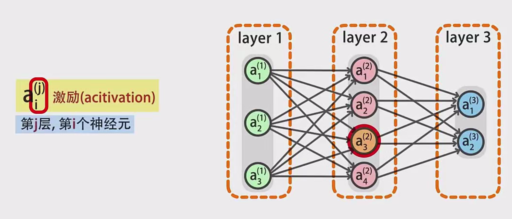
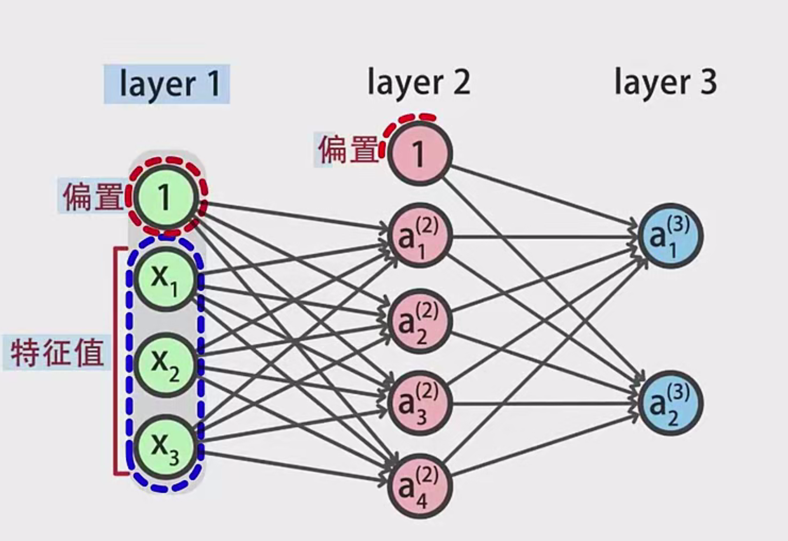
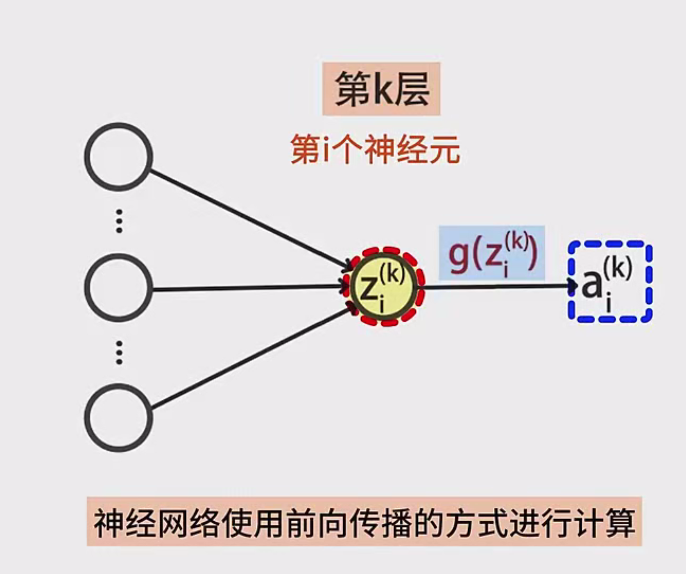
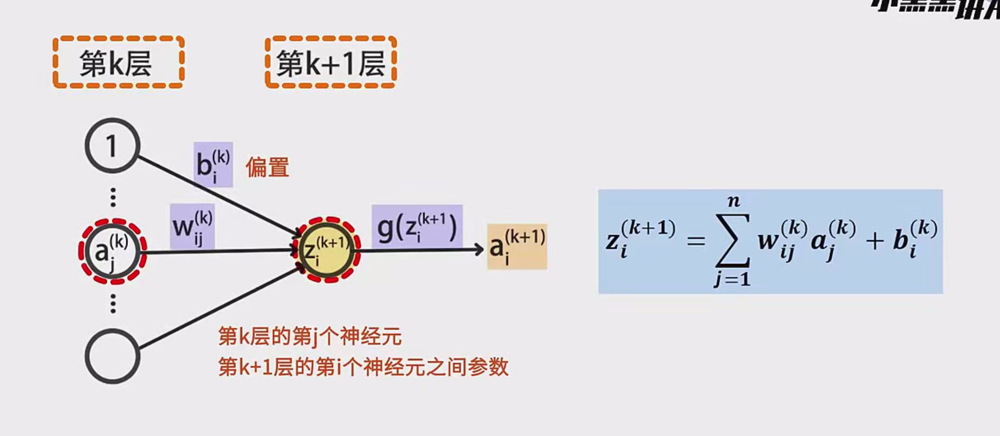
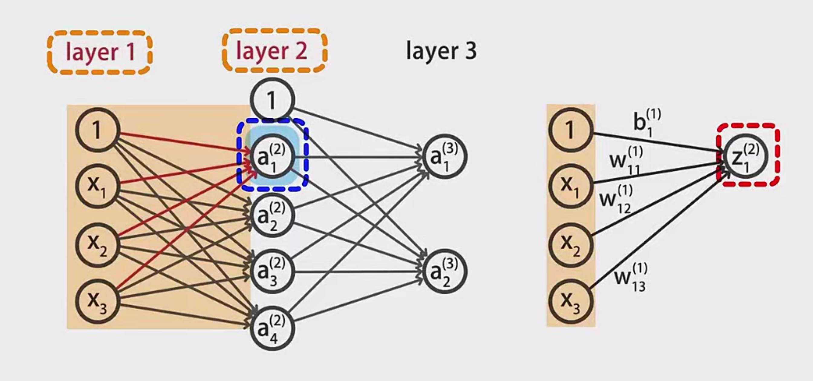
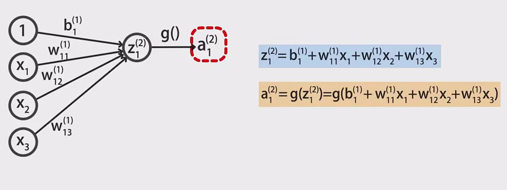
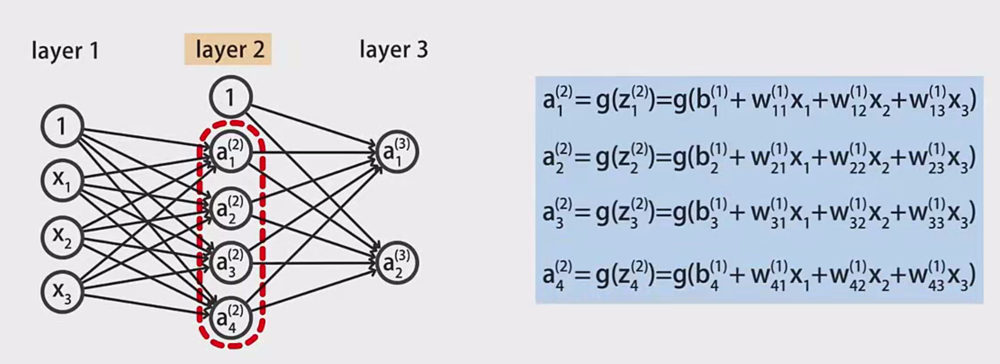

# 神经网络的表示与计算详解

## 1. 引言

大家好，欢迎来到本节课。本节课将深入探讨神经网络的表示与计算方法。我们将基于一个三层神经网络，详细说明如何使用数学符号对网络进行表示，并计算神经网络的输出。通过本节内容，您将掌握神经网络的基本结构、前向传播算法以及相关的数学表示方法。

## 2. 神经网络的基本结构

### 2.1 三层神经网络概述

我们将以一个三层的神经网络为例，具体结构如下：

- **第一层（输入层）**：包含3个神经元
- **第二层（隐藏层）**：包含4个神经元
- **第三层（输出层）**：包含2个神经元

### 2.2 神经元输出表示

每个神经元的输出被称为“激活值”，使用字母**a**表示，具体符号为：

- $ a_{i}^{j} $：表示第$ j $层第$ i $个神经元的输出值

例如，**第二层第三个神经元的输出**表示为：

- $ a_{3}^{2} $

### 2.3 输入层与特征值

神经网络的**输入层**负责接收输入的特征值。我们可以将输入特征 $ x_1, x_2, x_3 $ 直接标记到第一层中。

### 2.4 偏置信号

每一层除了接收输入特征外，还会接收一个值为1的**偏置信号**（Bias），表示为：

- 第一层的偏置信号：$ a_{0}^{1} = 1 $
- 第二层的偏置信号：$ a_{0}^{2} = 1 $

偏置信号在每一层的计算中起到调整输出的作用。

## 3. 神经网络的前向传播

神经网络采用**前向传播**的方式进行计算，即从输入层逐层向输出层传递信息。前向传播的过程包括以下步骤：

### 3.1 线性求和

对于第$ k $层第$ i $个神经元，其线性求和结果记为 $ z_{i}^{k} $，计算公式为：

$
z_{i}^{k} = \sum_{j=1}^{n} w_{ki}^{j} \cdot a_{j}^{k-1} + b_{ki}
$

其中：

- $ w_{ki}^{j} $ ：第$ k-1 $层第$ j $个神经元到第$ k $层第$ i $个神经元的权重参数
- $ a_{j}^{k-1} $ ：第$ k-1 $层第$ j $个神经元的输出
- $ b_{ki} $ ：第$ k $层第$ i $个神经元的偏置项
- $ n $ ：第$ k-1 $层的神经元数量

### 3.2 激活函数

将线性求和结果 $ z_{i}^{k} $ 带入激活函数 $ g $ 中，得到第$ k $层第$ i $个神经元的输出 $ a_{i}^{k} $：

$
a_{i}^{k} = g(z_{i}^{k})
$

常见的激活函数包括Sigmoid函数、ReLU函数等。

### 3.3 前向传播算法步骤

1. **初始化输入层**：将输入特征 $ x_1, x_2, x_3 $ 赋值给第一层的神经元输出 $ a_{1}^{1}, a_{2}^{1}, a_{3}^{1} $。
2. **计算隐藏层输出**：根据输入层的输出和权重参数，计算第二层每个神经元的线性求和结果 $ z_{i}^{2} $，再通过激活函数得到 $ a_{i}^{2} $。
3. **计算输出层输出**：根据隐藏层的输出和权重参数，计算第三层每个神经元的线性求和结果 $ z_{i}^{3} $，再通过激活函数得到最终输出 $ a_{i}^{3} $。
4. **完成前向传播**：整个网络的输出即为第三层各个神经元的激活值。

## 4. 具体计算实例

为了更好地理解前向传播算法，下面通过一个具体的例子详细演示计算过程。

### 4.1 网络层结构

- **输入层**：3个神经元（$ a_{1}^{1}, a_{2}^{1}, a_{3}^{1} $）
- **隐藏层**：4个神经元（$ a_{1}^{2}, a_{2}^{2}, a_{3}^{2}, a_{4}^{2} $）
- **输出层**：2个神经元（$ a_{1}^{3}, a_{2}^{3} $）

### 4.2 计算隐藏层输出

以隐藏层第一个神经元 $ a_{1}^{2} $ 为例，其计算过程如下：

1. **线性求和**：

$
z_{1}^{2} = w_{21}^{1} \cdot a_{1}^{1} + w_{21}^{2} \cdot a_{2}^{1} + w_{21}^{3} \cdot a_{3}^{1} + b_{21}
$

其中：

- $ w_{21}^{1}, w_{21}^{2}, w_{21}^{3} $ ：输入层到隐藏层第一个神经元的权重
- $ b_{21} $ ：隐藏层第一个神经元的偏置

2. **激活函数**：

$
a_{1}^{2} = g(z_{1}^{2})
$

3. **同样方式计算其他隐藏层神经元**：

$
a_{2}^{2} = g(z_{2}^{2}), \quad a_{3}^{2} = g(z_{3}^{2}), \quad a_{4}^{2} = g(z_{4}^{2})
$

### 4.3 计算输出层输出

以输出层第一个神经元 $ a_{1}^{3} $ 为例，其计算过程如下：

1. **线性求和**：

$
z_{1}^{3} = w_{31}^{1} \cdot a_{1}^{2} + w_{31}^{2} \cdot a_{2}^{2} + w_{31}^{3} \cdot a_{3}^{2} + w_{31}^{4} \cdot a_{4}^{2} + b_{31}
$

其中：

- $ w_{31}^{1}, w_{31}^{2}, w_{31}^{3}, w_{31}^{4} $ ：隐藏层到输出层第一个神经元的权重
- $ b_{31} $ ：输出层第一个神经元的偏置

2. **激活函数**：

$
a_{1}^{3} = g(z_{1}^{3})
$

3. **同样方式计算输出层第二个神经元**：

$
a_{2}^{3} = g(z_{2}^{3})
$

### 4.4 示例计算

假设输入特征为 $ x_1 = 1, x_2 = 2, x_3 = 3 $，隐藏层和输出层的权重及偏置如下：

- **输入层到隐藏层权重**：

$
w_{21}^{1} = 0.2, \quad w_{21}^{2} = 0.8, \quad w_{21}^{3} = -0.5
$

- **隐藏层第一个神经元偏置**：

$
b_{21} = 0.1
$

- **激活函数**：假设使用Sigmoid函数 $ g(z) = \frac{1}{1 + e^{-z}} $

#### 计算隐藏层第一个神经元 $ a_{1}^{2} $：

1. **线性求和**：

$
z_{1}^{2} = 0.2 \times 1 + 0.8 \times 2 + (-0.5) \times 3 + 0.1 = 0.2 + 1.6 - 1.5 + 0.1 = 0.4
$

2. **激活函数**：

$
a_{1}^{2} = \frac{1}{1 + e^{-0.4}} \approx 0.5987
$

同样的方法计算其他隐藏层神经元的输出值 $ a_{2}^{2}, a_{3}^{2}, a_{4}^{2} $。

#### 计算输出层第一个神经元 $ a_{1}^{3} $：

假设隐藏层其他神经元的输出分别为 $ a_{2}^{2} = 0.7, a_{3}^{2} = 0.3, a_{4}^{2} = 0.5 $，权重和偏置如下：

$
w_{31}^{1} = 0.4, \quad w_{31}^{2} = -0.3, \quad w_{31}^{3} = 0.2, \quad w_{31}^{4} = 0.1, \quad b_{31} = 0.05
$

1. **线性求和**：

$
z_{1}^{3} = 0.4 \times 0.5987 + (-0.3) \times 0.7 + 0.2 \times 0.3 + 0.1 \times 0.5 + 0.05
$

$
z_{1}^{3} = 0.2395 - 0.21 + 0.06 + 0.05 + 0.05 = 0.1895
$

2. **激活函数**：

$
a_{1}^{3} = \frac{1}{1 + e^{-0.1895}} \approx 0.5474
$

同样的方法计算输出层第二个神经元的输出值 $ a_{2}^{3} $。

最终，神经网络的输出结果为 $ a_{1}^{3} $ 和 $ a_{2}^{3} $。

## 5. 前向传播算法总结

通过上述步骤，我们完成了从输入层到输出层的前向传播过程。总结如下：

1. **初始化输入**：赋值输入特征给输入层神经元。
2. **逐层计算**：从输入层开始，依次计算每一层神经元的线性求和和激活输出。
3. **应用激活函数**：将每个神经元的线性求和结果通过激活函数，得到激活值。
4. **获取最终输出**：通过输出层的激活值，得到神经网络的最终输出结果。

这种逐层计算的方法即为**神经网络的前向传播算法**，它是神经网络进行预测和分类的基础。

## 6. 结语

到这里，关于神经网络的表示与计算的内容已经讲解完毕。我们详细介绍了三层神经网络的结构、数学符号表示、前向传播算法以及具体的计算实例。希望通过本节课的学习，大家能够深入理解神经网络的基本原理和计算过程。感谢大家的观看，我们下节课再会！