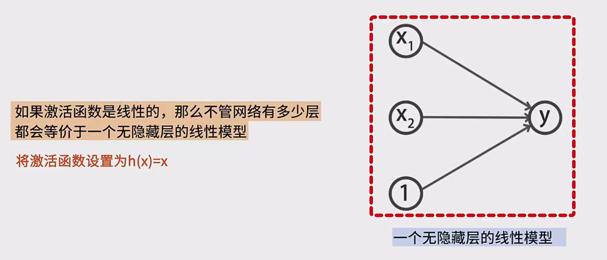
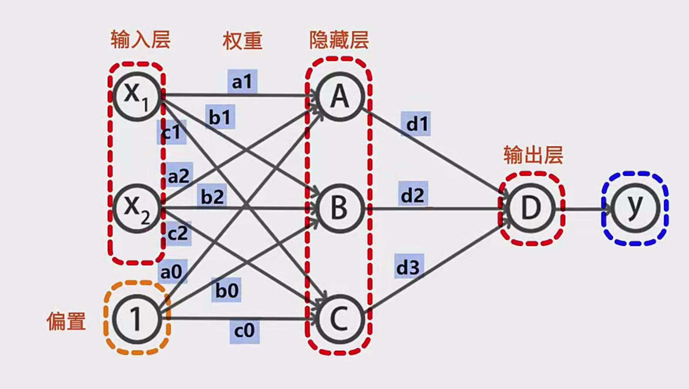
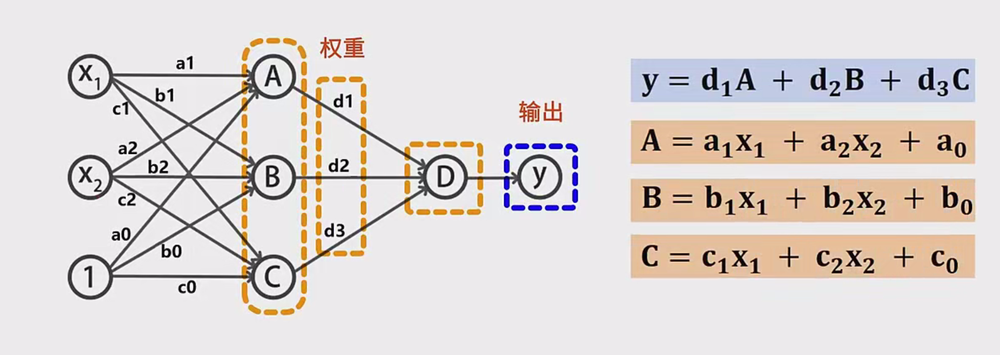
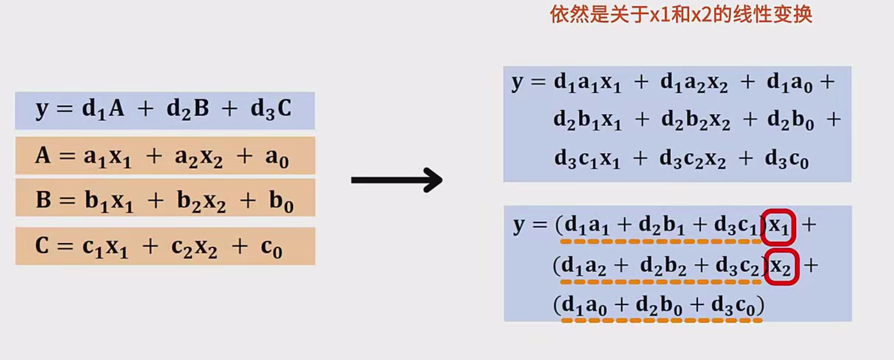
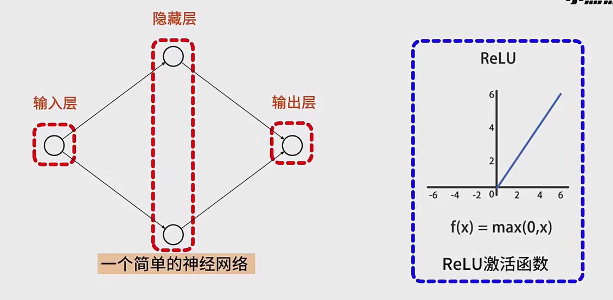
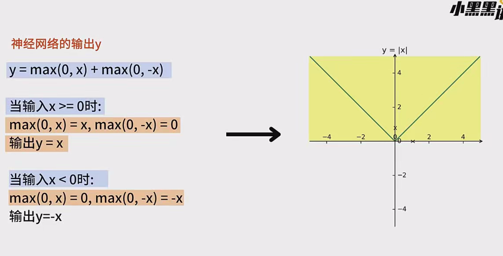

## 一、神经网络的非线性特性概述

1. **非线性特性**  
   - 神经网络的非线性特性是指：只要在网络中包含至少一层带有非线性激活函数的隐藏层（并在输出层使用线性或其他恰当的激活），就能够在理论上拟合任意形式的函数。  
   - 这一性质通常被称为**万能近似定理（Universal Approximation Theorem）**。

2. **万能近似定理（Universal Approximation Theorem）**  
   - 大意：给定一个前馈神经网络，只要它至少有一层带非线性激活函数的隐藏层，并且隐藏神经元数量足够多，理论上它就能逼近任意的连续函数。  
   - 该定理不保证一定会找到完美的网络结构或者完美的参数，但在表达能力的层面上，网络具备足够的灵活性。

---

## 二、利用神经网络拟合非线性函数的示例：拟合正弦函数

假设我们使用一个三层的前馈神经网络来模拟 $\sin(x)$，具体设置如下：

1. **网络结构**  
   - **输入层**：1 个神经元（接收输入 $x$）  
   - **隐藏层**：10 个神经元，激活函数为 sigmoid（常见的非线性激活函数之一）  
   - **输出层**：1 个神经元（输出最终的 $\sin(x)$ 预测值）

2. **训练思路**  
   - 准备一定数量的 $(x, \sin(x))$ 数据样本（可以在 $[-\pi, \pi]$ 或者更广范围内采样）。  
   - 使用随机初始化的权重和偏置，通过前向传播计算损失函数（例如均方误差 MSE）。  
   - 使用反向传播和优化算法（如梯度下降或其变体）来更新参数。  
   - 随着训练迭代的进行，网络会逐渐“学习”到逼近 $\sin(x)$ 的函数关系。

3. **关键点：非线性激活**  
   - 如果隐藏层使用的是非线性激活函数（如 sigmoid、ReLU、tanh 等），网络具备表达非线性关系的能力。  
   - 在足够训练和足够复杂度（隐藏单元数多）的条件下，该网络可以非常接近 $\sin(x)$ 函数。

---

## 三、为什么需要非线性激活函数？

### 3.1 无非线性激活函数时：网络只能表达线性变换

如果一个神经网络中的激活函数全部都是线性函数（例如 $h(x) = x$），即便网络有很多层，也依然只能得到一个线性变换。下面以一个三层神经网络为例（输入层 → 隐藏层 → 输出层）加以说明：

1. **网络结构示例**  
   - **输入层**：有特征 $x_1, x_2$，以及一个偏置项（记作 1）。  
   - **隐藏层**：包含 3 个神经元，分别记为 A、B、C。  
   - **输出层**：1 个神经元，记为 D。  
   - 权重用小写字母表示（例如 A 层的权重记为 $a$，B 层的权重记为 $b$ 等等）。

2. **假设激活函数 $h(x) = x$**  
   - A 神经元输出：$a = a_1 x_1 + a_2 x_2 + a_0$  
   - B 神经元输出：$b = b_1 x_1 + b_2 x_2 + b_0$  
   - C 神经元输出：$c = c_1 x_1 + c_2 x_2 + c_0$  
   - 输出神经元 D 对应的输出：  
     $
     y = d_1 \cdot a + d_2 \cdot b + d_3 \cdot c + d_0
     $  
     将 $a, b, c$ 的表达式带入后，可以将整个表达式展开。由于所有操作都是线性之和，最后得到的 $y$ 依然是关于 $x_1$ 和 $x_2$ 的线性函数：  
     $
     y = \text{(常数)} \cdot x_1 + \text{(常数)} \cdot x_2 + \text{(常数)}
     $  
   - **结论**：没有非线性的激活函数时，网络无论如何堆叠都是**线性函数**。

3. **原因：线性函数的可加性与叠加性**  
   - **可加性**：$f(x + y) = f(x) + f(y)$  
   - **叠加性**：多个线性变换的组合仍然是线性变换  
   - 所以，若每一层都只执行线性操作，相当于没有真正的“曲线”或“弯折”出现，最终的结果仍然是线性的。

### 3.2 使用非线性激活函数时：网络可表达非线性变换

1. **常见的非线性激活函数**  
   - Sigmoid：$\sigma(x) = \frac{1}{1 + e^{-x}}$  
   - Tanh：$\tanh(x)$  
   - ReLU：$\text{ReLU}(x) = \max(0, x)$  
   - Leaky ReLU、ELU 等

2. **非线性带来的好处**  
   - 函数表达能力更强，可以逼近任何连续函数。  
   - 神经网络之所以能解决很多复杂的模式识别和回归问题，关键正是隐藏层中的非线性激活函数。

---

## 四、使用神经网络拟合具体非线性函数示例：$|x|$ 函数

下面以 $|x|$ 作为目标函数，构造一个简单的三层神经网络来说明非线性激活如何帮助网络拟合非线性。

1. **目标**  
   - 输出函数满足：  
     $
     y = |x|
     $

2. **网络结构**  
   - **输入层**：1 个神经元（接收 $x$）  
   - **隐藏层**：2 个神经元，激活函数为 ReLU  
   - **输出层**：1 个神经元（汇总来自隐藏层的输出）

3. **隐藏层权重与偏置的设置**  
   - 第一个隐藏神经元：权重 $w_1 = 1$，偏置 $b_1 = 0$，输出 $\max(0, x)$。  
     $
     \text{hidden1} = \text{ReLU}(1 \cdot x + 0) = \max(0, x)
     $  
   - 第二个隐藏神经元：权重 $w_2 = -1$，偏置 $b_2 = 0$，输出 $\max(0, -x)$。  
     $
     \text{hidden2} = \text{ReLU}(-1 \cdot x + 0) = \max(0, -x)
     $

4. **输出层的合并**  
   - 将这两个隐藏层输出相加：  
     $
     y = \max(0, x) + \max(0, -x)
     $
   - 当 $x \ge 0$ 时：  
     $
     \max(0, x) = x, \quad \max(0, -x) = 0 \quad \Longrightarrow \quad y = x
     $  
   - 当 $x < 0$ 时：  
     $
     \max(0, x) = 0, \quad \max(0, -x) = -x \quad \Longrightarrow \quad y = -x
     $  
   - 综合可得：  
     $
     y = |x|
     $

5. **结论**  
   - 通过非常简单的网络结构（只用了 2 个带 ReLU 的隐藏神经元），网络就能完美表示 $|x|$ 这样的非线性函数。  
   - 这说明了非线性激活函数在神经网络中的重要性。

---

## 五、总结

1. **非线性激活函数的重要性**  
   - 如果一个神经网络中没有非线性激活函数，那么无论有多少层，都只能表示线性变换；这在面对复杂的非线性问题时就完全不够用。  
   - 只有在神经网络的隐藏层中使用非线性激活函数，网络才真正具备了逼近任意函数的潜力，也才能解决更多复杂的任务。

2. **万能近似定理回顾**  
   - 虽然理论上神经网络只要满足“至少一层非线性激活 + 足够多的神经元”就能逼近任意函数，但在实践中还需要通过恰当的训练算法、损失函数设计、数据规模以及网络结构的选择等多方面配合，才能达到理想的逼近效果。

3. **实际应用启示**  
   - 在深度学习中常见的激活函数（ReLU、sigmoid、tanh 等）都能引入非线性，但各有优缺点。  
   - ReLU 激活函数由于计算简单、梯度传播效果较好等优点，在现代深度神经网络中被广泛使用。  
   - 除了激活函数本身，网络的深度、宽度、正则化方法、初始化方式等也会影响网络的学习能力和泛化性能。

---

