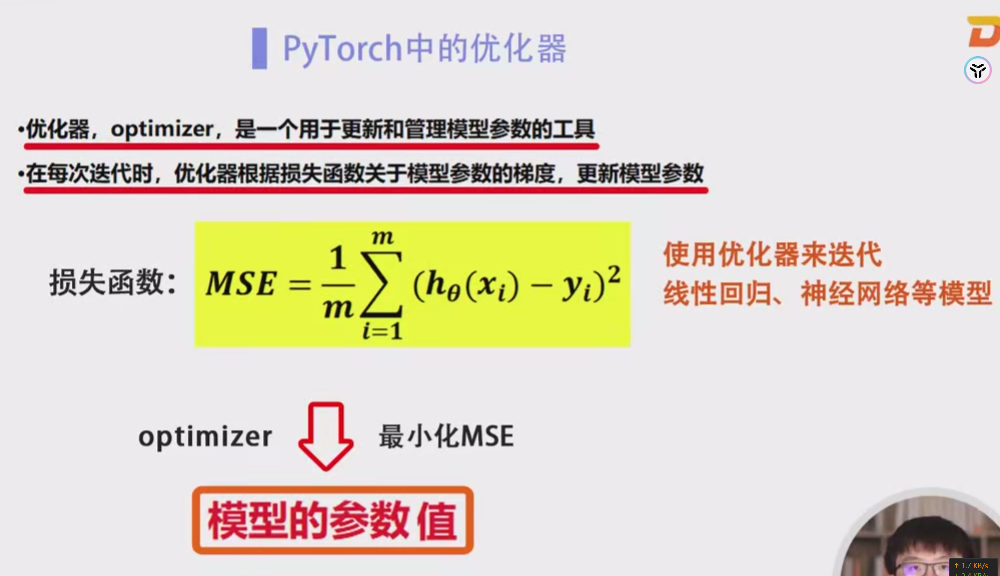
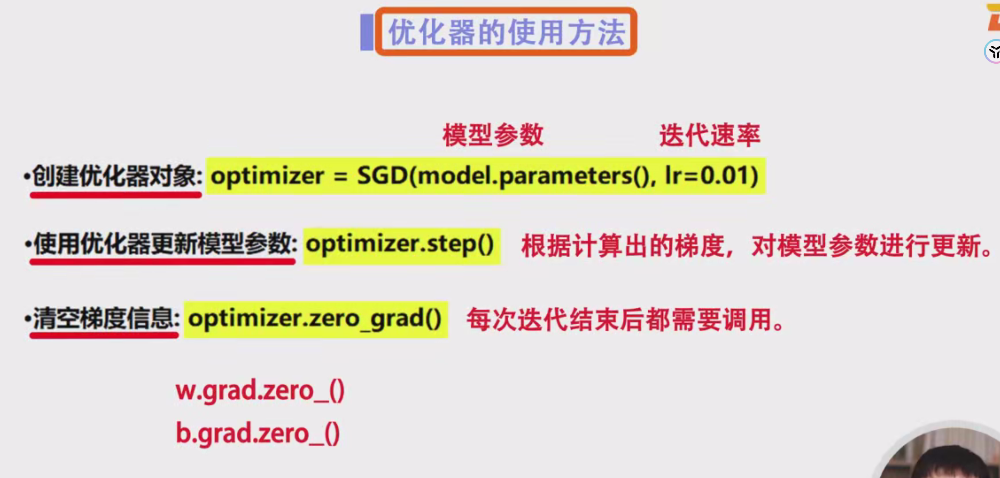
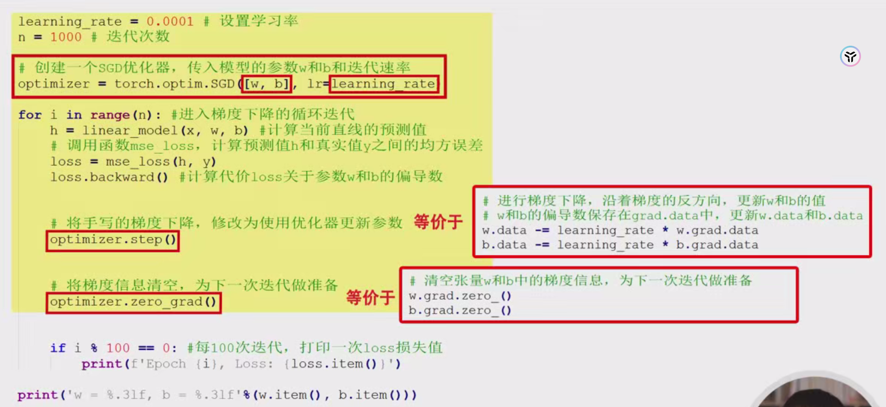
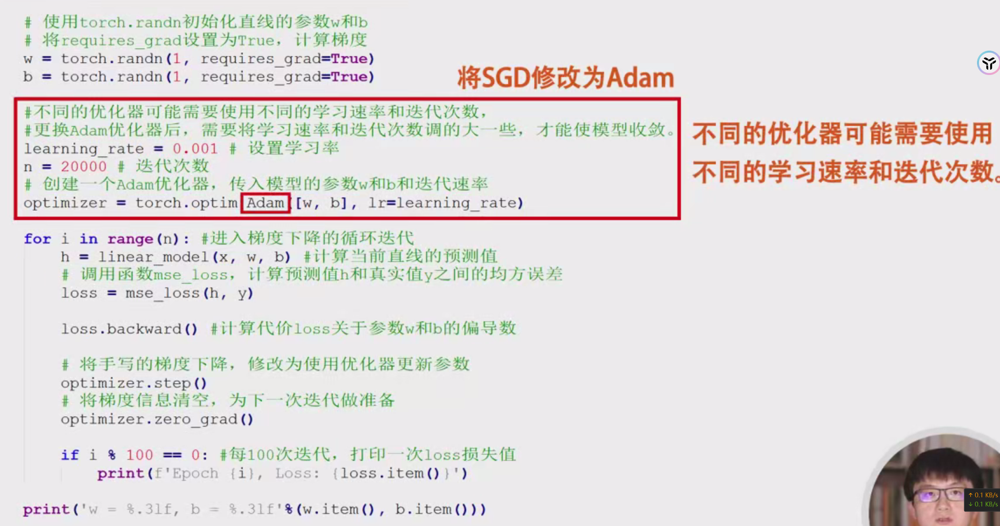

# PyTorch 实现一元线性回归详细笔记

大家好，今天我们将详细讲解如何使用 PyTorch 实现一元线性回归的程序设计实验。在本节课中，我们将探讨两种实现方法：

1. **基于自动微分的梯度下降**
2. **基于优化器的实现**

通过这两种方法，我们不仅可以理解一元线性回归的基本原理，还能掌握 PyTorch 在深度学习中的应用技巧。

## 一、什么是一元线性回归

一元线性回归（Simple Linear Regression）是统计学中用于描述两个变量之间关系的基本方法之一。其目标是找到一个线性方程，能够最准确地预测因变量（目标变量）与自变量（特征变量）之间的关系。数学表达式为：

y=wx+by = wx + b

其中：

- yy 是预测值
- xx 是输入特征
- ww 是权重
- bb 是偏置

## 二、PyTorch 实现一元线性回归

### 1. 基于自动微分的梯度下降

#### 1.1. 代码示例

```python
import torch
import torch.nn as nn
import matplotlib.pyplot as plt

# 定义线性模型
def linear_model(x, w, b):
    return w * x + b

# 定义均方误差损失函数
def mse_loss(y_pred, y_true):
    return ((y_pred - y_true) ** 2).mean()

# 生成模拟数据
torch.manual_seed(42)  # 设置随机种子，保证结果可重复
x = torch.linspace(0, 10, 100)
y = 2.5 * x + torch.randn(x.size()) * 2  # y = 2.5x + 噪声

# 初始化参数w和b，并设置requires_grad为True以计算梯度
w = torch.randn(1, requires_grad=True)
b = torch.randn(1, requires_grad=True)

# 设置学习率和迭代次数
learning_rate = 0.01
num_epochs = 1000

# 存储损失值用于可视化
loss_history = []

# 梯度下降迭代
for epoch in range(num_epochs):
    # 前向传播
    y_pred = linear_model(x, w, b)
    loss = mse_loss(y_pred, y)
    loss_history.append(loss.item())
    
    # 反向传播
    loss.backward()
    
    # 更新参数
    with torch.no_grad():
        w -= learning_rate * w.grad
        b -= learning_rate * b.grad
    
    # 清空梯度
    w.grad.zero_()
    b.grad.zero_()
    
    # 每100次迭代打印一次损失
    if (epoch+1) % 100 == 0:
        print(f'Epoch [{epoch+1}/{num_epochs}], Loss: {loss.item():.4f}')

# 将参数转为普通变量
w_final = w.item()
b_final = b.item()

print(f'\n训练完成: y = {w_final:.2f}x + {b_final:.2f}')

# 可视化损失下降过程
plt.figure(figsize=(10,4))
plt.subplot(1,2,1)
plt.plot(loss_history)
plt.xlabel('Epoch')
plt.ylabel('Loss')
plt.title('Loss下降曲线')

# 可视化拟合结果
plt.subplot(1,2,2)
plt.scatter(x.numpy(), y.numpy(), label='数据点')
plt.plot(x.numpy(), (w_final * x + b_final).detach().numpy(), color='red', label='拟合直线')
plt.xlabel('x')
plt.ylabel('y')
plt.legend()
plt.title('一元线性回归拟合结果')

plt.show()
```

#### 1.2. 代码详解

1. **导入必要的库**：
   - `torch`: PyTorch 的核心库，用于张量操作和自动微分。
   - `torch.nn`: 包含神经网络相关的模块。
   - `matplotlib.pyplot`: 用于数据可视化。
2. **定义模型和损失函数**：
   - `linear_model(x, w, b)`: 线性模型函数，计算预测值。
   - `mse_loss(y_pred, y_true)`: 均方误差损失函数，用于衡量预测值与真实值的差异。
3. **生成模拟数据**：
   - 使用 `torch.linspace` 生成 0 到 10 之间的 100 个点作为输入特征 `x`。
   - 生成对应的目标变量 `y`，其中加入了随机噪声，以模拟真实数据。
4. **初始化参数**：
   - 随机初始化权重 `w` 和偏置 `b`，并设置 `requires_grad=True` 以便在反向传播时计算梯度。
5. **设置学习率和迭代次数**：
   - `learning_rate = 0.01`: 学习率决定了每次参数更新的步长。
   - `num_epochs = 1000`: 迭代次数。
6. **梯度下降迭代**：
   - **前向传播**：计算预测值 `y_pred` 和损失 `loss`。
   - **反向传播**：调用 `loss.backward()` 计算梯度。
   - **参数更新**：在 `torch.no_grad()` 环境下，手动更新参数 `w` 和 `b`。
   - **清空梯度**：调用 `zero_()` 清除累积的梯度，以防止梯度累积。
   - **日志记录**：每100次迭代打印一次当前的损失值。
7. **结果展示**：
   - 打印最终训练出的模型参数。
   - 使用 `matplotlib` 可视化损失下降曲线和拟合结果。

#### 1.3. 关键点解释

- **自动微分**：PyTorch 的 `autograd` 功能自动计算张量的梯度，使得我们无需手动推导和实现梯度下降算法。
- **梯度清零**：在每次参数更新后，需要手动清零梯度，防止梯度累积影响后续计算。
- **无梯度更新**：在更新参数时使用 `torch.no_grad()` 确保这些操作不被追踪，避免不必要的计算和内存消耗。

### 2. 基于优化器的实现方法

PyTorch 提供了多种优化器，可以简化参数更新的过程。常用的优化器包括 SGD（随机梯度下降）、Adam、RMSprop 等。使用优化器可以自动处理梯度的计算、参数更新和梯度清零等步骤。

#### 2.1. 代码示例

```python
import torch
import torch.nn as nn
import torch.optim as optim
import matplotlib.pyplot as plt

# 定义线性模型
def linear_model(x, w, b):
    return w * x + b

# 定义均方误差损失函数
def mse_loss(y_pred, y_true):
    return ((y_pred - y_true) ** 2).mean()

# 生成模拟数据
torch.manual_seed(42)  # 设置随机种子，保证结果可重复
x = torch.linspace(0, 10, 100)
y = 2.5 * x + torch.randn(x.size()) * 2  # y = 2.5x + 噪声

# 初始化参数w和b，并设置requires_grad为True以计算梯度
w = torch.randn(1, requires_grad=True)
b = torch.randn(1, requires_grad=True)

# 设置学习率和迭代次数
learning_rate = 0.01
num_epochs = 1000

# 定义优化器，这里使用 SGD 优化器
optimizer = optim.SGD([w, b], lr=learning_rate)

# 存储损失值用于可视化
loss_history = []

# 梯度下降迭代
for epoch in range(num_epochs):
    # 前向传播
    y_pred = linear_model(x, w, b)
    loss = mse_loss(y_pred, y)
    loss_history.append(loss.item())
    
    # 反向传播
    loss.backward()
    
    # 更新参数
    optimizer.step()
    
    # 清空梯度
    optimizer.zero_grad()
    
    # 每100次迭代打印一次损失
    if (epoch+1) % 100 == 0:
        print(f'Epoch [{epoch+1}/{num_epochs}], Loss: {loss.item():.4f}')

# 将参数转为普通变量
w_final = w.item()
b_final = b.item()

print(f'\n训练完成: y = {w_final:.2f}x + {b_final:.2f}')

# 可视化损失下降过程
plt.figure(figsize=(10,4))
plt.subplot(1,2,1)
plt.plot(loss_history)
plt.xlabel('Epoch')
plt.ylabel('Loss')
plt.title('Loss下降曲线')

# 可视化拟合结果
plt.subplot(1,2,2)
plt.scatter(x.numpy(), y.numpy(), label='数据点')
plt.plot(x.numpy(), (w_final * x + b_final).detach().numpy(), color='red', label='拟合直线')
plt.xlabel('x')
plt.ylabel('y')
plt.legend()
plt.title('一元线性回归拟合结果')

plt.show()
```

#### 2.2. 代码详解

1. **导入必要的库**：
   - 与前述相同，额外导入了 `torch.optim` 用于优化器的使用。
2. **定义模型和损失函数**：
   - 与前述相同。
3. **生成模拟数据**：
   - 与前述相同。
4. **初始化参数**：
   - 与前述相同。
5. **定义优化器**：
   - 使用 `optim.SGD` 定义了一个随机梯度下降优化器，传入需要优化的参数 `[w, b]` 和学习率 `lr=0.01`。
6. **梯度下降迭代**：
   - **前向传播**：计算预测值 `y_pred` 和损失 `loss`。
   - **反向传播**：调用 `loss.backward()` 计算梯度。
   - **参数更新**：使用 `optimizer.step()` 自动更新参数。
   - **清空梯度**：使用 `optimizer.zero_grad()` 自动清零梯度。
   - **日志记录**：每100次迭代打印一次当前的损失值。
7. **结果展示**：
   - 与前述相同。

#### 2.3. 关键点解释

- 优化器的优势

  ：

  - **简化代码**：使用优化器后，无需手动实现参数更新和梯度清零的步骤。
  - **多样化选择**：PyTorch 提供了多种优化器，可以根据具体任务选择最合适的优化算法。

- 优化器的选择

  ：

  - **SGD（随机梯度下降）**：基础的优化器，适用于大多数情况，但可能收敛较慢。
  - **Adam**：结合了动量和自适应学习率，通常在多种任务中表现优异。
  - **RMSprop、Adagrad** 等：适用于特定场景，根据梯度的历史信息调整学习率。

#### 2.4. 使用不同优化器的示例

假设我们希望使用 Adam 优化器，只需修改优化器的定义部分：

```python
# 定义优化器，这里使用 Adam 优化器
optimizer = optim.Adam([w, b], lr=0.01)
```

**注意事项**：

- 不同优化器可能需要不同的学习率和迭代次数。例如，Adam 通常对学习率较为敏感，可能需要调整学习率以确保模型的收敛。
- 在更换优化器后，建议重新调试学习率和迭代次数，以获得最佳的训练效果。

## 三、总结

在本节课中，我们详细讲解了如何使用 PyTorch 实现一元线性回归，包括基于自动微分的梯度下降和基于优化器的两种方法。通过手动实现梯度下降，我们深入理解了参数更新的过程；而使用优化器则简化了代码，实现了更高效的模型训练。

**关键点回顾**：

1. **自动微分**：PyTorch 的 `autograd` 功能简化了梯度计算，使得我们可以专注于模型设计。
2. **优化器的使用**：优化器自动处理参数更新和梯度清零，提供了多种优化算法以适应不同的任务需求。
3. **参数初始化**：合理的参数初始化有助于加速模型的收敛。
4. **学习率和迭代次数**：选择合适的学习率和迭代次数是确保模型有效训练的关键。

通过本节内容，相信大家对一元线性回归的实现有了深入的理解，并掌握了 PyTorch 中梯度下降和优化器的使用方法。感谢大家的观看，我们下节课再会！